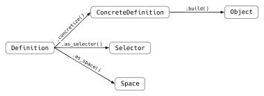
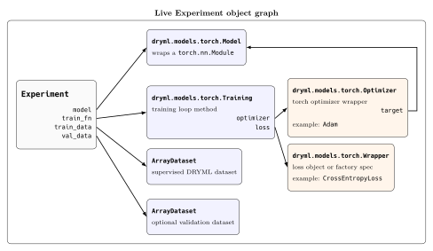

# DRYML


[](https://codecov.io/gh/ncsa/dryml)

**Don't Repeat Yourself Machine Learning:** A meta-library library to reduce code duplication, automate model testing, perform hyper parameters searches, simplify model/experiment naming, encourage object separability, ease code analysis, automate model testing, perform hyper parameter searches, and improve serialization.

DRYML provides `Definition` a new graph-based object identity model enabling users to describe complex composite objects using simple components. A `Definition` is a kind of 'super' factory object,  you specify the class you want to create followed by its args, then kwargs just like you would pass its constructor. However, `Definition` can be arbitrarily nested allowing the user to describe these composite objects.

`Definition` forms the starting point though, using `.concretize()`, a `Definition` object can be 'resolved' into a `ConcreteDefinition` where all default args are filled in, and unique ids are populated. `ConcreteDefinition` uniquely identifies a specific object, is immutable and hashable. `ConcreteDefinition` can also be used as a recipe to build its `Object` using `.build()`. `ConcreteDefinition` itself is lightweight and is easy to serialize and pass around.

When DRYML serializes an `Object` to disk, it uses a `Repo` and one or more backing `Store`s. Stores can contain any number of other `Object`s. A `Definition` can be turned into a `Selector` with the `.as_selector()` method. `Selector`s form a graph query language enabling you to pick a particular `Object` out of the store. Thus ends the difficult task of creating unique names for all of your trained models! refer to them with their unique identity! `Definition`s and hence `Selector`s can also be under-specified and can be made to match multiple different objects. This enables you to quickly grab a particular class of `Object` from your `Store`s.

`Definition`s can also be passed `Par`s which can define a distribution over possible values. Then `Definition`'s `.as_space()` method produces a `SearchSpace` object. `SearchSpace`'s `.sample()` method produces a `Definition` which is sampled from the defined space. `SearchSpace`'s `.support_selector()` method produces a `Selector` which matches any `ConcreteDefinition` that is producable by the `SearchSpace`. That's extremely useful for finding models in your `Store`s for a particular hyperparameter experiment!



DRYML aims to be as lightweight as possible. The user should be able to grab only the they need and nothing else. It does not pull in heavy dependencies unless the user wants them. Most `dryml` submodules are separable and can be used without the rest of DRYML's machinery as well. Use what you like and leave the rest!

## Dispatch, Planning, and Analysis Quickstart

Follow this workflow in order when starting with DRYML.

### 1. Create or open a Store

```python
import dryml
from dryml.core2.store.dir import DirStore

store = DirStore("work/store", query_index="none")
```

### 2. Declare requirements and defaults

Declare hard requirements separately from soft defaults. Put a portable function
at module scope, for example in `my_package/tasks.py`:

```python
@dryml.env.req(requirements=("numpy>=1",))
@dryml.world.req(cpus={"min": 1})
@dryml.world.default(cpus=1)
def importable_function(left, right):
    return left + right
```

### 3. Dispatch a module-level function

Functions use a verified import path for the portable path:

```python
from my_package.tasks import importable_function

result = dryml.dispatch.run(importable_function, store=store, args=(2, 3))
```

### 4. Dispatch a stored CDef method

Stored CDef methods use their stable Store identity:

```python
method_result = dryml.dispatch.run(
    model_cdef, "train", store=store, args=(dataset_cdef,)
)
```

### 5. Explain a plan before launching

[`dispatch.explain(...)`](docs/dispatch.md#requirement-aware-planning) is
non-launching and reports bounded planning facts:

```python
explanation = dryml.dispatch.explain(importable_function, store=store, args=(2, 3))
```

### 6. Set notebook planning defaults

Current environment and world values are context-local defaults for later
planning, not allocation of this process:

```python
with dryml.environments.use(dryml.environments.CurrentEnvironmentSpec()):
    with dryml.worlds.use(dryml.worlds.synthesize(None).require_world()):
        explanation = dryml.dispatch.explain(importable_function, store=store, args=(2, 3))
```

### 7. Use plain mode for trusted inline work

For trusted inline local work, `with dryml.runtime.plain():` uses an inline
allocation with enforcement off. It is not worker isolation or a dispatch
replacement. See [world/runtime](docs/world_runtime.md) and the
[notebook example](examples/notebooks/local_defaults_and_plain_mode.ipynb).

### 8. Analyze code without invoking it

Code analysis is an explicit submodule import:

```python
import dryml.code as code

facts = code.analyze(importable_function)  # does not intentionally invoke it
```

### 9. Opt into trusted current-process tracing

`code.trace(...)` is separate: it executes supported trusted code once in the
current process, is not a sandbox, and has no hard timeout. Read the
[analysis architecture](docs/architecture/code_analysis.md) before opting in.

### 10. Use OperationSpec only for advanced IR control

Both Python-shaped dispatch forms normalize to the canonical `OperationSpec` IR.
Use [operations](docs/operations.md) only when you deliberately need to construct
that advanced IR yourself.

Runnable lightweight workflows are available for
[requirements/explain](examples/requirements/requirements_and_explain.py),
[Python-shaped dispatch](examples/dispatch/python_shaped_dispatch.py),
[notebook defaults/plain mode](examples/notebooks/local_defaults_and_plain_mode.ipynb),
and [static/dynamic analysis](examples/code_analysis/static_and_dynamic_analysis.py).
Migration from removed context/execute APIs is covered by the
[migration guide](docs/migration/legacy_context_execute_removal.md).


# The DRYML Object Graph

As an example, let's look at a torch `Experiment`. Here's how you might build it up:

```python
import numpy as np
import torch

from dryml.data import ArrayDataset
from dryml.models import Experiment
from dryml.models.torch import Optimizer, Sequential, Training

x = np.array([[0.0], [1.0], [2.0], [3.0]], dtype=np.float32)
y = np.array([[0.0], [2.0], [4.0], [6.0]], dtype=np.float32)

train_data = ArrayDataset((x, y))

model = Sequential(layer_defs=(
    ("Linear", (1, 1), {}),
))

optimizer = Optimizer(torch.optim.SGD, target=model, lr=0.01)

train_fn = Training(
    optimizer=optimizer,
    loss_cls=torch.nn.MSELoss,
    epochs=2,
    batch_size=2,
    verbose=0,
)

experiment = Experiment(
    model=model,
    train_fn=train_fn,
    train_data=train_data,
)
```

And here is a diagram of this object:


For the object above, `experiment.definition` is a `ConcreteDefinition` rooted at
`Experiment`, with child `ConcreteDefinition`s for the model, training function,
optimizer, and dataset:

```python
mdl_cdef = ConcreteDefinition(
    ImportRef(module="dryml.models.torch.base", qualname="Sequential"),
    F(FactorySpec(target="Linear", args=(1, 1), kwargs=F{})),
)
ConcreteDefinition(
    ImportRef(module="dryml.models.experiment", qualname="Experiment"),
    model=mdl_cdef,
    train_fn=ConcreteDefinition(
        ImportRef(module="dryml.models.torch.base", qualname="Training"),
        optimizer=ConcreteDefinition(
            ImportRef(module="dryml.models.torch.base", qualname="Optimizer"),
            ImportRef(module="torch.optim.sgd", qualname="SGD"),
            target=mdl_cdef,
            lr=0.01,
        ),
        loss_cls=ImportRef(module="torch.nn.modules.loss", qualname="MSELoss"),
        epochs=2,
        batch_size=2,
        verbose=0,
    ),
    train_data=ConcreteDefinition(
        ImportRef(module="dryml.data.source", qualname="ArrayDataset"),
        F(
            FNDArray(shape=(4, 1), dtype=float32, writeable=False),
            FNDArray(shape=(4, 1), dtype=float32, writeable=False),
        ),
    ),
)
```

# Major DRYML submodules

| Submodule | Use it for |
|---|---|
| `dryml.core2` | Core `Object`, `Definition`, `ConcreteDefinition`, repository, store, selector, and graph-query machinery. |
| `dryml.data` | Re-iterable datasets, source adapters, batching/shuffling, mapping, projection, and other dataset pipeline building blocks. |
| `dryml.models` | Composable experiment/model abstractions, train functions, train state, and backend model wrappers. |
| `dryml.tf`, `dryml.torch`, `dryml.jax`, `dryml.numpy` | Framework-specific dtype, tensor spec, and backend integration utilities without requiring every framework at import time. |
| `dryml.environments` | Software environment requirements, compatibility checks, environment IDs, and environment probe records. |
| `dryml.worlds` | Resource/topology requirements and allocations, such as CPU, memory, accelerator, role, and process specs. |
| `dryml.runtime` | Process-local runtime mode, active allocation, device visibility, framework bootstrap, and import/workload guardrails. |
| `dryml.annotations` | Decorators and metadata collection for attaching environment, world, and runtime requirements to code. |
| `dryml.code` | Explicitly imported reusable non-invoking analysis, optional probes, and trusted opt-in current-process tracing. |
| `dryml.operations` | Portable function and method call specifications used by execution and dispatch layers. |
| `dryml.dispatch` | Local subprocess/local-world execution, worker protocol, cancellation, logs, and dispatch result handling. |
| `dryml.records` | Structured records for environments, execution, representations, products, logs, and sidecar metadata. |
| `dryml.formats` | Stable IDs, refs, envelopes, and canonical serialization helpers for store and record metadata. |
| `dryml.artifacts` | Lightweight artifact abstractions for scalars, datasets, and result products. |

# DRYML Major Components

## DRYML Dataset

The DRYML API provides the `Dataset` class for re-iterable machine learning datasets. Source adapters such as `ArrayDataset`, `TFDSAdapter`, and `TorchDatasetAdapter` bring external data into the DRYML dataset API, while transforms such as `Batch`, `Unbatch`, `Map`, and `Shuffle` build reusable data pipelines.

```python
>>> import numpy as np
>>> from dryml.data import ArrayDataset, Batch, Unbatch
>>> data = np.random.random((32, 10, 10)).astype("float32")
>>> data_ds = ArrayDataset(data)
>>> data_ds.peek().shape
(10, 10)
>>> type(data_ds.peek())
<class 'numpy.ndarray'>
>>> batched = Batch(data_ds, 8)
>>> batched.peek().shape
(8, 10, 10)
>>> Unbatch(batched).peek().shape
(10, 10)
```

Use `TFDSAdapter` for TensorFlow Datasets sources and `TorchDatasetAdapter` for `torch.utils.data.Dataset` or `IterableDataset` sources. The old framework-specific `TFDataset` and `TorchDataset` wrappers have been removed in favor of these source adapters plus the core DRYML dataset transforms.

## Runtime, Worlds, And Dispatch

DRYML now separates software requirements, resource planning, process-local runtime state, and execution.

Use `dryml.env.req(...)` for software/package compatibility, `dryml.world.req(...)` for hard CPU/GPU/memory/topology requirements, `dryml.world.default(...)` for overrideable requested resources, and `dryml.runtime.default(...)` for process-local runtime defaults. These decorators attach metadata only; dispatch or explicit runtime activation is responsible for running work with an allocation.

```python
import dryml


@dryml.env.req(packages={"numpy": ">=1.26"})
@dryml.world.req(cpus={"min": 1})
@dryml.world.default(cpus=1, memory="1GiB")
@dryml.runtime.default(mode="worker", device_visibility={"policy": "assigned"})
def add(x, y):
    dryml.runtime.require_worker_allocation("add() runs as dispatched workload code")
    return x + y
```

Local execution goes through `dryml.dispatch` and canonical operation specs:

```python
import dryml
from dryml.core2.store.dir import DirStore

operation = dryml.operations.attach_operation_id(
    dryml.operations.make_function_call_spec("my_package.tasks:add", args=[2, 3])
)
store = DirStore("dryml-workdir/store", query_index="none")
result = dryml.dispatch.run(operation, backend="local_subprocess", store=store)
assert result.status == "ok"
assert result.result_canonical == 5
```

Runtime guards validate active process state. In orchestrator mode there is no workload allocation, so workload-only code fails clearly until it is run in a worker or explicit inline runtime with an allocation:

```python
import dryml

try:
    dryml.runtime.require_allocation("training needs assigned workload resources")
except dryml.runtime.NoAllocationError as exc:
    print(exc.context["fix"])
```

World specs plan resources. Runtime allocation views activate resources in the current process. Environment requirements remain software-only. Operation specs and dispatch specs are metadata, not DRYML Objects.
