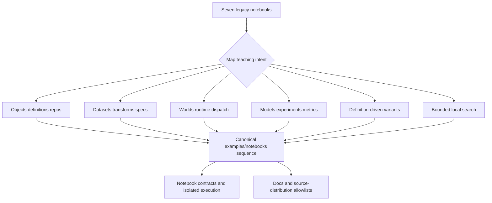
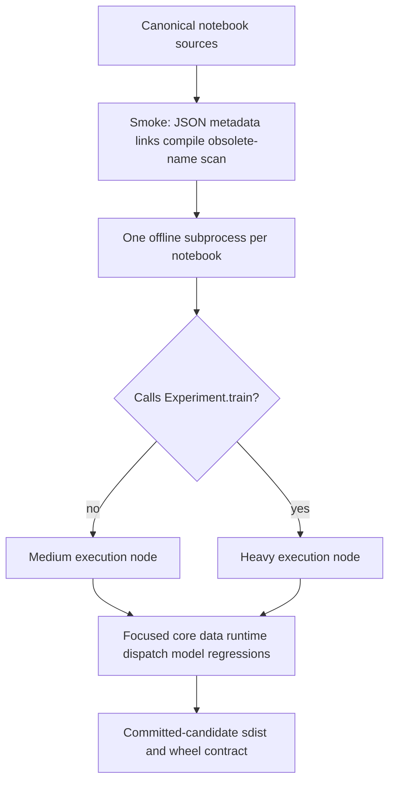

# Current-Framework Tutorial Port - Plan

## Goal Capsule

- **Objective:** Replace the legacy tutorial sequence with six maintained, standalone notebooks that teach current DRYML object, data, runtime, model, and search-space contracts.
- **Authority:** Current public docs, maintained tests, and exported APIs override historical notebook behavior; the old notebooks preserve teaching intent only.
- **Execution profile:** Documentation-first implementation with deterministic notebook execution against declared dependencies, focused subsystem regression tests, and source-distribution validation.
- **Stop conditions:** Stop rather than invent compatibility behavior if a lesson requires removed APIs, an unsupported integration, repository-local generated state, or changes to pre-existing untracked tutorial artifacts.
- **Tail ownership:** The framework repository owns the notebooks, tests, documentation links, release packaging, and retirement of tracked legacy sources.

---

## Product Contract

### Summary

Port the legacy tutorial curriculum into the maintained `examples/notebooks/` surface as six current-framework lessons. Preserve applicable learning goals while consolidating the two historical tuning notebooks into one bounded local-search lesson and omitting concepts that have no current supported equivalent.

### Problem Frame

The tracked notebooks under `tutorials/` teach a 2022-2023 DRYML API built around `ObjectDef`, fluent datasets, compute contexts, `Trainable`, generated `dry_id` values, and two obsolete scheduler-specific tuning integrations. Those mechanics now conflict with DRYML's `Definition`/`ConcreteDefinition` identity, Store-backed persistence, node-based data pipelines, environment/world/runtime boundaries, Python-shaped dispatch, `Experiment`, and `SearchSpace` contracts.

The repository already treats `examples/notebooks/` as the maintained notebook surface, but only one current notebook is release-tested. A direct cell translation would preserve incorrect mental models, while an untested rewrite would quickly drift again.

### Requirements

**Curriculum and behavior**

- R1. Replace the seven legacy notebooks with six standalone canonical notebooks under `examples/notebooks/`, expanding the existing local-defaults notebook rather than duplicating it.
- R2. Teach `Object`, `Definition`, `ConcreteDefinition`, definition-versus-state semantics, `Repo`/`DirStore` persistence, aliases, and explicit query domains using current APIs.
- R3. Teach re-iterable `ArrayDataset` and `GeneratorDataset` sources, `TensorSpec`, current method nodes, structural transforms, and deterministic edge cases using small local arrays.
- R4. Replace compute-context instruction with the environment, world, runtime allocation, `runtime.plain()`, `dispatch.explain()`, and importable-target dispatch distinctions.
- R5. Replace `Trainable` instruction with the maintained sklearn `Model`/`BasicTraining`/`Experiment`/`TrainState` workflow and explicit metric evaluation on small local arrays.
- R6. Replace generated-ID model loops with immutable definition variants whose seed or replicate parameters intentionally determine distinct identities.
- R7. Teach finite, deterministic local hyperparameter search through `SearchSpace.sample()`, `grid()`, `support_selector()`, current model training/evaluation, and stable best-candidate selection.

**Safety and maintainability**

- R8. Every canonical notebook must run independently with its declared DRYML extras, without Jupyter-only syntax, network access, downloads, special Python-path setup, fixed paths, or repository-local generated files; core lessons use base DRYML/NumPy and model/search lessons use the sklearn extra.
- R9. Commit canonical notebooks with cleared outputs, null execution counts, generic kernel metadata, and no transient widget, host, path, timing, or framework-log state.
- R10. Retire only the tracked legacy notebooks and their obsolete tracked SVGs; preserve all pre-existing untracked files and directories under `tutorials/` without using them as fixtures.
- R11. Add smoke structural checks and isolated-process execution checks that cover every canonical notebook, state restoration, import lightness, temporary-resource cleanup, and obsolete-API exclusion.
- R12. Publish the canonical sequence through the README and documentation index, include its exact notebooks in the source distribution, and keep notebooks out of the wheel.
- R13. Preserve applicable curriculum intent through the migration matrix in this plan; every legacy topic must map to a canonical lesson/current document or an explicit omitted disposition before tracked sources are retired.
- R14. Support learners arriving from a repository checkout, an extracted matching sdist, or an individually downloaded notebook by using only installed public APIs and documenting each notebook's required DRYML version and extras.

### Actors

- A1. A new DRYML learner needs an ordered path, explicit prerequisites, and a first successful persistence or execution workflow.
- A2. A legacy tutorial reader needs current conceptual replacements without obsolete compatibility instructions.
- A3. A maintainer needs deterministic examples, exact packaging inventory, and safe coexistence with untracked tutorial data.

### Key Flows

- F1. **Core learning path:** A1 follows objects and repos, datasets, runtime and dispatch, models and experiments, definition-driven variants, then bounded local search; every notebook also states its own prerequisites and can be opened independently.
- F2. **Notebook verification:** A maintainer validates notebook JSON and source statically, then executes each notebook in its own offline process and checks that process-local DRYML state and imports remain clean.
- F3. **Release cutover:** Maintainers expose the six canonical notebooks through docs and the sdist allowlist, then remove exact tracked legacy sources without recursively altering the legacy directory.

### Acceptance Examples

- AE1. Given the installed DRYML version and extras declared by a canonical notebook, when it executes in an isolated offline process from outside the repository, then all cells complete without special import paths and environment, world, runtime, working-directory, and filesystem state remain clean.
- AE2. Given a repeated experiment template, when the definition-driven lesson creates variants, then identical definitions retain one identity while explicit seed or replicate changes produce distinct concrete definitions.
- AE3. Given a finite parameter space, when the local-search lesson enumerates and scores candidates, then it bounds candidate execution, rejects non-finite metrics, and selects ties deterministically without undeclared frameworks or checkpoints.
- AE4. Given a source-distribution build from the committed candidate, when release artifacts are inspected, then all canonical notebooks are present in the sdist, absent from the wheel, and no generated tutorial payload is included.
- AE5. Given the existing mixed tracked/untracked `tutorials/` tree, when cutover completes, then only the tracked legacy notebooks and obsolete tracked SVGs are removed; untracked models, tuning results, serialized objects, and helper files remain untouched.
- AE6. Given A1 at the documented tutorial entry point, when the learner follows the prerequisites and first lesson, then they can complete and verify a Store save/load workflow without consulting undocumented setup material.
- AE7. Given a checkout, extracted matching sdist, or individual canonical notebook, when a learner installs the notebook's declared extras, then it runs without repository-only support modules or Python-path injection.

### Success Criteria

- The maintained tutorial sequence uses only current public APIs and aligns with the mental models in the current user documentation.
- Every default notebook path is deterministic, offline, output-free, independently executable, and covered by automated contracts.
- Removed context, trainable, fluent-dataset, generated-ID, and obsolete tuning-adapter APIs do not appear in executable tutorial cells.
- Documentation and source-distribution inventories point to one canonical tutorial copy.
- The ordered entry point identifies the learner, prerequisites, expected first success, and current backend progression.

### Curriculum Migration Matrix

| Legacy source | Applicable learning goals retained | Canonical destination | Explicit omissions |
|---|---|---|---|
| `tutorials/DRYML Tutorial 1 - Object Basics.ipynb` | Object construction, definition/build distinction, mutable state versus identity, nested graphs, Store save/load, and queries | `examples/notebooks/objects_definitions_and_repos.ipynb` | Generated IDs, old object archives/hooks, creation metadata, and legacy selector syntax |
| `tutorials/DRYML Tutorial 2 - Datasets.ipynb` | Re-iterability, element/spec shape, supervised structures, mapping, batching, taking, and handled source errors | `examples/notebooks/datasets_and_transforms.ipynb` | Fluent dataset methods and direct TensorFlow/Torch conversion methods |
| `tutorials/DRYML Tutorial 3 - Compute Contexts.ipynb` | Software/resource requests, requested versus active resources, inline work, planning, and worker execution | `examples/notebooks/local_defaults_and_plain_mode.ipynb` | Removed context dictionaries, context checks, compute decorators, and implicit object updates |
| `tutorials/DRYML Tutorial 4 - Trainables.ipynb` | Current model wrapper, experiment aggregate, training function/state, metrics, persistence, and backend progression | `examples/notebooks/models_experiments_and_metrics.ipynb` | `Trainable`, old model pipes/transforms, framework startup logs, and downloaded MNIST baseline |
| `tutorials/DRYML Tutorial 5 - Model Generation.ipynb` | Immutable nested definitions, explicit seed/replicate identity, bounded variants, training, and deterministic summaries | `examples/notebooks/definition_driven_experiments.ipynb` | Notebook-written helper modules, compute decorators, generated IDs, and multi-framework benchmark claims |
| `tutorials/DRYML Tutorial 6 - Hyperparameter Tuning with Ray 1.ipynb` | Finite parameter spaces, candidate training/evaluation, persistence, and best-candidate selection | `examples/notebooks/local_hyperparameter_search.ipynb` | Version-specific scheduler, resource, checkpoint, resume, dashboard, and result-dataframe mechanics |
| `tutorials/DRYML Tutorial 6 - Hyperparameter Tuning with Ray 2.ipynb` | Same applicable search goals, consolidated into one current lesson | `examples/notebooks/local_hyperparameter_search.ipynb` | Duplicate API-version coverage and all mechanics without a current supported equivalent |

The matrix is the pre-authoring and pre-cutover preservation oracle. Any implementation discovery that changes a retained or omitted disposition must update and review this plan before the affected tracked source is removed.

### Scope Boundaries

**In scope**

- Conceptual rewrites of the tracked legacy notebook lessons.
- Notebook contract/execution tests, tier metadata, docs links, and sdist allowlists.
- Targeted correction of directly conflicting README terminology encountered in the tutorial path.

**Deferred to Follow-Up Work**

- Additional executable backend-specific notebook variants and their heavy integration matrix.
- A general notebook execution framework beyond the helpers required by the maintained DRYML notebooks.

**Outside this work**

- Deleting, renaming, staging, packaging, or testing any pre-existing untracked file under `tutorials/`.
- Preserving historical notebook outputs, hardware results, UUIDs, checkpoints, or serialized `.dry`/`.dill` artifacts.
- Backward-compatibility shims for removed tutorial APIs.

---

## Planning Contract

### Key Technical Decisions

- KTD1. Make `examples/notebooks/` the single canonical tutorial home. (session-settled: user-approved — chosen over maintaining `tutorials/` in place or keeping duplicate copies: the examples tree already owns maintained notebook, release, and test conventions.)
- KTD2. Consolidate the two historical tuning notebooks into one lesson limited to current `SearchSpace`, model, metric, and Repo capabilities. Topics without a current supported equivalent are omitted rather than documented as a migration path.
- KTD3. Prefer current public implementations over tutorial-owned substitutes: core lessons use built-in DRYML types, model/search lessons use maintained sklearn wrappers, and the entry point links equivalent maintained TensorFlow/Torch APIs as further progression.
- KTD4. Use installed public or standard-library import targets for persistence and dispatch examples. Do not create a tutorial support package, inject a repository Python path, or make pickle transport the recommended notebook path.
- KTD5. Validate notebooks in two layers: smoke checks parse and compile every cell; isolated offline execution uses medium tiers for non-training notebooks and heavy tiers for notebooks that call `Experiment.train()`, consistent with `docs/testing.md`.
- KTD6. Treat source packaging as an exact allowlist. Add only authored tutorial notebooks to `MANIFEST.in` and the release-artifact contract; never recursively include the examples or legacy tutorial trees.
- KTD7. Perform cutover through exact tracked paths. The implementation must not recursively delete `tutorials/`, because the shared worktree contains extensive untracked user/runtime data.

### High-Level Technical Design

The content migration maps historical teaching goals to current framework seams and one maintained publication surface:

Verification separates cheap artifact checks from process-level behavior and release packaging:

### System-Wide Impact

- **Documentation:** `README.md`, `docs/table_of_content.md`, `docs/models.md`, and release notes must use current identity, world/runtime, model, and tutorial terminology. No tracked documentation may continue linking the retired tutorial paths.
- **Import boundaries:** Notebooks use installed public or standard-library imports only. This work does not change `dryml.__all__`, package modules, dependencies, extras, or the wheel's public surface.
- **Persistence:** Tutorial Stores are temporary demonstrations. This work changes no object format, Store schema, identity rule, or compatibility guarantee; maintained wrappers remain responsible for their documented state persistence.
- **Execution:** Notebook subprocesses run from an unrelated temporary working directory, block network access in notebook-authored code, enforce a timeout, and audit unexpected writes and undeclared optional imports. Dispatch uses naturally importable targets without Python-path customization.
- **Testing:** Static notebook policy remains smoke; subprocess execution is medium unless it trains, in which case it is heavy. Release packaging continues to validate exact sdist contents and exclude `examples/` from wheels.
- **Shared worktree:** Cutover removes an exact tracked allowlist only. A filesystem inventory includes ignored and non-ignored entries, records non-following type/size plus file-byte or symlink-target digests, and stops for user adjudication on any overlap before exact-path removal.

### Implementation Constraints

- Use repo-relative links and paths inside notebooks and documentation.
- Keep examples free of shell/magic cells so standard Python compilation remains meaningful.
- Use temporary directories for Stores and working state; tests must confirm no repository-local outputs appear and must not imply compatibility for tutorial-created Stores across DRYML versions.
- Execute each notebook from outside the repository with only its declared installation dependencies available; no repository Python-path or sibling helper import may be required.
- Derive the allowed optional-import inventory per notebook from its declared extras and reject undeclared optional frameworks/adapters after execution.
- Keep test helpers standard-library-first rather than adding `nbconvert`, `nbclient`, or a Jupyter runtime dependency.
- Do not assert unstable hashes, UUIDs, absolute paths, timing values, full diagnostic strings, hardware details, or representation memory addresses.
- Keep each notebook standalone; no notebook may require another notebook's executed state or a sibling helper file.

### Sequencing

1. Record the exact tracked deletion allowlist and an initial non-following filesystem inventory for every ignored and non-ignored `tutorials/` entry.
2. Establish notebook validation helpers and the canonical notebook registry.
3. Port the six lessons in curriculum order, extending the existing runtime notebook in place.
4. Immediately before cutover, compare the filesystem inventory and stop for user adjudication if concurrent work changed any non-target entry.
5. Cut documentation and packaging over to the complete canonical set, remove exact tracked legacy sources, and immediately confirm every non-target entry is unchanged.
6. Run layered verification from notebook contracts through committed-candidate artifact checks.

### Research Grounding

- Object identity and persistence: `docs/objects_and_defs.md`, `docs/repos.md`, `src/dryml/core2/object.py`, `tests/core/test_repo_save_load.py`, and `tests/core/test_repo_query_nested.py`.
- Data contracts: `docs/data.md`, `docs/tensor_specs.md`, `src/dryml/data/`, and maintained data tests.
- Runtime and dispatch: `docs/world_runtime.md`, `docs/dispatch.md`, `docs/migration/legacy_context_execute_removal.md`, `examples/dispatch/python_shaped_dispatch.py`, and `tests/notebook/test_local_defaults.py`.
- Models and search spaces: `docs/models.md`, `docs/immutable_definition_graph.md`, `src/dryml/models/`, `src/dryml/core2/search_space.py`, and maintained model/search-space tests.
- Publication: `MANIFEST.in`, `tests/package/test_release_artifacts.py`, `docs/table_of_content.md`, and `tests/docs/test_local_links.py`.
- No `docs/solutions/` corpus exists in this repository, so no institutional learning artifact supplemented the current source, docs, and test contracts.

---

## Implementation Units

### U1. Establish notebook contracts and isolated execution

- **Goal:** Create the validation harness and canonical registry that every rewritten notebook relies on.
- **Requirements:** R8, R9, R11; F2; KTD3, KTD4, KTD5.
- **Dependencies:** None.
- **Files:** Create `tests/notebook/notebook_helpers.py`, `tests/notebook/test_tutorial_contracts.py`, and `tests/notebook/test_tutorial_execution.py`; modify `tests/test_tiers.json`.
- **Approach:** Define one ordered canonical-notebook registry shared by static and execution tests. Copy only the selected notebook into a temporary tree, execute from an unrelated temporary working directory with socket access blocked and a hard timeout, and inspect the tree for writes. Capture current environment, world, and active runtime before execution and assert equivalent clean process state afterward, alongside import and filesystem audits. Generalize the existing loader so diagnostics name the notebook/cell and cleanup removes synthetic modules and linecache entries.
- **Patterns to follow:** `examples/dispatch/python_shaped_dispatch.py`, `tests/examples/test_documentation_examples.py`, `tests/notebook/test_local_defaults.py`, and the explicit node-tier conventions in `tests/test_tiers.json`.
- **Test scenarios:**
  1. Reject invalid JSON, a wrong nbformat, missing or wrongly typed cells/source, committed output, transient metadata, and a syntax failure with path/cell diagnostics where applicable.
  2. Inspect executable-cell syntax rather than Markdown prose to reject obsolete APIs, magics, shell escapes, absolute paths, and download/network calls.
  3. Prove the network guard with a fixture that attempts socket access, and report nonzero child exit and timeout with notebook/cell context.
  4. Execute the existing runtime notebook from outside the repository without Python-path injection and verify no unexpected files or undeclared optional imports.
  5. Verify environment, world, active runtime, working directory, module table, and linecache state are clean after normal execution and handled failure.
- **Verification:** Malformed and unsafe fixtures fail precisely, the existing notebook runs from an ordinary installed-package context, and initial nodes have intentional smoke/medium tiers.

### U2. Port objects, definitions, persistence, and queries

- **Goal:** Replace the first legacy lesson with a current object-identity and Store-backed persistence tutorial.
- **Requirements:** R1, R2, R8, R9, R13; F1; AE1.
- **Dependencies:** U1.
- **Files:** Create `examples/notebooks/objects_definitions_and_repos.ipynb`; modify `tests/notebook/notebook_helpers.py`, `tests/notebook/test_tutorial_contracts.py`, `tests/notebook/test_tutorial_execution.py`, and `tests/test_tiers.json`.
- **Approach:** Teach direct object construction and notebook-local subclass definition without using that local class as a cross-process target. Use current public `Pickleable`/Repo behavior for mutable state, temporary `DirStore` persistence, exact load/alias load, and explicit stored/nested/owner query domains.
- **Patterns to follow:** `docs/objects_and_defs.md`, `docs/repos.md`, `tests/core/test_object_create.py`, `tests/core/test_definition_concretize.py`, `tests/core/test_repo_save_load.py`, `tests/core/test_repo_query.py`, and `tests/core/test_repo_query_nested.py`.
- **Test scenarios:**
  1. Construct an object normally and prove its `.definition` equals the concretized expected definition.
  2. Modify mutable state and prove identity remains constructor-derived while a definition rebuild lacks the persisted mutation.
  3. Save, close, reopen, and exact-load a public importable DRYML object from a temporary Store; verify alias load and state restoration without a tutorial helper module.
  4. Query stored roots, nested definitions, and owners separately and verify each terminal returns the documented domain.
  5. Trigger and handle a query terminal without a domain so the lesson explains the failure without committing traceback output.
  6. Execute the notebook twice in independent processes and produce the same assertions without reusing repository state.
- **Verification:** The notebook passes static and isolated execution contracts and its object/repo claims agree with focused maintained core tests.

### U3. Port datasets, specs, and transform nodes

- **Goal:** Replace fluent legacy datasets and backend conversions with the current re-iterable source and node composition APIs.
- **Requirements:** R1, R3, R8, R9, R13; F1; AE1.
- **Dependencies:** U1.
- **Files:** Create `examples/notebooks/datasets_and_transforms.ipynb`; modify `tests/notebook/notebook_helpers.py`, `tests/notebook/test_tutorial_contracts.py`, `tests/notebook/test_tutorial_execution.py`, and `tests/test_tiers.json`.
- **Approach:** Use fixed small NumPy arrays to teach leading-axis cardinality, supervised trees, `TensorSpec`, a module-level generator factory, repeatable iteration, current map/method nodes, structural batching/taking, and one combination node. Show handled shape and empty-source failures without importing backend frameworks.
- **Patterns to follow:** `docs/data.md`, `docs/tensor_specs.md`, `src/dryml/data/source.py`, `tests/data/test_dataset_contracts.py`, `tests/data/test_generator_dataset.py`, and `tests/data/test_transform_nodes.py`.
- **Test scenarios:**
  1. Verify `ArrayDataset` length, `peek()` element shape, and explicit or inferred spec for a fixed array.
  2. Iterate a `GeneratorDataset` twice and receive the same finite values from fresh iterators.
  3. Transform supervised data through cast, scale/flatten, batch, and take nodes and verify both values and propagated specs.
  4. Verify the documented batch remainder for a cardinality not divisible by batch size.
  5. Handle mismatched leading dimensions and empty `peek()` with the current exception behavior.
  6. Execute without importing any module in the authoritative optional-extra/adapter inventory or downloading external data.
- **Verification:** The notebook is deterministic, backend-neutral, and covered by both notebook execution and maintained data-contract regressions.

### U4. Expand the runtime and dispatch notebook

- **Goal:** Turn the existing local-defaults notebook into the replacement for the removed compute-context lesson.
- **Requirements:** R1, R4, R8, R9, R13; F1; AE1.
- **Dependencies:** U1.
- **Files:** Modify `examples/notebooks/local_defaults_and_plain_mode.ipynb`, `tests/notebook/test_local_defaults.py`, `tests/notebook/notebook_helpers.py`, `tests/notebook/test_tutorial_contracts.py`, `tests/notebook/test_tutorial_execution.py`, and `tests/test_tiers.json`.
- **Approach:** Preserve the notebook's environment/world/default and plain-mode core, then add current runtime allocation inspection, stable `dispatch.explain()` fields, restoration after a handled exception, and one standard-library import-path dispatch such as `operator.add` through a temporary Store and current-Python environment. Contrast trusted inline work, worker dispatch, and explicit same-Python pickle transport without recommending the latter. Remove the duplicate full-notebook executor from `test_local_defaults.py`; that file retains focused runtime semantics while `test_tutorial_execution.py` becomes the sole complete notebook runner.
- **Patterns to follow:** `docs/world_runtime.md`, `docs/dispatch.md`, `docs/migration/legacy_context_execute_removal.md`, `examples/dispatch/python_shaped_dispatch.py`, `tests/runtime/test_plain_mode.py`, and focused callable-dispatch tests.
- **Test scenarios:**
  1. Verify requested world defaults do not change active allocation before dispatch.
  2. Explain an importable target twice and verify bounded stable planning fields without Store records or heavy imports.
  3. Enter and exit `runtime.plain()` normally and through a handled exception, verifying runtime identity restoration both times.
  4. Dispatch a standard-library import target in a worker and verify the structured result status and canonical value without repository Python-path setup.
  5. Demonstrate that a notebook-local callable lacks the portable import-path contract unless `allow_pickle=True` is explicitly selected.
  6. Verify no context/execute compatibility import or implicit enforcement bypass is taught.
- **Verification:** Existing notebook tests remain green, the expanded notebook passes isolated execution, and focused runtime/dispatch tests confirm the distinctions it teaches.

### U5. Port models, experiments, training state, and metrics

- **Goal:** Replace `Trainable` and obsolete backend wrappers with the maintained sklearn model and experiment workflow.
- **Requirements:** R1, R5, R8, R9, R13, R14; F1; AE1, AE7; KTD3.
- **Dependencies:** U1, U3.
- **Files:** Create `examples/notebooks/models_experiments_and_metrics.ipynb`; modify `tests/notebook/notebook_helpers.py`, `tests/notebook/test_tutorial_contracts.py`, `tests/notebook/test_tutorial_execution.py`, and `tests/test_tiers.json`.
- **Approach:** Use current `dryml.models.sklearn.RegressionModel` and `BasicTraining` with a fixed `ArrayDataset` and sklearn linear regression. Show model-as-method behavior, initial/training/trained lifecycle, state advancement, metric computation, and temporary Repo persistence using the wrapper's maintained `Pickleable` implementation. Label the sklearn extra as a notebook prerequisite and link current TensorFlow/Torch model APIs as further progression rather than implementing tutorial-owned substitutes.
- **Patterns to follow:** `docs/models.md`, `src/dryml/models/experiment.py`, `src/dryml/models/train_func.py`, `src/dryml/models/train_spec.py`, `src/dryml/metrics/scalar.py`, `tests/models/test_train_state.py`, and `tests/models/test_experiment_sklearn.py`.
- **Test scenarios:**
  1. Train and map the maintained sklearn model wrapper over fixed data and verify output values and output-spec behavior.
  2. Train an experiment and verify phase, epoch, step, and deterministic metric result.
  3. Use a current invalid training input or estimator failure, catch the expected exception, and verify failed state without embedding traceback output.
  4. Persist the experiment, reopen the Store, and verify both experiment training state and nested sklearn estimator state survive.
  5. Execute the notebook with sklearn installed while verifying undeclared frameworks remain unloaded and no network access occurs.
- **Verification:** Notebook assertions mirror `tests/models/test_experiment_sklearn.py`, current TensorFlow/Torch progression links resolve, and this notebook's execution node is classified heavy because it calls `Experiment.train()`.

### U6. Port definition-driven experiment variants

- **Goal:** Replace repeated generated-ID model construction with intentional immutable experiment variants and reproducible identity.
- **Requirements:** R1, R6, R8, R9, R13, R14; F1; AE1, AE2, AE7.
- **Dependencies:** U2, U5.
- **Files:** Create `examples/notebooks/definition_driven_experiments.ipynb`; modify `tests/notebook/notebook_helpers.py`, `tests/notebook/test_tutorial_contracts.py`, `tests/notebook/test_tutorial_execution.py`, and `tests/test_tiers.json`.
- **Approach:** Compose a nested experiment definition from current sklearn wrapper, training, and dataset classes; derive seed/replicate variants through immutable updates, concretize and compare identities, then build/train a small bounded set and summarize deterministic metrics. Explain default reuse versus explicit fresh-instance materialization without using fresh instances as fake persisted trial identities.
- **Patterns to follow:** `docs/immutable_definition_graph.md`, `src/dryml/core2/definition.py`, `tests/core/test_definition_concretize.py`, and `tests/core/test_materialization_plan.py`.
- **Test scenarios:**
  1. Verify immutable update operations leave the source definition unchanged.
  2. Verify identical templates concretize to the same identity while different seed/replicate values produce distinct CDefs.
  3. Show default build/cache reuse separately from `instance="new", cache="none"` fresh-instance behavior.
  4. Train the bounded variants and verify stable ordering and summary statistics across process runs.
  5. Save distinct variants and query them by their shared structural support without identity collisions.
- **Verification:** The notebook does not imply generated uniqueness, focused definition/materialization tests support every identity claim, and its training execution node is classified heavy.

### U7. Add bounded local hyperparameter search

- **Goal:** Teach a finite local hyperparameter-search workflow using only current supported APIs.
- **Requirements:** R1, R7, R8, R9, R13, R14; F1; AE1, AE3, AE7; KTD2.
- **Dependencies:** U5, U6.
- **Files:** Create `examples/notebooks/local_hyperparameter_search.ipynb`; modify `tests/notebook/notebook_helpers.py`, `tests/notebook/test_tutorial_contracts.py`, `tests/notebook/test_tutorial_execution.py`, and `tests/test_tiers.json`.
- **Approach:** Build a deliberately small finite definition over the maintained sklearn experiment workflow, sample through `random.Random(fixed_seed)`, and consume at most `cap + 1` candidate combinations before any training or best-candidate publication. Reject empty and over-cap candidate sets without inspecting private search-space state; otherwise train serially, validate finite metrics, select the best by metric then stable CDef identity, and use `support_selector()` against all generated CDefs. State that the cap bounds candidate execution/publication, not each generator's internal grid materialization; arbitrary-range preflight remains outside this tutorial.
- **Patterns to follow:** `docs/immutable_definition_graph.md`, `src/dryml/core2/search_space.py`, `src/dryml/core2/params.py`, `tests/core/test_immutable_definition_graph_sprint.py`, and `tests/data/test_metrics_scalar.py`.
- **Test scenarios:**
  1. Seeded sampling returns the same definition across runs.
  2. An empty grid raises the documented handled error before training or best-candidate publication.
  3. Deliberately small grid enumeration produces the expected finite cardinality and detects an over-cap candidate set after at most `cap + 1` combinations, before any candidate executes.
  4. Every candidate runs once in deterministic order and produces a finite metric.
  5. Candidate construction/training failure prevents best-candidate publication rather than silently selecting partial results.
  6. Equal metrics resolve through the documented stable tie-break.
  7. `support_selector()` matches every generated candidate and excludes an out-of-support variant.
  8. Execution creates no checkpoint or repository-local model directory and imports no undeclared optional framework.
- **Verification:** The notebook proves a supported local search composition using current public model APIs, and its training execution node is classified heavy.

### U8. Cut over documentation and release artifacts safely

- **Goal:** Publish one canonical tutorial sequence and retire exact tracked legacy sources without disturbing untracked work.
- **Requirements:** R1, R9, R10, R12, R13, R14; F3; AE4, AE5, AE7; KTD1, KTD6, KTD7.
- **Dependencies:** U2, U3, U4, U5, U6, U7.
- **Files:** Modify `README.md`, `docs/table_of_content.md`, `docs/models.md`, `docs/release_notes.md`, `MANIFEST.in`, `tests/docs/test_local_links.py`, and `tests/package/test_release_artifacts.py`; delete `tutorials/DRYML Tutorial 1 - Object Basics.ipynb`, `tutorials/DRYML Tutorial 2 - Datasets.ipynb`, `tutorials/DRYML Tutorial 3 - Compute Contexts.ipynb`, `tutorials/DRYML Tutorial 4 - Trainables.ipynb`, `tutorials/DRYML Tutorial 5 - Model Generation.ipynb`, `tutorials/DRYML Tutorial 6 - Hyperparameter Tuning with Ray 1.ipynb`, `tutorials/DRYML Tutorial 6 - Hyperparameter Tuning with Ray 2.ipynb`, `tutorials/images/Object_1.svg`, `tutorials/images/Object_2.svg`, `tutorials/images/Object_Load_2.svg`, `tutorials/images/Object_Save_2.svg`, and `tutorials/images/Repo_Selector_1.svg`.
- **Approach:** Add one ordered tutorial entry point for new and migrating learners, including per-notebook prerequisites, matching-version guidance, first-workflow success, and current backend progression. Correct README identity language and `docs/models.md` context terminology that conflict with the new lessons, explicitly allowlist every canonical notebook in the sdist, and keep examples excluded from the wheel. Validate checkout, extracted-sdist, and individual-notebook launch without repository-only imports. Add a dedicated expected-order assertion for the documentation index. Review the curriculum matrix before removing legacy sources. Remove legacy files through the enumerated paths only, with no glob or directory removal; immediately before and after cutover, compare every ignored and non-ignored non-target entry by non-following type/size and file-byte or symlink-target digest, stopping on overlap.
- **Patterns to follow:** The current explicit entries in `MANIFEST.in`, `EXAMPLES` in `tests/package/test_release_artifacts.py`, and local-link checks in `tests/docs/test_local_links.py`.
- **Test scenarios:**
  1. Every README and documentation-index tutorial link resolves to a tracked canonical notebook in the intended order.
  2. Every allowlisted example is tracked, and the sdist's `examples/` file inventory equals the explicit release allowlist without legacy or generated content.
  3. The built sdist contains each canonical notebook; the wheel contains none of `examples/`, `docs/`, or `tests/`.
  4. Artifact inspection rejects `.dry`, `.dill`, pickle, database, checkpoint, tuning-result, cache, and timing payloads.
  5. Immediate pre/post filesystem inspection confirms the enumerated tracked legacy set is gone while every ignored and non-ignored non-target `tutorials/` entry retains its non-following type/size and file-byte or symlink-target digest.
  6. Checkout, extracted-sdist, and individual-notebook fixtures run with installed public APIs and declared extras, without sibling support files or Python-path injection.
- **Verification:** Docs resolve offline, release artifacts satisfy exact content bounds, and the final diff contains no generated or unrelated tutorial-tree data.

---

## Verification Contract

| Gate | Scope | Evidence |
|---|---|---|
| Tutorial foundation | `./tests.sh tests/notebook/test_tutorial_contracts.py -x` | Notebook JSON/source policy, curriculum registry, cell compilation, and precise malformed-input failures pass. |
| Isolated notebook behavior | `./tests.sh tests/notebook/test_tutorial_execution.py tests/notebook/test_local_defaults.py -x` | Every canonical notebook executes offline from outside the repository with restored DRYML state, only declared optional imports, no special import path, and no unexpected writes; training cases are tiered heavy. |
| Focused framework regressions | `./tests.sh tests/core/test_object_create.py tests/core/test_definition_concretize.py tests/core/test_immutable_definition_graph_sprint.py tests/core/test_materialization_plan.py tests/core/test_repo_save_load.py tests/core/test_repo_query.py tests/core/test_repo_query_nested.py tests/data/test_dataset_contracts.py tests/data/test_generator_dataset.py tests/data/test_metrics_scalar.py tests/data/test_transform_nodes.py tests/models/test_train_state.py tests/runtime/test_plain_mode.py tests/dispatch/test_submit_callable.py -x` | Maintained contracts underlying all tutorial claims remain green. |
| Documentation | `./tests.sh tests/docs/test_local_links.py -x` | Release-facing local links resolve to tracked targets. |
| Public import surface | `./tests.sh tests/package/test_public_imports.py -x` | Tutorial work does not alter `dryml.__all__` or import optional frameworks through the base package. |
| Tier registration | Profile new nodes with `./tests.sh profile --unknown-only`, then rerun once reviewed | Final profiling reports zero unknown nodes and no manifest change; notebook subprocess cases remain at least medium and training cases remain heavy. |
| Broad non-heavy compatibility | `./tests.sh smoke -x` followed by `./tests.sh medium -x` | Tutorial and packaging changes do not regress maintained lightweight behavior. |
| Learner acquisition | Execute the canonical fixtures from a checkout, the extracted matching sdist, and an individual-notebook directory against installed declared extras | Every supported acquisition mode works without repository support modules or Python-path injection. |
| Release artifacts | `./tests.sh tests/package/test_release_artifacts.py -x` after the candidate paths are committed because the fixture archives `HEAD` | Exact sdist/wheel inventories include authored notebooks and exclude generated payloads. |
| Legacy-tree safety | Compare immediate pre/post full filesystem inventories around exact-path cutover | Only the twelve enumerated tracked files are removed; every ignored and non-ignored non-target entry retains type, size, bytes or symlink target, and remains unstaged. |

Additional backend-framework or full-suite execution is not required unless implementation expands beyond the declared sklearn lessons or a governing closeout contract requires it. The sklearn training notebooks run in their focused gate and carry heavy tier assignments because they invoke training.

---

## Risks and Dependencies

- **Mixed tracked/untracked legacy tree:** Broad deletion or staging could destroy user/runtime work. Mitigate with exact path operations and final tracked/untracked inventory comparison.
- **Notebook JSON fragility:** Manual edits can leave stale outputs or malformed cell metadata. Mitigate by making static notebook contracts the first implementation gate.
- **Import-path portability:** Notebook-local classes and functions may appear to work in one kernel but fail on Store reopen or worker dispatch. Mitigate by using installed public objects and standard-library dispatch targets for cross-process examples, with fresh-process tests from outside the repository.
- **Identity regression:** Repeated builds can accidentally reuse one CDef and invalidate the model-generation lesson. Mitigate with explicit seed/replicate fields and dedicated same-versus-distinct identity assertions.
- **Optional dependency leakage:** A harmless-looking top-level import can make a core lesson depend on undeclared extras. Mitigate with per-notebook prerequisite metadata and allowed-import audits after every notebook process.
- **Grid over-expansion:** `SearchSpace.grid()` is lazy and has no cardinality preflight. Mitigate by reading no more than `cap + 1` elements before training and rejecting overflow without private-state inspection.
- **Temporary Store compatibility:** Tutorial Stores are demonstrations, not durable interchange artifacts. Mitigate with public import paths, temporary ownership, explicit cleanup, and same-version round-trip tests.
- **Acquisition drift:** Source-only notebooks can diverge from installed wheels or be downloaded without prerequisites. Mitigate with version/extra declarations, three acquisition-mode tests, and matching-version guidance at the entry point.
- **Release test timing:** The artifact fixture builds from committed `HEAD`, so final source-distribution evidence cannot validate uncommitted candidate files. Treat it as a post-candidate gate and keep pre-commit manifest/inventory checks focused and deterministic.

---

## Documentation and Operational Notes

- The README should link the tutorial entry point rather than duplicate the whole curriculum narrative.
- `docs/table_of_content.md` should own the ordered six-notebook sequence, learner/prerequisite guidance, matching-version acquisition modes, and first successful workflow.
- `docs/release_notes.md` should stop describing the repository as having only four runnable examples once the tutorial set enters the sdist.
- Model/search prose should use maintained sklearn APIs directly and link current TensorFlow/Torch equivalents as further progression.
- Notebook prose should link current concept docs and the legacy context/execute migration guide where terminology changed.
- No migration or cleanup operation should target the untracked generated artifacts; they remain outside product documentation and release packaging.

---

## Definition of Done

- R1-R14 and AE1-AE7 are satisfied by the final code, notebook, documentation, and packaging diff.
- Six canonical notebooks exist under `examples/notebooks/`; no second maintained tutorial copy remains under tracked `tutorials/` paths.
- Each notebook is standalone, output-free, deterministic, offline, explicit about required extras, free of repository-only imports, and isolated-process verified.
- The object, data, runtime, model, identity, and local-search lessons match current public APIs and maintained tests.
- The local-search lesson teaches only current supported parameter-space, training, metric, persistence, and selection APIs.
- Exact source-distribution and wheel content contracts pass from the committed candidate.
- Only intended tracked legacy notebooks/SVGs are removed; pre-existing untracked tutorial files remain untouched and unstaged.
- Documentation links resolve, test tiers are registered, and relevant smoke/medium/focused regressions pass.
- No abandoned duplicate notebooks, temporary conversion scripts, generated Stores, serialized objects, checkpoints, caches, or experimental code remain in the implementation diff.
