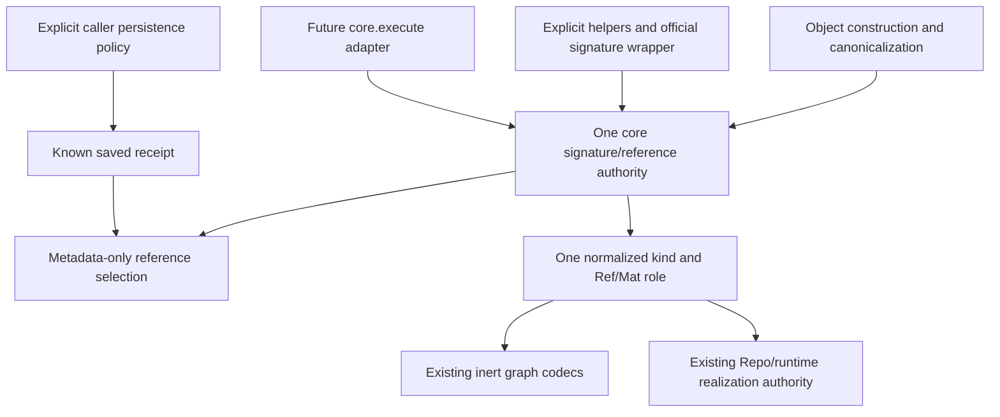

# Core Signature Simplification - Plan

## Goal Capsule

- **Objective:** Unify signature interpretation, Ref/Mat behavior, and reference selection in one shared core authority used by Object construction, supported DRYML method arguments/returns, canonicalization, and future core execution.
- **Product authority:** The project owner's reference/signature simplification decisions, including the requirement that this logic not be duplicated elsewhere in core.
- **Boundary:** This plan owns shared semantics and migration of their existing consumers, not another reference identity, persistence lifecycle, execution backend, or transport codec.
- **Open blockers:** None at the product-contract level. Repo reuse is delegated, incomparable data unions and nested role annotations are rejected, and undetected mutation of reused live payloads is an accepted limitation described below. Detailed API and implementation choices remain for planning.

---

## Product Contract

### Summary

Provide one core-owned interpreter for reference-bearing signatures and values, exposed through validation/normalization helpers and an official local-call wrapper in the core signature module.
Choose the requested authority through supported flat annotations, then return it for Ref or delegate Mat realization to Repo under its existing reuse policy and accepted checkpoint-metadata limitation.
Migrate constructors and supported method/return consumers to this authority, retire legacy argument-role APIs, and let higher-level wrappers consume the same behavior without another annotation or conversion system.

### Problem Frame

DRYML has one live Object abstraction and several ways to describe or recover one: a construction recipe, ObjectRef identity, and exact StateRef state.
Constructor argument roles, canonicalization, and runtime decoding currently interpret parts of this behavior separately.
The first Stage 7 API draft proposed another Ref annotation inside Execute, which would make similar constructor and function signatures depend on different policy implementations.
The existing constructor-only `RefCDef` mechanism is useful precedent but cannot by itself express the agreed graph-aware reference selection or method-return behavior.

### Key Decisions

- **One semantic owner, not merely shared type names.** Parsing annotations, checking wrapper conflicts, selecting references, and interpreting normalized roles must use one core implementation. Thin adapters may bind different calling conventions but may not reproduce the policy.
- **Authority and delivery are separate.** Definition is a soft expression, CDef is a bound recipe, ObjectRef identifies a graph, and StateRef selects saved state. Ref returns the requested representation; Mat delegates realization of that authority to Repo, including its accepted live-reuse limitation. (session-settled: user-approved - chosen over separate ad hoc conversion matrices for each role: resolve authority first, then choose delivery.)
- **One public Ref/Mat vocabulary.** Support the proposed `Ref[T]` and `Mat[T]` signature forms alongside value wrappers `Ref(value)` and `Mat(value)`, rather than an execution-specific marker. (session-settled: user-approved - chosen over a separate `dryml.core.execute.Ref` system: the same semantic contract should serve all supported DRYML signature boundaries.)
- **Graph-aware automatic reference selection.** A live Object with no stateful nodes in its materializing graph selects its CDef; a stateful graph selects its known last saved StateRef when available, otherwise its ObjectRef. (session-settled: user-directed - chosen over always selecting one reference family: the graph determines which existing representation is useful.)
- **Saved means last saved, not current live state.** A known saved StateRef remains the automatic choice even after unsaved live mutation. (session-settled: user-directed - chosen over requiring a current-state match: reference selection denotes the saved snapshot rather than capturing new state.)
- **No automatic persistence.** The signature helpers and official signature wrapper never save to satisfy a conversion; the caller must save separately before requesting a StateRef that does not yet exist. Higher-level persistence policies remain outside this module. (session-settled: user-directed - chosen over caller-authorized automatic persistence at the signature boundary: saving must remain a separate caller action.)
- **Explicit conflicts fail.** Ref-wrapped values conflict with a materializing role, and Mat-wrapped values conflict with a reference-valued role. Wrappers are assertions, not permission to override the signature or its default.
- **Preserve incoming kinds during automatic selection.** A supplied CDef remains a recipe, an ObjectRef remains identity-bound, and a StateRef remains snapshot-bound; an exact-kind signature instead applies the supported conversion for its requested output.
- **Clean break from legacy role APIs.** Retire `RefCDef`, `RefCDefArg`, and superseded argument-role entry points rather than retaining compatibility facades. (session-settled: user-directed - chosen over delegation-only legacy adapters: rapid development favors one supported API.)
- **Required StateRefs must already exist.** A known applicable live receipt or unambiguous Repo lookup may supply saved state; a live binding or claim without a snapshot cannot substitute. Requests for StateRef authority reject entirely stateless graphs. (session-settled: user-approved - chosen over implicit saving or rejecting all ObjectRef-to-StateRef lookup: the requested snapshot must already exist for a stateful graph.)
- **Claim construction is conditional.** A materializing ObjectRef may reuse a matching live binding; without live or saved state, construction requires a reachable active Repo claim and cannot satisfy a StateRef requirement. (session-settled: user-directed - chosen over unconditional reconstruction or unconditional rejection: live bindings and active claims provide distinct permitted realization paths.)
- **Repo owns realization and reuse.** Ordinary direct live-Object delivery retains existing semantics; actual materialization and restoration use the caller's existing Repo policies rather than a new signature-layer reuse policy. Mat[StateRef] selects exact snapshot authority but may reuse checkpoint-marked live state without detecting later mutation. (session-settled: user-approved - chosen over independently defining live reuse in signatures: Repo already owns reuse, caching, admission, and restoration.)
- **Activation is explicit.** Annotations are inert until a developer uses the shared helpers or a DRYML wrapper that calls them; this module provides an official wrapper. (session-settled: user-directed - chosen over annotation-driven interception of arbitrary calls: conversion requires an explicit call boundary.)
- **Unspecified roles materialize.** Unannotated argument and return slots default to materializing, so `Ref(value)` conflicts in those slots. (session-settled: user-approved - chosen over wrapper-selected roles in unannotated slots: the materializing default intentionally replaces historical constructor behavior.)
- **Ambiguous saved state fails.** ObjectRef-to-StateRef resolution raises when Repo authority exposes multiple distinct saved StateRefs, including materialization that needs such resolution. (session-settled: user-directed - chosen over newest, first, or arbitrary snapshot selection: the caller has not identified one snapshot.)
- **Statefulness is a per-node class property.** Test whether each materializing node's class is a `Serializable` subclass; inspecting descendants does not mean constructing them or loading state. Resolving a class where needed is permitted at an admitted live-operation boundary. (session-settled: user-approved - chosen over materializing Objects to inspect statefulness: class information is sufficient.)
- **Reject Object-subclass annotations, not instances.** Use the supported `Object` category rather than declaring model-specific subclasses in signature policy. (session-settled: user-directed - chosen over Object-subclass signature matching: domain-specific types do not participate in this conversion layer.)
- **Unions choose the strictest reachable authority without ambiguous fallback.** Within one delivery mode, use permitted conversions to choose the strictest obtainable member, independent of member order. An ambiguous strengthening raises instead of falling back to a weaker member; mixing Ref and Mat in one union is rejected. (session-settled: user-directed - chosen over weaker unambiguous fallback or mixed delivery modes: a union does not authorize guessing authority or delivery behavior.)
- **Definitions and quotations need an explicit reference role.** Offer `Ref[Definition]` and the corresponding Selector quotation form without making these values exceptions to the materializing default. (session-settled: user-directed - chosen over automatically reference-valued Definitions and quotations: callers must declare their data role.)
- **Direct normalization helpers infer their signature context.** Provide `normalize_args` and `normalize_return` that attempt to obtain the enclosing callable's signature; the official wrapper applies them around its target. `dryml.function` is a provisional wrapper name. (session-settled: user-approved - chosen over requiring users to construct a signature-binding object for every local call: the common path should use direct helpers.)
- **Exact requested kinds, convenient conversion.** `Ref[ObjectRef]` delivers an ObjectRef, not a StateRef that happens to contain one; the same exact-output rule applies to CDef and StateRef requirements. (session-settled: user-approved - chosen over treating a reference annotation as a minimum-information requirement: richer representations are not interchangeable recipient types.)
- **Relaxation is permitted.** StateRef can relax through ObjectRef and CDef to Definition; relaxing retains the represented recipe and graph relationships without choosing new identity or state. (session-settled: user-approved - chosen over rejecting all cross-kind conversion: the requested less-specific representation is already described by the input.)
- **Live Objects supply the requested representation.** A live Object supplies its own CDef or ObjectRef when explicitly requested, regardless of statefulness or a known saved receipt; requesting StateRef retains the existing saved-state rules. (session-settled: user-approved - chosen over replacing an exact-kind request with the automatic best-available choice: the callee should receive the type it declared.)
- **Definition construction uses concretization.** A concretizable Definition becomes a CDef before materialization; omitted defaults are allowed, but missing required information or unresolved matcher/search expressions fail. (session-settled: user-approved - chosen over rejecting every non-CDef construction input: Definition-to-CDef is the ordinary preparation path.)
- **Claims supply existing identity, not a reason for Ref to construct.** CDef-to-ObjectRef requires an explicitly identified eligible declaration/claim or a unique eligible graph-matching candidate. Ref returns that identity without consuming its construction claim; Mat may realize it under existing Repo rules. (session-settled: user-approved - chosen over arbitrary claim selection or constructing merely to return a reference: identity choice and Object realization have different effects.)
- **Implicit reference strengthening preserves argument bindings.** Definition-to-CDef reference strengthening requires an already-bound expression and cannot add defaults or change supplied arguments. Ordinary Mat[Definition] construction may still apply defaults. (session-settled: user-directed - chosen over treating every concretizable Definition as an implicitly convertible reference: Definition(Counter) must not silently become CDef(Counter, start=0) for a CDef reference request.)
- **Permitted strengthening steps compose under source guards.** Definition-to-CDef-to-ObjectRef-to-StateRef chains are allowed when every step is eligible and unambiguous. A live Object without its own applicable receipt cannot implicitly use its ObjectRef to find a snapshot, and quoted input cannot implicitly unwrap into materialization. (session-settled: user-directed - chosen over unrestricted conversion-graph search: composition must preserve the original input's restrictions.)
- **Quotation unwrapping is allowed for data targets only.** Ref requests may wrap or unwrap QuotedDef and SelectorSpec and compose relaxation with wrapping; Mat requests reject quoted inputs unless the caller unwraps first. (session-settled: user-directed - chosen over banning all unwrapping or allowing automatic quoted construction: quotation is an explicit materialization boundary.)
- **Synchronous callable coverage includes `__call__`.** Support functions, methods, and instances with a discoverable synchronous Python `__call__`; reject async and generator targets initially. Passing a callable as constructor data remains a separate symbol-serialization concern. (session-settled: user-approved - chosen over rejecting all callable instances: synchronous `__call__` has the same invocation contract as an ordinary method.)
- **Flat annotations only.** Support top-level Ref/Mat forms and ordered same-role unions, not nested annotation-driven element conversion. Existing recursive value and graph materialization remains unchanged. (session-settled: user-approved - chosen over the earlier homogeneous-list signature feature: containers do not need a new conversion system in this change.)
- **Incomparable data unions are rejected.** A union whose alternatives do not have a supported authority ordering, such as Ref[Definition | QuotedDef], is unsupported rather than assigned a member-order preference. (session-settled: user-directed - chosen over inventing a preference between data representations: keep the initial conversion order well-defined.)
- **Undetected live mutation is an accepted limitation.** Do not implement mutation detection or change Repo reuse semantics to guarantee refreshed payloads. A recorded checkpoint match can reuse an Object whose live state has changed since that checkpoint. (session-settled: user-directed - chosen over mutation tracking or a mandatory reuse repair: this limitation is accepted for the current scope.)

### Conversion By Example

Choose the requested authority using permitted, unambiguous conversions; Ref delivers it, while Mat delegates realization to existing Repo policy.
An exact Ref kind is the recipient's type, not a minimum-information promise that a richer reference may replace.
Quotation is a separate expression-as-data boundary, not another rung in the authority order.

The mock signatures below illustrate the proposed contract, not APIs already implemented in DRYML.
`CDef` abbreviates `ConcreteDefinition`, and `dryml.function` is a provisional name for the official signature wrapper.
The examples distinguish selected reference authority from the current payload of a reused live Object; the accepted limitation below is part of the contract, not a promise of mutation detection.

#### Shared Scenario

Assume a Serializable Counter with constructor argument `start=0`, whose initial `count` equals `start`.
The following names describe a scenario rather than executable setup code; a row may specify a different Repo configuration when testing missing or ambiguous evidence.

| Name | Value in the scenario |
| --- | --- |
| `d` | The fully supplied Definition(Counter, start=0), with no argument left to fill |
| `d_defaults` | Definition(Counter), omitting the defaulted start argument |
| `c` | Its fully bound CDef |
| `r` | An ObjectRef for one particular Counter graph with that recipe |
| `s` | A StateRef for `r`, saved with `count=4` |
| `s2` | A different StateRef for the same `r`, saved with `count=7` |
| `o` | The live Object matching `r`, now at `count=9`, with known receipt `s` |
| `o_without_receipt` | A live Object with no known receipt, in a separate scenario where Repo state exists for its exact ObjectRef |
| `u` | Another live stateful Counter with no saved snapshot available |
| `d_bad` | A Definition missing required information or containing unresolved matcher/search values |
| `e` | A live Object whose entire materializing graph is stateless |
| `q` | A QuotedDef containing `d` |
| `sel`, `qs` | A Selector expression and a SelectorSpec wrapping that expression |

Statefulness is a per-node `Serializable` class property and includes materializing descendants, not reference-only data edges.
Inspect graph/class metadata without constructing Objects or loading payloads; resolve classes only at an admitted live-operation boundary under caller runtime controls.
Inert graph and codec inspection remain import-free.
StateRef-required signature slots reject entirely stateless graphs even if an empty-state reference can be represented by existing core formats; this plan does not invalidate those formats globally.

#### Reference Delivery

```python
@dryml.function
def recipe_ref(x: Ref[CDef]) -> Ref[CDef]:
    return x

@dryml.function
def identity_ref(x: Ref[ObjectRef]) -> Ref[ObjectRef]:
    return x

@dryml.function
def snapshot_ref(x: Ref[StateRef]) -> Ref[StateRef]:
    return x

@dryml.function
def definition_data(x: Ref[Definition]) -> Ref[Definition]:
    return x
```

| Call and evidence | Recipient/result | Effects and failure boundary |
| --- | --- | --- |
| `recipe_ref(o)` or `recipe_ref(u)` | The live Object's own CDef | No state capture or Object construction |
| `recipe_ref(s)` or `recipe_ref(r)` | The contained CDef | Relax the input; no snapshot lookup |
| `identity_ref(s)` | `s.object` | Do not restore state |
| `identity_ref(o)` | `o`'s ObjectRef, not `s` | `o.count` remains `9` |
| `snapshot_ref(o)` | Its known applicable receipt `s` | `o.count` remains `9`; no restore or save |
| `snapshot_ref(r)` with one distinct saved snapshot | That StateRef | Read supplied Repo authority without loading the target |
| `snapshot_ref(r)` with no saved snapshot | Raise | A live binding or claim without saved state cannot substitute |
| `snapshot_ref(r)` with both `s` and `s2` available | Raise as ambiguous | Do not choose newest, first, or arbitrary state |
| `snapshot_ref(u)` with no saved snapshot available | Raise | Never publish a snapshot automatically |
| `snapshot_ref(e)` | Raise | Entirely stateless graphs cannot satisfy this signature slot |
| `recipe_ref(d)` | Canonicalize its already-bound arguments and return its CDef | Representation freezing is allowed; adding or changing argument bindings is not |
| `recipe_ref(d_defaults)` | Raise | Do not silently supply `start=0` for reference strengthening |
| `recipe_ref(d_bad)` | Raise during concretization | Do not invent required arguments or execute a search for a completion |
| `identity_ref(c)` with one eligible graph-matching declaration/claim | That registered ObjectRef | Do not construct the Object or consume the construction claim |
| `identity_ref(c)` with no eligible matching identity | Raise | Do not register a new identity |
| `identity_ref(c)` with several eligible distinct identities | Raise as ambiguous | An explicitly identified eligible claim can disambiguate |
| `definition_data(d)` or `definition_data(d_bad)` | Preserve the Definition as data | Omission and matcher semantics stay unchanged |
| `definition_data(c)`, `definition_data(r)`, or `definition_data(s)` | Relax through CDef to Definition data | Retain the recipe's effective values and graph relationships |
| `definition_data(o)` | Relax its CDef to Definition data | Do not inspect or capture current payload state |

Relaxation follows `StateRef -> ObjectRef -> CDef -> Definition` without mutating the input or recursively erasing embedded reference authority from descendants.
Strengthening has individual permitted steps: already-bound Definition to CDef without argument changes, CDef to an eligible identified ObjectRef, and ObjectRef to an existing unambiguous StateRef.
The Definition guard applies to every implicit strengthening path, not only an exact Ref[CDef] request; ordinary Mat[Definition] preparation is distinguished below.
Freezing a list into a canonical container or normalizing equivalent positional/keyword spelling may change representation, but cannot supply omitted constructor defaults, evaluate an unresolved choice, or rewrite the passed arguments to make strengthening succeed.
Matching a declaration must preserve complete graph topology and embedded identities, not merely compare class/parameter values.
Reference delivery may validate an eligible declaration but leaves claim acquisition and construction to Repo materialization; a later loss of eligibility must fail under existing Repo rules, not be reported as completed construction.

#### Materialized Delivery

```python
@dryml.function
def from_definition(x: Mat[Definition]) -> Object:
    return x

@dryml.function
def from_recipe(x: Mat[CDef]) -> Object:
    return x

@dryml.function
def from_identity(x: Mat[ObjectRef]) -> Object:
    return x

@dryml.function
def from_snapshot(x: Mat[StateRef]) -> Object:
    return x
```

| Call and evidence | Object delivered to the body | Effects and failure boundary |
| --- | --- | --- |
| `from_definition(d)` | Concretize, then materialize under ordinary CDef rules | The full chain produces an Object, not a CDef result |
| `from_definition(d_defaults)` | Apply `start=0`, concretize, then materialize | Ordinary Definition construction may fill constructor defaults |
| `from_definition(d_bad)` | Raise during concretization | No guessed arguments or implicit Repo search |
| `from_recipe(c)` | An Object satisfying the recipe | No selected saved snapshot is promised |
| `from_identity(r)` with an eligible live binding | May reuse that exact identity | Retain existing admission/ownership rules |
| `from_identity(r)` without a live binding, with one saved StateRef | Realize that saved state for `r` | Load through existing Repo authority |
| `from_identity(r)` without a live binding, with multiple saved StateRefs | Raise as ambiguous | Do not fall back to claim construction |
| `from_identity(r)` without live or saved state, with an active reachable claim | Construct under the claim | Mat may acquire the claim; Ref must not |
| `from_identity(r)` without live/saved state or an eligible claim | Raise | Do not manufacture declaration authority |
| `from_snapshot(s)` | Realize exact snapshot authority `s` through Repo | A fresh/restored payload has `count=4`; reused checkpoint-marked payloads have the accepted limitation below |
| `from_snapshot(o)` | Select known `s`, then use the caller's Repo reuse policy | Do not independently force restoration or promise `count=4` for a mutated reused instance |
| `from_snapshot(u)` with no saved state available | Raise | Never save automatically |
| `from_snapshot(e)` | Raise | The required StateRef slot excludes entirely stateless graphs |

`Mat(Definition(...))` asserts materializing delivery and therefore takes the Definition-to-CDef-to-Object path when admitted by a materializing slot.
That construction path is not permission to fill missing bindings when a request first needs stronger CDef, ObjectRef, or StateRef reference authority; the already-bound guard applies at that implicit strengthening step.
`Ref(Definition(...))` is not permission to override an unannotated slot's materializing default; reference-data delivery needs a compatible explicit annotation.
Ordinary `Object`/`Mat[Object]` delivery of `o` preserves its live instance at `count=9`.
Canonical selection of saved state `4` does not change that ordinary local-call rule; an explicit `Mat[StateRef]` request delegates the selected snapshot to Repo instead of using an unconditional live pass-through rule.

```python
snapshot_ref(o)     # returns s; o.count remains 9
from_snapshot(o)    # selects s; payload reuse follows Repo policy below
```

The second call fixes reference authority, but does not independently verify that a reused live payload still equals the saved snapshot.
When Repo performs restoration, it retains reservations, ownership checks, preflight, and failure handling; these effects belong to Mat realization, not Ref selection or canonicalization.
Within one argument or return normalization boundary, incompatible state demands for a shared materializing identity must fail before any restore begins, including conflicts on overlapping descendant ObjectIds.
Different snapshots of one identity are permitted as reference-valued data; comparing those snapshots does not require materializing one Object in two states.

#### Repo Reuse And Accepted Limitation

Signature consumers forward the caller's existing realization options to Repo without assigning independent meanings or overriding its defaults.
For exact StateRef loads, `reuse_live` defaults to `"matching"`; `cache` is a separate Repo option whose default remains `"weak"`.
Structural CDef/Definition realization keeps Repo's existing cache and per-realization sharing rules, not a new guarantee to always reuse or always rebuild a supplied instance.
Ordinary direct live-Object delivery remains unchanged where no reference realization is required.

| Caller-selected Repo policy | Existing realization behavior | Consequence for a mutated live candidate |
| --- | --- | --- |
| `reuse_live="matching"` | May reuse an eligible instance whose recorded checkpoint hash matches the requested state | A matching marker can skip restoration even when the payload changed |
| `reuse_live="greedy"` | May restore a uniquely eligible candidate in place when its recorded checkpoint hash differs | It may also skip restoration when the marker already matches; this is not mutation detection |
| `reuse_live="never"` | Load a fresh realization rather than reuse a live candidate | The new instance loads the selected saved payload; a separately held mutated instance is not refreshed |

**Accepted limitation:** after saving state A and mutating a live Object to B, Repo can still reuse that Object for A when its recorded checkpoint marker remains A.
For the shared scenario, `from_snapshot(o)` may return the eligible live instance at `count=9` under `"matching"` or `"greedy"`, even though the selected StateRef records `count=4`.
This is knowingly accepted for the current requirements, not an undetected defect claimed fixed or an outstanding implementation blocker.
Do not add mutation interception, dirty tracking, payload comparison, extra serialization, or forced refresh to close this gap.
Consumers that require a freshly loaded snapshot can use existing `reuse_live="never"`; an explicit caller-owned restore into an exact live graph remains a separate existing Repo operation.
The limitation does not permit selecting a different StateRef, mixing identities, bypassing claims or reservations, or concealing detected load/restore failures.
Tests should document the accepted reused-payload behavior and correct policy forwarding rather than require mutation detection.

#### Composed Strengthening

Permitted relaxation and strengthening steps compose, with each authority-producing step independently validated against the original input and requested delivery mode.
The already-bound Definition guard and no-implicit-live-receipt-lookup rule are source restrictions, not optional shortcuts.

| Call | Permitted chain or rejection | Required evidence |
| --- | --- | --- |
| `identity_ref(d)` | Definition -> CDef -> eligible ObjectRef -> return reference | Fully supplied arguments and one selected eligible identity |
| `from_identity(d)` | The same chain, then realize that identity | The same authority checks plus Repo realization/admission |
| `snapshot_ref(c)` | CDef -> eligible ObjectRef -> unique saved StateRef | Both identity-selection and snapshot evidence must independently exist |
| `snapshot_ref(d)` | Definition -> CDef -> eligible ObjectRef -> unique saved StateRef | The already-bound guard plus every later authority check |
| `identity_ref(d_defaults)` or `snapshot_ref(d_defaults)` | Raise before using a completed recipe to select identity | Implicit strengthening cannot fill the omitted `start` argument |
| `snapshot_ref(o_without_receipt)` | Raise even when Repo state exists for its exact identity | A live Object must supply its own known applicable receipt |
| `snapshot_ref(o_without_receipt.object_ref)` | ObjectRef -> unique saved StateRef | Supplying the ObjectRef explicitly opts into the Repo lookup rules |

An explicitly selected claim is not a snapshot, and the existence of a snapshot does not prove a claim is eligible.
No allowed chain may discard supplied identity and regain a different identity: an ObjectRef must not relax to CDef merely to select another ObjectRef's claim.
All chains retain no-automatic-save and no-new-identity-allocation constraints.
They cannot bypass a quoted-input or missing-live-receipt restriction by finding an indirect path through a weaker representation.

#### Union Selection

```python
@dryml.function
def reference_choice(
    x: Ref[CDef | ObjectRef | StateRef],
) -> Ref[CDef | ObjectRef | StateRef]:
    return x
```

Within one delivery mode, choose the strictest reachable permitted member, not the first member and not only a direct Python-type match.
With stable evidence for the duration of these illustrative calls:

| Call and evidence | Selected result |
| --- | --- |
| `reference_choice(s)` | The supplied StateRef |
| `reference_choice(o)` | Its known StateRef `s` |
| `reference_choice(r)` with one saved snapshot | That StateRef through the permitted lookup |
| `reference_choice(u)` with no saved snapshot | Its ObjectRef |
| `reference_choice(c)` without any eligible matching identity | Its CDef |
| `reference_choice(e)` | Its ObjectRef; the StateRef alternative is ineligible for a stateless graph |
| `reference_choice(r)` with both `s` and `s2` available | Raise as ambiguous strengthening; do not fall back to ObjectRef |
| `reference_choice(c)` with several eligible distinct ObjectRefs | Raise as ambiguous strengthening; do not fall back to CDef |
| Input with no reachable permitted member | Raise rather than invent a conversion |

`Ref[A | B]` and `Ref[A] | Ref[B]` express the same single-role alternatives; the equivalent distribution holds for Mat.
A union such as `Ref[ObjectRef] | Mat[ObjectRef]` is rejected rather than guessing the delivery mode.
An unavailable stronger alternative may leave a weaker reachable member, but ambiguity in an otherwise eligible strengthening is an error for the whole request.
The same ambiguity rule applies to exact requirements and to both Ref and Mat unions.
Same-role unions with incomparable data alternatives, such as `Ref[Definition | QuotedDef]`, are rejected during signature validation rather than assigned a preference based on the supplied value or member order.
Individual supported data forms remain usable; only their unsupported union is rejected.

Graph-aware automatic selection remains distinct from a broad union.
It chooses CDef for a stateless live graph, the known receipt for a stateful live graph with one, and ObjectRef otherwise; supplied reference/data values retain their kind.
It does not search the Repo for the newest snapshot or fill an absent live receipt by lookup.
In particular, automatic selection of `e` yields CDef while `reference_choice(e)` can choose ObjectRef.
Its public spelling may be finalized during planning, but must advertise the possible result family rather than masquerade as an exact ObjectRef request.

#### Quotation Examples

QuotedDef stores a Definition expression; SelectorSpec stores a Selector and its matching policy.
They are expression data, not materializing Object edges or an extension of the reference-authority order.
The following names distinguish the requested data types rather than hiding them behind a single "Selector quotation" category:

```python
@dryml.function
def quoted_data(x: Ref[QuotedDef]) -> Ref[QuotedDef]:
    return x

@dryml.function
def selector_data(x: Ref[Selector]) -> Ref[Selector]:
    return x

@dryml.function
def selector_spec_data(x: Ref[SelectorSpec]) -> Ref[SelectorSpec]:
    return x
```

| Call | Required behavior |
| --- | --- |
| `quoted_data(q)` | Preserve the quoted Definition as data |
| `selector_spec_data(qs)` | Preserve the quoted Selector and its policy |
| `selector_data(sel)` | Preserve the Selector as data; do not execute a query |
| `quoted_data(d)` | Explicit-target wrapping of the Definition as QuotedDef |
| `selector_spec_data(sel)` | Explicit-target wrapping of the Selector as SelectorSpec |
| `definition_data(q)` | Unwrap and deliver `d` as Definition data |
| `selector_data(qs)` | Unwrap and deliver the contained Selector, retaining its policy |
| `from_definition(q)` or `from_recipe(qs)` | Raise; do not implicitly unwrap quoted input into materialization |
| `from_definition(q.value)` | Ordinary explicit Definition materialization; succeeds only if the expression concretizes |
| `selector_spec_data(d)` or `selector_spec_data(d_defaults)` | Construct a Selector with its ordinary default matching policy, then wrap as SelectorSpec; preserve omissions in the original Definition |
| `quoted_data(s)` | Relax through CDef to Definition, then wrap as QuotedDef |

Creating a Selector is not identical to quoting a Definition: use the existing Selector constructor's default matching policy and leave omitted parameters unconstrained, rather than concretizing first or inventing a second policy.
Wrapping, unwrapping for an explicit data target, and relaxation followed by wrapping are supported; an original QuotedDef or SelectorSpec remains ineligible for implicit Mat delivery even when an unwrapping path exists.
The caller may request data unwrapping separately and then explicitly pass the resulting Definition to a materializing boundary.
Reference-data support never overrides the default materializing role of an unannotated slot.

#### Flat Annotation Boundary

```python
def nested_role(xs: list[Ref[ObjectRef]]):
    pass  # rejected if activated through a signature helper/wrapper

def container_role(xs: Mat[list[ObjectRef]]):
    pass  # rejected: a container is not a supported Ref/Mat target

def ordinary_layers(layer_defs):
    pass  # ordinary value handling; no per-element annotation conversion
```

Reject nested role forms such as `list[Ref[ObjectRef]]` in argument or return annotations, including for empty containers; do not silently ignore an unsupported nested Ref/Mat marker.
Reject container targets such as `Ref[list]` and `Mat[list[ObjectRef]]`.
Top-level `Ref[ObjectRef]`, `Mat[StateRef]`, and ordered same-role unions remain supported; distributing one role over a union is not container-element interpretation.
Ordinary annotations such as `list` or `list[float]` do not introduce element-wise Ref/Mat policy or a new general-purpose type checker.

This restriction does not reject list values or disable existing recursive canonicalization/materialization of graph values inside lists, tuples, mappings, or sets.
Existing graph edges, aliases, whole-call sharing, and wrapper validation remain owned by the same core pipelines; no new signature-driven element conversion or map-key conversion is introduced.
This change adds no annotation-directed list element conversion such as `[r, s] -> [r, r]` reference normalization.

Current Torch and Keras Sequential helpers normalize layer descriptions into FactorySpec values and construct native framework layers from them.
FactorySpec is a leaf spec for non-DRYML runtime objects and rejects nested DRYML Object/Definition/CDef arguments; these Sequential layer lists do not require nested Ref/Mat annotations.
Preserve Sequential/FactorySpec behavior rather than adding container policy to signatures or weakening FactorySpec's graph-node restriction.

#### Callable Targets

The initial wrapper supports synchronous Python functions, ordinary methods, and callable instances whose effective synchronous Python `__call__` signature is discoverable.
The normalizer must preserve Python receiver binding rather than treating `self` as a user argument to be rebound or converted independently.

```python
class Model:
    @dryml.function
    def __call__(self, model: Mat[Object]) -> Object:
        return model

wrapped_model = dryml.function(model_instance)
```

Decorating `Model.__call__` wraps a method; wrapping `model_instance` uses its bound `__call__` signature.
Either route normalizes arguments before synchronous invocation and normalizes the result after return.
Existing Method/Model invocation machinery may call the shared helpers directly without surrendering its own dispatch or model policy.

Async functions, generator functions, async-generator functions, and instances with such `__call__` implementations are unsupported targets initially and must be rejected rather than partially invoked.
A synchronous function returning an iterator or awaitable as a value is not itself an async/generator target; the wrapper must not iterate or await that value automatically.
It still applies the declared return normalization, which may reject a value unsupported by that declaration.

This target-invocation contract is distinct from passing a callable as constructor data.
Existing symbol serialization may represent supported functions as ImportRef or SourceSpec and later resolve them back to live callables; it is not a blanket claim that all callable objects are plain data or serializable.

Other boundary examples are already determined:

- An Object-subclass instance can pass through `Mat[Object]`; declaring `Mat[Counter]`, `Ref[Counter]`, or a union containing the subclass annotation raises.
- Ref/Mat applied to an unsupported type raises; ordinary scalar values in ordinary slots do not become Objects.
- Nested Ref/Mat container annotations and incomparable same-role data unions raise; ordinary container values retain their existing non-annotation-driven behavior.
- `normalize_args` and `normalize_return` raise when they cannot identify the enclosing signature rather than guessing; wrappers supply their target signature to the same authority.
- An ordinary synchronous function wrapper normalizes arguments, invokes the target, then normalizes its result. Direct helpers validate when called and cannot prevent preceding body statements.
- Ordinary bound methods and synchronous callable instances are supported as targets when their effective signature is discoverable; unsupported or undiscoverable targets raise. Async and generator target support is deferred, not an open choice for this implementation.

Input and return normalization use the same policies but occur at different times.
Return-time snapshot selection sees a receipt explicitly updated by the body or a separate owning policy; Ref normalization never performs that save, and Mat realization retains Repo's accepted reuse limitation and does not promise rollback of body effects.

### Single-Owner Boundary

There must be one reference/signature policy implementation in core, with one supported interface for all consumers.
The new core signature module owns the helpers and official wrapper; its final interface names and internal layout are implementation-planning decisions.
The existing `core.arg_roles` machinery is a migration input, not a compatibility surface to retain.
Moving the current rules into a new module while leaving competing fallbacks in canonicalization or runtime decoding does not satisfy this plan.

| Current path | Responsibility after consolidation |
| --- | --- |
| `core.arg_roles`: annotation parsing and `apply_arg_roles`, `apply_bound_arg_roles`, `apply_definition_arg_roles` | Migrate consumers to the shared signature API and retire the superseded entry points; no compatibility adapters |
| `core.canonical`: live Object conversion, `freeze_def_value`, `freeze_link_target` | Use the shared selector rather than independently forcing live Objects to CDefs |
| `core.links`: Ref/Mat helpers and DefLink admission | Use the shared role/wrapper rules without prematurely erasing evidence needed for conflict checks |
| `core.object` and `core.definition`: constructor preparation, binding, and concretization | Apply one shared signature interpretation without duplicate binding or policy evaluation |
| `core.canonical` runtime decoding and `core.materialization` | Interpret normalized reference roles consistently and delegate realization to existing Repo/runtime authority |
| Repo/reference topology walkers in `repo`, `repo_plan`, and `reference_values` | Reuse shared materializing/reference traversal semantics rather than maintain equivalent ad hoc decisions |
| `core.cdef_graph` and graph utilities | Retain generic graph algorithms and explicit traversal views; query/reference inspection is not the same view as materialization |
| CDef and portable Repo-definition codecs | Encode and validate normalized kind/edge structure inertly, not select new references or run signature/materialization policy |
| Official signature wrapper, supported Method/method callers, and higher-level wrappers such as managed and future `core.execute` | Call the shared validation/normalization helpers; no private annotation parser, reference chooser, or Ref marker |

Type-tag checks needed to encode a closed format or validate an exact reference are not themselves duplicated policy.
The prohibition applies to independently deciding defaults, allowed conversions, wrapper precedence, reference selection, or runtime meaning.
Different traversal purposes must be named and use their appropriate shared view rather than be forced into an incorrect universal walk.

<!-- ce-section: work-relationships -->
### How This Work Fits Together

This artifact owns the common signature/reference contract and consolidation of its consumers.

- **Depends on:** Existing CDef graph topology, ObjectRef/StateRef identities, last-state receipts, Repo construction/exact-load operations, runtime admission, and passive annotation infrastructure.
- **Enables:** `docs/plans/2026-09-10-002-feat-stage-7-core-execute-plan.md` can bind calls and results through this interface while owning transport, worker setup, output-save policy, and caller recovery.
- **Does not reopen:** Implemented Repo Selector routing, replication, portable definitions, or local managed state-Repo routing in `docs/plans/2026-09-10-001-feat-repo-save-routing-plan.md`.
- **Keeps separate:** Stage 7's named P1/P2 Repo repairs remain in that plan rather than being moved or duplicated here.
- **Does not create:** A new roadmap stage, generic annotation-policy package, backend, or global function-interception mechanism.

### Actors

- A1. **Object author:** Declares constructor argument behavior and relies on a faithful canonical definition.
- A2. **Method author:** Declares argument and return behavior at a supported DRYML call boundary.
- A3. **Core/integration consumer:** Uses the shared interpreter to freeze, decode, invoke, or transport a call without implementing the policy again.

### Requirements

**One authority and shared signature binding**

- R1. Core must provide one shared authority for reference-bearing annotation interpretation, wrapper validation, reference selection, and normalized runtime/canonical meaning.
- R2. Every existing core path that performs those decisions must delegate to that authority or be removed; sharing declarations while retaining separate decision trees is insufficient.
- R3. Constructor, already-bound argument, definition/concretization, supported method-argument, and method-return paths must consume the same normalized contract.
- R4. Signature binding must preserve Python positional/keyword/default behavior and whole-call graph sharing without independently rebinding or preparing an Object constructor twice.
- R5. The owner must not import its higher-level consumers, execution backends, managed policy, or optional frameworks merely to expose the signature/reference API.
- R6. Passive annotations remain inert unless a developer invokes shared helpers or a DRYML-controlled boundary that calls those helpers.

**Reference selection**

- R7. Automatic selection for a live Object must inspect the whole materializing graph for statefulness rather than only the root class.
- R8. An entirely stateless live graph must select its CDef while preserving private graph topology.
- R9. A stateful live graph with a known applicable last saved StateRef must select that exact receipt even if later live mutations are unsaved.
- R10. A stateful live graph without a saved receipt must select its ObjectRef without claiming that a saved snapshot or valid reconstruction authority exists.
- R11. Automatic selection must preserve the kind and meaning of already supplied CDef, ObjectRef, and StateRef values.
- R12. Reference selection must not save or capture Object payloads, commit Stores, allocate a replacement live Object, or infer a newest snapshot from Store ordering.
- R13. An explicit reference-kind requirement must deliver that exact kind through supported normalization or raise, never substitute a richer or poorer reference kind.

**Roles, canonicalization, and delivery**

- R14. Ref/Mat signature forms and value wrappers must use one public vocabulary, rejecting conflicts before normalization effects at the activated input or return boundary.
- R15. A materializing role, including the unspecified-role default, must reject a Ref-wrapped value, and a reference-valued role must reject a Mat-wrapped value.
- R16. Wrapper conflict validation must occur before canonical normalization can erase the explicit wrapper distinction.
- R17. Canonicalization must retain both the selected reference kind and its graph-edge role rather than replace every materializing reference with one family.
- R18. A supplied materializing CDef must remain a construction recipe, not acquire ObjectRef/StateRef authority merely to form a CDef.
- R19. Reference-valued delivery must return the actual selected reference value without materializing its target or exposing an additional wrapper to the callee.
- R20. Materializing delivery must use shared resolution semantics and existing Repo/runtime authority, preserving selected identity/snapshot authority and admission constraints while retaining the accepted checkpoint-based live-payload reuse limitation.
- R21. Selecting an unsaved ObjectRef must not be confused with permission to reconstruct unsaved live state or bypass declaration/claim requirements.
- R22. Return interpretation must use the same policy as arguments, with a distinct return-time selection boundary so an explicitly updated saved receipt is not replaced by an earlier input choice.
- R23. Reference selection and canonicalization alone must not mutate the supplied live Objects or weaken the caller's orchestration floor.

**Consumer and persistence integrity**

- R24. Canonicalizers, materializers, and reference/topology consumers must reuse the correct shared edge/traversal semantics while retaining their separate graph, persistence, and validation responsibilities.
- R25. Codecs must preserve normalized reference/role information without opening Stores, resolving live targets, or invoking a second copy of signature policy during inert decoding.
- R26. The change must preserve CDef/ObjectRef/StateRef identity algorithms and encoded authority, while documenting intentional changes to newly formed CDefs when a live argument now selects a different reference representation.
- R27. Existing Selector quotation, value-role, and parameter matcher/generator behavior must remain with its owner rather than be misclassified as another reference kind.
- R28. Retire `RefCDef`, `RefCDefArg`, and superseded argument-role entry points, migrating maintained consumers, tests, and documentation without compatibility facades.
- R29. The shared contract must support later `core.execute` consumption without another Ref/Mat marker, graph-statefulness test, saved-receipt fallback, or materialization decision table; implementing that execution adapter is not a completion prerequisite here.
- R30. Signature helpers and the official signature wrapper must never save automatically, including when required-state conversion fails; any higher-level publication policy remains a separate caller-owned operation.
- R31. Maintained tests and ownership checks must demonstrate that all supported entry paths use the same decisions, not merely produce the same result in one hand-picked case.

**Explicit activation and resolved delivery rules**

- R32. The core signature module must expose reusable argument/return validation and normalization helpers and an official local-call wrapper implemented through those helpers.
- R33. Higher-level DRYML wrappers adopting signature conversion, including managed and core execution wrappers, must call the same helpers rather than interpret annotations themselves.
- R34. Argument and return slots with no specified role must default to materializing for supported reference-bearing values.
- R35. Ordinary local Object/Mat[Object] delivery must preserve a supplied live instance and its unsaved state; explicit Mat[StateRef] delivery must delegate the selected snapshot to Repo's existing realization policy rather than independently force or validate current live state.
- R36. Materializing ObjectRef delivery may reuse a matching live binding under existing Repo/runtime admission constraints, but identity matching alone must not substitute for required snapshot authority or bypass its Repo resolution path.
- R37. Without matching live or saved state, ObjectRef construction must require a materializing role and an already-registered active claim reachable through the Repo for that exact ObjectRef.
- R38. Without matching live or saved state and an applicable claim, ObjectRef realization must raise rather than create declaration or claim authority.
- R39. A required StateRef conversion must raise when no applicable existing snapshot is available under an approved conversion path; live bindings and claims alone cannot supply saved-state authority.
- R40. For a stateful graph, a reference-valued StateRef requirement must preserve a supplied StateRef or applicable known live receipt without capturing unsaved mutation or restoring the Object.
- R41. Explicit ObjectRef-to-StateRef conversion must use supplied Repo authority to resolve existing saved state, with the one-distinct-snapshot case succeeding without saving or materializing the target.

**Statefulness, annotations, and helper ergonomics**

- R42. ObjectRef saved-state resolution must raise as ambiguous for multiple distinct saved StateRefs, including materialization without a matching live binding.
- R43. Graph statefulness must use each materializing node's `Serializable` class status without constructing Objects or loading state payloads.
- R44. Any class resolution needed for statefulness must occur at an admitted live-operation boundary under caller runtime controls, not during inert graph or codec inspection.
- R45. Signature validation must reject Object-subclass annotations, including within Ref/Mat forms and unions, while allowing their live instances under supported `Object` annotations.
- R46. Single-role unions must rank permitted reachable authorities by strictness, rejecting ambiguous strengthening rather than falling back to a weaker member or using union order to choose.
- R47. Explicit reference-valued Definition and Selector quotation annotations must deliver those values as data without concretization, target construction, or a default-role exception.
- R48. `normalize_args` must validate and normalize arguments against the enclosing callable's discovered signature and return normalized positional and keyword arguments.
- R49. `normalize_return` must validate and normalize a result against the enclosing callable's discovered return signature.
- R50. The official function wrapper must invoke the shared argument normalizer before the target and the shared return normalizer after the target returns, using the target's signature rather than the wrapper's generic signature.

**Exact-kind normalization**

- R51. An exact CDef or ObjectRef requirement applied to a live Object must return that Object's own requested representation regardless of graph statefulness or saved-receipt availability.
- R52. A StateRef supplied to an exact ObjectRef requirement must normalize to its contained ObjectRef without saved-state lookup or target materialization.
- R53. An ObjectRef or StateRef supplied to an exact CDef requirement must normalize to its contained CDef while preserving that CDef's graph topology and embedded reference authority.
- R54. Exact-kind projection must not mutate the input, save state, allocate replacement Objects or Object identities, or query for a different snapshot.
- R55. Automatic reference selection must remain distinct from exact-kind normalization, and its public annotation must represent the possible result family rather than promise a single kind.

**Concretization and realization boundaries**

- R56. Mat[Definition] must concretize a constructible expression with normal defaults and preparation before ordinary CDef materialization, raising when required information or unresolved expressions prevent concretization.
- R57. CDef-to-ObjectRef conversion must use an explicitly identified eligible declaration/claim or one unique eligible graph-matching candidate, without constructing the target, allocating identities, or consuming its construction claim for Ref delivery.
- R58. CDef-to-Definition relaxation, including from an ObjectRef, StateRef, or live Object's CDef, must preserve the represented recipe and graph relationships without capturing payload state.
- R59. Signature slots requiring StateRef authority must reject entirely stateless materializing graphs without changing the global validity or identity algorithms of persisted references.
- R60. Mat[StateRef] must submit the selected exact StateRef to existing Repo realization with caller-selected reuse/cache options, without adding mutation detection or stronger refreshed-payload guarantees for reused instances.
- R61. Combined materializing demands within one normalization boundary must reject conflicting saved states for shared identities before restoration effects, including overlapping descendant ObjectIds; reference-valued snapshots remain independent data.
- R62. Signature normalization must raise for unsupported Ref/Mat types or unavailable/ambiguous enclosing-signature discovery rather than guess a conversion or signature.
- R63. Distributing one role over an ordered reference union must preserve its meaning; mixed Ref/Mat unions and incomparable same-role data alternatives must be rejected.
- R64. A dedicated public signatures documentation page must centralize the final authority rules, mock-call examples, supported conversions, failure cases, and effects, with dependent consumers tested against the shared contract.

**Guarded composition and callable support**

- R65. Implicit Definition-to-CDef reference strengthening must require already-bound arguments and preserve their meaning without supplying omitted defaults or changing passed argument bindings, while allowing canonical representation changes.
- R66. Permitted strengthening steps must compose when every step has eligible unambiguous evidence, without relaxing existing identity merely to select a different identity or bypassing original-input restrictions.
- R67. A live Object lacking an applicable known receipt must fail a StateRef requirement without implicit ObjectRef-based Repo lookup, even though explicitly supplied ObjectRefs retain their lookup behavior.
- R68. Explicit reference-data targets must support QuotedDef/SelectorSpec wrapping and unwrapping and relaxation followed by wrapping, but original quoted inputs must not implicitly unwrap into Mat delivery.
- R69. The official wrapper must support synchronous Python functions, methods, and callable instances with discoverable synchronous Python `__call__` signatures, preserving receiver binding and rejecting async/generator targets initially.
- R70. Signature interpretation must support only flat Ref/Mat forms and ordered same-role unions, rejecting nested role/container-target annotations without changing existing recursive value or graph materialization.
- R71. The wrapper must not automatically await or iterate a synchronous target's returned value; ordinary return validation and normalization still apply.
- R72. Signature consumers must preserve Repo's existing reuse/cache options and defaults, including StateRef load reuse_live="matching" and cache="weak", without introducing a parallel signature-layer reuse policy.
- R73. Documentation and tests must state the accepted possibility of mutated checkpoint-marked live payloads being reused without restoration, while keeping mutation detection and any mandatory correction of that limitation out of scope.

### API Direction

The proposed public vocabulary is shared through core, not an Execute namespace.
The mock functions in Conversion By Example define the user-facing direction, including rejected forms and the accepted live-reuse limitation; API naming and plumbing remain planning choices.

#### New

New annotation forms are flat `Ref[T]` and `Mat[T]` with supported ordered same-role unions; nested role annotations are not supported. QuotedDef and SelectorSpec remain distinct expression-data types rather than Object reference identities.
These are proposed annotations, not syntax already supported by the current callable Ref/Mat helpers.
Ref recipients receive the requested reference/data type; Mat recipients receive Repo realizations of the selected authority subject to existing reuse semantics and the accepted payload limitation.
These annotations are inert on a direct call unless the body uses normalization helpers or a DRYML wrapper activates them.
Exact-kind conversion, required-StateRef behavior, Object-subclass annotation rejection, and strictest-reachable unions follow Conversion By Example.
For example, a wrapped call to an argument annotated `Ref[ObjectRef]` may receive a live Object or StateRef as input, but the target receives an ObjectRef after normalization.
The automatic-selection annotation remains a separate unresolved spelling and is not implemented by silently widening an exact-kind annotation.

The direct helper API has the following intended call shapes:

```python
from typing import Any

def normalize_args(
    *args: Any, **kwargs: Any,
) -> tuple[tuple[Any, ...], dict[str, Any]]: ...

def normalize_return(value: Any) -> Any: ...
```

Both helpers attempt to obtain the enclosing callable's signature and share the argument/return policy with constructors and integration consumers.
`normalize_args` returns `(args, kwargs)` suitable for invoking the target; `normalize_return` returns the normalized result.
Signature-discovery failures raise; precise discovery mechanics and any explicit-signature API are planning decisions within the settled synchronous function/method/callable-instance scope.
Direct helper use validates when the helper runs; it cannot prevent statements that the function body executed before invoking it.

The official wrapper belongs to the core signature module; `dryml.function` is provisional, not an implemented or finalized export.
It runs the shared argument normalizer, invokes the target, then runs the shared return normalizer against the target's signature.
For a method or callable instance, that is the effective bound signature, with Python receiver binding retained.
It does not save or change unrelated unwrapped Python calls; return validation cannot undo effects already performed by the body.

The shared consumer interface must also retain metadata-only reference selection, canonicalization, already-bound constructor input, and separate validation before caller-owned post-return effects.
Already-bound constructors must not repeat preparation hooks or Python binding; none of these views is a new persistent identity or transport record.
Constructor consumers use argument operations without changing Python's `__init__` return contract.
The earlier `Signature`/`SignatureBinding` class sketch is not a required public API; planning chooses the reusable representation behind the direct helpers.
Repo-backed normalization must accept supplied Repo authority without making ordinary metadata-only selection open a Repo or materialize an Object.
Final API plumbing for Repo authority, existing realization options, explicit claim selection, and wrapper-supplied signature context is a planning choice; it must not steal user-call keyword arguments.
Realization delegates to existing Repo/runtime operations and retains their admission failures, reuse/cache defaults, local direct-live delivery, and accepted lack of mutation detection.

#### Modified

Existing value-call shapes remain recognizable:

```python
def Ref(target: Any) -> DefLink: ...
def Mat(target: Any) -> DefLink: ...
```

They acquire the shared semantics instead of independently converting live Objects to CDefs; support for annotation subscription must coexist with those value forms.
Constructor, canonicalization, and runtime consumers migrate to the new shared API rather than retain old argument-role methods as delegation facades.
Unannotated constructor uses of `Ref(value)` intentionally become conflicts under the materializing default; callers must declare a reference-valued role.
Codec signatures need not change merely to consume normalized references, but their round trips must preserve the chosen kind and role.

#### Removed

Remove superseded private policy implementations and the proposed Execute-owned annotation system.
`dryml.core.execute.Ref` has not been implemented; withdrawing that proposal is not removal of a shipped runtime API.
Retire `RefCDef`, `RefCDefArg`, other superseded public role spellings, and the old `apply_arg_roles`, `apply_bound_arg_roles`, and `apply_definition_arg_roles` entry points without compatibility aliases or adapters.
This API retirement does not remove CDef/ObjectRef/StateRef identities or transfer Selector quotation semantics into signature policy.

### Key Flows

- F1. **Bind a constructor or method.** A helper discovers its enclosing signature, or a DRYML wrapper provides its target's signature to the same authority. Shared normalization validates supported annotation categories, binds inputs or accepts an already-bound constructor record, applies role defaults, and checks wrapper conflicts. The official wrapper does this before invoking the body; direct helper use checks at the point the helper is called. **Covers R1-R6, R14-R16, R32-R34, R45-R50.**
- F2. **Form canonical arguments.** The shared authority resolves an exact-kind request, a strictest-reachable union, or graph-aware automatic selection under its named policy. Implicit strengthening preserves already-bound Definition arguments, validates each authority step, and rejects ambiguity or source-guard violations. Canonicalization records the resolved authority and role. **Covers R7-R18, R23-R25, R46, R51-R58, R65-R68.**
- F3. **Deliver arguments.** Ref delivers reference/data values without target construction or restoration. Mat concretizes a Definition when needed, validates combined identity/state demands, and delegates realization to Repo with its existing options and defaults. Checkpoint-marked reused payloads have the accepted limitation; claims still cannot substitute for missing snapshot authority. **Covers R19-R21, R35-R42, R47, R56-R61, R72-R73.**
- F4. **Interpret a return.** Shared helpers normalize the result using the same flat authority and role rules at a fresh return boundary. Ref receipt selection does not mutate the returned Object; Mat[StateRef] delegates reuse/restoration to Repo and inherits its accepted payload limitation. Prior body/caller saves remain separately owned, and return normalization neither detects mutation nor rolls back body effects. **Covers R9, R12-R13, R22-R23, R30, R32-R41, R51-R61, R70, R72-R73.**
- F5. **Prove integration readiness.** A backend-free representative consumer exercises shared binding, canonical data, and realization without recreating the decision table. Stage 7 later uses that same contract after worker controls are established; this plan does not implement or require the execution adapter. **Covers R5, R20, R29-R31.**



### Acceptance Examples

- AE1. **Stateless automatic selection.** Graph-aware automatic selection of an entirely stateless live Object selects its CDef through every supported entry point, with no state capture or Store writes. This does not override an exact ObjectRef request or strictest-reachable union. **Covers R7-R8, R12, R31, R55.**
- AE2. **Stateful descendant.** A non-Serializable container around a materializing Serializable model follows the stateful rule based on its graph's class metadata, without constructing Objects or loading payloads. Resolving a class where needed occurs only at an admitted live-operation boundary. A reference-only edge to that model does not make it a live descendant, and inert codec inspection does not resolve its class. **Covers R7, R9-R10, R24-R25, R43-R44.**
- AE3. **Last saved snapshot.** An Object is saved at state A and mutated to B without another save. Automatic reference selection returns the known StateRef for A, does not capture B, and does not scan Stores for a newer snapshot. **Covers R9, R12.**
- AE4. **Unsaved stateful graph.** Automatic selection returns an ObjectRef without writing a snapshot or claiming that this reference can reconstruct unsaved state in another process. **Covers R10, R12, R21.**
- AE5. **Reference kind preservation.** Supplied CDef, ObjectRef, and StateRef inputs keep their meanings through automatic selection and canonical round trips; a materializing CDef remains a fresh-construction recipe. **Covers R11, R17-R18, R25-R26.**
- AE6. **Opposing wrapper.** In the constructor pipeline or official function wrapper, a Ref-wrapped value in a materializing slot, or a Mat-wrapped value in a reference slot, fails before the target body or caller-owned save operations run. Direct helper use rejects at helper invocation, before normalization effects; canonicalization cannot erase the wrapper first and accidentally accept it. **Covers R14-R16, R50.**
- AE7. **Reference-valued delivery.** A valid reference-mode binding supplies the actual CDef/ObjectRef/StateRef to the recipient without opening its target or passing a DefLink wrapper to user code. **Covers R19.**
- AE8. **Missing required snapshot.** A StateRef-required argument or return rejects inputs for which no applicable existing snapshot is available under the approved path. A matching live binding or active claim without saved state does not change that result, and neither helpers nor the official wrapper save automatically. A live Object without its own receipt also fails even if explicit ObjectRef lookup could succeed. **Covers R13, R21, R30, R39, R67.**
- AE9. **Return-time receipt.** A method explicitly saves new state during its body. Return normalization can select that newly known receipt rather than reusing its input-time selection; if no save occurred, the previous receipt remains the choice. **Covers R9, R22, R30.**
- AE10. **Whole-call sharing.** Repeated occurrences of one Object/reference retain sharing and exact identity across binding, canonicalization, and realization instead of becoming independent references from separately implemented argument converters. **Covers R4, R17, R20.**
- AE11. **Cross-entry-point parity.** Parameterized cases run through raw constructor arguments, already-bound arguments, Definition concretization, and supported method/return boundaries and produce the same policy decision or error. **Covers R1-R3, R28-R31.**
- AE12. **No hidden policy in codecs.** CDef and RepoDefinition encode/decode preserve normalized kinds and roles without invoking live reference selection, symbol realization, Store opening, or user constructors. **Covers R5, R25.**
- AE13. **Ownership audit.** Every current decision site in the inventory is either delegated, removed, or documented as structural machinery using an explicit shared view. Tests/inspection reject an execution-private Ref class or duplicate graph-statefulness/receipt fallback in another core module. **Covers R1-R2, R24, R28-R31.**
- AE14. **Return conflict timing.** A method body produces a wrapper that conflicts with its declared return role. Shared return validation raises before an owning caller's post-return save/adaptation runs, without claiming that the already executed body or its explicit saves were rolled back. **Covers R14, R22, R30.**
- AE15. **Required saved reference.** A supplied StateRef remains unchanged, a live Object saved at A and mutated to B selects its known A receipt, and an ObjectRef with one distinct saved StateRef resolves through supplied Repo authority without loading the Object. Repeated evidence for that same snapshot does not create ambiguity. **Covers R13, R40-R42.**
- AE16. **Live state versus selected snapshot.** An Object saved at A is mutated to B. Ordinary Mat[Object] delivery preserves the live instance at B; Ref[StateRef] returns A without mutation. Mat[StateRef] selects A but delegates to Repo, which may reuse the marked instance at B under matching/greedy; fresh realization under never loads A instead. This reused-payload mismatch is the accepted limitation, not a detection requirement. **Covers R9, R22, R35, R40, R60, R72-R73.**
- AE17. **Live ObjectRef binding.** A materializing ObjectRef may use a matching live binding under existing admission constraints even without a snapshot. A different Object identity is not eligible, and identity matching alone cannot satisfy an explicit StateRef requirement. **Covers R20-R21, R36, R39.**
- AE18. **Claim-gated construction.** An ObjectRef with no matching live or saved state can be constructed for a materializing argument or return only with a reachable active claim already registered for that identity. Missing, inactive, unreachable, or other-identity claims fail; reference-valued delivery does not construct, and requiring a StateRef still fails. **Covers R19-R21, R37-R39.**
- AE19. **Inert annotations and explicit activation.** Calling an annotated function directly does not invoke DRYML conversion. Using shared helpers or the official signature wrapper applies the same argument/return validation and normalization, without adding a save policy. **Covers R6, R30-R33.**
- AE20. **Unspecified role.** An unannotated argument or return follows materializing semantics for supported Object/reference values. `Mat(value)` agrees with that default; `Ref(value)` raises at the appropriate input or return validation boundary, while ordinary scalar values remain ordinary values. **Covers R14-R16, R34.**
- AE21. **Clean API migration.** Maintained callers, tests, and public documentation use the shared signature API; retired role spellings and argument-role methods are no longer exposed as compatibility facades. **Covers R2-R3, R28, R31.**
- AE22. **Ambiguous ObjectRef.** Two distinct saved StateRefs are available for one ObjectRef. Required-state conversion raises as ambiguous, as does materializing delivery without a matching live binding; an active claim does not authorize constructing a replacement. Supplying an exact StateRef selects that snapshot without ambiguity. **Covers R13, R37, R41-R42.**
- AE23. **Object category versus subclass annotation.** A `MyModel` instance is accepted through `Mat[Object]`; annotations using `MyModel` directly, in Ref/Mat, or in a union raise an unsupported-annotation error. Annotation rejection is not a ban on passing subclass instances. **Covers R45.**
- AE24. **Strictest reachable union.** A Ref union permitting CDef, ObjectRef, and StateRef returns a supplied StateRef unchanged, strengthens an ObjectRef with one saved snapshot to StateRef, and retains CDef when no eligible stronger identity exists. Multiple eligible identities or snapshots raise as ambiguous strengthening. Mixed Ref/Mat and incomparable same-role data unions are rejected; reversing ordered single-role members changes no result. **Covers R13, R41, R46, R63.**
- AE25. **Definition and quotation data.** Explicit `Ref[Definition]` delivery preserves a complete or incomplete Definition without concretizing it; the corresponding Selector quotation annotation preserves quotation data without target construction. `Ref(value)` in an unannotated slot still conflicts with the materializing default. **Covers R15, R27, R34, R47.**
- AE26. **Direct helpers and official wrapper.** With an identifiable enclosing signature, `normalize_args` returns normalized `(args, kwargs)` and `normalize_return` returns the normalized result. The official wrapper applies the same helpers using its target signature before invocation and after return, without introducing a persistence policy. Direct helper use does not claim validation preceded earlier body statements. **Covers R4, R6, R30, R32-R33, R48-R50.**
- AE27. **Predictable ObjectRef delivery.** A live Object saved at A and mutated to B passes through an argument or return requiring `Ref[ObjectRef]`. Delivery returns its ObjectRef, not the saved StateRef; passing the StateRef itself returns its contained ObjectRef. These paths do not query saved snapshots, and automatic selection of the live Object remains a separate operation that can select A. **Covers R9, R13, R51-R52, R54-R55.**
- AE28. **Requested recipe projection.** Live stateless and stateful Objects, ObjectRefs, and StateRefs normalize to their own or contained CDef when CDef is required. Embedded reference edges and graph sharing remain intact; no state is loaded, snapshot selected, input mutated, or Object identity allocated. **Covers R4, R13, R51, R53-R54.**
- AE29. **Exact kinds, unions, and automatic selection.** A StateRef projects to ObjectRef for an exact Ref[ObjectRef] requirement, but remains StateRef in a union permitting that stricter authority. For a stateless live graph, automatic selection chooses CDef while a broad same-role union can choose ObjectRef. **Covers R8, R13, R46, R52, R55.**
- AE30. **Definition materialization versus strengthening.** Mat[Definition] may complete Definition(Counter) with start=0 and materialize it, while Ref[CDef] rejects that omitted binding. Definition(Counter, start=0) can strengthen without changing its arguments. Missing required information or unresolved matcher/search values cannot be guessed for either path. **Covers R4, R19-R20, R56, R65.**
- AE31. **Claim-based identity selection.** A CDef with one eligible graph-matching declaration yields that ObjectRef under Ref[ObjectRef] without acquiring the construction claim. Zero eligible candidates or multiple distinct identities raise unless the caller identifies an eligible candidate explicitly; Mat construction rechecks eligibility under existing Repo rules. **Covers R19, R21, R57.**
- AE32. **Stateless snapshot slot.** Ref[StateRef] and Mat[StateRef] reject an entirely stateless graph, including a supplied empty-state reference, without changing that reference's persistent encoding or identity algorithm. **Covers R26, R59.**
- AE33. **Conflicting materializing states.** One call graph requires state A and state B for a shared materializing ObjectId. It fails before any restore hook, including when the conflict occurs through different enclosing ObjectRefs. Holding the two StateRefs as reference-valued data remains permitted. **Covers R4, R20, R61.**
- AE34. **Explicit boundary errors.** Ref/Mat on unsupported types and helpers unable to determine the enclosing signature raise rather than guessing. Supported wrapper invocation uses the target signature, and a direct helper cannot retroactively validate earlier body statements. **Covers R6, R50, R62.**
- AE35. **Definition relaxation as data.** Ref[Definition] receives a Definition preserving the represented recipe from CDef, ObjectRef, StateRef, or a live Object's CDef, without capturing payload state or turning omitted query conditions into new constraints. Relaxation may compose with explicitly requested quotation wrapping. **Covers R27, R47, R58, R68.**
- AE36. **Guarded strengthening chain.** A fully bound Definition can strengthen through CDef and an eligible selected ObjectRef to a unique existing StateRef. Each missing or ambiguous authority step fails; omitted Definition bindings cannot be completed as a hidden first step, and no conversion registers new identity or saves state. **Covers R57, R65-R66.**
- AE37. **Original live-input guard.** snapshot_ref(o_without_receipt) fails even when the Repo holds one matching snapshot. snapshot_ref(o_without_receipt.object_ref) can succeed because the caller explicitly supplied ObjectRef authority. A union or intermediate conversion cannot evade the live-input guard. **Covers R39, R66-R67.**
- AE38. **Quotation data boundary.** definition_data(q) and selector_data(qs) unwrap to their declared data values. from_definition(q) and from_recipe(qs) fail without implicit unquoting, while from_definition(q.value) can build a concretizable expression supplied explicitly by the caller. **Covers R27, R47, R66, R68.**
- AE39. **Synchronous callable targets.** Decorating a synchronous `__call__` method and wrapping an instance with that method both retain receiver binding and normalize the target's inputs/results. Async, generator, and async-generator targets are rejected; a synchronous function returning an iterator or awaitable is not automatically driven. **Covers R50, R62, R69, R71.**
- AE40. **Flat annotations, existing nested values.** list[Ref[ObjectRef]] and Mat[list[ObjectRef]] are rejected during signature interpretation, including for empty input lists. Ordinary list values and existing recursive graph materialization still work, and Sequential continues to consume FactorySpec layer descriptions without a signature-driven element converter. **Covers R4, R62, R70.**
- AE41. **Delegated reuse and accepted limitation.** An eligible live candidate retains checkpoint marker A after mutation to B. With matching or greedy, unchanged Repo policy may reuse B without restoring A; with never, a fresh realization loads A. Tests preserve this accepted behavior and verify option forwarding rather than require mutation detection, extra state capture, or forced refresh. **Covers R20, R60, R72-R73.**

### Scope Boundaries

- Includes the common reference/signature contract, its public helpers and official local-call wrapper, constructor/method consumers, and consolidation of equivalent policy decisions elsewhere in core.
- Includes intentional live-Object canonicalization changes, the materializing default for unspecified roles, and clean retirement of superseded argument-role APIs with maintained-consumer migration.
- Includes flat Definition/quotation data roles, rejection of Object-subclass annotations, ordered strictest-reachable same-role unions, and the direct-normalizer/function-wrapper API direction.
- Includes predictable exact-kind delivery, live-Object CDef/ObjectRef selection, and contained-reference projection; it does not add minimum-information annotations or a new reference-subtyping hierarchy.
- Includes ordinary Definition concretization, eligible claim-based identity selection, StateRef slot restrictions, delegated Repo realization, and centralized signatures documentation; it does not globally invalidate existing empty-state reference records.
- Includes guarded strengthening composition, data-only quotation unwrapping, and discoverable synchronous function/method/callable-instance targets while preserving ordinary recursive materialization and Sequential/FactorySpec behavior.
- Excludes new reference identity families, changes to ObjectId/StateRef identity algorithms, Store routing/replication redesign, compatibility facades, and automatic snapshot publication by signature helpers or the official signature wrapper.
- Excludes arbitrary Python-call interception, interpreting requirements or backend traits in the passive annotations kernel, and absorbing tensor-signature inference into this reference policy.
- Excludes execution transport, worker setup, lifecycle/cancellation, metric features, and the old Repo plan's P1/P2 repair set, which remain with their owners.
- Defers async/generator target invocation and adds no implicit awaiting/iteration or expansion of callable-as-data serialization support.
- Excludes annotation-driven container element/key conversion, nested Ref/Mat annotations, incomparable data unions, mutation detection, dirty tracking, forced live-payload refresh, and redesign of Repo reuse policy.
- Accepts checkpoint-based reuse of a subsequently mutated live payload as a current limitation, not a requirement to implement a fix or a blocker to planning.

### Outstanding Questions

**Resolve Before Planning**

None. The remaining choices below concern implementation/API design, not undecided product behavior. The accepted live-reuse limitation is documented under Repo Reuse And Accepted Limitation and must not be silently promoted into a mutation-detection workstream.

**Deferred To Planning**

- Finalize `normalize_args` / `normalize_return` plumbing, reusable consumer binding, explicit claim/Repo context, existing realization-option forwarding, and wrapper naming without introducing parallel policy or consuming user keywords.
- Choose the public spelling/result typing for graph-aware automatic selection, which remains distinct from strictest-reachable unions, and the precise discovery/error interfaces under the settled raise-on-discovery-failure rule.
- Implement the already-bound Definition check without changing argument meaning, and preserve receiver binding when discovering synchronous method/callable-instance signatures; rejecting unsupported target forms is already decided.
- Choose the implementation of callable and subscriptable Ref/Mat forms, normalized metadata, annotation caching, and safe handling of unresolved annotations.
- Detect and reject unsupported nested role annotations without changing ordinary container values or the existing recursive materialization/FactorySpec paths; do not implement per-element signature conversion.
- Map canonical kind/edge representation and live bindings onto existing graph utilities, preserving alias topology and separating materialization from query/reference traversal views.
- Migrate and test every inventory site, including the portable Repo-definition codec's handling of the resulting normalized forms.
- Establish failure diagnostics and the narrowest deterministic test corpus plus dependency/ownership guards that prove semantic delegation rather than brittle absence of all reference-type checks.
- Publish the final rules and call examples together on a dedicated signatures page under `docs/`, rather than duplicate authority tables in each consumer's documentation; this requirements-only plan does not claim that public API page already exists.

### Sources And Research

- `src/dryml/core/arg_roles.py:33-52, 82, 94-246`: Existing CDef-only reference annotation, constructor-role parsing, and multiple binding entry points.
- `src/dryml/core/links.py:7-37`: Current Ref/Mat value helpers and DefLink target handling.
- `src/dryml/core/canonical.py:673-751, 895-924, 1114-1117, 1249-1260`: Existing live-Object-to-CDef rules, wrapper normalization, and runtime decoding.
- `src/dryml/core/object.py:119-192, 304-320`: Constructor canonicalization/runtime binding and the known last-state receipt contract.
- `src/dryml/core/object.py:457-465`, `src/dryml/core/definition.py:679-693`, and `src/dryml/core/cdef_codec.py:188-211`: Serializable class status, recorded per-node role metadata, and validation against an already-resolved class without constructing an Object.
- `src/dryml/core/definition.py:402-419`, `src/dryml/core/repo.py:1756-1825, 3003-3024`, and `src/dryml/core/quoted.py`: Existing concretization, declaration/claim, effectful restoration, and distinct expression-data wrapper boundaries.
- `src/dryml/core/symbol.py:488-545` and `src/dryml/core/canonical.py:837-838, 1150-1157`: Existing callable-as-data symbol conversion and resolution, separate from the signature wrapper's callable-target support.
- `src/dryml/core/repo.py:2959-3000`, `src/dryml/core/policies.py:7-14`, and `src/dryml/core/materialization.py:451-517`: Existing reuse/cache controls and recorded-checkpoint comparisons that underlie the accepted undetected-mutation limitation.
- `src/dryml/core/canonical.py:950-964`, `src/dryml/core/factory.py:16-25, 96-98`, `src/dryml/models/torch/base.py:685-715`, and `src/dryml/models/tf/keras/base.py:7-36`: Existing recursive container materialization and non-DRYML Sequential layer factory boundaries, independent of nested signature annotations.
- `src/dryml/core/cdef_graph.py`, `src/dryml/core/materialization.py`, `src/dryml/core/reference_values.py`, and `src/dryml/core/repo_plan.py`: Graph traversal views, exact state realization, and identity topology that retain their authority.
- `src/dryml/core/cdef_codec.py` and `src/dryml/core/repo_definition.py`: Existing inert representation codecs rather than new runtime policy owners.
- `tests/core/test_ref_selector_values.py`, `tests/core/test_reference_canonicalization.py`, and `tests/core/test_reference_projection.py`: Current role, exact-reference, and canonical projection behavior.
- `tests/core/test_materializing_reference_runtime.py`, `tests/core/test_materializing_reference_load.py`, and `tests/core/test_materialization_plan.py`: Materialization, claim, and exact-state regression boundaries.
- `docs/ref_selector_values.md` and `docs/objects_and_defs.md`: Current public CDef reference and saved-receipt semantics.
