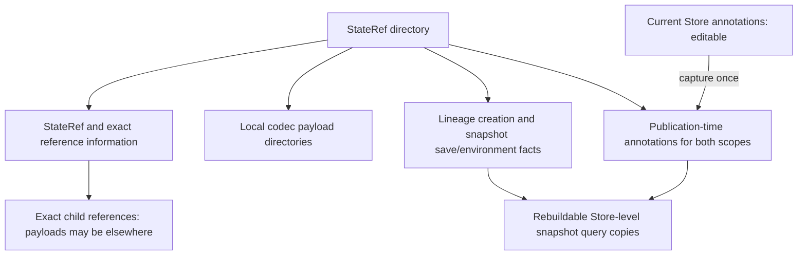
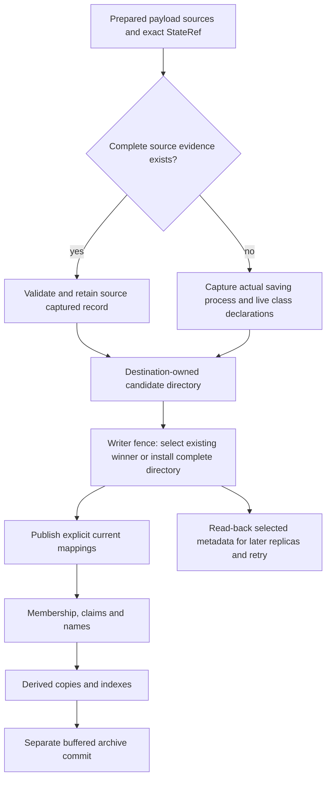

# Stage 1 Environments and Metadata - Plan

## Goal Capsule

- **Objective:** Deliver the 0.3.0b1 Stage 1 metadata, environment-evidence, and query foundation, including independently inspectable snapshot directories and write-once captured metadata.
- **Product authority:** Section 1 of `docs/plans/2026-09-20-001-v0.3.0b1-roadmap.md` and the confirmed decisions below. The other release workstreams are not active scope.
- **Open blockers:** None. This is an implementation-ready design, not a claim that Stage 1 is implemented.
- **Execution profile:** Serial implementation in this repository using the declared `big_env` toolchain; characterize publication failures before replacing persistence paths.
- **Stop conditions:** Revisit the plan before changing reference identity, weakening publication guarantees, importing code analysis from core, adding environment policy, or migrating existing pre-beta Stores.
- **Tail ownership:** The implementation coordinator owns integration, verification, documentation, and any separately authorized Git or shipping operations. This planning run authorizes no implementation or remote publication.

---

## Product Contract

### Summary

Saved Objects will be discoverable through editable experiment annotations, lineage-creation facts, and write-once snapshot timestamps and environment evidence.
Each StateRef directory will retain its local saved payloads, exact references, and captured metadata, with Store-level snapshot-evidence copies accelerating import-free queries.
Current editable annotations remain separate from the values captured at snapshot publication.

### Problem Frame

Researchers need to label model lineages by project, retain experiment notes, associate evaluation scores with exact saved states, and find those states later.
An orchestrator also needs to inspect recorded software facts and declarations without loading the model or its heavy dependencies.
An existing saved StateRef already identifies the snapshot; calling save again does not by itself create another snapshot that needs new evidence.
Its original save environment and the lineage's creation time remain useful facts, distinct from the caller's current environment or restoration time.

### Key Decisions

- **Separate attachment scopes.** ObjectRef annotations describe a lineage; StateRef annotations describe one exact saved state. They are independently addressable, never automatically flattened, and do not change their target's identity. This carries forward the roadmap's accepted contract.
- **Creation means lineage creation.** Record when an ObjectId-bearing lineage comes into existence, not when it first reaches a Store or is restored. (session-settled: user-approved - chosen over first-persistence time: distinguish an object's origin from its storage and restoration history.) A root without its own ObjectId reports unknown creation time; stateful descendants retain their own facts. (session-settled: user-approved - chosen over distinct identities for stateless or reference-only roots: preserve existing reference identity.)
- **Write evidence once per snapshot.** A newly saved StateRef receives its save timestamp and environment evidence; saving an already-persisted StateRef leaves that evidence unchanged, even from a different environment. (session-settled: user-approved - chosen over mandatory or optional save-call history: persist snapshot facts rather than a log of save invocations.)
- **Use bounded nested user data.** Support null, booleans, integers, finite floats, strings, lists, tuples, and nested string-keyed mappings. (session-settled: user-approved - chosen over the historical tuple-only container model or richer typed objects: support practical experiment annotations while retaining import-free inspection.)
- **Use last-writer-wins annotations.** Whole-mapping writes and deletions are atomic and require no caller-visible revision tokens; stale writes may overwrite newer edits or recreate a deleted mapping. (session-settled: user-directed - chosen over revision checks or an exclusive editing session: accept stale-edit replacement in exchange for a simpler annotation API.)
- **Consolidate materializing-graph requirements.** Combine class declarations for the saved Object and dependencies restored with it into one environment-domain requirement value, serialized as a dictionary using the existing codec. No separate per-class provenance ledger or source-code archive is required. (session-settled: user-approved - chosen over root-only collection, unrelated method collection, or a provenance-oriented saved representation: expose the combined requirements needed for inspection.)
- **Allow explicit incomplete evidence.** State can be saved with unavailable inspection, incomplete collection, or conflicting declarations, provided those outcomes are recorded honestly. (session-settled: user-approved - chosen over rejecting otherwise valid state: preserve recoverable work without claiming complete evidence.)
- **Reject ambiguous cross-Store annotation reads.** Different current records require an explicit Store choice. (session-settled: user-approved - chosen over Store-order precedence or implicit per-Store result duplication: avoid silent changes to experiment meaning.)
- **Disambiguate independently saved snapshot evidence.** Different write-once evidence for the same StateRef in connected Stores requires explicit Store selection without overwriting either record. (session-settled: user-approved - chosen over returning multiple Store-qualified evidence records by default: keep unqualified inspection unambiguous without inventing a global first-save transaction.)
- **Retain the existing environment fields.** Record the saving process's Python/software environment, including platform information already supplied by `dryml.environments`; do not add a separate hardware inventory. (session-settled: user-directed - chosen over excluding existing platform facts: retain the environment domain's useful information while avoiding a broader host-survey feature.)
- **Keep explicit probing available.** Saved requirements are historical evidence, not a replacement for existing environment/world probing when code or requirements may have changed. (session-settled: user-approved - chosen over adding a new saved-reference probe API: preserve existing probing workflows without expanding Stage 1.)
- **Make filtering order-independent.** Metadata-first and structure-first expressions impose the same constraints and produce the same results. (session-settled: user-approved - chosen over distinct semantic stages: permit query composition and optimization without changing meaning.)
- **Start forks unannotated.** Rekeyed ObjectId-bearing lineages get new creation facts; a root without its own ObjectId remains unknown, and references containing no ObjectIds retain their existing fork rejection. New fork annotation records are absent, not present empty mappings. Copying user annotations requires an explicit request and does not create a live link. (session-settled: user-approved - chosen over automatic inheritance: avoid silently carrying project labels or state-specific scores into a new experiment.)
- **Provide practical bounded predicates.** Include nested-field access, existence, equality, numeric/time comparisons, tag membership, literal text containment, and Boolean composition. (session-settled: user-approved - chosen over a smaller equality/range-only set: support the stated labels, notes, tags, scores, and time queries.)
- **Keep captured metadata with the snapshot.** Each StateRef directory contains its StateRef, local codec payloads, lineage creation facts, and the snapshot's saving environment and consolidated requirements. Both reference scopes' captured annotations remain separately addressable. Store-level copies of this information are rebuildable query acceleration, not its sole authority. (session-settled: user-directed - chosen over Store-sidecar-only evidence: keep a snapshot's descriptive information with its saved state.)
- **Capture annotations at publication.** Retain both reference scopes' annotation mappings as they stood at first snapshot publication, separately from current editable annotations. (session-settled: user-directed - chosen over excluding user annotations or synchronizing current annotations into every snapshot: preserve snapshot context without rewriting published metadata after later edits.)
- **Preserve routed dependency boundaries.** Snapshot directories contain local payloads and exact child references, not mandatory copies of the entire materializing graph. (session-settled: user-approved - chosen over fully self-contained graph payloads: allow independent inspection without changing per-object routing or claiming restoration needs no other Store.)
- **Treat missing creation time as non-blocking.** Report an unknown marker and allow ordinary inspection, saving, and loading to continue when only creation evidence is absent. (session-settled: user-directed - chosen over failing closed for missing creation time: missing descriptive metadata is not a reason to reject otherwise valid state.)
- **Persist time as Unix seconds.** Python callers may use timezone-aware UTC `datetime.datetime` values, but saved timestamps are numeric seconds since the Unix epoch rather than serialized datetimes or ISO timestamp strings.
- **Reuse environment values and policy.** Persist the existing environment and consolidated requirement values with their existing codecs and validation; Stage 1 adds no separate environment evidence types or additional security/redaction policy.

Framework lifecycle facts are not editable user annotations.
Unavailable creation evidence is reported as unknown rather than invented from the first observed save.
Identity-preserving copies retain existing evidence; neither repetition, replication, nor internal publication retries refresh it.
Write-once evidence is enforced per Store, with existing evidence reused for known snapshots and independently produced cross-Store differences reported rather than silently reconciled.
Annotation last-writer-wins semantics do not authorize replacement of immutable lifecycle or environment evidence.
They also do not modify the annotation copies captured inside already-published snapshot directories.
One annotation mapping may contain many user-defined fields and nested values, such as project, notes, tags, and evaluation results together.

<!-- ce-section: work-relationships -->
### How This Work Fits Together

This plan owns the combined Stage 1 foundation, not separate metadata and environment projects.
The following relationships come from the finalized beta roadmap; this plan does not redefine the later workstreams.

- **Depends on:** Current core reference/Store authority and the environment domain's existing value, declaration, collection, and compatibility contracts.
- **Enables:** Stage 2 argument-hook removal by giving non-construction metadata a separate home; removal itself is excluded here.
- **Supports:** Later Artifact, CachedDataset, and ML workflow inspection through saved-state annotations and software evidence, without deciding their authoring APIs.
- **Independent scope:** Method-selection polish and selector/list-multiplier design retain their own focused plans.
- **Shares a release constraint:** Framework-owned persistence written by 0.3.0b1 needs version identification and representative fixtures supporting later direct compatibility or explicit migration.

### Actors

- A1. **Researcher:** Adds project labels and experiment notes to lineages, associates scores with exact states, and queries saved work.
- A2. **Saving process:** A local caller or supported worker that publishes a new snapshot with its own environment evidence or reuses an already-persisted snapshot's evidence.
- A3. **Lightweight inspector or orchestrator:** Reads references, annotations, lifecycle facts, and saved declarations without materializing Objects or launching probes.
- A4. **Concurrent Store client:** Another trusted same-host reader or writer that can hold a stale annotation mapping or overlap publication and index rebuilding.

### Requirements

**Ownership and record authority**

- R1. Shared record mechanics must support user annotations, lifecycle facts, and save-associated environment evidence without becoming a second Object system or a universal provenance model.
- R2. Core retains reference identity, Repo attachment, Store publication, and query authority; environments retains its typed payloads and declaration/compatibility semantics.
- R3. Authoritative records must identify their kind, supported version, and exact attachment target, with domain validation before accepting their contents.
- R4. Each reference scope must support one current user-annotation mapping per Store containing multiple user-defined fields, alongside immutable lifecycle facts and one write-once snapshot-evidence association per StateRef per Store.
- R5. Sidecar changes must not alter CDef identity, ObjectRef/StateRef identity, immutable state payloads, or construction arguments.

**Editable user annotations**

- R6. Repo operations must read, create, replace, and delete annotations on explicitly selected ObjectRefs or StateRefs without materializing their targets.
- R7. User annotation values must preserve the agreed nested data types on round trip, including the distinction between lists and tuples.
- R8. User data must have finite, documented bounds on nesting, container contents, keys/strings, numeric representation, and total encoded size; malformed or excessive input is rejected without changing authority.
- R9. Reads must expose the current annotation mapping without requiring concurrency revision tokens, with absence distinct from a present empty mapping.
- R10. Annotation writes and deletions must be atomic and last-writer-wins in successful publication order, accepting that a stale whole-mapping write can overwrite newer edits or recreate a deleted record.
- R11. Removing a key uses whole-mapping replacement, while deleting the annotation record removes the attachment; neither operation deletes its target or framework-owned evidence.
- R12. Ordinary annotation queries must use the current mappings, while explicit inspection can read the separate publication-time copies without implying a history of every annotation edit.

**Lifecycle and snapshot evidence**

- R13. Framework-created ObjectId-bearing lineages must receive a creation timestamp at ObjectId allocation and retain it across saving, reopening, and restoration; a root without its own ObjectId reports unknown creation time without changing reference identity, while stateful descendants retain their own facts.
- R14. Missing creation evidence must produce a clear unknown marker without blocking otherwise valid inspection, saving, or loading, and must not be replaced with a guessed restoration, file, or first-save time.
- R15. A newly saved snapshot must associate its exact StateRef with a write-once save timestamp, observed environment evidence, and consolidated requirement evidence.
- R16. Saving an already-persisted StateRef must preserve its timestamp, environment evidence, and captured annotations without refreshing them or adding save-call history.
- R17. Identity-preserving snapshot copies, replication, and publication retries must preserve existing evidence and captured annotations rather than substitute the copying process's environment or current notes.
- R18. Valid forks rekey existing ObjectIds, create facts for those new lineages, and start with no user-annotation records, with an explicit copy-by-value option at selected attachment scopes; roots without their own ObjectId remain unknown and ObjectId-empty references retain their existing fork rejection.
- R19. Lifecycle timestamps must persist as numeric Unix seconds and load as UTC datetime values, without timestamp equality or ordering substituting for reference identity or annotation publication order.

The required snapshot-local contents below are separate from current Store annotations and derived query copies.
The APIs and Persistence Formats sections define the reviewed implementation design, not APIs already implemented in the current code.



**Environment facts and declarations**

- R20. When evidence is first captured for a new snapshot, it must describe the actual saving process, including workers, using lightweight inspection rather than package-runtime imports or subprocess probes.
- R21. The saved environment must reuse the facts already provided by `dryml.environments`, including Python, platform, distribution, and DRYML information, without adding a separate collection, filtering, or redaction policy.
- R22. Environment payloads must retain their domain-owned validation and codec semantics rather than become unvalidated user-annotation dictionaries.
- R23. Requirement evidence must consolidate inherited class declarations across the saved target's materializing graph into one domain-owned requirement value, excluding reference-only inputs and unrelated method declarations.
- R24. Observed installed software must remain distinct from declared requirements, and collecting no declarations over a completely inspected scope must remain distinguishable from incomplete collection.
- R25. Inspection and collection must expose known facts, known-empty declarations, valued requirements, conflicting declarations, incomplete collection, and unavailable evidence as distinguishable outcomes with bounded safe diagnostics.
- R26. Evidence collection failures may permit state publication with an explicit status, but failures to persist or correctly associate that status/evidence must not be reported as a fully successful save.
- R27. Saved evidence must remain separate from current-code requirement discovery, preserving existing explicit environment/world probing without adding automatic load enforcement or a new saved-reference probe API.

Successful requirement inspection exposes the consolidated dictionary, not a required per-class provenance ledger or stored source code.
Bounded conflict diagnostics may still identify contributing declarations when necessary to explain incompatible requirements.
Existing explicit probes may discover different requirements after code changes, but their results do not rewrite a snapshot's saved evidence.
An explicitly recorded incomplete or unavailable result also remains write-once once it is successfully published; repairing an interrupted association is not the same as refreshing completed evidence.
Unknown creation time is non-blocking descriptive metadata, not invalid ObjectRef/StateRef or payload authority.
Known-time filters still require a known matching timestamp; an unknown marker is inspectable and queryable, not an automatic match for every time range.

**Query behavior**

- R28. Explicit lineage and exact-state predicates, including snapshot-evidence fields, must compose with structural/reference predicates independently of builder order without automatically merging attachment scopes.
- R29. Supported predicates must include nested-field access, existence/missing checks, equality, numeric and timestamp comparisons, collection membership, literal string containment, and Boolean composition.
- R30. Predicate evaluation must distinguish missing fields from explicit null and avoid implicit conversion of strings, booleans, sequences, and numbers into one another; invalid operator/operand combinations have defined failures.
- R31. Snapshot timestamp and environment predicates must evaluate one coherent evidence association for the selected StateRef and Store, never combine fields from conflicting Store records.
- R32. Callers must be able to inspect matching references' saved evidence and publication-time annotations independently of Store-level snapshot query copies, without materializing Objects or requiring a save-event model.
- R33. Queries must inspect serialized authority without materializing Objects, opening state payloads, importing optional frameworks, or launching environment probes.
- R34. Indexed and non-indexed execution must agree, and missing or stale Store-level snapshot query copies or indexes must not silently omit authoritative matches.

**Multiple Stores, publication, and recovery**

- R35. Unqualified reads and queries must report differing current annotations or write-once snapshot evidence across connected Stores rather than choose by Store order or merge values; explicit Store selection resolves the ambiguity.
- R36. Annotation mutations must have an unambiguous destination and apply last-writer-wins publication within that Store, without a cross-Store transaction or automatic synchronization.
- R37. Concurrent publication of one snapshot in one Store must select one coherent write-once evidence record and preserve it for subsequent saves, with no combination of competing timestamp, environment, or requirement fields.
- R38. Concurrent annotation writes, delete/recreate cycles, saves, and index rebuilding must preserve atomic current mappings and correct evidence associations; accepted stale-annotation replacement must not be confused with torn writes or false publication success.
- R39. Partial publication must preserve safe completed authority and expose actionable completion/failure evidence, with incomplete required snapshot-local contents never reported as a complete snapshot directory.
- R40. Query recovery must rebuild snapshot acceleration from snapshot-local authority and current-annotation acceleration from current annotation authority, never use captured annotation copies to overwrite or reconstruct current mappings implicitly.

**Compatibility and documentation**

- R41. New persistence contracts must reject malformed or unsupported authority without silently substituting empty records, while a supported unknown creation-time marker remains valid and non-blocking.
- R42. No pre-beta reader, migration, or compatibility shim is required, but this work must not delete or rewrite existing user data to enforce the format break.
- R43. Representative beta fixtures and documentation must establish the forward persistence commitment for these framework-owned records, distinct from Python API stability or arbitrary author-owned payload compatibility.
- R44. Public documentation must explain attachment scopes, last-writer-wins annotation risks, write-once snapshot evidence, explicit probing, supported queries, multi-Store conflicts, and publication/recovery failures.

**Snapshot-local representation**

- R45. Each StateRef directory must contain its StateRef, local saved-state codec directories, and exact references to materializing child snapshots without requiring their payloads to be duplicated locally.
- R46. Snapshot-local metadata must retain ObjectRef lineage-creation facts alongside StateRef save-time environment, consolidated requirements, and unknown/incomplete statuses as the authoritative captured view, without fabricating a second environment observation for lineage creation.
- R47. Store-level sidecar copies of captured snapshot metadata must be rebuildable query acceleration, while current editable user annotations and other existing core authority retain their own authoritative roles.
- R48. Each snapshot must retain separate publication-time copies of both reference scopes' user-annotation mappings, including absence versus an empty mapping, without subsequent edits or repeated saves changing those copies.
- R49. Store must resolve an exact StateRef to its snapshot directory, and Repo must federate that lookup across connected Stores with explicit Store selection when the physical location is ambiguous.

### Key Flows

- F1. **Annotate an experiment.** A1 selects an ObjectRef and atomically writes a complete mapping with project labels and notes. A StateRef score uses a separate explicit attachment, and later writes replace the chosen mapping without revision checks. **Covers R5-R12.**
- F2. **Save and inspect.** A2 identifies a new snapshot, captures environment/declaration evidence and both annotation scopes, and publishes the required snapshot-local contents with an honest save outcome. A3 can later inspect that directory's metadata without Store-level query copies or Object materialization. **Covers R13-R17, R20-R27, R33, R39, R45-R48.**
- F3. **Save unchanged state again.** A2 finds that the resulting StateRef is already persisted and retains its original evidence without another timestamp or environment capture. Missing destination publication still has to complete; an identifier alone is not proof of completed storage. **Covers R15-R17, R31-R32, R39.**
- F4. **Find saved experiments.** A1 combines a lineage project label, a model structure, a state score threshold, and a snapshot save-time/environment condition. Reordering the constraints preserves results, and A1 can inspect the matching snapshot's evidence. **Covers R28-R34.**
- F5. **Publish overlapping annotation edits.** A4 publishes an edited mapping before A1 submits a stale replacement; A1's later successful publication wins and may discard A4's edits. Cross-Store differences remain a separate explicit-selection conflict rather than being reconciled by publication time. **Covers R9-R11, R35-R38.**
- F6. **Fork or copy.** A valid fork rekeys ObjectIds, creates their lineage facts, and starts with no annotations unless a copy is requested; a root without its own ObjectId remains unknown. An ObjectId-empty reference remains an invalid fork input. An identity-preserving snapshot copy retains its captured metadata and exact child references, which may still need other locations for restoration. **Covers R13-R18, R45-R48.**
- F7. **Recover interrupted publication.** A2 reports partial completion without deleting completed records; A3 distinguishes missing required contents from valid unknown metadata. Rebuilding Store-level snapshot query copies uses snapshot directories without replacing current annotations with historical captured values. **Covers R14, R26, R34, R38-R40, R45-R48.**
- F8. **Probe current requirements explicitly.** A3 reads historical saved requirements, then uses an existing environment/world probing workflow for a current operation when needed after code changes. The probe follows its existing coverage and failure contracts without overwriting saved evidence. **Covers R17, R27, R33.**
- F9. **Locate and inspect a snapshot.** A3 supplies a StateRef to Repo, selects a Store if multiple locations match, and passes the returned directory to `read_snapshot_metadata`. No Object is materialized, and an archive-backed path is consumed while its Store remains open. **Covers R32-R33, R45-R49.**

### Acceptance Examples

- AE1. **Many fields fit one mapping.** A lineage mapping contains project, notes, and tags together; two StateRef mappings contain different evaluation scores and other state-specific fields. A combined project/accuracy query selects the correct state, and editing either scope changes neither reference identity nor the other scope's mapping. **Covers R4-R7, R28.**
- AE2. **Nested values survive reopening.** An annotation mapping containing null, booleans, numbers, Unicode text, lists, tuples, and nested string-keyed mappings round-trips without type loss. An over-limit or unsupported value fails without changing the previous mapping. **Covers R7-R8.**
- AE3. **Last publication wins without a torn mapping.** Two clients edit an earlier mapping; both valid writes may succeed, and the later publication becomes the complete current mapping even when it discards the other edit. A stale write after deletion may recreate the mapping, but readers never observe a partially combined or torn mapping. **Covers R9-R11, R38.**
- AE4. **Absent, empty, and null differ.** No annotation record, a present empty mapping, and a mapping with an explicit null value remain distinguishable after reopening and during existence/equality queries. **Covers R9, R29-R30.**
- AE5. **Creation is not restoration.** An ObjectId-bearing lineage created before its first save retains its original creation time after restoration. A stateless root reports unknown root creation while its stateful children retain their own facts. A valid fork gets new facts for rekeyed ObjectIds and absent annotation records by default; requested annotation copies are independent values, and an ObjectId-empty fork is rejected. **Covers R13-R14, R18-R19.**
- AE6. **Unknown creation does not block use.** Otherwise valid reference inspection, saving, and loading continue with an explicit unknown creation-time marker. A known-time range predicate does not match that unknown value, but inspecting it or querying for unknown time succeeds; malformed reference or payload authority remains an error. **Covers R14, R29-R30, R41.**
- AE7. **Identical state keeps its original evidence.** A StateRef first saved on Monday with package version A is saved again on Tuesday from version B. Its timestamp and evidence remain Monday/A, no new record is added, and a fresh environment capture is not required. **Covers R15-R17, R32.**
- AE8. **Time and environment predicates stay correlated.** Store A independently records Monday/version A for a StateRef while Store B records Tuesday/version B. Unqualified lookup reports a conflict; selecting either Store never produces a synthetic Monday/version B match. **Covers R28, R31-R32, R35.**
- AE9. **Worker facts belong to the original saver.** Coordinator and worker environments differ. A new worker-saved snapshot records the worker's existing environment-domain value; coordinator inspection or re-saving does not replace it, filter it through a new policy, or introduce additional environment-variable collection. **Covers R16, R20-R22.**
- AE10. **Requirements are consolidated across materializing edges.** A saved root and materialized child contribute class declarations that combine into one environment requirement dictionary. A reference-only heavy input and an unrelated method do not contribute, and successful inspection needs no separate provenance ledger or source-code archive. **Covers R22-R24.**
- AE11. **Empty is not unknown or conflict.** Complete collection with no declarations is known empty; partial collection is incomplete; incompatible declarations retain a conflict. A safely recorded incomplete result may accompany a saved state, while failure to publish its evidence association is reported as a publication failure. **Covers R24-R27, R39.**
- AE12. **Queries remain lightweight and order-independent.** A fresh process can combine labels, tags, note containment, numeric scores, timestamps, environment fields, and structural/reference predicates in different orders without loading Objects or frameworks. Query results agree with indexes enabled, disabled, missing, stale, and rebuilt. **Covers R28-R34, R40.**
- AE13. **Multiple Stores do not silently disagree.** Connected Stores expose different current notes for the same reference. An unqualified read/query reports the conflict; selecting a Store gives that Store's record, and updating it does not claim to update the other Store. **Covers R35-R36.**
- AE14. **Partial graph publication stays attributable.** Failure during a routed graph save leaves only honestly reported completed root/child associations. Recovery must complete missing required publication rather than treat a known StateRef as sufficient; it never borrows another target's evidence or deletes completed immutable records to simulate rollback. **Covers R26, R38-R40.**
- AE15. **Corrupt evidence is not an empty answer.** Unsupported record versions, mismatched attachment targets, or invalid content identities fail explicitly. Rebuilding an index cannot normalize corrupt authority away; differing valid first-publication evidence across Stores instead follows the explicit Store-selection rule. **Covers R3, R35, R40-R42.**
- AE16. **Captured and current annotations differ explicitly.** A snapshot captures project/notes and state annotations at publication. Later edits appear in ordinary current-annotation queries, while explicit captured-view inspection retains the original mappings; no intermediate edit history is implied and repeated saves do not refresh the copies. **Covers R12, R16-R17, R48.**
- AE17. **Concurrent initial saves choose one complete record.** Two clients attempt the first publication of one StateRef in the same Store. One complete timestamp/environment/requirements association is retained, and later saves reuse it rather than replacing it or mixing evidence from both writers. **Covers R15-R17, R37-R39.**
- AE18. **Explicit probes do not rewrite saved requirements.** After dependent code changes, an existing explicit probing workflow can report different environment/world declarations subject to its normal coverage limits. The snapshot's previously saved requirement dictionary remains unchanged, and ordinary Store inspection still launches no probe. **Covers R17, R27, R33.**
- AE19. **Copying is not a new observation.** Copying a known snapshot preserves its local payloads, timestamp, environment evidence, captured annotations, and exact child references rather than capturing the copy process's current environment or notes. If the destination already holds different valid write-once evidence, neither record is overwritten. **Covers R17, R35, R45-R48.**
- AE20. **Snapshot metadata survives loss of acceleration.** With Store-level snapshot sidecar copies and derived indexes absent, a fresh lightweight process can inspect the directory's StateRef, lineage creation facts, snapshot environment/requirements, and both scopes' captured annotations. Rebuilding query acceleration from these records preserves complete results without opening codec payloads or modifying authority. **Covers R32-R34, R40, R45-R48.**
- AE21. **Local independence preserves routed children.** A parent snapshot directory contains its own codec payloads and exact references to a child in another Store. Metadata inspection works without that Store; full restoration still requires the child and must not silently succeed without it. **Covers R39, R45-R46.**
- AE22. **Captured notes do not recover current notes.** A snapshot captured an old project label, and the current annotation mapping later changes or is deleted. Rebuilding indexes or snapshot query sidecars does not resurrect the old label as current metadata. **Covers R12, R40, R47-R48.**
- AE23. **Exact directory lookup federates without guessing.** Repo finds a snapshot held in its second connected Store and returns that Store's directory. If two Stores contain the exact snapshot, unqualified location lookup requests explicit Store selection rather than guessing a path; a ZipStore result is usable only while that Store remains open. **Covers R32-R33, R45, R49.**
- AE24. **Timestamp representation changes only at the codec boundary.** A UTC datetime is written as a finite JSON number of Unix seconds, including fractional seconds, and loaded back as a UTC datetime. Epoch zero is a known instant, while null with unknown status remains unknown; no ISO string or pickled datetime is emitted for these fields. **Covers R14, R19, R41.**

### Scope Boundaries

- In scope: shared record mechanics, snapshot-local captured metadata and local payload organization, derived Store-level snapshot query copies, current editable annotations, and owning persistence/query tests and documentation.
- Excluded: arbitrary Python metadata objects, annotation audit history, revision-token/stale-edit checks, patch/merge APIs, per-key conflict resolution, automatic annotation synchronization, and an implicitly flattened lineage/state view.
- Excluded: arbitrary executable query predicates, regex/full-text search, and interpreting a recorded-field match as successful compatibility checking or destination admission.
- Excluded: automatic environment provisioning, new load enforcement, a new saved-reference probe API, method-wide requirement cataloging, reference-only requirement closure, hot reload, and live-Object migration.
- Excluded: a history of repeated save calls for the same StateRef, automatic refresh of completed snapshot evidence, a separate requirement-source provenance ledger, and new hardware inventory beyond the existing environment domain.
- Excluded: wholesale restoration of the historical records package, migration of managed control records or unrelated sidecars, and a general product/provenance ontology.
- Excluded: Stage 2 argument-hook removal and the later Artifact, CachedDataset, Method, multiplier, and ML qualification workstreams.
- Excluded: synchronizing current annotations into every published snapshot, an audit log of every edit, and mandatory duplication of the complete materializing graph into each StateRef directory.
- Excluded: a new environment security/redaction layer, new environment-domain evidence wrappers, and changes to existing environment collection or serialization policy.
- No new general Store-transfer or distributed transaction system is required; existing supported snapshot-copy/replication paths must honor the historical-evidence contract when handling these records.

### Dependencies and Assumptions

The workspace's trusted same-host concurrency and local-filesystem model applies.
Snapshot-local metadata is authoritative for its captured view; Store-level copies of that view and indexes are disposable acceleration.
Current editable annotations remain separate authoritative Store records, and existing core definition/reference/state authority is not replaced by a query cache.
No hostile-code sandbox or safe-deserialization claim is added.
Core identity and Store publication contracts remain foundations rather than being redesigned to encode annotations or timestamps in state identity.

Current environment value codecs, static declaration combination, canonical encoding primitives, and native locking are reusable foundations.
Reuse the applicable codecs and locking mechanics rather than duplicating them in records.
They do not themselves implement this attachment or query contract.
Existing Repo saves can partially publish across Stores, and a buffered archive save is not necessarily an archive commit; this stage must preserve that distinction in its evidence rather than promise a new global transaction.
The current DirStore layout uses separate StateRef records and shared local-state directories, so the required StateRef directory organization is a format change to design and verify, not existing behavior.
Independent metadata inspection does not promise that a routed snapshot directory contains every child payload or is a general standalone import/export format.

Historical evidence describes observations and declarations at save time, not proof of the environment that originally produced a payload or a frozen guarantee about future code.
Timestamps depend on the saving/creating host clock and are descriptive facts, not a total-order or authenticity guarantee.
Last-writer-wins annotations intentionally accept stale-edit loss and recreation after deletion; atomic publication protects record integrity, not the semantic preservation of every writer's edits.
Independently publishing the same StateRef in disconnected Stores can produce different valid first-save evidence, so there is no claim of a globally coordinated first timestamp or environment.
Current code may require different software than saved declarations describe, and world requirements can still require explicit probing under the existing Dispatch contracts.
Environment and requirement validation and diagnostic handling reuse their existing domain behavior; this stage is not an additional security-hardening workstream.

### Product Contract Preservation

Changed: R13 and R18, with corresponding Key Decisions, F6, and AE5, reflect the user-approved unknown-creation rule for roots without their own ObjectId and the existing rejection of ObjectId-empty forks.
R18 and its related prose also use the user-approved precise default of absent annotation records, distinct from explicitly written or copied empty mappings.
All other requirements, actors, flows, acceptance examples, scope boundaries, and settled decisions are preserved.
The former planning questions are resolved in the Planning Contract, APIs, Persistence Formats, and implementation units below.

### Sources and Research

- `docs/plans/2026-09-20-001-v0.3.0b1-roadmap.md`: section 1 owns this combined milestone; sections 2 and Delivery Sequence establish the later dependency boundary.
- `../docs/plans/2026-08-26-002-feat-state-aware-object-graphs-plan.md` in the parent workspace: historical R29-R33a, R37-R40, MetadataValue, and optimistic replacement proposal; discussion input, not the current attachment model.
- `docs/repos.md`: routed saving, partial-publication reports, reference restoration, and Store authority/lifetime.
- `docs/formats.md` and `src/dryml/core/store/dir.py`: current separate StateRef records and shared local-state paths; baseline for the requested snapshot-directory format change.
- `docs/graph_querying.md` and `docs/query_index_backend_contracts.md`: import-free queries and rebuildable derived indexes.
- `docs/environments.md`: lightweight inspection including existing platform facts, versioned environment values, declaration combination, and separation from automatic enforcement.
- `docs/dispatch.md`: existing explicit environment/world probing and its coverage, isolation, and failure contracts; saved evidence does not replace these workflows.
- `src/dryml/core/reference_values.py` and `src/dryml/core/cdef_graph.py`: current reference identity and materializing versus reference-only edges.
- `src/dryml/core/repo_plan.py`: capture-once replication and partial-publication boundaries.
- `src/dryml/environments/introspection.py`, `src/dryml/environments/combination.py`, and `src/dryml/environments/kernel.py`: existing inspection and declaration collection mechanisms.
- `docs/solutions/architecture-patterns/2026-09-18-code-shift-in-long-lived-sessions.md`: accepted limits on live code/environment evolution.

---

## Planning Contract

### Key Technical Decisions

- KTD1. Generic records encode bounded envelopes only, using `dryml.formats`; core owns attachment schemas, identity checks, lifecycle, persistence, and queries. This keeps records independently useful and avoids a new Object or provenance system.
- KTD2. New creation evidence follows ObjectId allocation, not first persistence. Root-without-ObjectId evidence remains unknown and stateful descendants keep their own facts. (session-settled: user-approved - chosen over distinct identities for stateless or reference-only roots: preserve existing reference identity.) See the Product Contract's creation decision.
- KTD3. Current whole mappings use writer-serialized atomic last-writer-wins replacement/deletion; captured mappings are immutable snapshot fields. (session-settled: user-directed - chosen over revision checks or exclusive editing: retain the agreed simple annotation API.) See the Product Contract's last-writer-wins decision.
- KTD4. The exact StateRef directory, not a Store-level query copy, owns captured evidence and local payload availability. External materializing children remain exact references. (session-settled: user-directed - chosen over Store-sidecar-only evidence: keep descriptive information with its snapshot.) See the Product Contract's snapshot-local and routed-boundary decisions.
- KTD5. One private environment-owned multi-class collector invokes the existing declaration combiner once. Core supplies live materializing classes, not static code dependencies; no new public declaration API or core-to-code import is needed.
- KTD6. Outcome and coverage are distinct snapshot fields. This preserves a partial conflict as both conflicting and incomplete instead of forcing one fact to erase the other; environment and requirement values keep their existing envelopes.
- KTD7. Complete directory rename is the first snapshot-association publication boundary. Unpublished owned staging is not a persistent pending transaction; after rename all retries reuse the selected evidence. This is smaller than adding another authoritative recovery ledger.
- KTD8. Queries retain Store provenance until conflict checks and typed predicate evaluation finish. Index projections are advisory and cannot hide disagreement, malformed authority, or evaluation errors.

### Grounding And Integration

| Current seam | Implementation consequence |
| --- | --- |
| `src/dryml/core/repo_plan.py`, `attach_runtime_binding` and `apply_exact_reference_identity` | Allocate creation facts with new ObjectIds; discard provisional constructor facts when restoring exact identities |
| `src/dryml/core/repo_plan.py`, routed save execution and local-state capture | Replace capture/install/copy/bare-StateRef publication with prepared sources and complete snapshot publication |
| `src/dryml/core/materialization.py` and exact-load preflight in `src/dryml/core/repo.py` | Resolve exact placement and validate all required payload authority before construction or load hooks |
| `src/dryml/core/store/dir.py` and `src/dryml/core/store/zip.py` | Reuse writer locks, atomic publication, extracted-archive transactions, and explicit commit reporting |
| `src/dryml/core/query/reference.py` | Delay cross-Store identity deduplication; preserve immutable builder state across every conversion |
| `src/dryml/core/query/sqlite/index.py` | Extend staged rebuild and captured-dirty-token behavior, not a second index-authority mechanism |
| `src/dryml/environments/combination.py` and `src/dryml/requirements/collection.py` | Collect class/MRO declarations and combine once under current owner budgets |
| `src/dryml/environments/kernel.py` | Do not use its static code-dependency closure as the saved Object's materializing graph |

The code-shift learning in `docs/solutions/architecture-patterns/2026-09-18-code-shift-in-long-lived-sessions.md` constrains documentation and tests: historical evidence is not proof of producer code, compatibility, admission, or future restoration success.
External research is not load-bearing here: the plan reuses existing canonical codecs, native locking, Store and query recovery, and environment APIs rather than selecting new technology.
Source inspection grounds this design; no runtime verification was performed during planning.

### Assumptions

These are planning choices, not additional user-confirmed product requirements.

- The existing same-host filesystem and Store locking contract is sufficient for same-filesystem whole-directory publication. A backend unable to provide it raises `StoreCapabilityError` before mutation.
- Initial v3 payload placement uses real copies, not hard links, a shared payload cache, or a new deduplication service. This trades disk usage for independently available local payloads; optimization is deferred.
- The first routed destination is the capture destination when no complete source exists. Its effective current mappings supply first-publication annotations; the installed winner supplies subsequent replicas.
- Metadata queries initially validate authoritative candidates before residual evaluation instead of pushing arbitrary nested predicates into SQL. This accepts scan cost to preserve conflict and typed-error semantics.
- A synchronous operation borrows open Store handles. Concurrent closing of a borrowed handle is unsupported and must fail without a false publication success; supported concurrent readers/writers otherwise use existing fences.
- Tests are deterministic, credential-free, and use small synthetic Objects and environment fixtures. One local subprocess proves saving-process attribution; no new Ray, GPU, network, or ML-workflow qualification matrix is pulled into Stage 1.

### Lifecycle And Evidence Collection

Associate creation instants with newly allocated ObjectIds after successful initialization in `attach_runtime_binding`, including primary descendant identities.
Also capture facts at preallocated identity creation in `Repo.declare_object` and `_fork_rekey_reference`; declarations and object-only forks need lineage publication before any snapshot exists.
Use one core allocation/fact helper across these paths, with immutable `Store.write_lineage_metadata` publication coordinated under the declaration or snapshot writer fence.
Declaration registration preserves creation facts across reopening before construction; read-back and the `lineage` report phase expose partial publication rather than inventing a later build time.
Never timestamp a root solely because a new CDef or Python wrapper was constructed.
Exact restoration replaces provisional identity and creation evidence with the selected snapshot's per-path facts before caching or returning the graph.
Missing facts remain unknown, including after live reuse; a constructor's temporary timestamp cannot fill historical absence.
Fork rekeying creates facts for all fresh ObjectIds and retains the existing rejection of ObjectId-empty references.

`records/lineage` contains core-owned immutable facts per exact ObjectRef attachment.
Snapshot metadata includes the root and primary descendant facts so closure restoration does not depend on independently published child directories.
An absent lineage sidecar is valid unknown; a present malformed record is an error, not unknown.
Before publication, compare any existing immutable lineage facts with the incoming facts for that same attachment; differing present facts are an authority conflict, never last-writer-wins.
Do not upgrade an already published unknown snapshot fact from later observations.
Snapshot restoration uses its captured facts; `get_lineage_metadata` reads validated lineage authority and compares applicable Store domains, returning unknown when that descriptive authority is absent.

Collect from each projected snapshot's ordered MATERIALIZE graph, using the SavePlan's live class bindings and deduplicating shared classes/carriers by identity.
The environments-private helper in `combination.py` uses existing passive collection and `_EnvironmentCombiner` once, enforcing the aggregate 64-declaration, 1,024-path, 4,096-occurrence, and 1 MiB combination budgets.
It returns internal result/coverage/diagnostic data to core without creating a public evidence type or declaration API.
Missing class associations and ordinary per-class collection failures yield incomplete coverage; do not import classes, invoke descriptors, traverse REF inputs, or collect unrelated methods to fill gaps.
Over-limit or malformed collected declarations are unsuccessful collection, not a valid empty set or a reason to silently truncate and call coverage complete.

| Result | Persisted outcome | Coverage and value |
| --- | --- | --- |
| Complete collection, no declarations | `empty` | Complete, no value |
| Complete compatible declarations | `value` | Complete, consolidated value |
| Complete incompatible declarations | `conflict` | Complete, no value, bounded conflict diagnostics |
| Some classes inspected successfully | `empty`, `value`, or `conflict` | Incomplete; retain the inspected subset's actual outcome |
| No usable collection coverage | `unavailable` | Incomplete, no value |
| `inspect_current()` returns a valid record | Environment `known` | Existing complete record unchanged |
| `inspect_current()` fails ordinarily | Environment `unavailable` | No value, fixed bounded diagnostic |

The current observer has no partial-inventory result; Stage 1 does not fabricate `environment_status="incomplete"` by truncating packages.
That status remains decodable only with genuine partial domain evidence.
Preserve existing environment fields, including interpreter paths, distribution locations, platform facts, and existing selected environment details; no new collection or redaction policy is added.
Reuse safe domain diagnostic code/message pairs and fixed capture-failure messages, not arbitrary exception representations.
Catch ordinary failures only at observation/collection boundaries; never turn cancellation, payload failures, malformed saved source authority, or destination persistence errors into an unavailable-evidence success.

### Source And Publication Decisions

For each exact StateRef, resolve complete source evidence before collecting new observations.
An explicit `source_store` selects the root source; otherwise compare complete connected sources, reuse equal records, and reject disagreement before mutation.
Compare full validated captured records, not only environment content IDs: environment details and paths can be non-identifying within that domain but are still retained snapshot content.
Destination evidence different from an explicitly selected copy source remains immutable and causes conflict.
When there is no source, publish a live candidate in the first destination and carry its actual selected metadata to later missing replicas.
Do not distribute a losing candidate after a concurrent first-publication winner.
Existing different valid destinations are neither refreshed nor reconciled; report a partial failure if a later conflict becomes visible after an earlier destination completed.

Validate payload bytes in owned staging before acquiring the publication fence, then recheck all mutable authority under the fence.
For live capture, the fence covers current mapping reads, explicit-input overlay, final metadata association, atomic directory install, and explicit current writes.
For copy capture, preserve the source metadata and apply explicit inputs only to current mappings after selection.
Do not hold multiple destination writer locks while copying payload bytes.
Read source metadata into a detached stable cut and use validated borrowed payload sources; consume them synchronously before their owner closes.
If staging is moved into the first snapshot, reopen exact sources there for further copies rather than reusing consumed staging handles.
Fork rebinding copies into destination-owned staging and never rewrites source manifests or definitions.

Extend `PublicationPhase` with `lineage`, `object_metadata`, and `state_metadata`.
Update exhaustive phase consumers in `src/dryml/core/execute_codec.py`, `src/dryml/core/execute.py`, and `src/dryml/managed/storage.py` in the same cutover, including the already existing `claim` phase in transport capacity accounting.
Worker outcome reservations must cover the complete ledger before publication, decoders must reject unknown phase names, and managed completion must reject failed or uncertain required lineage/current-metadata phases.
Retain existing `definition`, `state`, `snapshot`, `membership`, `claim`, `alias`, `main`, `index`, and `commit` phases and the completed/failed/unattempted/uncertain outcomes.
`state` completion now proves local payload placement through a complete directory; staging or an unattached local-state hash is insufficient.
`snapshot` proves the complete metadata/placement/reference association, while explicit current mapping changes are separate boundaries.
Attribute lineage publication to the exact primary graph path even when it precedes snapshot publication.
Read-back resolves ambiguous exceptions; completed immutable work is retained even if current writes, claims, names, indexes, or commit later fail.
Fork APIs retain their successful return types but use `RepoSaveError` with the same partial report when publication fails.
The detached fork source cut includes target-holding checks, selected current object/state mappings, immutable source metadata, and source provenance; copying immutable payload bytes can then proceed outside the source fence.

Save-time annotation inputs are explicit writes, not an exactly-once operation identity or durable auto-replay request.
If snapshot publication succeeds but a requested current mapping fails, the save raises with separate partial phases; captured values represent the effective publication input, not proof that every requested current write succeeded.
Reopening or retrying without `annotations` does not replay that input from captured history.
Retrying with `annotations` is a new LWW write that may overwrite intervening edits under R10; callers needing another outcome must read current mappings and decide what to submit.
This preserves the Product Contract's expressly separate partial-publication boundary without introducing annotation history, revision tokens, or a pending mutation ledger.



### Queries And Recovery

`field` projects documented typed values, not record envelopes: lineage exposes root `creation_status` and `created_at`; snapshot exposes `saved_at`, environment/requirement status, requirement coverage, and the existing environment/requirement payload fields.
An empty path selects the scope-root query projection: `field("object").exists()` is false for absent annotations and true for a present mapping, while `.eq({})` matches only a present empty mapping.
The state scope follows the same rule; lineage and snapshot roots expose their documented detached field projections and exist when their required candidate authority exists.
Root projection does not expose dataclass internals, record envelopes, or payload bytes; typed timestamps use the same numeric query representation as field access.
For example, environment distributions are addressed by their existing normalized names beneath `environment.distributions`, without interpreting version strings as compatibility constraints.
Raw record IDs, envelope wrappers, and captured annotations are not silently part of current annotation scopes.
The snapshot lineage table remains explicitly inspectable; lineage predicates apply to the selected root, not an implicit descendant aggregate.

Preserve candidate-to-Store provenance until applicable metadata conflicts and type checks complete.
ObjectRef holding follows existing validated core reference-authority discovery, including supported embedded reference projections, rather than only declaration filenames.
Current StateRef attachments require a complete snapshot in that Store; an embedded exact StateRef alone is not completed saved-state authority.
An absent mapping on a holding Store differs from present empty, and a Store without the target does not vote.
Use the existing deterministic ordered authority-fence pattern for a detached multi-Store read cut; never combine independently fetched current records across a concurrent mutation.
Fix its fence-domain assumption for ZipStore: distinct live extracted transactions require distinct transaction fences even when they share an archive path.
Acquire every distinct transaction fence in stable process-local order; deduplicate only truly shared authority fences, not different buffered views that happen to commit to the same archive.
Divergent buffered transactions participate as distinct conflicting authority views; archive stale-commit checks still apply independently.

Bound predicate construction to 256 leaves, Boolean depth 32, and paths of at most 32 components; user-data nesting remains independently bounded to 8.
Reject booleans as path indexes, negative indexes, invalid literals, naive datetimes, and excessive expression work before scanning.
All populated leaves on every structurally selected candidate are type-checked before Boolean reduction: invalid containment or ordering raises `QueryError` even if another branch would short-circuit.
Missing leaves yield normal false comparisons; known-time ranges on a valid unknown timestamp yield false rather than a type error.
Scope misuse, such as a state predicate evaluated on a terminal that cannot produce StateRef candidates, follows `QueryDomainError`, not implicit materialization.
State/snapshot constraints select StateRefs before `object_refs()` projects unique lineages.
This strict evaluation rule and conflict-before-filtering prevent builder order, Store order, or index optimization from changing answers or failures.

Write unique durable dirty tokens before each query-visible authority mutation; unsuccessful publication may leave harmless dirty state.
Snapshot acceleration validates source StateRef, placement/completeness association, and captured record ID; current annotation acceleration validates current record identity or absence.
Build replacement indexes from a stable detached authority cut, activate through existing staged replacement, and clear only tokens captured for that cut.
New tokens from overlapping mutations remain dirty and force authoritative fallback or another rebuild.
On supported filesystems, persist dirty-token entries before authority changes, flush staged file contents and directory entries before rename, and persist destination parent entries before reporting durable DirStore completion.
Current replacement/deletion and archive replacement require the corresponding parent-directory persistence barrier; post-replace failures are reported by read-back as completed or uncertain, not falsely rolled back.
Directory-fsync or equivalent durability capability failures must be exposed explicitly; do not claim power-loss durability from atomic rename alone.
No metadata candidate pruning may hide a conflict or typed-leaf error; authoritative residual evaluation is the initial baseline.
Rebuild reads snapshot metadata and current records separately, opens no codec payloads, launches no collectors, and never resurrects current notes from captured notes.

### Sequencing And Risks

U1 and U2 add codecs and capture foundations without enabling v3 persistence.
U3 is the intentionally broad but indivisible format-cutover gate: backend readers, producers, exact restoration, routed copying, fork callers, reference enumeration, and ZipStore must all switch together.
Preparation can be developed internally in smaller steps, but no supported intermediate v3 writer/v2 reader combination is acceptable.
U4 completes the public metadata surface; U5 establishes authoritative query semantics before U6 adds acceleration.
U7 qualifies cross-boundary faults and concurrency; U8 establishes beta fixtures, documentation, and integrated verification.

The main costs are copying payloads for snapshot-local availability and scanning metadata for strict conflict/error visibility.
Measure these with bounded representative fixtures during implementation and record observations, but do not invent a performance target or weaken authority semantics to meet an unagreed target.
Unsupported filesystem capabilities, missing toolchain prerequisites, or inability to retain exact preflight/load behavior are execution blockers, not grounds for compatibility shims.
Later payload deduplication, SQL predicate pushdown, new metadata history, and release-wide ML/GPU qualification remain separate work.

---

## APIs

The signatures below are the reviewed Stage 1 interface design, not APIs that already exist.
Types on currently unannotated parameters document their intended contracts; they are not a claim that the source already contains these annotations.
Implementation must satisfy the backend, verification, and failure contracts below; spelling-level adjustments cannot silently change their semantics.

### Shared Types

Persistent user metadata is called `metadata` in the proposed API to distinguish it from the existing passive, process-local `dryml.annotations` attachment kernel.
The new metadata types and domain readers belong to `dryml.core`; generic record encoding belongs to `dryml.records`.
Environment values remain owned by `dryml.environments`.

```python
class StoreFile(Protocol):
    def read(self, size: int = -1) -> bytes: ...
    def write(self, data: bytes) -> int: ...
    def seek(self, offset: int, whence: int = 0) -> int: ...
    def truncate(self, size: int | None = None) -> int: ...

MetadataScalar: TypeAlias = None | bool | int | float | str
MetadataValue: TypeAlias = (
    MetadataScalar
    | list["MetadataValue"]
    | tuple["MetadataValue", ...]
    | Mapping[str, "MetadataValue"]
)
MetadataMapping: TypeAlias = Mapping[str, MetadataValue]
MetadataTarget: TypeAlias = ObjectRef | StateRef
EvidenceSources: TypeAlias = Mapping[StateRef, Store]
MetadataScope: TypeAlias = Literal["object", "state", "lineage", "snapshot"]
EnvironmentStatus: TypeAlias = Literal["known", "incomplete", "unavailable"]
RequirementStatus: TypeAlias = Literal["empty", "value", "conflict", "unavailable"]
EvidenceCoverage: TypeAlias = Literal["complete", "incomplete"]
MetadataDiagnostic: TypeAlias = tuple[str, str]  # Existing diagnostic code and message.
StoreSpec: TypeAlias = Store | str | Path | IOBase | StoreFile
RepoSpec: TypeAlias = Repo | StoreSpec | list[StoreSpec]
SaveResult: TypeAlias = StateRef | tuple[StateRef, StoreReport]
MatchMode: TypeAlias = Literal["first", "all"]
GraphMode: TypeAlias = Literal["per-object", "closure"]

@dataclass(frozen=True)
class SaveAnnotations:
    object: MetadataMapping | None = None
    state: MetadataMapping | None = None

@dataclass(frozen=True)
class LineageMetadata:
    object_ref: ObjectRef
    creation_status: Literal["known", "unknown"]
    created_at: datetime | None

@dataclass(frozen=True)
class SnapshotMetadata:
    state_ref: StateRef
    lineages: Mapping[GraphPath, LineageMetadata]
    saved_at: datetime
    environment: EnvironmentRecord | None
    environment_status: EnvironmentStatus
    requirements: EnvironmentRequirement | None
    requirements_status: RequirementStatus
    requirements_coverage: EvidenceCoverage
    diagnostics: tuple[MetadataDiagnostic, ...]
    captured_object_annotations: MetadataMapping | None
    captured_state_annotations: MetadataMapping | None

@dataclass(frozen=True)
class SnapshotCapture:
    lineages: Mapping[GraphPath, LineageMetadata]
    saved_at: datetime
    environment: EnvironmentRecord | None
    environment_status: EnvironmentStatus
    requirements: EnvironmentRequirement | None
    requirements_status: RequirementStatus
    requirements_coverage: EvidenceCoverage
    diagnostics: tuple[MetadataDiagnostic, ...]

@dataclass(frozen=True)
class LocalStateSource:
    store: Store
    handle: object
    manifest: LocalStateManifest
```

The Python-facing `datetime` annotation means timezone-aware UTC `datetime.datetime` values.
At the persistence boundary these become numeric Unix seconds; decoding converts the numbers back to UTC datetimes rather than exposing serialized datetime objects or requiring ISO timestamp strings.
Unknown creation means `creation_status="unknown"` and `created_at=None`; known creation requires a timestamp.
The lineage mapping includes the empty root path and each canonical primary ObjectId path; the root is unknown when it has no own ObjectId, while each descendant retains its own known or unknown fact.
Each entry's ObjectRef must equal the corresponding exact subtree projection; shared aliases do not create duplicate lineage entries.
`None` in either captured-annotation field means no mapping was present; `{}` means a present empty mapping.
Returned metadata is detached from Store authority: changing a returned nested mapping or list cannot mutate storage.
Implementations defensively copy inputs and validate their bounds rather than converting lists into tuples to obtain immutability.

`SnapshotMetadata.environment` and `.requirements` are the existing domain values directly, not new evidence-wrapper classes.
Sibling status fields retain the required distinction between successful capture, missing/incomplete evidence, and conflicting declarations without changing those value schemas.
`environment_status="known"` requires a valid existing environment record.
An incomplete result may retain known partial facts, but unavailable evidence has no usable value.
Requirement outcome and coverage are separate: `empty`, `value`, and `conflict` describe the inspected subset, while `requirements_coverage` reports complete or incomplete class coverage.
Only `empty` with complete coverage means known-empty; partial conflict remains conflict with incomplete coverage rather than becoming a compatible partial value.
`unavailable` carries no value and requires incomplete coverage.
Contradictory status/value combinations fail validation.
Diagnostics reuse the existing inspection/requirements diagnostic behavior as bounded code/message pairs, not a new redaction pass or a successful-result provenance ledger.

The `StoreSpec` and `RepoSpec` aliases describe the existing Store, string/concrete `Path`, IOBase, and duck-typed file coercion surface; arbitrary `PathLike` support for those existing entry points is not proposed here.
The file protocol documents the binary operations needed for an archive, not a promise that every IOBase subtype is a valid zip container.
New metadata reads and writes deliberately use connected `Store` handles, not implicit path opening.
`SnapshotCapture` is only a backend publication input, not an environment-domain type or separately persisted evidence format.
It excludes annotation copies so the backend captures them under its publication fence, not from a mapping the caller read earlier.
`LocalStateSource` couples a borrowed backend-supported payload handle with its owning Store and validated manifest; it describes bytes prepared by capture or read from an exact saved snapshot, not completed destination publication.
For fresh staging, `store` is the Store that allocated the handle; for snapshot reads, it is the Store that returned the source.
That Store and handle remain alive until consumption completes, and an unsupported source/destination backend pairing fails capability validation before destination publication.
The allocating operation owns unpublished staging until consumption or explicit discard; a source read from a completed snapshot borrows immutable authority and must never be deleted by cleanup.
Store owns staging cleanup through the idempotent `discard_local_state_staging(handle)` hook, used on serializer, preparation, cancellation, conflict, and copy failure paths.
Core never converts an opaque backend handle into a path for `shutil.rmtree`.
On successful move, the backend records staging as consumed and later discard is a no-op; borrowed snapshot handles are not accepted by the discard hook.

### New APIs

**Current annotations and captured facts.** These methods are new additions to `Repo`; the current implementation has no equivalent persistent metadata surface.

```python
class Repo:
    def get_metadata(
        self, target: MetadataTarget, *, store: Store | None = None,
    ) -> MetadataMapping | None: ...

    def set_metadata(
        self, target: MetadataTarget, values: MetadataMapping,
        *, store: Store | None = None,
    ) -> None: ...

    def delete_metadata(
        self, target: MetadataTarget, *, store: Store | None = None,
    ) -> bool: ...

    def get_lineage_metadata(
        self, target: ObjectRef, *, store: Store | None = None,
    ) -> LineageMetadata: ...

    def get_snapshot_metadata(
        self, target: StateRef, *, store: Store | None = None,
    ) -> SnapshotMetadata: ...

    def get_snapshot_directory(
        self, target: StateRef, *, store: Store | None = None,
    ) -> Path: ...

class Store:
    def get_snapshot_directory(self, target: StateRef) -> Path: ...

def read_snapshot_metadata(
    directory: str | PathLike[str],
) -> SnapshotMetadata: ...

class MetadataConflictError(RepoLoadError):
    """Selected Stores disagree about authoritative metadata for one target."""
```

- `get_metadata` returns the current whole mapping or `None` for an absent mapping on a known target. Passing an ObjectRef versus a StateRef selects the attachment scope without automatic inheritance or merging.
- `set_metadata` atomically creates or replaces the entire mapping using last-writer-wins semantics. No revision argument is accepted, and editing does not modify already-captured snapshot annotations.
- `delete_metadata` returns whether a current mapping was removed. It does not remove the target, lineage facts, snapshot evidence, or captured copies.
- Unqualified reads compare the connected Stores that hold the target. Different authoritative values, including absent versus present current annotations, raise `MetadataConflictError`; identical values may be deduplicated. A Store that does not hold the target is not an empty-metadata vote.
- Mutations require `store=` when more than one connected writable Store could be selected. A supplied handle must belong to the Repo; no metadata operation silently creates or connects a Store.
- `get_lineage_metadata` returns unknown creation time when a valid known lineage lacks that descriptive evidence. `get_snapshot_metadata` returns the write-once captured view, not a merge with current annotations.
- `read_snapshot_metadata` directly inspects a snapshot directory without a Repo, Store query cache, child Store, or live Object. It validates required metadata records and their cross-references, but does not read codec payload contents; full payload verification remains a restoration/copy responsibility.
- Unknown targets raise `KeyError`; malformed authority raises `StoreAuthorityError`; unsupported backend mutation raises `StoreCapabilityError`; wrong value types and unsupported values raise `TypeError` or `ValueError`. Missing creation time alone raises none of these.
- Repo metadata mutation follows the Store's existing buffering semantics. A DirStore write publishes directly; a ZipStore write remains buffered until its normal commit boundary.

**Snapshot directory lookup.** Both `get_snapshot_directory` methods are new: the current v2 APIs return separate StateRef records or hash-addressed local-state handles, not a StateRef's snapshot directory.
The proposed Store method returns the absolute directory for that exact v3 StateRef after checking its reference identity, required metadata association, and local directory completeness.
It does not open payload contents, materialize an Object, rebuild a directory from v2 files, or require externally routed child payloads to be locally available.

Repo delegates lookup to its already-connected Stores; `store=` restricts it to that connected handle.
Without an explicit Store, no match raises `KeyError`, one match returns its path, and more than one physical location raises `RepoLoadError` requesting Store selection, even if the replicas have identical metadata.
Location ambiguity is distinct from metadata-content disagreement: equal metadata can be deduplicated for `get_snapshot_metadata`, but two distinct directories are not the same location.
Malformed matching authority raises `StoreAuthorityError` rather than being silently skipped, and a backend that holds the snapshot but cannot expose a filesystem directory raises `StoreCapabilityError`.
No new Store is opened or closed by this lookup.

A DirStore path refers to persistent directory storage; a ZipStore path refers to that live Store's temporary extraction and can include buffered, uncommitted work.
The returned path is borrowed and must be consumed while its owning Store remains open; it is neither an archive member URL nor a durable locator to retain after closing ZipStore.
Returning a directory does not promise that external child payloads are present or that restoration can succeed without their Stores.
Completed snapshot files remain immutable authority, so callers must not edit them through the returned path.

```python
# Proposed use; keep the selected Store open while using its directory.
directory = repo.get_snapshot_directory(state_ref, store=selected_store)
assert directory == selected_store.get_snapshot_directory(state_ref)
metadata = read_snapshot_metadata(directory)
```

**Predicates.** The proposed query helper is `dryml.core.query.field`.
Predicates are inert typed values, not callables executed on live Objects.

```python
def field(scope: MetadataScope, *path: str | int) -> MetadataField: ...

class MetadataField:
    def exists(self) -> MetadataPredicate: ...
    def missing(self) -> MetadataPredicate: ...
    def eq(self, value: MetadataValue | datetime) -> MetadataPredicate: ...
    def lt(self, value: int | float | datetime) -> MetadataPredicate: ...
    def le(self, value: int | float | datetime) -> MetadataPredicate: ...
    def gt(self, value: int | float | datetime) -> MetadataPredicate: ...
    def ge(self, value: int | float | datetime) -> MetadataPredicate: ...
    def contains(self, value: MetadataValue) -> MetadataPredicate: ...

class MetadataPredicate:
    def __and__(self, other: MetadataPredicate) -> MetadataPredicate: ...
    def __or__(self, other: MetadataPredicate) -> MetadataPredicate: ...
    def __invert__(self) -> MetadataPredicate: ...

class ReferenceQuery:
    def where(self, predicate: MetadataPredicate) -> ReferenceQuery: ...
    def in_store(self, store: Store) -> ReferenceQuery: ...

class DefinitionQuery:
    def where(self, predicate: MetadataPredicate) -> ReferenceQuery: ...
```

`object` and `state` select current annotation mappings; `lineage` selects lifecycle facts; `snapshot` selects the snapshot's saved timestamp, environment, and requirements projection.
Captured annotations remain explicitly inspectable through `SnapshotMetadata`; ordinary annotation filters do not silently switch to captured values.
String path components select mapping keys or documented typed fields; non-negative integers select sequence elements.
An empty path denotes the selected scope's entire documented query projection; it is not an invalid path or an implicit flattening of scopes.
The path is a component tuple, not a dotted string requiring an escaping language.
Typed lifecycle timestamp fields accept aware datetime operands or numeric Unix-second operands; query evaluation converts them to the persisted seconds representation without materializing Objects.
Naive datetime operands are rejected, and this timestamp-specific conversion does not allow datetime values in arbitrary user annotations or infer timestamps from ordinary numeric fields.

Equality is type-aware, distinguishing null from missing, booleans from integers, and lists from tuples.
The proposed codec also preserves integer versus floating-point values; equality does not coerce them, while numeric ordering accepts integers and finite floats but not booleans.
`contains` means literal substring containment for strings or element membership for lists/tuples, never regex matching or recursive search.
Missing paths make value comparisons false; `exists` and `missing` test presence explicitly, and Boolean negation is the complement of the predicate result.
Malformed predicate operands raise `TypeError`/`ValueError` before scanning; an incompatible populated field encountered during ordered/containment evaluation raises `QueryError` rather than coercing data.
All referenced populated leaves are checked before Boolean reduction, even if an AND or OR branch could otherwise determine the result; this preserves deterministic errors under reordering.
Valid unknown lifecycle timestamps are a special nonmatching known-time-range case, not malformed populated fields.
Recorded package-version equality is a field comparison, not a compatibility or admission check.

`where` returns an immutable reference query, adding conjunctive constraints without changing evaluation semantics by call order.
`DefinitionQuery.where` is convenience for `references().where(...)`, not a claim that a CDef uniquely identifies metadata shared by all its lineages or states.
State or snapshot predicates require StateRef candidates; `state_refs()` returns exact matches and `object_refs()` projects their distinct ObjectRefs.
`in_store` restricts both structural/reference authority and metadata evaluation to one connected Store.
Cross-Store disagreements are checked before selecting a favorable metadata value, so a filter cannot conceal an authoritative conflict.

```python
# Proposed use, not executable against the current release.
predicate = (
    field("object", "project").eq("mnist-baseline")
    & field("state", "evaluation", "accuracy").ge(0.95)
    & field("object", "tags").contains("baseline")
)
matches = repo.query(model_definition).where(predicate).state_refs()
# Equivalent filter-first composition:
matches = repo.references().where(predicate).definition(model_definition).state_refs()
```

**Generic record mechanics.** This is a small proposed `dryml.records` interface, not a restoration of the historical package or a dynamic plugin loader.

```python
JSONValue: TypeAlias = (
    None | bool | int | float | str
    | list["JSONValue"] | Mapping[str, "JSONValue"]
)

@dataclass(frozen=True)
class Record:
    kind: str
    version: int
    payload: Mapping[str, JSONValue]

def encode_record(
    record: Record, *, max_bytes: int = 4_194_304,
) -> bytes: ...

def decode_record(
    data: bytes, *, max_bytes: int = 4_194_304,
) -> Record: ...
```

These functions reuse `dryml.formats` canonical encoding, semantic IDs, and envelope validation; they neither open files nor import a payload's named type.
Malformed, duplicate-key, non-finite, unsupported-envelope, or oversized input raises the existing format-validation errors.
Generic decoding validates the envelope only; core and environment owners validate their own record kinds, payload versions, fields, and target associations.
No generic API permits replacing immutable snapshot evidence just because a record is decodable.

### Modified APIs

**Save entry points: add an optional typed annotation input.** Existing routing, aliases, return types, reservation use, and commit distinctions remain.
The following signatures show public parameters; private `_capture_memo`, `_save_context`, and `_commit_stores` plumbing on `Repo.save_object` is not a supported caller API and is omitted.

```python
class Repo:
    def save_object(
        self, obj: Object, *, main: bool = False,
        store: StoreSpec | None = None, alias: str | None = None,
        source_store: Store | None = None,
        source_stores: EvidenceSources | None = None,
        deep_capture: bool = False, match_mode: MatchMode | None = None,
        graph_mode: GraphMode | None = None, report_stores: bool = False,
        reservation: StateGraphReservation | None = None,
        annotations: SaveAnnotations | None = None,
    ) -> SaveResult: ...

    def save(
        self, obj: Object, *, main: bool = False,
        store: StoreSpec | None = None, alias: str | None = None,
        source_store: Store | None = None,
        source_stores: EvidenceSources | None = None,
        deep_capture: bool = False, match_mode: MatchMode | None = None,
        graph_mode: GraphMode | None = None, report_stores: bool = False,
        annotations: SaveAnnotations | None = None,
    ) -> SaveResult: ...

def save_object(
    obj: Object, repo: RepoSpec | None = None, *, main: bool = False,
    store: StoreSpec | None = None, alias: str | None = None,
    source_store: Store | None = None,
    source_stores: EvidenceSources | None = None,
    deep_capture: bool = False, match_mode: MatchMode | None = None,
    graph_mode: GraphMode | None = None, report_stores: bool = False,
    annotations: SaveAnnotations | None = None,
) -> SaveResult: ...

class Object:
    def save(
        self, repo: RepoSpec | None = None, main: bool = True, *,
        store: StoreSpec | None = None, alias: str | None = None,
        source_store: Store | None = None,
        source_stores: EvidenceSources | None = None,
        deep_capture: bool = False, match_mode: MatchMode | None = None,
        graph_mode: GraphMode | None = None, report_stores: bool = False,
        annotations: SaveAnnotations | None = None,
    ) -> SaveResult: ...
```

The proposal adds `annotations` so a new StateRef can receive annotation values before its publication-time copy is frozen, without requiring callers to predict its payload hash.
Each non-`None` field supplies a whole current mapping for the saved root at that scope; `{}` supplies an empty mapping and `None` leaves that scope unchanged.
The option does not apply root annotations to child snapshots and does not delete mappings; explicit deletion uses `delete_metadata`.
When omitted, saving does not edit current annotations.

On first publication, the snapshot captures the supplied mappings or the current mappings observed for its target Store.
An explicit `annotations` argument on a repeated save may update current annotations, but never refreshes the already-captured copies, timestamp, or environment evidence.
This is an explicit annotation edit requested by the caller, not a side effect of merely saving an unchanged StateRef.
Each required root replica receives the explicit current-mapping inputs under its own writer serialization; there is no cross-Store atomic transaction.
Validation precedes mutation, and partial failures must appear in `StoreReport`/`RepoSaveError` rather than implying rollback.

`source_store` selects historical evidence independently of destination routing and must be an already-connected open Store containing the exact resulting root StateRef.
Without an effective root selection from `source_store` or `source_stores`, identical complete source evidence may be deduplicated; different complete source evidence raises `MetadataConflictError` before destination publication.
An explicitly selected source does not authorize overwriting a different complete destination record.
When no complete source exists, one fresh capture is made for each projected StateRef in the actual saving process.
The first destination's actual installed metadata, including any concurrent winner, becomes the source for subsequent missing replicas.
Root source selection also selects available exact child snapshots there; otherwise child evidence is resolved across connected Stores by the same equality/conflict rule, never guessed from parent metadata.
All save entry points also accept optional `source_stores: EvidenceSources | None`, selecting exact child sources when federation contains independently conflicting child evidence; keys are exact StateRefs and values are connected open Stores holding complete snapshots.
It also accepts a root entry; when both root selectors are supplied they must designate the same Store.
Validate all supplied selections before publication, reject unrelated/nonholding entries, and do not let a selector change graph identity, routing, or overwrite policy.
In copy mode, explicit save annotations update only current destination mappings and never overlay the source's captured copies.

`report_stores=False` returns `StateRef`; `True` returns `(StateRef, StoreReport)`.
`Repo.save` and temporary convenience Repos retain their flushing behavior; `Repo.save_object` may leave ZipStore work buffered.
`Object.save` retains its existing `main=True` default, unlike the Repo/module defaults.
No metadata argument enters construction identity, local-state hashes, or ObjectRef/StateRef digests.

**Forks: add explicit annotation-copy selection.** Namespaces and existing `federated` behavior are unchanged.

```python
class Repo:
    def fork_object_ref(
        self, reference: ObjectRef, *, store: StoreSpec | None = None,
        namespace: tuple[str, ...] | list[str] | None = None,
        copy_annotations: bool = False,
        source_store: Store | None = None,
    ) -> ObjectRef: ...

    def fork_state_ref(
        self, state_ref: StateRef, *, store: StoreSpec | None = None,
        namespace: tuple[str, ...] | list[str] | None = None,
        federated: bool = False,
        copy_annotations: tuple[Literal["object", "state"], ...] = (),
        source_store: Store | None = None,
        source_stores: EvidenceSources | None = None,
    ) -> StateRef: ...
```

Default forks have no current annotation records and new creation facts; explicitly copied or written empty mappings remain present empty mappings.
Only rekeyed ObjectIds receive new facts; stateless roots remain unknown and references with no ObjectIds retain their existing `ValueError` rejection.
Requested copies use current source annotations by value for the selected root scopes, not the source snapshot's historical captured mappings.
`source_store` disambiguates source metadata without changing the destination selected by `store`; it does not prevent payload recovery from other connected Stores where existing federation permits that.
`fork_state_ref` also accepts optional `source_stores: EvidenceSources | None` with the same exact-snapshot selection contract for independently ambiguous child sources.
A new fork StateRef captures its own selected annotations and first-publication environment; the source's evidence is not relabeled as a save of the new lineage.
The unchanged payload hashes do not make a rekeyed StateRef the same snapshot.
Ambiguous metadata raises `MetadataConflictError`; existing missing-source, namespace, state-validation, and publication errors remain.

**Exact restoration: select historical authority without changing reference identity.** Add optional `source_store: Store | None` and `source_stores: EvidenceSources | None` keyword arguments to `Repo.load_state_ref`, `Repo.restore_state_ref_into`, and the module-level `load_state_ref` convenience wrapper.

```python
class Repo:
    def load_state_ref(
        self, state_ref: StateRef, *, reuse_live: LiveReusePolicy = "matching",
        cache: CachePolicy = "weak", source_store: Store | None = None,
        source_stores: EvidenceSources | None = None,
    ) -> Object: ...

    def restore_state_ref_into(
        self, obj: Object, state_ref: StateRef, *,
        reservation: StateGraphReservation | None = None,
        source_store: Store | None = None,
        source_stores: EvidenceSources | None = None,
    ) -> StateRef: ...

def load_state_ref(
    state_ref: StateRef, repo: RepoSpec | None = None, *,
    reuse_live: LiveReusePolicy = "matching", cache: CachePolicy = "weak",
    source_store: Store | None = None,
    source_stores: EvidenceSources | None = None,
) -> Object: ...
```

`source_store` is root shorthand; the exact-StateRef mapping selects independently ambiguous routed children.
Other connected Stores remain available for external child payload recovery.
Resolve conflicts, selectors, and the complete lineage-fact table before constructors, payload loading, restore hooks, or live-cache reuse.
Unqualified equal replicas may be deduplicated, but differing required captured evidence raises `MetadataConflictError` before materialization; explicit selection chooses one complete record rather than mixing fields.
A live cached identity cannot silently retain facts from a different selected capture; bypass reuse or raise an explicit reuse conflict without retimestamping or mutating another active caller's object.

**Queries and Store readers: extend behavior without changing the existing terminals.**

```python
class Repo:
    def query(
        self, selector: Definition | ConcreteDefinition | Selector | Object | None = None,
    ) -> DefinitionQuery: ...
    def references(self) -> ReferenceQuery: ...

class DefinitionQuery:
    def references(self) -> ReferenceQuery: ...

class ReferenceQuery:
    def definition(self, value: Definition | ConcreteDefinition) -> ReferenceQuery: ...
    def object_refs(self) -> ObjectRefResultSet: ...
    def state_refs(self) -> StateRefResultSet: ...

class Store:
    def read_state_ref_record(self, digest: str) -> StateRefRecord | None: ...
    def iter_state_ref_records(self) -> Iterable[StateRefRecord]: ...
    def rebuild_query_index(self) -> ReconcileReport: ...
    def validate_query_index(self, *, thorough: bool = False) -> ValidationReport: ...

    def create_local_state_staging(self) -> object: ...
    def discard_local_state_staging(self, handle: object) -> None: ...
    def prepare_local_state(
        self, source: object, manifest: LocalStateManifest,
    ) -> LocalStateSource: ...
    def prepare_rebound_local_state(
        self, source: LocalStateSource, target_definition: ConcreteDefinition,
    ) -> LocalStateSource: ...
    def open_local_state(
        self, reference: StateRef, path: GraphPath,
    ) -> LocalStateSource: ...
    def validate_local_state(
        self, reference: StateRef, path: GraphPath,
    ) -> LocalStateManifest: ...
```

The existing result-set types and non-materializing reference terminals remain; the new predicate chain does not introduce a save-event result type.
Repeated new `where` calls intersect rather than replace predicates.
Existing structural/reference filters must be retained when converting between builders; no new default materialization or framework imports are introduced.
Store reference readers enumerate complete snapshot directories rather than treating a top-level StateRef file alone as completed publication.
Index maintenance additionally covers snapshot metadata and current annotations, rebuilding each from its proper authority rather than using captured annotations as current values.
`create_local_state_staging()` remains the existing pre-serialization staging hook because the final StateRef is not known until payload hashes are computed.
`prepare_local_state` validates codec-completed backend staging and returns a typed borrowed source without publishing independent payload authority.
`prepare_rebound_local_state` copies validated source bytes into destination-owned staging, rewrites only target definition and manifest evidence for a graph-equivalent fork, and verifies the state hash is unchanged.
Neither method mutates source authority or claims completed destination publication.
`open_local_state` changes from `(graph_hash: str, state_hash: str) -> object` to the snapshot-scoped signature above; `validate_local_state` changes from `(definition: ConcreteDefinition, state_hash: str) -> object` to a snapshot-scoped manifest check.
Both derive the expected local hash and definition from `reference` at `path` and verify the snapshot's placement and payload authority, rather than choosing an arbitrary matching payload from a shared pool.
If the path is externally placed, Repo resolves the exact child reference to its owning Store and rebases the path before calling the backend; a Store does not silently open another Store.
An unavailable local path raises `KeyError`, while inconsistent records or payload bytes raise `StoreAuthorityError`.
Open returns a verified source handle and manifest for restoration or copying; validate performs the same authority check when only its manifest is needed.
Neither reader depends on a shared payload cache, and preparing a source handle is not completed destination publication.

**Store backend extension boundary.** Proposed typed hooks support the new Repo surface and composite snapshot publication.

```python
class Store:
    def read_metadata(self, target: MetadataTarget) -> MetadataMapping | None: ...
    def write_metadata(self, target: MetadataTarget, values: MetadataMapping) -> None: ...
    def delete_metadata(self, target: MetadataTarget) -> bool: ...
    def read_lineage_metadata(self, target: ObjectRef) -> LineageMetadata: ...
    def write_lineage_metadata(self, value: LineageMetadata) -> LineageMetadata: ...
    def read_snapshot_metadata(self, digest: str) -> SnapshotMetadata | None: ...

    def publish_snapshot(
        self, reference: StateRef,
        *, evidence: SnapshotCapture | SnapshotMetadata,
        annotations: SaveAnnotations | None = None,
        local_states: Mapping[GraphPath, LocalStateSource],
        children: Mapping[GraphPath, StateRef],
    ) -> SnapshotMetadata: ...
```

These hooks belong to the backend-neutral core Store contract, implemented by DirStore and the extracted DirStore underlying ZipStore.
`write_lineage_metadata` is immutable/idempotent publication coordinated with declaration registration and live/fork snapshot publication; conflicting present facts fail rather than overwrite, and absent creation evidence remains valid unknown.
`local_states` supplies typed captured/validated source handles keyed by primary graph path; `children` supplies exact projections for externally placed materializing subgraphs.
The inputs must account for the complete StateRef graph without contradictory placement or reference-only dependencies.
The backend stages local bytes, then retains writer serialization while selecting existing authority, reading current annotations, applying explicit mapping inputs to the capture view, and constructing the final `SnapshotMetadata`.
The caller cannot supply pre-read captured annotations or race an intervening edit between capture and publication.
For a new snapshot, validate the association and atomically install the complete directory before publishing any current StateRef annotation record that depends on the new target's existence.
Explicit current-mapping writes remain inside that same writer fence; later failure of a current-mapping write is a separately reported partial boundary and does not erase the already-published captured values.
Source handles are borrowed; failed publication must not delete source authority.
For a live-save `SnapshotCapture`, an already-complete matching StateRef retains its installed metadata even if this invocation applies explicit current-annotation updates.
For an identity-preserving copy, `evidence` is instead validated source `SnapshotMetadata` and its StateRef must equal `reference`; the backend preserves captured mappings rather than reading destination mappings into the snapshot.
Explicit `annotations` in this mode affect only separately reported current destination records, not the copied snapshot.
An existing identical destination is idempotent, while different write-once destination evidence raises an explicit conflict without overwriting either captured view.
The caller must validate source authority before using this copy form; a fork uses the live-save candidate form because its new StateRef is not the source snapshot's identity.
It raises `StoreAuthorityError` for malformed/incomplete authority and `StoreCapabilityError` when the backend cannot meet the publication contract.
Its return does not imply a buffered archive has committed.

`publish_snapshot` is an extension-author API, not an invitation for ordinary callers to fabricate evidence; normal saves collect evidence through Repo.
Current payload install/copy/rebind callers move to source-handle preparation and composite publication rather than a completed shared-pool write followed by a bare StateRef write.
Fork publication may rebind definition/graph evidence for verified copied bytes without changing their payload state hash; ordinary same-identity copying preserves the source snapshot's captured view.
`dryml.records` supplies encoding only and does not import Store, Repo, reference, or environment policy.

### Removed APIs

**No application-facing API removal is proposed in Stage 1.**
The new metadata APIs do not silently remove or reinterpret the existing `core.Metadata` constructor mixin or the passive `dryml.annotations` APIs.
The following Store mutation extension points are proposed for replacement by source-handle preparation and composite snapshot publication:

```python
# Existing backend extension signatures proposed for removal/replacement:
class Store:
    def write_state_ref_record(self, record: StateRefRecord) -> StateRefRecord: ...
    def install_local_state(
        self, source: object, manifest: LocalStateManifest,
    ) -> LocalStateManifest: ...
    def copy_local_state_from(
        self, source: Store, definition: ConcreteDefinition, state_hash: str,
    ) -> LocalStateManifest: ...
    def rebind_local_state_from(
        self, source: Store, source_definition: ConcreteDefinition,
        target_definition: ConcreteDefinition, state_hash: str,
    ) -> LocalStateManifest: ...
```

Replace their destination-publication callers and backend implementations with `publish_snapshot(...)`; capture/copy preparation supplies validated `LocalStateSource` values rather than requiring a shared payload pool.
Do not retain an adapter that invents missing environment evidence or marks an incomplete directory complete.
These are intentional pre-beta Store-extension breaks, not changed StateRef identity; the read APIs remain with the explicit signature changes listed above.

The existing `Object.__prepare_args__`, `Object.__strip_unique_args__`, `Metadata`, and `UniqueID` cleanup belongs to Stage 2 and is not performed by this plan.
No save-event-history API or revision-token metadata API exists to remove: those were discarded proposals, not shipped interfaces.

---

## Persistence Formats

The layouts and record families below define the implementation's v3 format contract.
Byte-level fixtures and backend qualification must establish that the implementation satisfies this design before the beta format ships.

### Existing Format Changes

| Surface | Current baseline | Proposed Stage 1 change |
| --- | --- | --- |
| Store-wide gate | Framed `StoreFormatRecord`, logical record `version=1`, `format_version=2` | Bump `format_version` to `3`; keep the existing framing and record-header version unless their grammar actually changes |
| StateRef placement | `state-refs/<hh>/<digest>.record` | `snapshots/<hh>/<digest>/state-ref.record`, valid as a published snapshot only with its required sibling records and local contents |
| Local payload placement | Shared `local-state/<hh>/<graph-hash>/<codec>-<digest>/` authority | Local payload directories physically available beneath the owning snapshot; exact child projections may point to other snapshot locations |
| Payload codec directory | Exactly `data/`, `def.pkl`, and v2 `manifest.record` | Preserve these contents and their hashing rules; metadata is a sibling at snapshot level, never an extra codec payload file |
| StateRef/ObjectRef and CDef identity | Existing exact graph/reference codecs and digests | Unchanged; new metadata, placement, and record IDs do not enter these digests |
| Existing definition/declaration/claim/alias/main records | Current framed core records and authority rules | Retain their logical identities and ownership; update location lookup/publication ordering only where the new snapshot boundary requires it |
| Environment values | Closed v1.1 environment/requirement envelopes | Embed the existing envelopes directly in snapshot metadata, with no new domain wrapper or filtering/redaction policy |
| Query acceleration | Memory/SQLite indexes and dirty markers | Add snapshot-metadata and current-annotation projections, using a bumped derived-index schema and rebuild rather than treating old indexes as current |
| ZipStore archive | Buffered extracted DirStore, atomically committed archive | Contain the v3 layout; retain the distinction between buffered snapshot completion and durable archive commit |

No v2 Store is upgraded in place or rewritten merely by opening it.
Opening an unsupported Store version gives an actionable version error without deleting its contents.
There is no pre-beta fallback reader or migration requirement; fixtures for the eventual beta v3 format support the separate forward-compatibility commitment.

### Proposed Directory Layout

```text
<store>/
  store-format.record                         # format_version = 3
  definitions/<hh>/<definition-digest>.record  # existing authority family
  declarations/<hh>/<object-digest>.record    # existing authority family
  stored-roots/...                            # existing membership authority
  claims/...                                 # existing mutable claims
  aliases/...                                # illustrative existing alias areas
  records/
    lineage/<hh>/<object-digest>.json          # lineage facts, including unknown
    annotations/object/<hh>/<digest>.json      # current mutable mapping
    annotations/state/<hh>/<digest>.json       # current mutable mapping
  snapshots/<hh>/<state-ref-digest>/
    state-ref.record                          # existing StateRefRecord codec
    placement.json                            # local payload / child placement
    metadata.json                             # immutable captured view
    snapshot.json                             # completeness/association record
    local-state/<graph-hash>/<codec>-<digest>/
      data/                                   # unchanged codec-owned payloads
      def.pkl                                 # unchanged definition evidence
      manifest.record                         # unchanged local-state manifest
  .dryml/
    snapshot-metadata/<hh>/<digest>.json        # derived query copy only
    ...                                       # derived indexes / dirty markers
  .staging/...                                # unpublished owned work
```

The existing alias/main/claim directory names are not renamed by the illustrative abbreviations above.
The v3 layout retires top-level `state-refs/` as completed-snapshot authority and does not require a top-level shared payload pool as a restoration dependency.
The first implementation may copy immutable payload bytes into snapshot-local directories; any deduplication optimization must preserve local availability and cannot substitute a fragile link to a required external shared pool.
Reference-only inputs remain values, not owned payloads to copy.

The StateRef still contains the exact complete ObjectRef graph and all its state hashes.
`placement.json` says which primary-path payloads are physically local and which materializing subgraphs are supplied by exact child StateRef projections.
A child entry records its typed graph path and StateRef digest; that projection is reconstructible and verifiable from the parent StateRef, not an invented path-only identity.
The union of local placement and child projections must cover the required state graph, with consistent shared-node identities.
Closure saves may put all required local payloads in the destination; per-object routed saves retain exact child references where appropriate.
Filesystem-relative placement names do not become persistent object identity.

### New Record Envelope

Use the existing `dryml.formats` v1.1 envelope for new JSON record families, not a second canonical-JSON or hashing implementation.
The proposed generic schema is `dryml.record.v1.1`; `kind` identifies the domain family and the nested payload version identifies its grammar.

```json
{
  "contract_version": "1.1",
  "schema": "dryml.record.v1.1",
  "kind": "dryml.core.current_annotations",
  "payload": {
    "version": 1,
    "data": {
      "target": {"scope": "object", "digest": "<object-ref-digest>"},
      "values": ["map", [["project", ["str", "mnist-baseline"]]]]
    }
  },
  "id": "record-v1.1-<sha256>"
}
```

The ID covers the kind and full versioned payload using the existing semantic-ID machinery.
It identifies record content, not an ObjectRef/StateRef, save event, or optimistic concurrency revision.
A mutable annotation file can atomically change to another valid content ID without the caller supplying its previous ID.
No arbitrary non-identifying envelope metadata is written for these new authority families.
Unknown record kinds/versions are rejected by the owning consumer; generic decoding never imports a module named by a kind.
Generic envelope bounds accommodate tag expansion and nested domain envelopes: depth 64, 131,072 encoded nodes, 65,536 entries per JSON container, 4,096-codepoint keys/strings, and 4,096-bit native integers, with the caller-selected byte limit capped at 32 MiB.
The depth allowance covers eight logical map levels expanded into tag, entry-list, pair, and outer envelope layers; it does not increase the logical metadata depth bound.
Domain validators still enforce their tighter logical-value limits after envelope validation.

| Proposed kind, payload version 1 | Authority and fields |
| --- | --- |
| `dryml.core.lineage_metadata` | Target ObjectRef digest, creation status, numeric Unix seconds or null; associated with validated core lineage authority and copied into snapshot capture |
| `dryml.core.current_annotations` | Exact target scope/digest and one typed mapping; mutable current authority, absent when deleted |
| `dryml.core.snapshot_placement` | StateRef digest, typed-path local payload entries with graph/state hashes and relative directories, and exact child projection entries |
| `dryml.core.snapshot_metadata` | Target StateRef/ObjectRef digests, captured lineage facts, save timestamp, observed-environment result, consolidated-requirement result, and both captured annotation mappings |
| `dryml.core.snapshot` | Target StateRef digest plus the expected record IDs of placement and captured metadata; validates the completeness association without changing StateRef identity |

`snapshot.json` is not sufficient by itself: all required sibling records, targets, placement entries, and local directory structure must validate.
Metadata-only inspection validates this metadata association without hashing or opening codec payload files; load/copy validates payload manifests and bytes before use.
A complete unknown creation marker is valid metadata, whereas a truncated or unsupported authority record is not silently accepted as unknown.

### Typed Annotation Values

Plain JSON cannot preserve Python tuples versus lists, and JSON numbers are not a sufficient interchange representation for all allowed integers.
The proposed domain codec uses fully tagged nodes before handing the resulting JSON tree to the shared canonical encoder:

| Python value | Encoded node |
| --- | --- |
| `None` | `["null"]` |
| Boolean | `["bool", true]` or `["bool", false]` |
| Integer | `["int", "<canonical decimal integer>"]` |
| Finite float | `["float", "<canonical float.hex() spelling>"]` |
| String | `["str", "text"]` |
| List | `["list", [<encoded elements>]]` |
| Tuple | `["tuple", [<encoded elements>]]` |
| String-keyed mapping | `["map", [["key", <encoded value>], ...]]` with sorted unique keys |

Tagging every container prevents ordinary user keys from colliding with codec control fields.
Decoding rejects unknown tags, wrong arity, duplicate keys, noncanonical numeric spelling, non-finite floats, and unsupported values.
The logical-value limits are depth 8, 1,024 value nodes, 64 entries per container, 4,096 codepoints per key/string, 4,096-bit integers, and 4 MiB per current or captured annotation envelope.
Limits apply to decoded user values before tag expansion, with separate encoded-envelope limits to prevent oversized input.
Tag before canonical freezing, which otherwise normalizes lists and tuples to the same internal sequence form; existing environment-family limits remain unchanged.

### Captured Snapshot Metadata

`metadata.json` uses the new record envelope with kind `dryml.core.snapshot_metadata`.
Its logical `data` shape is:

```text
state_ref_digest: str
object_ref_digest: str
lineages:
  - path: typed GraphPath
    object_ref_digest: str
    creation_status: "known" | "unknown"
    created_at: number of Unix seconds | null
saved_at: number of Unix seconds
environment: existing EnvironmentRecord v1.1 envelope | null
environment_status: "known" | "incomplete" | "unavailable"
requirements: existing EnvironmentRequirement v1.1 envelope | null
requirements_status: "empty" | "value" | "conflict" | "unavailable"
requirements_coverage: "complete" | "incomplete"
diagnostics: [{code: str, message: str}]
captured_annotations:
  object: {present: bool, values: tagged mapping | null}
  state: {present: bool, values: tagged mapping | null}
```

Persist timestamps as finite JSON numbers of seconds since `1970-01-01T00:00:00Z`, allowing fractional seconds, for example `1700000000.25`.
The epoch definition is not a string-valued timestamp field: neither ISO strings nor pickled `datetime.datetime` objects are written for `created_at` or `saved_at`.
Encoding converts an aware UTC datetime to Unix seconds; decoding converts seconds to an aware UTC datetime within Python's supported range and precision.
Reject booleans, non-finite numbers, and out-of-range values rather than guessing units or returning a misleading date; integer seconds and epoch zero are valid, and unknown creation remains null with an explicit unknown status.
Absent captured annotations require `present=false, values=null`; present empty mappings use `present=true` and an empty tagged map.
The root ObjectRef's creation facts and annotations are distinct from the exact StateRef's save facts and annotations; independently published children carry their own corresponding metadata.
The lineage table includes the root and every canonical primary ObjectId path, enabling restoration of descendant facts even when closure placement has no independently published child snapshot.
Root-without-ObjectId entries are unknown; each other entry must match its exact ObjectRef projection, with no duplicate, foreign, reference-only, or alias-only paths.
There is no second environment observation fabricated for ObjectRef scope: the directory carries the applicable lineage information alongside the snapshot's actual saving environment and consolidated materializing-graph requirements.

Serialize the `EnvironmentRecord` supplied by existing inspection with its existing `to_data()` codec and decode with `from_data()`.
Retain its existing field semantics, including platform information and any paths, details, or metadata that the environment domain already supplies; Stage 1 does not clear those fields or introduce a separate privacy projection.
This does not request additional environment-variable collection, new host inspection, or changes to the environment domain's existing validation and diagnostic policy.
Successful consolidated requirements likewise use the existing `EnvironmentRequirement` envelope directly, without adding a per-class provenance record or changing its domain-owned fields.

The existing in-memory `RequirementResult` supplies its consolidated value and empty/value/conflict outcome; separate snapshot coverage and unavailable status record incomplete capture without redefining environment values or serializing live collector objects.
There are no new `EnvironmentEvidence` or `RequirementEvidence` classes or environment envelope families.
The snapshot container's proposed diagnostics bound remains 64 code/message entries of 512 characters per field, using existing diagnostic handling rather than a new sanitization policy; its complete envelope is bounded to 32 MiB, while embedded environment envelopes retain their existing 16 MiB limit and annotation subtrees retain their own limits.
Nested validation applies the stricter applicable family limit rather than treating the outer allowance as permission to exceed inner limits.

### Publication and Recovery

1. Validate inputs and capture local state through existing codec hooks, without including metadata in payload hashing.
2. Resolve the complete StateRef, routing, and explicit or unambiguous evidence source. Reuse already-complete authority rather than collecting new evidence for an unchanged snapshot.
3. Stage local payloads and placement, then hold the target Store's writer fence through authority selection, current-annotation reads, explicit-input overlay, and construction of the captured metadata. Do not accept caller-pre-read annotation copies for a live save.
4. Validate cross-record identities and completeness, mark derived state dirty before authority publication, then publish the staged directory atomically and explicit current-annotation updates inside the same writer fence. A concurrent winner supplies retained captured metadata and subsequent replicas; a losing candidate never replaces its fields, even if it intentionally updates current annotations.
5. Publish the existing membership/claim/name boundaries according to the established save contract, recording partial failures. Snapshot metadata and current-annotation index generations must be invalidated for their respective changes.
6. Publish or rebuild Store-level snapshot-metadata copies and indexes as derived state. Their failure does not erase completed snapshot authority, and callers retain the existing honest partial-error reporting.
7. Commit buffered ZipStore authority only at its existing commit boundary; do not equate extracted-directory publication with durable archive replacement.

Current annotation updates use writer-serialized atomic replacement or deletion, not a snapshot rewrite or revision-token comparison.
A crash must leave either the previous whole mapping or the new whole mapping, with derived state detectably stale rather than silently current.
Owned incomplete staging is not queryable snapshot authority and must not be deleted broadly when another save may still use it.
Owned staging is not a durable pending-snapshot association; no additional authoritative pending ledger is introduced.
Before complete directory rename there is no published snapshot association, so a later first-publication attempt may capture again if no complete source exists.
After rename, exact read-back selects the complete write-once record even if the enclosing save failed; recovery finishes later boundaries without refreshing captured evidence.
An incomplete or corrupt final-path directory raises `StoreAuthorityError` and is preserved for diagnosis rather than deleted or repaired by recapturing observations.
Recovery never removes a valid complete snapshot or another operation's staging, and never relabels later observations as original evidence.
Persist candidate files and directories before install and the final parent entry before declaring durable completion; an uncertain barrier/rename outcome remains explicit in the publication report.

Store-level snapshot query copies carry their source StateRef and captured-record IDs and are always replaceable from complete snapshot directories.
Current-annotation indexes instead follow current annotation authority, including deletion; they must never be reconstructed from the captured historical copies.
Corrupt or incompatible derived schemas are rebuilt or bypassed with an authoritative scan, while corrupt snapshot authority remains an explicit error.

---

## Implementation Units

### U1. Records And Metadata Codecs

**Goal:** Establish generic envelopes and core-owned metadata values without changing Store behavior.

**Requirements:** R1-R3, R5, R7-R8, R19, R22, R25, R41; F1-F2; AE2, AE4, AE11, AE15, AE24.

**Dependencies:** None.

**Files:** New `src/dryml/records/__init__.py`, `src/dryml/records/records.py`, `src/dryml/core/metadata.py`, `tests/records/test_records.py`, and `tests/core/test_snapshot_metadata_records.py`; existing `src/dryml/formats/canonical.py`, `src/dryml/formats/envelope.py`, `src/dryml/formats/ids.py`, and `src/dryml/core/__init__.py` only where reuse/export requires changes.

**Approach:** Implement generic encode/decode over existing canonical and semantic-ID primitives, with no core/environment imports in records.
Core owns tagged annotations, timestamp conversion, lineage tables, capture/result values, status/coverage invariants, target matching, and detached input/output semantics.
Validate logical data before tag expansion and nested domain envelopes through their existing owner decoders.
Use the existing format errors for generic decoding and translate persisted core-domain errors to `StoreAuthorityError` at the Store boundary, preserving caller `TypeError`/`ValueError` for new invalid input.

**Test Scenarios:**

1. Round-trip every allowed scalar/container, Unicode text, list versus tuple, integer versus float, nested null, and absent versus empty captured mappings.
2. Reject duplicate keys, unsupported kinds/versions/tags, wrong target, noncanonical numeric strings, non-finite numbers, cyclic input, and each bound at one over its limit without mutating input or prior authority.
3. Exercise the deepest permitted tagged mapping inside a complete snapshot wrapper and reject both logical over-limit and oversized encoded envelopes.
4. Verify aware UTC timestamps, fractional seconds, epoch zero, unknown null, rejected naive datetimes, booleans, and out-of-range seconds.
5. Reject inconsistent outcome/coverage/value pairs and wrong, missing, duplicate, or alias-only lineage paths; preserve existing environment envelope semantics and full non-identifying fields.
6. Mutating original inputs or returned nested lists/maps cannot change an encoded record, another returned value, or Store authority.

**Verification:** Pure codec/model tests pass without Store I/O, Object materialization, environment observation, optional frameworks, or a records-to-consumer import.

### U2. Lifecycle And Save Evidence Capture

**Goal:** Produce creation facts and historical environment/requirement capture from the correct live identities and materializing scope.

**Requirements:** R2, R13-R14, R18-R27, R46; F2, F6, F8; AE5-AE6, AE9-AE11, AE18, AE24.

**Dependencies:** U1.

**Files:** Existing `src/dryml/core/repo.py`, `src/dryml/core/repo_plan.py`, `src/dryml/core/materialization.py`, `src/dryml/environments/combination.py`, `src/dryml/requirements/collection.py`, `tests/core/test_state_ref_save.py`, `tests/core/test_reference_projection.py`, `tests/environments/test_current_environment.py`, `tests/environments/test_environment_requirements.py`, and `tests/core/test_environment_integration_guard.py`; new `src/dryml/core/snapshot_capture.py`, `tests/core/test_lineage_metadata.py`, and `tests/core/test_snapshot_environment_evidence.py`.

**Approach:** Extend `attach_runtime_binding` at ObjectId allocation and `apply_exact_reference_identity` at restoration, not serialization hooks or arbitrary user attributes.
Include `src/dryml/core/repo.py` for allocation-time fact capture in `declare_object` and both fork paths; U2's gate covers in-memory candidates and propagation only.
Store publication, declaration reopening, and persisted fork facts are integrated and verified in U3, which introduces the required lineage hooks.
Carry per-identity facts in runtime realization evidence and ensure exact restoration replaces provisional facts before cache visibility.
The narrow core capture adapter projects live classes from SavePlan MATERIALIZE edges and lazily calls existing inspection plus one environments-private multi-class collector.
Reuse declaration collection/combination budgets and diagnostic policy without using scheduled code kernels, method discovery, probes, or iterative merges that evade aggregate limits.
Keep environment inspection implementation unchanged unless a verified integration defect requires a scoped correction.

**Test Scenarios:**

1. A stateful lineage retains its allocation instant through in-memory capture and live-cache propagation; failed construction produces no successful lineage candidate. Save/reopen preservation is verified in U3.
2. Two equal all-stateless roots stay identity-equal with unknown creation; a stateless root with stateful descendants preserves separate descendant facts and shared aliases.
3. Rebind supplied known and unknown fact tables over constructor-allocated provisional identities in memory; full `reuse_live="never"` and materializing-child restoration are verified in U3.
4. Fork allocation timestamps fresh ObjectIds; ObjectId-empty forks remain rejected and structural roots remain unknown.
5. Root, inherited classes, shared child classes, and distinct compatible declarations combine once; REF inputs, unrelated methods, and static helper dependencies do not contribute.
6. Cover complete empty/value/conflict, partial empty/value/conflict, no usable coverage, malformed declarations, and aggregate limit exhaustion without claiming complete coverage.
7. Observer failure yields unavailable with a fixed bounded diagnostic; cancellation propagates, and source/payload/persistence errors never become successful unavailable evidence.
8. A small local subprocess observes a deliberately different injected environment fixture and persists worker rather than parent facts after U3 integration; reads and repeated saves call no observer.
9. Explicit current probing after code drift can differ from an earlier detached capture without mutating it; persisted historical-evidence preservation is verified in U3 and U8, and no admission guarantee follows from a metadata match.
10. Preallocated declaration and fork candidates retain allocation-time facts through in-memory propagation; persistence and reopening scenarios belong to U3.

**Verification:** In-memory lifecycle and environment tests prove ObjectId scope, domain ownership, and honest outcome/coverage semantics without requiring new Store hooks; worker saves, persisted restoration, declarations, and forks complete with U3.

### U3. Complete Store V3 Cutover

**Goal:** Switch every backend producer and consumer coherently to exact snapshot-local authority.

**Requirements:** R3-R5, R13-R17, R26, R32-R33, R37-R42, R45-R49; F2-F3, F6-F7, F9; AE7, AE14-AE15, AE17, AE19-AE21, AE23.

**Dependencies:** U1-U2.

**Files:** `src/dryml/core/store/records.py`, `src/dryml/core/store/store.py`, `src/dryml/core/store/dir.py`, `src/dryml/core/store/zip.py`, `src/dryml/core/repo_plan.py`, `src/dryml/core/repo.py`, `src/dryml/core/materialization.py`, `src/dryml/core/query/reference.py`, `src/dryml/core/execute_codec.py`, `src/dryml/core/execute.py`, `src/dryml/managed/storage.py`, `tests/core/test_store_direct_layout.py`, `tests/core/test_store_atomic_publication.py`, `tests/core/test_repo_save_routing.py`, `tests/core/test_repo_forks.py`, `tests/core/test_state_ref_load_preflight.py`, and `tests/core/test_zipstore_identity.py`; new `tests/core/test_snapshot_publication.py`, `tests/core/test_snapshot_directory.py`, `tests/core/test_snapshot_report_transport.py`, and `tests/managed/test_snapshot_report_completion.py`.

**Approach:** Characterize current routing, preflight-before-construction, read-back reporting, and buffered commit behavior before replacing their layout dependencies.
Also update `src/dryml/core/execute_codec.py`, `src/dryml/core/execute.py`, and `src/dryml/managed/storage.py` as owning consumers of the closed phase set; add focused `tests/core/test_snapshot_report_transport.py` and `tests/managed/test_snapshot_report_completion.py`.
Implement v3 paths, strict placement/completeness validation, snapshot-scoped readers, borrowed typed sources, rebound staging, lineage records, current-map backend hooks, and whole-directory publication.
Retain native writer-lock mechanics and copy payloads before the short final publication fence.
Migrate all calls to `install_local_state`, `copy_local_state_from`, `rebind_local_state_from`, `write_state_ref_record`, and definition/hash-only local lookup; include fork and load-preflight call sites, not only ordinary saves.
Retire removed extension methods without inventing compatibility metadata.
Enable the v3 format gate only together with coherent save/copy/fork/load/reference-enumeration/ZipStore paths.
Integrate the expanded publication ledger, selected winner propagation, dirty-before-authority marking, and capability preflight.
Metadata-only directory validation checks required structure but opens no payload or `def.pkl`; restoration/copy performs full validation before use.

**Test Scenarios:**

1. Fresh directory/archive Stores use v3; opening v2 or unsupported versions fails without rewriting bytes or deleting data.
2. Empty-state and stateful snapshots require all metadata siblings and complete placement; a lone StateRef, missing association, malformed placement, or staging directory cannot appear as completed authority.
3. Closure placement restores from local snapshot payloads; per-object routing stores exact child projections, permits parent metadata inspection without child Stores, and fails full restoration when a required child is absent.
4. Shared materializing nodes, primary/alias paths, nested exact references, and reference-only inputs preserve topology and existing reference/state digests.
5. Unchanged save reuses completed evidence before observation; newly missing destinations use validated historical source metadata rather than current process facts.
6. Copy and fork rebind validate role, exact definition, manifest, and payload hashes; a fork changes identity/evidence without mutating source bytes or payload hash.
7. Missing creation authority stays valid unknown, while malformed present authority fails; closure restoration recovers each descendant's creation fact.
8. Directory lookup handles no match, one match in the second Store, identical multiple locations, explicit selection, unsupported backend, and open/closed ZipStore lifetime.
9. Failure before and after atomic rename, lineage installation, current mapping writes, membership/claims, and commit yields honest completed/failed/unattempted/uncertain phases.
10. Existing exact-load preflight fails before constructors or load hooks when required payload or snapshot authority is corrupt.
11. Exact root and independently routed child source selections restore the selected facts; disconnected/nonholding selectors and conflicting cached evidence fail before side effects.
12. Serializer/preparation/abort cleanup uses backend staging ownership, never removes borrowed authority, and is idempotent after consumption.
13. Near-limit worker outcome budgets cover every publication phase, reject unknown phases, and preserve partial evidence; managed completion rejects each required failed or uncertain new phase.
14. Declare at a fixed time, reopen before construction, build later, and save without changing creation time; object-only forks expose persisted facts immediately, nested declaration facts survive, and failed declaration/fork publication retains honest partial evidence.

**Verification:** No supported v3 publication or reader path depends on a top-level v2 StateRef file or shared payload pool, and original identity, routing, restoration, and commit contracts remain intact.

### U4. Repo Metadata And Save Interfaces

**Goal:** Expose current annotations, captured inspection, save inputs, fork copies, and explicit source/destination selection.

**Requirements:** R4, R6, R9-R18, R32, R35-R39, R48-R49; F1-F3, F5-F6, F9; AE1, AE3-AE8, AE13-AE14, AE16, AE19, AE23.

**Dependencies:** U3.

**Files:** `src/dryml/core/repo.py`, `src/dryml/core/object.py`, `src/dryml/core/repo_plan.py`, `src/dryml/core/metadata.py`, `src/dryml/core/__init__.py`, `tests/core/test_repo_save_routing.py`, `tests/core/test_repo_forks.py`, and `tests/core/test_repo_query_multistore.py`; new `tests/core/test_repo_metadata.py`.

**Approach:** Use connected Store handles and existing `_reference_authoritative_in`-style validation rather than opening paths in metadata APIs.
Implement detached reads, whole-mapping replacement/deletion, immutable fact inspection, and exact location federation.
Thread `annotations`, `source_store`, and `source_stores` through every save wrapper, preserving reservation, defaults, routing, report shapes, temporary Repo lifetime, and commit behavior.
Use source selection independently of writable destination selection; a source choice cannot overwrite incompatible destination evidence.
Copy requested current fork annotations by value, never by link or from captured historical mappings.

**Test Scenarios:**

1. CRUD at both target scopes preserves reference identity, payloads, the other scope, and captured annotations; deletion's Boolean result distinguishes present from absent.
2. Absent, empty, and null differ after reopening; disconnected, closed, wrong-type, unknown, and unsupported targets fail before mutation.
3. Two holding Stores with identical mappings deduplicate; absent/present or differing mappings conflict regardless of order; nonholding Stores do not vote.
4. Multiple writable holding Stores require selection, and explicit updates affect only the selected Store.
5. Save-time inputs affect only root scopes, support empty and unchanged values, capture first-publication mappings, and update current mappings without refreshing an existing snapshot.
6. Root evidence selection rejects missing/disconnected sources and differing unqualified evidence, preserves source non-identifying environment fields, and rejects an incompatible completed destination.
7. Source replicas preserve captured absence/empty/current distinctions even when destination current annotations differ; explicit copy-mode inputs update only current destination mappings.
8. Fork default mappings are absent, selected copies are independent current values, source metadata ambiguity requires selection, and failures expose partial reports.
9. All save entry points preserve return types, `Object.save(main=True)`, and their existing buffering/flush distinctions.

**Verification:** Metadata operations remain nonmaterializing, source and destination choices are unambiguous, and no save or fork silently synchronizes Stores or refreshes completed evidence.

### U5. Typed Metadata Queries

**Goal:** Establish deterministic authoritative predicate evaluation before adding acceleration.

**Requirements:** R12, R28-R35; F4, F9; AE1, AE4, AE6, AE8, AE12-AE13, AE16.

**Dependencies:** U3-U4.

**Files:** `src/dryml/core/query/reference.py`, `src/dryml/core/query/query.py`, `src/dryml/core/query/__init__.py`, `src/dryml/core/repo.py`, `tests/core/test_reference_query_index.py`, and `tests/core/test_repo_query_multistore.py`; new `src/dryml/core/query/metadata.py` and `tests/core/test_metadata_query.py`.

**Approach:** Add inert bounded field/predicate values and immutable builder propagation, following current `ReferenceQuery` replacement patterns.
Construct the structural/reference candidate set first, retain Store provenance, take a stable detached authority cut, validate conflicts and all typed leaves, then reduce Boolean expressions and deduplicate results.
Project typed timestamp and existing environment/requirement fields, not envelope encodings or arbitrary live attributes.
State/snapshot predicates retain StateRef candidates through object projection; definition conversion preserves every earlier constraint.

**Test Scenarios:**

1. Metadata-first and structure-first chains, repeated `where`, Boolean operand reversal, and Store-order reversal return equal references and equivalent failures.
2. Test nested key/index access, empty path, absent record, missing key, null, bool/int/float equality, numeric ordering, list/tuple distinction, literal text containment, membership, AND/OR/NOT, and every construction bound.
3. Naive time, bad index, invalid operator operand, and oversized predicates fail before scanning; populated incompatible leaves raise despite otherwise decisive AND/OR branches.
4. Unknown creation is inspectable and queryable but does not match a known-time range; epoch zero is known.
5. State and snapshot conditions select exact states, then project unique ObjectRefs without dropping structure or mixing scopes.
6. Opposing time/environment evidence in two Stores cannot produce a synthetic match; conflict is visible even when only one Store would satisfy the filter.
7. Explicit `in_store` limits structural and metadata authority together and refuses disconnected Store handles.
8. Queries use current notes while captured-view inspection retains old notes; no Object, payload, optional framework, or probe is touched.

**Verification:** Reference results and errors are independent of builder/Boolean/Store order, and query execution remains import-free and nonmaterializing.

### U6. Derived Metadata Acceleration

**Goal:** Extend snapshot copies and indexes without making them authoritative or changing U5 semantics.

**Requirements:** R34, R38-R40, R47; F4, F7; AE12, AE14-AE15, AE20, AE22.

**Dependencies:** U5.

**Files:** `src/dryml/core/store/dir.py`, `src/dryml/core/query/reference.py`, `src/dryml/core/query/sqlite/index.py`, `src/dryml/core/query/sqlite/schema.py`, `tests/core/test_dirstore_query_index.py`, and `tests/core/test_reference_query_index.py`; new `tests/core/test_metadata_query_index.py`.

**Approach:** Bump the derived schema and retain source record IDs and scope on metadata projections.
Extend the existing staged rebuild/dirty-token protocol: capture a detached authority cut under the required fences, build outside long-held locks, activate, and clear only captured tokens.
Snapshot rows come from complete directories; current rows come only from current records, including absence after deletion.
Fall back to authority for missing, corrupt, stale, dirty, or incompatible acceleration; always preserve authoritative conflict/type checking before metadata filtering.
Do not attempt SQL coercion of large integers, tuples, typed equality, or version compatibility.

**Test Scenarios:**

1. Every U5 predicate agrees with indexes enabled, disabled, missing, dirty, corrupt, incompatible, and rebuilt.
2. Removing snapshot copies and SQLite files leaves direct inspection and complete authoritative query matches intact.
3. Changed/deleted current annotations do not revert to captured notes after rebuilding.
4. Pause rebuild while publishing, replacing, deleting, and recreating metadata; newer dirty tokens survive activation and no later query omits the mutation.
5. Fault injection before/after dirty marker creation and authority publication leaves either no change or detectably stale derived state, never clean stale results.
6. Corrupt snapshot authority remains an error, even when an index lacks its row or a filter would exclude it.
7. Rebuild with collectors, payload reads, and materialization patched to fail succeeds from metadata authority alone.

**Verification:** All derived metadata can be deleted and rebuilt without changing authority, hiding disagreements, or reviving historical annotations as current.

### U7. Cross-Boundary Failure Qualification

**Goal:** Prove the publication and recovery contracts under supported trusted overlap and interruption.

**Requirements:** R10, R15-R17, R26, R35-R40, R45, R49; F2-F3, F5-F7, F9; AE3, AE7, AE14, AE17, AE19, AE21, AE23.

**Dependencies:** U3-U6.

**Files:** `tests/core/test_store_atomic_publication.py`, `tests/core/test_repo_save_routing.py`, `tests/core/test_zipstore_identity.py`; new `tests/core/test_snapshot_publication_faults.py` and `tests/core/test_snapshot_publication_concurrency.py`; correct only the owning implementation files from U3-U6 when these cases expose defects.

**Approach:** Reuse existing failure-injection and read-back patterns, with deterministic barriers rather than timing-sensitive sleeps.
Exercise threads/processes only under documented Store locking and archive transactions.
Cover observation failure separately from publication failure and preserve partial authority rather than simulating cross-Store rollback.

**Test Scenarios:**

1. Interrupt at staging, lineage install, rename, current-object update, current-state update, membership, claim, alias/main, index, and commit; verify exact report phase/status and retained authority.
2. Two first saves with different candidate times/environments select one entire record and later replicas use the actual winner, not the discarded candidate.
3. Concurrent whole-mapping writes and delete/recreate cycles expose only complete maps and never alter captured metadata.
4. Retry after rename or later-boundary failure observes no new environment capture and no refreshed incomplete/unavailable result; retry before publication makes no claim to preserve a nonexistent association.
5. Routed child/root partial publication retains exact completed associations and fails recovery when required external child payloads are absent.
6. Conflicting copy destinations, unsupported backend pairings, corrupt source manifests, and source-lifetime errors fail without mutating source authority or claiming destination completion.
7. Zip buffered completion is inspectable while open; failed commit leaves the previous archive reopenable, successful commit persists v3, stale transaction handles fail, and close invalidates borrowed paths.
8. Index failure retains snapshot/current authority and dirty fallback; malformed final-path authority is preserved and rejected rather than overwritten by recapture.
9. Interrupt between snapshot install and each explicit current write; reopening does not replay history, retry without inputs preserves intervening edits, and retry with inputs is a documented new LWW write with fresh report evidence.
10. Distinct open transactions for one archive are all fenced during query/source/fork reads; concurrent updates cannot produce a mixed object/state mapping cut.
11. Inject failures at file/directory persistence barriers and archive replacement bookkeeping; fresh reopening sees old authority, complete new authority with surviving dirty state, or an explicit preserved authority error, never assumed clean stale state.

**Verification:** Every persistent boundary has deterministic failure and overlap coverage, with no torn metadata, mixed identity, lost completed authority, or false overall success.

### U8. Beta Fixtures And Documentation

**Goal:** Establish representative v3 compatibility evidence and synchronize public contracts with the verified implementation.

**Requirements:** R1-R2, R20-R22, R27, R33, R41-R44; F8-F9; AE9, AE12, AE15, AE18, AE20, AE23-AE24.

**Dependencies:** U1-U7.

**Files:** `docs/environments.md`, `docs/formats.md`, `docs/repos.md`, `docs/graph_querying.md`, `docs/query_index_backend_contracts.md`, `src/dryml/core/__init__.py`, `src/dryml/environments/__init__.py`, and changed public API modules; new `docs/metadata.md`, `tests/fixtures/store_v3/manifest.json`, `tests/fixtures/store_v3/dir-store/`, `tests/fixtures/store_v3/zip-store.zip`, `tests/core/test_store_v3_fixtures.py`, and `tests/core/test_metadata_import_boundaries.py`.

**Approach:** Keep fixed synthetic environment/clock data, not the developer's actual paths, inventory, credentials, or private data, in checked-in fixtures.
Record format identifiers and expected semantic values alongside directory and committed-archive fixtures; tests copy fixtures to disposable storage before writable opening.
Cover known/unknown lineage facts, all requirement outcomes/coverage, annotation absent/empty/nested values, captured/current divergence, local payloads, and routed child references.
Replace obsolete no-sidecar claims in `docs/environments.md` without transferring persistence ownership into environments.
Document scopes, LWW loss, unknown roots, write-once capture, source selection, current versus captured views, predicate errors, probing limits, location lifetime, partial reports, recovery, and v2 rejection.
Warn that sharing or replicating real Stores and Zip archives also shares retained environment fields, including interpreter prefixes, distribution locations, and environment-name/path details; immutable snapshot copies retain those values even after current annotation edits.
This warning does not add collection, filtering, or redaction policy, and checked-in fixtures continue to use synthetic values.
Give every changed public API full parameter/return/error/side-effect documentation, including borrowed resources and buffering.
The beta compatibility commitment concerns framework-owned persistence, not Python API stability or arbitrary user codec migration.

**Test Scenarios:**

1. Directory and archive fixtures decode to manifest expectations, including Unix seconds and exact reference associations; source fixture bytes remain unchanged.
2. Corrupt and unsupported copies fail explicitly; v2 fixture rejection does not rewrite contents.
3. Inspection/query succeeds with acceleration removed while restoration checks payloads separately.
4. A fresh process imports core, records, and environments and inspects/queries saved metadata without heavy frameworks, probes, or new core-to-code imports.
5. Public examples use implemented names and preserve save defaults, Store selection, capture/write behavior, and Zip lifetime.
6. A documented explicit probe may differ after code changes without rewriting fixture evidence; inspection makes no admission guarantee.

**Verification:** Fixtures, documentation, lazy exports, and the integrated maintained suite agree on the v3 persistence boundary; no release publishing or later ML-workflow qualification is implied.

---

## Verification Contract

### Execution Environment

Verification belongs to implementation, not this planning run.
Run from this repository using the parent's `big_env` activation instructions and disposable root; do not install substitute toolchains or touch user Stores/datasets.
Use `tests.sh`, run focused files named in each unit first, and run at most one resource-intensive suite at a time.
The normal maintained closeout command is `./tests.sh --ignore tests/old --ignore tests/dev -x tests`.
Do not run the old/development tiers, heavyweight integrations, network downloads, or GPU tests as an implied part of Stage 1.

### Verification Gates

| Gate | Units | Required evidence |
| --- | --- | --- |
| Codecs and schemas | U1 | Tagged type fidelity, bounds, timestamps, target associations, closed schemas, owner codec validation |
| Lifecycle and environment | U2 | Known/unknown identity facts, restored provisional-fact replacement, materializing-only collection, complete/partial/conflict outcomes |
| Coherent v3 persistence | U3-U4 | Exact save/load/copy/fork and all wrappers, directory completeness, source selection, report read-back, no v2 mutation |
| Query equivalence | U5-U6 | Same results and errors across builder/Store order and every index state, current/captured separation, conflict visibility |
| Fault and concurrency | U7 | Deterministic overlap, pre/post-publication interruption, archive commit/lifetime, dirty-marker recovery |
| Beta fixture/import proof | U8 | Stable synthetic fixture expectations, no payload reads on inspection, no heavy imports or automatic probes |
| Maintained suite | U1-U8 integrated | One successful maintained run after focused gates; record any environmental blocker or unrun check honestly |

### Traceability And Fault Coverage

All R1-R49 requirements are assigned above; F1-F9 and AE1-AE24 are retained with stable IDs and named test scenarios.
Coverage must include A1 researcher edits/queries, A2 actual saving-process capture, A3 fresh lightweight inspection, and A4 trusted overlap.

| Boundary | Before completion | After completion |
| --- | --- | --- |
| Payload/candidate preparation | No snapshot authority; preserve or clean only owned staging | Still not publication until the complete directory is installed |
| Immutable lineage | Missing remains unknown; invalid present records error | Existing facts retained, conflicting replacement rejected |
| Snapshot directory install | No published association; no false snapshot report | Exact winner is write-once, later failure cannot refresh it |
| Current annotation replace/delete | Prior whole mapping remains | New whole mapping/absence visible; captured copies unchanged |
| Membership/claim/name | Remaining boundaries failed/unattempted/uncertain as proven | Completed authority retained, no fictitious rollback |
| Derived refresh/rebuild | Dirty state or authoritative fallback | Clear only tokens belonging to the captured authority cut |
| Zip commit | Complete buffered work is not committed archive authority | Reopened archive agrees; borrowed extraction still has scoped lifetime |

Tests must prove full record equality for copies, not merely matching environment IDs, and preserve failure visibility under filtering.
Cancellation is not a successful unavailable observation; malformed authority is not valid unknown metadata.
Use fixed clocks, controlled environment records, and synchronization barriers so no test depends on installed package churn or accidental timing.

---

## Definition of Done

- U1-U8 meet their verification outcomes and named test scenarios; the full maintained selection passes after integration.
- Every R1-R49 requirement, F1-F9 flow, and AE1-AE24 example is satisfied, with the documented user-approved R13/R18 exception and no silent scope changes.
- Generic records remain dependency-light; core owns attachment/query/publication policy and environments retains its codecs, collection/combination policy, and lightweight imports.
- Every supported path that reads or writes StateRef snapshot authority uses complete v3 directories, not top-level v2 StateRef files or a required shared payload pool; declaration-only ObjectRef operations remain independent of snapshots.
- Repeated saves and identity-preserving copies retain complete captured evidence; unknown creation and incomplete observation remain honest, non-fabricated facts.
- Current mappings remain atomic LWW authority separate from captured history; query recovery never reconstructs them from old snapshot notes.
- Source/destination ambiguity, differing immutable evidence, corruption, cancellation, partial publication, and uncommitted archives produce explicit failures or accurately scoped reports.
- Checked-in beta fixtures contain synthetic public data, remain byte-stable during tests, and establish the stated framework-owned forward-compatibility boundary.
- Documentation and API docstrings match verified behavior, including source selection, predicate typing, scopes, creation facts, buffering, and borrowed lifetimes.
- Existing user data and unrelated work are preserved; no v2 migration, legacy reader, automatic provisioning/probing, Stage 2 hook removal, or new environment security policy is introduced.
- Abandoned experimental code, temporary dual-layout paths, dead compatibility adapters, and unused schemas are removed from the implementation diff.
- Implementation reports tests not run and genuine blockers honestly; remote commits, pushes, PRs, package publication, and release-wide qualification follow separate user authorization and workspace policy.
