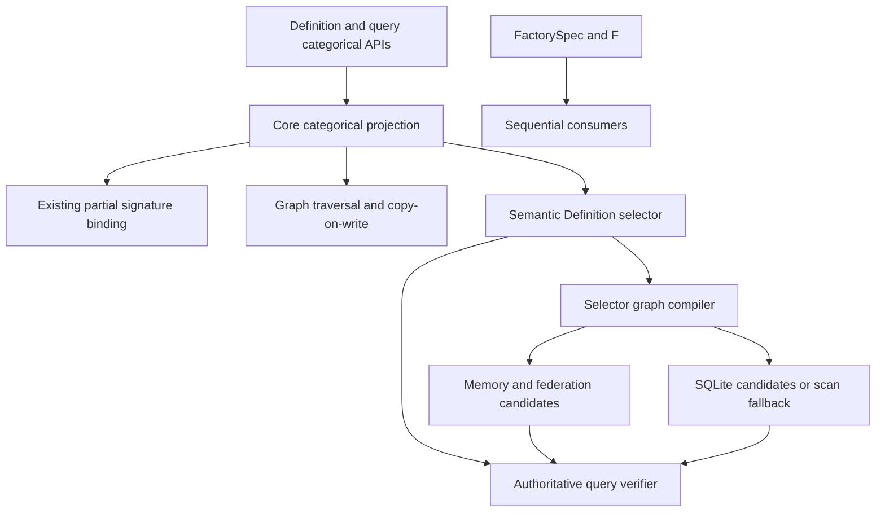
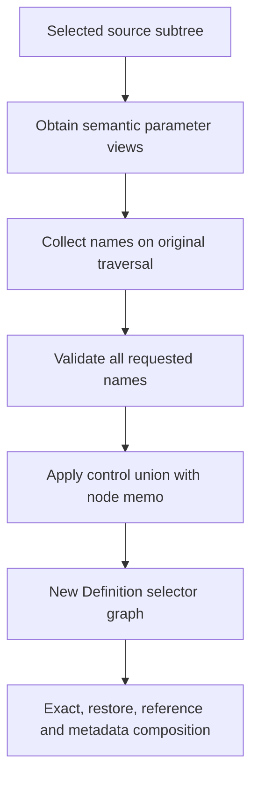
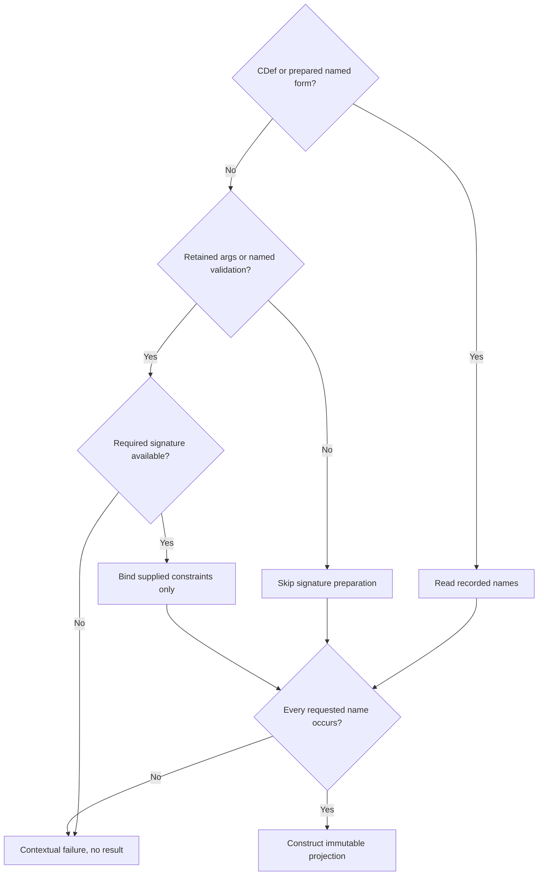
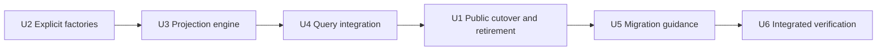

# Stage 2 Argument Hook Removal - Plan

## Goal Capsule

- **Objective:** Complete the 0.3.0b1 Stage 2 API simplification with hook-free construction, explicit factories, and caller-controlled categorical selector projection.
- **Product authority:** The Product Contract in this file, followed by Section 2 of `docs/plans/2026-09-20-001-v0.3.0b1-roadmap.md`. Other release workstreams are not active scope.
- **Open blockers:** None. Stage 1 prerequisite commits `f5f3ae11` and `2d4c7890` are ancestors of the researched checkout; their recorded verification is evidence, not a fresh test run.
- **Execution profile:** Serial implementation in `big_env`, with characterization and focused verification before the representative `good-enough` gate. Use the workspace's declared disposable build root and no unauthorized exhaustive suites.
- **Stop conditions:** Stop for a required CDef/Store format change, a new public selector type, an inability to preserve source graph authority, or query acceleration that cannot fall back without omitting valid matches.
- **Tail ownership:** The execution coordinator owns integration, authoritative verification, and separately authorized Git and parent-gitlink actions. Planning authorizes no implementation, commit, push, release, or automatic Proof synchronization.
- **Readiness:** Implementation-ready design, not a claim that Stage 2 has been implemented or verified.

---

## Product Contract

### Summary

Remove the legacy argument preparation/stripping hooks and the `Metadata` and `UniqueID` mixins.
Use explicit `F(...)` or `FactorySpec(...)` declarations for Sequential layers, preserving supplied call shape and existing build-time namespace resolution.
Make `categorical()` an explicit named-parameter projection for Definition and CDef while retaining ordinary Object binding, definition-only orchestration, querying, and exact-state restoration.

### Problem Frame

Legacy hooks combine unrelated concerns: injecting non-construction metadata, stripping selected identity fields, and converting layer shorthand.
The metadata foundation and current reference identities provide separate homes for the first two concerns, but Sequential still depends on preparation hooks for shorthand conversion.
Researchers want concise layer declarations without a hidden argument-rewriting protocol.
Factory default expansion was considered, but a usable callable can have defaults that DRYML cannot encode as canonical leaf values.
Removing stripping hooks alone would also leave categorical projection with little support for generalizing a complex concrete example into a useful selector.

### Key Decisions

- **Make `F` a true alias.** `F` and `FactorySpec` name the same generic non-Object factory class, not backend-specific factories. Both are public from `dryml` and `dryml.core`. (session-settled: user-directed - chosen over backend-specific factories and core-only imports: retain a generic factory with concise public authoring.)
- **Preserve factory call shape.** Do not bind factory arguments to parameter names or insert omitted defaults. Existing symbolic and frozen-value representation remains applicable. (session-settled: user-directed - chosen over automatic default filling and supplied-argument normalization: avoid injecting unsupported defaults and accept call-shaped identity.)
- **Keep namespaces at build time.** Consumers supply the existing `build(namespace=...)` context; factories gain no stored namespace. Preserve existing namespace-first string resolution followed by explicit import-path resolution. (session-settled: user-directed - chosen over per-factory namespace state: existing Sequential build-time context is sufficient.)
- **Require explicit layer factories.** Sequential accepts `F(...)` and `FactorySpec(...)`, not implicit tuple/string layer shorthand. (session-settled: user-approved - chosen over relocating shorthand conversion: remove the implicit protocol while retaining concise authoring.)
- **Remove both mixins outright.** Use current Object/reference identity, persistent Store metadata, and lifecycle facts instead of legacy constructor injection. (session-settled: user-approved - chosen over replacement convenience mixins: keep identity and metadata responsibilities separate.)
- **Preserve Object binding.** The FactorySpec decision does not remove ordinary Object constructor binding, named parameters, declared defaults, or reference-role handling.
- **Project semantic parameters, not call spelling.** `categorical()` uses constructor parameter names for both Definition and CDef, with `drop`, `drop_args`, and `drop_class` controls. Do not add positional/keyword split flags or change CDef identity to retain original call spelling. (session-settled: user-approved - chosen over source-dependent split flags and current-call-projection semantics: equivalent calls should have the same categorical behavior for the same supplied semantic constraints.)
- **Scope drops to a definition subtree.** Apply named drops at the selected root by default; `recursive=True` applies all requested controls to nested definitions in that subtree. The query API retains `path=` for selecting the subtree. (session-settled: user-directed - chosen over a separate exact-parameter-path deletion language: support concise scoped and recursive generalization.)
- **Reject wholly unmatched names.** Every name in `drop` must occur in at least one visited definition; individual nodes may lack it. (session-settled: user-approved - chosen over silent no-ops for unknown names: catch misspellings without making heterogeneous recursive traversal cumbersome.)

Factory identity describes the supplied construction recipe, not a complete snapshot of effective target behavior.
Omitted versus explicit defaults and positional versus keyword equivalents may have different identities.
A later change to the target's defaults can change construction behavior without changing an unchanged factory declaration.
No new FactorySpec target-signature inspection or canonicalization-time factory-target import is required by this design.
Categorical projection is separate: naming positional constraints in an authored Definition may require resolving its constructor signature, but must not insert omitted defaults or construct the target.

<!-- ce-section: work-relationships -->
### How This Work Fits Together

This plan owns Stage 2 of the finalized beta roadmap, not a redesign of the other workstreams.

- **Depends on:** Stage 1 persistent metadata, lifecycle evidence, attachment, and query capabilities, as specified in `docs/plans/2026-09-20-002-feat-stage-1-environments-metadata-plan.md`.
- **Enables:** Hook-free authoring for the later Artifact revision and layer-list multiplier work.
- **Preserves:** Current ObjectRef/StateRef identity, Store authority, signature-role handling, and exact-state restoration contracts.
- **Separate scope:** Artifact/CachedDataset APIs, Method selection, list multipliers, and complete ML release qualification retain their own focused plans.

### Actors

- A1. **Class author or researcher:** Defines Objects and assembles backend models with explicit factory declarations.
- A2. **Definition-only orchestrator or inspector:** Handles canonical definitions, references, and queries without constructing layers or loading saved model payloads.
- A3. **Materializing caller or worker:** Builds declared runtime objects using a consumer namespace or restores exact saved state through existing lifecycle boundaries.

### Requirements

**Hook and mixin removal**

- R1. Remove `__prepare_args__` and `__strip_unique_args__` from the Object API and all supported construction, definition, and query paths.
- R2. Remove `Metadata` and `UniqueID`, their public exports, and their automatic constructor-field injection rather than replacing them with shims or renamed hooks.
- R3. Remove or revise framework overrides, callers, maintained tests, examples, and current documentation that require the removed protocol.
- R4. Preserve ordinary Object signature binding, declared defaults, Ref/Mat behavior, identity, and reference topology without invoking either removed hook.

**Explicit factory authoring**

- R5. Export `F` and `FactorySpec` from both `dryml` and `dryml.core`, with every spelling referring to the same class.
- R6. Keep FactorySpec generic for non-Object runtime construction rather than specializing it for TensorFlow, Torch, or layers.
- R7. Preserve supplied factory arguments and target meaning under the existing symbolic/frozen representation, without signature binding, default insertion, or semantic call equivalence normalization.
- R8. Keep namespace context an argument to factory building rather than persisted factory state, retaining existing target-resolution precedence.
- R9. Require explicit FactorySpec values in Torch and Keras Sequential layer declarations, rejecting implicit tuple/string shorthand with guidance toward explicit factories.
- R10. Preserve the distinction between inert factory declarations and runtime construction, including lightweight factory imports and import-free inspection of already-canonical definitions.

**Queries, persistence, and transition**

- R11. Extend the categorical definition and query APIs into hook-free, caller-controlled selector projections, leaving source definitions and persisted identities unchanged.
- R12. Preserve definition-only orchestration and exact saved-state restoration without replaying removed preparation or stripping hooks.
- R13. Document persistent metadata through Repo's reference-targeted metadata APIs and lifecycle inspection through the existing lineage/snapshot APIs, without conflating them with passive `dryml.annotations`.
- R14. Reject encountered incompatible legacy definitions through actionable failures rather than silently rewriting their identity or adding pre-beta readers and migration shims.
- R15. Document the clean API break, explicit-factory migration examples, and the accepted limits of call-shaped factory identity.

**Explicit categorical projection**

- R16. Apply `drop` by semantic constructor parameter name consistently to Definition and CDef, independent of positional/keyword call spelling when their supplied semantic constraints agree.
- R17. Support `drop_args` to remove all argument constraints and `drop_class` to remove the class constraint, preserving every constraint not selected for removal.
- R18. Scope projection to the selected definition root with `recursive=False`, applying all requested controls to nested definitions in the selected subtree with `recursive=True`.
- R19. Require each requested drop name to occur somewhere in the original selected traversal, failing without a partial result when any name is wholly unmatched.
- R20. Preserve Definition omissions and CDef bound defaults during projection unless selected for dropping; do not change either representation's persisted identity model.
- R21. Project named CDef records without resolving their classes, permitting signature resolution only where authored argument constraints need semantic interpretation.
- R22. Keep prepared selector parameter matching import-free and preserve composition with query `exact`, `restore`, and metadata predicates, while retaining the current class-match policy under which unequal retained class symbols may resolve or import for inheritance checks.

The hooks named for removal are `__prepare_args__` and the currently named `__strip_unique_args__`; the roadmap's requested `__strip_args__` refers to the latter.
Ordinary subclass parameters named `uid` or `metadata` are not globally reserved or automatically stripped; an explicit named drop may remove their selector constraints like any other parameter.
Categorical projection deliberately broadens matching rather than rewriting the source identity; neither the new controls nor the hook-free implementation are currently shipped.

### APIs

The signatures below describe the intended public contracts, not implementation code or a claim that every current function already has these Python annotations.
`Any` denotes an existing generic value boundary, not a promise to encode arbitrary Python objects.
New and modified entries are Stage 2 proposals; the persistent metadata APIs are existing Stage 1 capabilities reused unchanged.

**New: public factory alias and exports**

```python
from dryml import F, FactorySpec
# Equivalently: from dryml.core import F, FactorySpec

assert F is FactorySpec

# Signature of the existing class reached through both names:
class FactorySpec:
    def __init__(
        self,
        target: str | type[Any] | Callable[..., Any] | ImportRef | SourceSpec,
        *args: Any,
        **kwargs: Any,
    ) -> None: ...

    def resolve_target(self, *, namespace: object | None = None) -> Any: ...

    def build(
        self,
        *,
        namespace: object | None = None,
        instance_type: type[Any] | None = None,
    ) -> Any: ...
```

`F(...)` returns a FactorySpec, not the constructed target instance; it is an alias, not a wrapper function or subclass.
The new exports are `dryml.F`, `dryml.core.F`, and `dryml.FactorySpec`; `dryml.core.FactorySpec` already exists.
Class/function targets must have a supported symbolic representation, and supplied values retain the existing factory value restrictions.
Construction freezes supplied values but does not inspect the target signature, fill defaults, or build the target.

`resolve_target()` and `build()` are unchanged supporting APIs.
A namespace may be a name-to-target mapping or an attribute-bearing object such as a module.
String targets use namespace lookup first, then supported explicit import paths; unresolvable short names raise `ValueError`.
Resolution may import target code, and `build()` invokes it with the supplied arguments, propagating resolution and constructor failures.
An incompatible `instance_type` raises `TypeError` after construction; the returned runtime object otherwise has the target's return type, represented here as `Any`.

**Modified: Sequential layer inputs**

Both `dryml.models.tf.keras.base.Sequential` and `dryml.models.torch.base.Sequential` retain this constructor shape:

```python
def __init__(
    self,
    layer_defs: Sequence[FactorySpec] = (),
    output_spec: Any = None,
) -> None: ...
```

The change is the accepted element contract: each layer must be an explicit FactorySpec, including its `F` spelling.
Bare strings and tuple/list layer shorthand are no longer implicitly converted and must produce an actionable rejection.
The outer layer sequence may still be a supported list or tuple; this signature does not add arbitrary iterator canonicalization.
`output_spec` retains its existing semantics without a new validation contract.
At runtime the constructors build layers using `tf.keras.layers` or `torch.nn`, respectively; they no longer define or invoke a preparation hook.
Target resolution, constructor errors, and backend layer-type validation remain visible failures.

```python
# Before: implicit layer shorthand inside Sequential.
layer_defs = [("Dense", 32, {"activation": "relu"})]

# After: explicit factory; the outer layer list is unchanged.
layer_defs = [F("Dense", 32, activation="relu")]
```

**Modified: constructor preparation and categorical projection**

The advanced signature boundary remains an Object-construction API, not a new FactorySpec normalizer:

```python
class SignaturePlan:
    def prepare_constructor_args(
        self,
        args: tuple[Any, ...],
        kwargs: Mapping[str, Any],
        *,
        repo: Any = None,
        cache: Any = None,
        reuse_live: Any = None,
        selections: Mapping[Any, Any] | None = None,
    ) -> BoundaryPlan: ...
```

Previously this method called the class's preparation hook before binding.
After Stage 2 it binds the supplied Object call directly, retaining declared defaults, role validation, and explicit Repo selection controls.
It returns a prepared boundary rather than a live Object and does not materialize or save.
Invalid binding or use on a non-constructor plan still raises `SignatureError`; hook-return-shape validation disappears with the hook.

```python
class DefInterface:
    def categorical(
        self,
        recursive: bool = False,
        *,
        drop: Sequence[str] = (),
        drop_args: bool = False,
        drop_class: bool = False,
    ) -> Definition: ...

class DefinitionQuery:
    def categorical(
        self,
        *,
        path: DefinitionPathLike = "$",
        recursive: bool = False,
        drop: Sequence[str] = (),
        drop_args: bool = False,
        drop_class: bool = False,
    ) -> DefinitionQuery: ...

def categorical_definition(
    defn: Object | Definition | ConcreteDefinition,
    recursive: bool = True,
    memo: dict[Any, Any] | None = None,
    *,
    drop: Sequence[str] = (),
    drop_args: bool = False,
    drop_class: bool = False,
) -> Definition: ...
```

These preserve their existing positional arguments and result forms while adding keyword-only projection controls.
The two methods retain `recursive=False`; the existing helper retains its `recursive=True` default.

| Control | Selector effect |
| --- | --- |
| `drop=("seed", ...)` | Omit constraints on those semantic constructor parameters. |
| `drop_args=True` | Omit all argument constraints, regardless of original call spelling. |
| `drop_class=True` | Omit the class constraint while retaining any remaining argument constraints. |
| `recursive=True` | Apply every requested control at nested definition nodes in the selected subtree. |
| Query `path=` | Select the definition subtree where projection starts; surrounding constraints remain. |

Omission means unconstrained, not equal to `None`, an empty argument collection, or the constructor default.
Dropping a dependency-valued parameter removes that branch's selector constraints, not the dependency from the source graph.
Retained constraints preserve their values, explicit references, and topology meaning.
Both Boolean flags together produce an unconstrained definition selector at the selected position, not a wildcard for arbitrary scalar values.
With all controls at their defaults, `categorical()` returns a Definition selector surface without removing parameter or class constraints.

Names refer to semantic constructor parameters, including named variadic buckets, not arbitrary keys inside parameter values.
Recursion follows nested definition nodes through their structural containers, but does not inspect FactorySpec internals or follow ObjectRefs/StateRefs by loading referenced Objects.
It never runs class-defined stripping hooks.

Overlapping controls combine as a union of requested removals.
Validate names against the original selected traversal before removing anything, so combining a named drop with `drop_args=True` does not create order-dependent failures.
A missing name on one visited node is harmless; a name missing everywhere is an error.
Boolean flags may be no-ops on already-unconstrained categories, but repeating a named drop may fail because that name was removed previously.
An error returns neither a partial projection nor a partially modified query.

Definition preserves authored call spelling, whereas CDef V2 stores a fully bound named parameter record.
Categorical projection bridges those representations using semantic names, not a reconstructed positional/keyword split.
For example, positional and keyword spellings of the same supplied `width` constraint must behave identically when dropping `seed`.
Named CDef projection reads its stored record without resolving the class.
An authored Definition may require constructor signature resolution to name positional or variadic call constraints; this can import the referenced backend but never constructs an Object or fills omitted defaults.
If surviving constraints cannot be interpreted safely, fail explicitly instead of guessing their names or changing their meaning.
When `drop_class=True` retains arguments, interpret any signature-dependent constraints before discarding the source class constraint.
No class resolution is needed merely to erase all argument constraints.

The resulting expression retains enough semantic information for parameter matching against CDefs without importing their classes.
Class matching remains separate: equal symbolic references and exact rejection are import-free, while the default selector policy may resolve unequal retained class symbols to check inheritance.
An authored Definition target may still require signature resolution to prepare its semantic parameter record before comparison.
A partial Definition and a fully bound CDef can still produce different selectors because omitted defaults are absent from the former and present in the latter.
Projection does not erase that meaningful difference in completeness.
Neither `drop_positional_args` nor `drop_keyword_args` is part of this API.

The query variant returns a new query at the selected path and preserves composition with `exact(...)`, `restore(...)`, and `where(...)`.
An unconstrained query with no source definition still raises `QueryPathError`; an explicit unconstrained Definition returned by dropping class and arguments remains a valid selector expression.
Invalid paths, malformed controls, wholly unmatched names, and unavailable required signature information have actionable failures; exact exception choices belong to planning.
These APIs do not materialize Objects, save state, or migrate old definitions.

The existing Selector wrapper remains unchanged:

```python
class Selector:
    def __init__(
        self,
        root: Definition | type[Any],
        strict: bool = False,
        cls_policy: str = "selector",
    ) -> None: ...

    def matches(self, target: Any, *, verbose: bool = False) -> bool: ...
```

`Selector(category)` wraps the Definition returned by `categorical()`; it is not a separate categorical-selector type.
`matches()` returns a Boolean under the selected matching policies without materializing an Object.
Pass a definition as the target in the examples below.
An unsupported root raises `TypeError`; a class root is shorthand for a Definition of that class.
`Repo.query(selector)` accepts this wrapper and preserves its matching policies.

**Removed: rewriting hooks and mixins**

```python
class Object:
    @classmethod
    def __prepare_args__(
        cls, *args: Any, **kwargs: Any,
    ) -> tuple[tuple[Any, ...], Mapping[str, Any]]: ...

    @classmethod
    def __strip_unique_args__(
        cls, *args: Any, **kwargs: Any,
    ) -> tuple[tuple[Any, ...], Mapping[str, Any]]: ...

class Metadata(Object):
    def __init__(
        self, *args: Any, metadata: dict[str, Any] | None = None, **kwargs: Any,
    ) -> None: ...

class UniqueID(Object):
    def __init__(
        self, *args: Any, uid: str | None = None, **kwargs: Any,
    ) -> None: ...
```

These are historical signature sketches, not APIs to implement.
The mixins' overrides of both hooks and all existing public mixin exports are removed with them.
The preparation hook previously returned rewritten arguments; the stripping hook returned arguments with selected identity fields removed.
Metadata injected a dictionary with `description` and `creation_time` defaults and exposed `self.metadata`; UniqueID injected a UUID string and exposed `self.uid`.
Neither automatic attribute is recreated by Stage 2.
Use reference-targeted metadata for labels, lineage facts for creation evidence, and current ObjectId/reference facilities for framework identity.
Applications may still declare ordinary constructor parameters with these names, but they receive no mixin behavior or identity exemption.

**Existing replacements: persistent metadata and queries**

The value aliases below already belong to `dryml.core.metadata`:

```python
MetadataScalar = None | bool | int | float | str
MetadataValue = (
    MetadataScalar
    | list["MetadataValue"]
    | tuple["MetadataValue", ...]
    | Mapping[str, "MetadataValue"]
)
MetadataMapping = Mapping[str, MetadataValue]
MetadataTarget = ObjectRef | StateRef

class SaveAnnotations:
    def __init__(
        self,
        object: MetadataMapping | None = None,
        state: MetadataMapping | None = None,
    ) -> None: ...

class Repo:
    def get_metadata(
        self, target: MetadataTarget, *, store: Store | None = None,
    ) -> dict[str, MetadataValue] | None: ...

    def set_metadata(
        self, target: MetadataTarget, values: MetadataMapping,
        *, store: Store | None = None,
    ) -> None: ...

    def delete_metadata(
        self, target: MetadataTarget, *, store: Store | None = None,
    ) -> bool: ...

    def get_lineage_metadata(
        self, target: ObjectRef, *, store: Store | None = None,
    ) -> LineageMetadata: ...

    def get_snapshot_metadata(
        self, target: StateRef, *, store: Store | None = None,
    ) -> SnapshotMetadata: ...

    def query(
        self,
        selector: Definition | ConcreteDefinition | Selector | Object | None = None,
    ) -> DefinitionQuery: ...

    def references(self) -> ReferenceQuery: ...

def field(scope: str, *path: str | int) -> MetadataField: ...

class MetadataField:
    def eq(self, value: Any) -> MetadataPredicate: ...
    def ge(self, value: int | float | datetime) -> MetadataPredicate: ...
    def contains(self, value: Any) -> MetadataPredicate: ...

class DefinitionQuery:
    def where(self, predicate: MetadataPredicate) -> ReferenceQuery: ...

class ReferenceQuery:
    def where(self, predicate: MetadataPredicate) -> ReferenceQuery: ...
    def in_store(self, store: Store) -> ReferenceQuery: ...
    def object_refs(self) -> ObjectRefResultSet: ...
    def state_refs(self) -> StateRefResultSet: ...
```

Metadata is bounded nested data, not an arbitrary Python-object dictionary; floating-point values must be finite.
`get_metadata()` returns a detached mapping or `None` for an absent mapping on a known target.
`set_metadata()` atomically replaces a whole mapping, not individual fields; `delete_metadata()` returns whether a mapping was removed.
Writes are Store-local last-writer-wins and do not change the target reference, saved payload, or captured snapshot metadata.
Unknown targets raise `KeyError`, invalid values raise `TypeError` or `ValueError`, and malformed authority raises `StoreAuthorityError`.
Conflicting unqualified reads raise `MetadataConflictError`; writes with ambiguous destinations raise `RepoSaveError` and require an explicit connected `store=`.
Backend capability restrictions remain in effect.

`SaveAnnotations(...)` copies and validates caller mappings for an ordinary save; `None` means no explicit replacement at that scope, while `{}` requests a present empty mapping.
The existing `Repo.save_object(..., annotations=...)` returns a `StateRef`, or `(StateRef, StoreReport)` with `report_stores=True`.
A new snapshot captures the selected annotations once; later current-metadata edits do not rewrite those copies.
Lineage inspection returns known creation evidence or an explicit unknown marker, not the mixin's former mutable wall-clock field.

`field()` accepts the `object`, `state`, `lineage`, and `snapshot` scopes with string keys and nonnegative sequence indexes.
Its operators construct inert typed predicates; invalid operands, scopes, or paths raise `TypeError` or `ValueError`, and incompatible comparisons during evaluation remain query errors.
Repeated `where()` calls intersect constraints, while `DefinitionQuery.where()` returns a ReferenceQuery combining structural and metadata constraints.
The terminal result sets iterate ObjectRefs or StateRefs, not live Objects; reads verify Store authority without loading payloads or probing environments.
Use `in_store()` to choose a connected Store when replicas disagree.

### Metadata Before And After

**Before: constructor-attached metadata**

This example uses the legacy mixin still present immediately before Stage 2, not an invented historical sidecar API.
Assume `repo` is an open Repo connected to an application-owned writable Store.
The explicit timestamp makes the supplied constructor mapping reproducible; omitting it allowed the old hook to inject the current time.

```python
from typing import Any
from dryml.core import Definition, Metadata


class LegacyRun(Metadata):
    def __init__(
        self, name: str, metadata: dict[str, Any] | None = None,
    ) -> None:
        super().__init__(metadata=metadata)
        self.name = name


legacy_metadata = {
    "description": "baseline",
    "creation_time": 0.0,
    "project": "forecasting",
}
run = LegacyRun("forecast", metadata=legacy_metadata, repo=repo)
repo.save_object(run)

# Match constructor data in the known-definition domain.
matches = (
    repo.query(Definition(
        LegacyRun, name="forecast", metadata=legacy_metadata,
    ))
    .known()
    .defs()
)
assert run.definition in list(matches)
assert run.metadata["project"] == "forecasting"
```

The query returns a DefinitionResultSet of canonical definitions, not StateRefs.
It matches a supplied constructor mapping, not an independent `project` sidecar predicate; this example does not claim a partial-dictionary metadata-query contract.
The known-definition domain includes the live registered definition, so this is not a demonstration of a reopened-Store metadata scan.
Calling `categorical()` previously invoked the mixin's stripping hook and removed the metadata constraint.
Mutating `run.metadata` was also not a call to the Store's current annotation API and must not be described as one.

**After: reference-attached metadata with field predicates**

Use an ordinary Object without either mixin.
The following Stage 1 APIs already work and remain the supported path after Stage 2 removes the old APIs.

```python
from dryml.core import Definition, Object, SaveAnnotations, field


class Run(Object):
    def __init__(self, name: str) -> None:
        self.name = name


run = Run("forecast", repo=repo)
state_ref = repo.save_object(
    run,
    annotations=SaveAnnotations(
        object={"description": "baseline", "project": "forecasting"},
        state={"score": 0.91},
    ),
)

# Query saved references by independent object- and state-scope fields.
matches = (
    repo.references()
    .where(field("object", "project").eq("forecasting"))
    .where(field("state", "score").ge(0.90))
    .state_refs()
)
assert state_ref in list(matches)

# Add a structural constraint without injecting metadata into Definition.
same_run_matches = (
    repo.query(Definition(Run, name="forecast"))
    .where(field("object", "project").eq("forecasting"))
    .where(field("state", "score").ge(0.90))
    .state_refs()
)
assert state_ref in list(same_run_matches)

# Add or replace metadata after publication without changing state_ref.
repo.set_metadata(state_ref, {"score": 0.95})
assert repo.get_metadata(state_ref) == {"score": 0.95}
captured = repo.get_snapshot_metadata(state_ref)
assert captured.captured_state_annotations == {"score": 0.91}

removed = repo.delete_metadata(state_ref)
assert removed is True
assert repo.get_metadata(state_ref) is None
```

`state_ref.object` selects object-scope metadata; `state_ref` selects state-scope metadata.
The scopes are not merged, and an arbitrary key such as `project` need not be accompanied by a timestamp or any other key to query it.
Use `.object_refs()` instead of `.state_refs()` when the desired result is matching lineages rather than exact saved states.
For an already-saved target, `repo.set_metadata(state_ref.object, {"project": "forecasting"})` adds the object-scope mapping without a new save; it replaces any previous mapping at that scope.
To retain other keys in a read-modify-write update, callers must coordinate concurrent writers themselves.
The sample Run is stateless, so lineage creation evidence may be unknown; this example makes no new ObjectId-allocation promise.

The change is from metadata embedded in construction identity to metadata addressed by stable references.
Store annotation edits no longer need unique-argument stripping, and metadata queries no longer require a metadata-bearing constructor or materialized model.
This is authoring guidance, not an automatic migration of old definitions or Stores.

### Categorical Selectors Before And After

A categorical selector is formed in two steps: project a definition with `.categorical(...)`, then wrap the resulting Definition in `Selector(...)`.
The query builder's `.categorical(...)` applies the corresponding projection and returns a new query without changing the original.
Retained constructor constraints still matter unless the caller explicitly removes them with named drops or `drop_args=True`.

**Before: strip mixin fields to match a construction category**

Reuse the legacy `LegacyRun` class from the metadata example and an open Repo.
These two runs have the same `name` but different constructor metadata, so their unprojected canonical definitions differ.

```python
from dryml.core import Selector

first = LegacyRun(
    "forecast",
    metadata={"description": "first", "creation_time": 0.0, "project": "one"},
    repo=repo,
)
second = LegacyRun(
    "forecast",
    metadata={"description": "second", "creation_time": 1.0, "project": "two"},
    repo=repo,
)
other = LegacyRun("classification", repo=repo)
repo.add_objects(first, second, other)

category = first.definition.categorical(recursive=True)  # Definition
category_selector = Selector(category)                  # Selector

assert "metadata" not in category.parameters
assert category_selector.matches(first.definition)
assert category_selector.matches(second.definition)
assert not category_selector.matches(other.definition)

# Query registered definitions with the reusable selector.
matches = repo.query(category_selector).known().defs()
assert first.definition in list(matches)
assert second.definition in list(matches)

# Equivalent formation through the query builder.
same_category = (
    repo.query(first.definition)
    .categorical(recursive=True)
    .known()
    .defs()
)
assert set(matches) == set(same_category)
```

The old projection resolves the class and calls `__strip_unique_args__`, removing the entire `metadata` argument, including `project`.
A class using the old UniqueID mixin similarly loses its injected `uid` constraint.
`recursive=True` applies that projection to nested definitions too.
The surviving `name="forecast"` constraint explains why `other` does not match.
These terminals return canonical definitions from the known-definition domain, not saved StateRefs or loaded Objects.

**After: choose construction constraints and filter sidecars separately**

Reuse the ordinary `Run` class from the metadata example.
Without explicit drop controls, the formation syntax retains its construction constraints, but Stage 2 makes the projection hook-free: there are no injected metadata/UID constructor fields to remove.

```python
from dryml.core import Definition, SaveAnnotations, Selector, field

run = Run("forecast", repo=repo)
state_ref = repo.save_object(
    run,
    annotations=SaveAnnotations(object={"project": "forecasting"}),
)

category = run.definition.categorical(recursive=True)
category_selector = Selector(category)
assert category_selector.matches(run.definition)

# For this one-parameter class, the intent can also be authored directly.
authored_selector = Selector(Definition(Run, name="forecast"))
assert authored_selector.matches(run.definition)

definitions = repo.query(category_selector).known().defs()
all_saved_states = repo.query(category_selector).references().state_refs()
assert run.definition in list(definitions)
assert state_ref in list(all_saved_states)

# Category plus an explicit sidecar constraint.
project_states = (
    repo.query(category_selector)
    .where(field("object", "project").eq("forecasting"))
    .state_refs()
)
assert state_ref in list(project_states)

# The query-builder spelling composes the same way.
same_project_states = (
    repo.query(run.definition)
    .categorical(recursive=True)
    .where(field("object", "project").eq("forecasting"))
    .state_refs()
)
assert set(project_states) == set(same_project_states)

# Editing sidecar metadata does not change the structural category.
repo.set_metadata(state_ref.object, {"project": "another-project"})
assert category_selector.matches(run.definition)
updated_project_states = (
    repo.query(category_selector)
    .where(field("object", "project").eq("forecasting"))
    .state_refs()
)
assert state_ref not in list(updated_project_states)
```

The projection and metadata predicate have independent responsibilities: categorical projection chooses construction constraints; `where(field(...))` selects annotations on exact references.
`.known().defs()` returns a DefinitionResultSet, whereas `.references().state_refs()` and `.where(...).state_refs()` return StateRefResultSets without loading model payloads.
Terminal results are snapshots of a query evaluation; execute the query again to observe later metadata edits.
The hand-authored selector is equivalent here because Run has only the `name` constructor parameter; for a richer class, omitting parameters intentionally makes a partial selector and need not equal projection of a fully bound definition.

**New: generalize the same semantic parameter on either representation**

The following examples specify proposed Stage 2 behavior, not executable features in the current implementation.
The two classes below have the same parameter names but are unrelated classes.

```python
from dryml.core import Definition, Object, Selector


class ConfiguredRun(Object):
    def __init__(self, width: int, seed: int = 7) -> None:
        self.width = width
        self.seed = seed


class OtherRun(Object):
    def __init__(self, width: int, seed: int = 7) -> None:
        self.width = width
        self.seed = seed


positional = Definition(ConfiguredRun, 32, 7)
keyword = Definition(ConfiguredRun, width=32, seed=7)
cdef = positional.concretize(repo=repo)
different_seed = Definition(ConfiguredRun, width=32, seed=99).concretize(repo=repo)
different_width = Definition(ConfiguredRun, width=64, seed=99).concretize(repo=repo)
other_class = Definition(OtherRun, width=32, seed=7).concretize(repo=repo)

# New API: ignore seed, regardless of the source's argument spelling.
for source in (positional, keyword, cdef):
    category_selector = Selector(source.categorical(drop=("seed",)))
    assert category_selector.matches(different_seed)
    assert not category_selector.matches(different_width)
    assert not category_selector.matches(other_class)

# Dropping the first positional parameter must not shift seed onto width.
seed_selector = Selector(positional.categorical(drop=("width",)))
assert seed_selector.matches(
    Definition(ConfiguredRun, width=64, seed=7).concretize(repo=repo)
)
assert not seed_selector.matches(different_seed)

# Keep the class constraint, but ignore every argument constraint.
class_selector = Selector(cdef.categorical(drop_args=True))
assert class_selector.matches(different_width)
assert not class_selector.matches(other_class)

# Keep width=32 and seed=7, but ignore the class constraint.
parameter_selector = Selector(cdef.categorical(drop_class=True))
assert parameter_selector.matches(other_class)
assert not parameter_selector.matches(different_seed)

# Match any definition, not arbitrary non-definition values.
any_definition = Selector(cdef.categorical(drop_args=True, drop_class=True))
assert any_definition.matches(other_class)
assert any_definition.matches(different_width)
```

The first projection has the intent of `Selector(Definition(ConfiguredRun, width=32))` without requiring the caller to rebuild the remaining constraints by hand.
It must not shift the surviving `width` constraint onto another parameter or treat the absence of `seed` as `seed=None`.
There is no positional-versus-keyword flag and no requirement that the two authored Definitions themselves have equal identity before concretization.

**New: generalize a complex subtree, then pin an exact branch**

For an existing `pipeline_cdef` with root parameters `model`, `optimizer`, and `seed`, suppose the model also declares `seed` and the optimizer declares `learning_rate`.
The proposed query composition is:

```python
query = (
    repo.query(pipeline_cdef)
    .categorical(drop=("seed",), recursive=True)
    .categorical(path="optimizer", drop=("learning_rate",))
    .exact(path="model")
)
matching_states = query.references().state_refs()

# Alternatively restore the optimizer's complete original constraint too.
original_optimizer_query = query.restore(path="optimizer")
```

The first operation removes the root and model seed constraints, ignoring visited nodes that have no seed parameter.
The second removes only the selected optimizer's learning-rate constraint.
The third reinstates the original exact model constraint, including its seed, while leaving the other generalizations in place.
Neither the source graph nor its saved references change.
If no selected node declares `seed`, or the optimizer has no `learning_rate`, the corresponding named-drop operation fails rather than silently preserving an unintended constraint.

A partial `Definition(ConfiguredRun, width=32)` omits seed, while its CDef includes the declared default.
Consequently, dropping `seed` from that partial root fails the unmatched-name check, whereas dropping it from the fully bound CDef succeeds.
That difference reflects actual constraint presence, not whether width was supplied positionally or by keyword.

Parameters named `metadata` and `uid` receive no automatic exemption, but callers can explicitly include them in `drop` like any other parameter.
Dropping an entire dependency-valued argument removes its constraints; otherwise retained explicit references and topology constraints remain.
FactorySpec stays opaque and call-shaped, so categorical projection does not normalize its internal arguments or defaults.
Matching a construction category does not merge distinct ObjectRefs or StateRefs.
The preceding no-drop examples can demonstrate matching on the current ordinary-Object path, but the new controls and hook-free projection still require implementation.

### Key Flows

- F1. **Author and construct a model.** A1 declares layers using `F(...)`; definition canonicalization preserves those factory recipes without inspecting target signatures. At materialization, A3's Sequential supplies the backend namespace and builds the layers. **Covers R4-R10.**
- F2. **Inspect or restore saved work.** A2 reads and queries canonical definitions and reference metadata without factory-target resolution. A3 restores an exact saved state through existing restoration behavior, without running removed hooks. **Covers R10-R13.**
- F3. **Update pre-beta authoring code.** A1 replaces implicit Sequential shorthands with explicit factories and removes mixin inheritance. Persistent labels use the existing reference metadata API; identity and lifecycle inspection use current core facilities. Incompatible input fails rather than being silently migrated. **Covers R1-R3, R9, R13-R15.**
- F4. **Derive a reusable category.** A1 starts from a partial Definition or exact CDef, selects a subtree, and removes named, all-argument, or class constraints. Projection interprets semantic parameters where needed, validates every requested name, and returns a new selector expression. A2 evaluates it with optional exact branches and metadata predicates; prepared parameter matching is import-free, while unequal retained classes may resolve under the existing inheritance-aware selector policy. **Covers R11, R16-R22.**

### Acceptance Examples

- AE1. **Public alias.** Importing `F` and `FactorySpec` from either public namespace yields the same class without importing TensorFlow or Torch merely to expose those names. **Covers R5, R6, R10.**
- AE2. **Explicit layer declarations.** Keras Sequential accepts `F("Dense", 32, activation="relu")`; Torch Sequential accepts `F("Linear", 3, 8)`, resolving each through its existing consumer namespace at construction. Neither needs a preparation hook. **Covers R1, R8, R9.**
- AE3. **Retired shorthand.** A Sequential layer supplied as `"ReLU"` or `("Dense", 32, {"activation": "relu"})` is rejected with guidance to use an explicit factory. It is not silently converted during canonicalization or construction. **Covers R3, R9, R15.**
- AE4. **Unsupported omitted default.** A supported target has a default that is not a supported canonical leaf value, but the caller omits that argument. Canonicalizing its factory does not inspect or inject the default, so that omitted value alone cannot make the declaration fail. Explicitly supplied values remain subject to existing supported-value constraints. **Covers R7, R10.**
- AE5. **Call-shaped identity.** `F("Dense", 32)` is not normalized into `F("Dense", units=32)` or into a call containing omitted defaults. Persistence retains each supplied call shape under existing factory value encoding. **Covers R7, R15.**
- AE6. **Namespaces remain contextual.** Building a short-name factory without a resolving namespace fails through the existing resolution behavior. A supplied namespace resolves its names before import-path fallback; canonicalizing the factory does not resolve the target or persist the namespace. **Covers R8, R10.**
- AE7. **Object defaults remain.** Equivalent supported positional and keyword calls to an ordinary Object constructor still produce the existing fully bound canonical parameters, including declared defaults, without a prepare hook. Reference-role handling and shared/independent graph relationships remain intact. **Covers R1, R4.**
- AE8. **No implicit stripping.** Categorizing a definition or selected query subtree never invokes a stripping hook. With no explicit drop controls, an ordinary declared `metadata` or `uid` parameter remains constrained. **Covers R1, R11, R17.**
- AE9. **Saved-state and metadata separation.** Save and restore a supported model authored with explicit factories and verify its exact state and graph associations. Persistent reference metadata remains independently readable and editable through the existing APIs without mixin inheritance or constructor injection. **Covers R2, R12, R13.**
- AE10. **Incompatible legacy input.** A definition requiring a removed mixin or otherwise incompatible legacy constructor arguments is not accepted by silently deleting fields or changing identity. Diagnostics identify the incompatibility, and migration documentation directs authors to current APIs without rewriting existing Store data. **Covers R14, R15.**
- AE11. **Spelling-independent named drops.** Two Definitions supplying the same width and seed values positionally and by keyword, and their equivalent CDef, each produce a selector that retains width and ignores seed after `drop=("seed",)`. No constructor runs, no omitted defaults are inserted, and surviving positional constraints keep their semantic names. **Covers R16, R20, R21.**
- AE12. **Broad projection flags.** `drop_args=True` matches the retained class without argument constraints; `drop_class=True` retains semantic argument constraints across classes. Both together match definitions without becoming a scalar wildcard. Existing Selector class-match policy applies whenever the class constraint is retained. **Covers R17.**
- AE13. **Scoped recursion and missing names.** Dropping seed recursively removes it from every visited definition that has it while leaving a same-named ordinary mapping key and FactorySpec contents untouched. A wholly unmatched name fails atomically, including in a multi-name request where another name matched. A path-scoped operation leaves surrounding branches unchanged. **Covers R18, R19.**
- AE14. **Source preservation and composition.** Dropping a dependency argument or its nested constraints leaves the source CDef, reference identities, and saved payloads unchanged. Exact/restored retained branches and metadata predicates compose with the resulting selector, and repeated evaluation reflects current sidecar metadata. **Covers R11, R17, R22.**
- AE15. **Resolution boundary and omissions.** CDef named projection succeeds with target imports unavailable. An authored positional or variadic Definition that needs an unavailable signature fails explicitly rather than guessing. Prepared parameter matching against CDefs is import-free; exact or equal-symbol class matching and `drop_class=True` avoid class resolution, while unequal retained class symbols may resolve for inheritance matching. A partial Definition lacking seed fails `drop=("seed",)` even when concretizing it would add that default. **Covers R19-R22.**
- AE16. **Control overlap and absent categories.** Combining `drop_args=True` with a named drop validates the name against the original traversal before applying their union. Repeating a named drop can fail after its first removal; applying a Boolean flag to an already-unconstrained category is a no-op. **Covers R17, R19.**

### Scope Boundaries

- No renamed generic argument-rewriting protocol or replacement Metadata/UniqueID mixins.
- No FactorySpec signature normalization, automatic default filling, inherited-default discovery, framework-policy capture, or stored namespace state.
- No requirement that equivalent factory calls share identity, or that factory declarations freeze future target defaults and implementation behavior.
- No redesign of ordinary Object canonicalization, reference identity, persistence schemas, or Stage 1 metadata semantics.
- No `drop_positional_args` or `drop_keyword_args` controls, original-call-spelling persistence for CDefs, or blanket import-free promise for authored selector preparation that requires a signature.
- No exact-parameter-path drop language, arbitrary predicate callbacks, or class-defined projection hooks; query `path=` selects a subtree and `drop` names constructor parameters within it.
- No recursive introspection of ordinary metadata dictionaries or FactorySpec internals, and no following stored references by materializing Objects during projection.
- No pre-beta Store migration, compatibility reader, or permission to delete or rewrite existing user data.
- No expansion of implicit Sequential shorthand support; independently invoked explicit conversion helpers are not themselves Sequential shorthand acceptance and need no unrelated redesign.
- No changes to historical planning records merely because they describe superseded behavior; update current product guidance and maintained consumers.

### Dependencies And Assumptions

Stage 1 is the implementation dependency, not an additional deliverable of Stage 2.
Current `Repo.get_metadata`, `set_metadata`, `delete_metadata`, `get_lineage_metadata`, and `get_snapshot_metadata` provide concrete non-constructor facilities, but their presence alone is not proof that all Stage 1 release gates passed.
The planning pass must establish that prerequisite's verification evidence before Stage 2 implementation begins.

Factory targets and Store contents retain the workspace's trusted-input assumptions.
Existing optional-backend boundaries and runtime restoration rules remain authoritative; factory aliasing does not introduce a sandbox or new admission policy.

### Outstanding Questions

**Deferred to Planning**

- Identify the full hook/mixin dependency set and the smallest removal that preserves the confirmed signature and categorical contracts.
- Select an import-free semantic selector representation/lowering for named CDef projection and prepared authored constraints, including variadic parameter buckets and retained graph sharing.
- Map named-drop failures and required-signature failures to existing error types while keeping validation atomic and independent of control order.
- Select the existing validation boundaries and precise diagnostics for incompatible definitions and retired Sequential shorthand without adding compatibility behavior.
- Identify focused tests, representative backend coverage, and current documentation/examples that establish the acceptance examples under the repository's verification policy.
- Verify Stage 1 prerequisite evidence and map each removed convenience to the exact current metadata, lifecycle, or reference API in migration documentation.

### Sources

- `docs/plans/2026-09-20-001-v0.3.0b1-roadmap.md`: Stage 2 scope, clean-break boundary, acceptance criteria, and historical categorical direction.
- `docs/plans/2026-09-20-002-feat-stage-1-environments-metadata-plan.md`: metadata foundation and explicit deferral of hook/mixin removal.
- `src/dryml/core/factory.py:96-202`: current FactorySpec representation, namespace-aware build path, and call-shaped hashing.
- `src/dryml/core/canonical.py:43-54` and `src/dryml/core/signatures.py:478-546`: factory identity-leaf treatment versus Object hook dispatch and ordinary binding/defaults.
- `src/dryml/models/tf/keras/base.py:7-34` and `src/dryml/models/torch/base.py:685-713`: current Sequential hook conversion and consumer namespaces.
- `src/dryml/core/object.py:582-631`: legacy mixin injection and stripping behavior.
- `src/dryml/core/definition.py:1135-1186` and `src/dryml/core/query/query.py:164-174`: current categorical paths still share the stripping-hook implementation.
- `src/dryml/core/__init__.py` and `src/dryml/__init__.py`: existing public export surfaces; root FactorySpec and both F exports are proposed additions.
- `docs/metadata.md`, `docs/annotations.md`, and `docs/signatures.md`: persistent metadata, the distinct passive annotation kernel, and the signature contracts to preserve.
- `src/dryml/core/repo.py:1536-1730` and `src/dryml/core/metadata.py:27-103`: metadata value types, current mapping operations, save annotations, and lifecycle inspection.
- `src/dryml/core/query/metadata.py`, `src/dryml/core/query/reference.py:390-464`, and `src/dryml/core/query/query.py:142-174`: typed metadata predicates, reference terminals, and structural-query composition.
- `tests/core/test_repo_metadata.py:41-79` and `tests/core/test_metadata_query.py:196-230`: maintained examples of reference metadata CRUD, immutable captures, and combined queries.
- `src/dryml/core/selector.py:7-67`, `tests/core/test_query_builder.py:10-45`, and `tests/core/test_query_path.py:130-157`: selector formation, categorical query composition, and the current hook-based projection without source mutation.
- `src/dryml/core/definition.py:177-216,252-284,364-370,523-536,592-617,730-739` and `src/dryml/core/bound_args.py:18-25,103-148`: authored call storage versus fully bound named CDef storage, partial binding, and the current signature-dependent compatibility projections.

---

## Planning Contract

**Product Contract preservation:** Changed R22 and its categorical API prose, F4, and AE15 with user approval to preserve inheritance-aware class matching and qualify the import-free guarantee; all other Product Contract text and IDs remain unchanged.

### Research And Prerequisites

The researched checkout is `dfe83965`.
Stage 1 integration commit `f5f3ae11` and publication-qualification commit `2d4c7890` are confirmed ancestors of that checkout.
The former records 3,360 passing maintained tests with 63 skips and 494 integrated persistence/environment/managed checks; the latter records 42 focused passes with one native Windows skip.
Commit `116f9461` records subsequent cross-platform CI evidence and a Windows job-budget correction.
These are historical verification records, not new test executions or a certification of every current environment.
Execution must stop if the required metadata APIs or authority guarantees have regressed.

The implementation patterns are local: `SignaturePlan.prepare_args` supplies ordinary binding, `BoundArguments` supplies named CDef authority, graph utilities supply occurrence-scoped copy-on-write, and query verification supplies semantic parameter matching and conservative candidate checks.
No new third-party integration, dependency choice, or persisted-data migration needs external research.
The code-shift learning at `docs/solutions/architecture-patterns/2026-09-18-code-shift-in-long-lived-sessions.md` constrains class-resolution claims: current ImportRef resolution is not historical-code identity, and projection must not migrate live Objects or saved states.

### Key Technical Decisions

- KTD-1. **Keep ordinary binding at the existing signature boundary.** Remove hook dispatch from `SignaturePlan.prepare_constructor_args` and delegate directly to the existing binding/default/role machinery. Persisted restoration continues to consume stored records without preparation replay. This realizes the Product Contract's Preserve Object binding decision rather than creating a second constructor-normalization boundary.
- KTD-2. **Keep factories opaque and publish one alias.** Add the true `F` alias through existing lazy facades, retain supplied-call hashing and build-time namespaces, and keep standalone coercion utilities independent. (session-settled: user-directed - chosen over backend-specific factories, default expansion, and stored namespaces: preserve the Product Contract's Make F a true alias, Preserve factory call shape, and Keep namespaces at build time decisions.)
- KTD-3. **Require explicit factories only at Sequential consumers.** Remove their preparation overrides and retain backend construction/type validation with actionable factory guidance. (session-settled: user-approved - chosen over relocating shorthand conversion: implement the Product Contract's Require explicit layer factories decision without retiring unrelated explicit conversion helpers.)
- KTD-4. **Use a semantic Definition selector surface.** Lower to an existing Definition with a stable symbolic class or no class, skipped positional spelling, and named semantic constraints. This preserves the required return type without adding a CDef format, public selector type, or positional wildcard placeholders. (session-settled: user-approved - chosen over positional/keyword split flags: implement the Product Contract's Project semantic parameters, not call spelling decision.)
- KTD-5. **Separate authored binding from prepared parameter records.** An authored call uses partial binding without defaults when semantic interpretation is required; a prepared symbolic/classless Definition with skipped call args uses its named fields directly. A live-class skipped Definition still requires ordinary partial binding. Make the existing classless skipped-args constructor branch mutually exclusive so it cannot fall through and interpret the sentinel as a class. A CDef always uses its stored parameters. Repeated projection must not repack an already-prepared variadic bucket or resolve a CDef class.
- KTD-6. **Validate the original traversal, then construct a result.** Snapshot controls, validate their shapes, collect semantic names across the selected original graph, and apply the union only after every requested name matches. (session-settled: user-approved - chosen over silent missing-name no-ops: implement the Product Contract's Reject wholly unmatched names decision atomically.)
- KTD-7. **Keep traversal scope distinct from graph identity.** The query path selects one occurrence; recursive projection shares one memo inside that selected subtree but cannot rewrite aliases outside it. CDefs are memoized by private node identity and Definitions by object identity, never structural equality. (session-settled: user-directed - chosen over a separate exact-parameter-path drop language: implement the Product Contract's Scope drops to a definition subtree decision using existing path semantics.)
- KTD-8. **Integrate all query consumers before activation.** Matching, selector compilation, paths, reference/metadata queries, memory catalogs, federation, and SQLite must consume the same semantic constraints. Prefer authoritative scan fallback over speculative index pruning; no schema change is justified by this feature.
- KTD-9. **Preserve inheritance-aware class policy.** Equal symbolic references and exact/strict unequal-symbol rejection remain import-free; the default unequal-class fallback may resolve classes for inheritance checks. (session-settled: user-approved - chosen over symbolic-only class matching during planning: preserve existing behavior while narrowing R22's import-free promise.)
- KTD-10. **Stage the cutover without compatibility machinery.** Prepare and test the new projection internally while current public behavior still exists, then switch public categorical APIs, remove hooks/mixins, and migrate shared fixtures as one coherent unit. Do not add a runtime feature flag, fallback hook protocol, or transitional public alias.
- KTD-11. **Retire mixins without rewriting identity.** Remove both classes and exports; preserve ordinary user parameters with the same names and contextualize genuine retired-symbol failures at resolution/materialization boundaries. (session-settled: user-approved - chosen over replacement convenience mixins: implement Remove both mixins outright without a pre-beta reader or data rewrite.)
- KTD-12. **Retain projection correspondence for query restoration.** Carry internal occurrence-level correspondence with immutable query transformations, including original semantic bucket values and changed set-member addresses. Compose it across repeated projections and use it for exact/restore, rather than assuming every projected name maps to one original authored path. This is query-local data, not a Store format or new public identity.
- KTD-13. **Keep class authority separate from signature inspection.** Retain an original ImportRef or SourceSpec unchanged even when a resolved class supplies an authored signature. Re-symbolizing a SourceSpec-resolved transient class can discard source provenance; follow the existing canonicalizer's authority-preservation pattern.

### High-Level Technical Design

These sketches express ownership and semantic flow, not implementation code or required helper names.

**Component ownership**



A narrow new `src/dryml/core/categorical.py` owns categorical traversal and parameter preparation, while `definition.py` retains public entry points.
Query policy remains in `src/dryml/core/query`; generic graph utilities do not gain backend or class-policy knowledge.
Neither core nor the projection imports `dryml.code` beyond the already authorized symbol lexical-dependency seam.

**Projection data flow**



CDef parameters are read directly; existing `.args`, `.kwargs`, `.thaw`, and runtime call projection are not used on this route.
Authored Definitions retain omission because preparation uses partial binding without applying defaults.
Prepared output uses the existing skipped-call-args distinction and symbolic/classless named fields; no new authoritative CDef fields are introduced.
The semantic view includes named variadic buckets, not an expansion that can shift positional constraints or double-pack `**kwargs`.
The projection returns selector data, not a promise that every partial result can be concretized or materialized as a constructor call.
Original class authority travels alongside any temporary resolved signature class and is the only class reference emitted into the result.
Resolving an authored SourceSpec can execute trusted source, just as importing a target module can execute its initialization; projection never invokes the target to discover parameter values or applies omitted defaults.

**Preparation and failure branches**



Malformed flag types, a bare string where a sequence of names is required, and non-string name entries raise `TypeError`.
Duplicate names are coalesced without changing the requested union.
Wholly unmatched names raise `ValueError` with the names and selected traversal context; invalid paths remain `QueryPathError`.
Signature-binding failures retain contextual type/binding errors and preserve their cause; resolution failures must not become guessed names or silent non-matches.
No signature is needed merely to erase all arguments when there are no named drops to validate.
An unavailable signature needed to interpret retained authored constraints fails before a result is exposed.

**Control combinations**

| Named drops | All arguments | Class | Outcome |
| --- | --- | --- | --- |
| None | Retain | Retain | Named selector surface with every present constraint. |
| Present | Retain | Retain | Remove only matched named constraints. |
| Any | Drop | Retain | Validate named requests first, then retain class only. |
| None | Retain | Drop | Retain semantic constraints across classes. |
| Any | Drop | Drop | Validate names first, then produce a definition wildcard, not a scalar wildcard. |
| Any, recursive | Either | Either | Apply the same controls throughout the selected definition traversal. |

**Entry and return boundaries**

| Entry | Source interpretation | Result |
| --- | --- | --- |
| Authored Definition | Partial binding when names are not already semantic | New named Definition selector |
| CDef | Stored named authority without resolution | New named Definition selector |
| Object helper input | Read the Object's CDef without construction | New named Definition selector |
| Query categorical | Select occurrence, project, replace ancestors | New immutable DefinitionQuery |
| Query exact or restore | Reinsert original/explicit authority at translated path | New query with retained exact/original branch |
| Matching or terminal | Compare named constraints, then preserve class policy | Existing Boolean/result-set forms |

### Consumer And Graph Invariants

Prepared projected Definitions must not be rebound as raw keyword calls when queried, copied, recursively projected again, or used as a query source.
The precise discriminator is skipped positional spelling plus a symbolic or absent class; a live-class skipped expression remains an authored partial call.
Tests must distinguish the prepared form from unresolved authored call spelling with an ordinary empty args tuple.
Fix the classless constructor fallthrough before using the prepared form, and preserve the distinction through existing Definition pickle and supported RepoDefinition selector codecs without new encoding fields.
Named matching against a CDef reads `parameters`; matching an authored Definition target may prepare its supplied semantic record first.
Exact CDef anchors continue to use the existing graph-aware equality rather than partial matching.
Missing/Present Par constraints retain their established absent-field behavior.
The generic `SelectorMatcher` and `selector_match` route must share the semantic interpretation used by `Selector.matches`, `Definition.match`, query terminals, and fixed-result-set refinement.

Selector-graph compilation must translate semantic named fields into CDef Parameter paths or request scanning.
It cannot require authored `HAS_KWARG` postings for a semantic field, and unsupported lowering cannot return an empty candidate set as a substitute for verification.
Keep existing class-policy filtering conservative, including unequal-symbol inheritance candidates.
When scan policy forbids the required fallback, fail explicitly through the existing query-policy error instead of claiming no matches.
Do not redesign posting formats, Store generations, or SQLite schemas.

Soft replacement beneath a CDef must rebuild its ancestors from stored named parameters rather than call `project_bound_arguments` on the current class.
Use the existing graph replacement and path-translation seams, extending them only as needed for semantic soft ancestors and classless roots.
Chained `categorical`, `exact`, and `restore` use occurrence-level correspondence to recover original constraints without losing retained branch meaning.
An authored positional or variadic argument may become a named bucket with no single original path, and projecting a set member can change its hash-derived address even when cardinality is preserved.
Retain synthesized original semantic values where necessary and map transformed set-member occurrences back to their original members.
Use existing Parameter-path translation for the simple CDef case, not as the complete restoration solution.

Recursive traversal follows embedded Definition/CDef nodes through supported containers and traversable finalized DefLinks, preserving edge kind.
FactorySpec, ObjectRef, StateRef, QuotedDef, and SelectorSpec remain opaque.
Use a per-operation identity memo with separate active-cycle tracking; repeated visits cannot be mistaken for cycles or cause equal independent nodes to merge.
Preserve these properties at the real query entry boundary too: `_resolve_query_state_selectors` must memoize repeated Definition nodes, retain separate active-cycle detection, and reject set-cardinality collapse caused by state-selector resolution.
Otherwise public query projection would receive an already-damaged graph even if the projection engine itself is correct.
For `recursive=False`, only the selected root is transformed and nested definition values remain unchanged.
For query `path=`, aliases outside the selected occurrence remain untouched even when they reference the same original node.
Keep set-member addresses deterministic and reject transformations that would silently collapse distinct set members, following existing replacement safeguards.

### Assumptions

- The existing symbolic/classless Definition with skipped positional spelling can carry prepared semantic records after the classless constructor correction, without new persisted fields; if consumer/codec coverage disproves this, stop for architecture review rather than invent a hidden format.
- Path-scoped changes affect the addressed occurrence only, consistent with current `replace_subtree`; shared-node reuse is preserved within the selected transformed subtree.
- Categorical selector results are selection expressions and are not guaranteed to be valid construction calls, especially after dropping required parameters or retaining named positional-only/variadic buckets.
- Portable RepoDefinition routing-selector grammar is not expanded: unsupported FactorySpec-bearing or otherwise nonportable selector values continue to fail explicitly, while supported ordinary query paths must work.
- Scan fallback is available wherever the query policy allows it; caller-forbidden scans remain explicit failures, not permission to weaken predicates.
- Recorded Stage 1 verification remains an adequate prerequisite baseline unless current source inspection at execution reveals a regression; no repeat exhaustive qualification is authorized.

These are implementation assumptions, not additional user-settled product decisions.
The Product Contract's planning deferrals are resolved by KTD-1 through KTD-11 and the units below; execution-time performance measurements and any newly exposed baseline defects must be reported without silently expanding scope.

### Sequencing And Impact

Execute the stable units in this order: U2, U3, U4, U1, U5, U6.
U2 removes the backend preparation dependency first.
U3 and U4 prepare internal projection and query support without switching the old public categorical default behavior.
U1 performs the public cutover, hook/mixin retirement, and dependent fixture migration together.
This is implementation sequencing, not a shipped compatibility layer or runtime feature flag.



The cross-cutting interfaces are Object binding, public facades, backend layer construction, graph queries, and maintained fixtures that previously relied on injected UUIDs.
Stage 1 Store metadata, immutable snapshots, references, and derived-index authority remain unchanged.
The largest correctness risks are misinterpreting variadic buckets, losing graph identity during projection, and filtering valid matches before final verification.

| Risk | Evidence and mitigation | Disposition |
| --- | --- | --- |
| Rebinding prepared names as call kwargs shifts meaning. | Keep a defined prepared representation and test positional-only, varargs, varkwargs, repeated projection, and serialization seams. | Must pass focused verification before public cutover. |
| Index features omit valid semantic matches. | Compare direct verification with every backend; require scan fallback for unsupported lowering. | Blocks completion on any disagreement. |
| Copy-on-write imports a class or changes an unselected alias. | Replace the import-capable soft-CDef ancestor seam and verify exact paths plus node-identity memoization. | Blocks completion on identity or scope loss. |
| Query entry or projected paths lose original graph meaning. | Memoize source finalization and retain occurrence correspondence for positional/variadic buckets and changed set-member addresses. | Blocks completion on wrong exact/restore or sharing results. |
| Signature inspection substitutes a transient class for SourceSpec authority. | Preserve the original symbol separately from the resolved signature class and test round trips. | Blocks completion on changed authority. |
| Shared fixtures lose the distinction formerly provided by UniqueID. | Migrate by test intent: explicit constructor discriminators for structural identity, ObjectId/reference fixtures for stateful identity. | Migrate with public cutover, not mechanical base-class replacement. |
| Default inheritance comparison imports an optional backend. | Preserve the user-approved policy and document exact/equal-symbol/class-unconstrained alternatives. | Accepted behavior, not a new import-free guarantee. |
| Retired classes fail with misleading diagnostics. | Contextualize actual resolution/materialization failures without banning arbitrary user metadata/uid fields. | Covered by migration and failure tests. |

---

## Implementation Units

### U2. Publish F And Migrate Sequential Authoring

- **Goal:** Publish the true factory alias and remove the backend consumers' dependency on implicit preparation.
- **Dependencies:** Stage 1 prerequisite evidence; no earlier Stage 2 unit.
- **Requirements:** R3, R5-R10, R15; F1, F3; AE1-AE6; KTD-2, KTD-3.
- **Files:** `src/dryml/core/factory.py`, `src/dryml/core/__init__.py`, `src/dryml/__init__.py`, `src/dryml/models/tf/keras/base.py`, `src/dryml/models/torch/base.py`, `docs/models.md`.
- **Tests:** `tests/core/test_factory_spec.py`, `tests/core/test_import_safety.py`, `tests/core/test_namespace_promotion.py`, `tests/package/test_public_imports.py`, `tests/models/test_tf_training.py`, `tests/models/test_torch_training.py`, `tests/models/test_mnist_classifiers.py`.
- **Approach:** Add lazy exports for one class object, leave factory encoding/default/namespace behavior intact, remove Sequential overrides, and migrate retained layer declarations to explicit factories. Keep generic `coerce` utilities unchanged.
- **Patterns:** Follow existing facade dispatch maps, FactorySpec stable-leaf hashing, and Sequential's backend namespace and instance-type checks.
- **Test scenarios:** Verify all four public spellings are identical without backend imports; explicit list/tuple layer sequences work; omitted unsupported target defaults are not inspected; call spellings retain distinct identity; namespace precedence remains unchanged.
- **Failure scenarios:** Bare layer strings/tuples/lists fail with factory guidance, unresolved short names fail, constructor failures propagate, and wrong-backend layer objects are rejected. Validate a mixed declaration before building any of its layers.
- **Verification:** Focused factory/facade checks, the focused installed-artifact public-import check, and bounded synthetic TensorFlow/Torch construction/save-load cases pass without dataset downloads. Package tests are not covered by `good-enough`, so this check must be explicit; no Sequence normalization hook remains in either wrapper.

### U3. Prepare The Semantic Projection Engine

- **Goal:** Implement the internal semantic projection and atomic validation used by all categorical entry points.
- **Dependencies:** U2; the old public categorical route remains until U1.
- **Requirements:** R11, R16-R21; F4; AE8, AE11-AE13, AE15-AE16; KTD-4 through KTD-7, KTD-13.
- **Files:** New `src/dryml/core/categorical.py`, `src/dryml/core/definition.py`, `src/dryml/core/bound_args.py`, graph traversal helpers only where reusable changes are required, and their API docstrings.
- **Tests:** New `tests/core/test_categorical_projection.py`, `tests/core/test_bound_args.py`, `tests/core/test_cdef_graph.py`, and representative-profile inclusion if required by `tests/test_profiles.json`.
- **Approach:** Correct the classless skipped-args constructor branch, prepare authored constraints through partial binding, read CDefs directly, recognize already-prepared named selector surfaces, snapshot/validate controls, and transform only after name discovery succeeds. Preserve original class-reference authority separately from the resolved signature class. Do not activate public wrappers or add a temporary feature flag.
- **Patterns:** Reuse BoundArguments name records, existing symbolic references, frozen containers, CDef private node identity, and generic active-cycle checks.
- **Execution note:** Establish preservation and no-import characterization before adding drops, so widening a selector cannot silently alter source authority.
- **Test scenarios:** Positional and keyword source equivalence; dropping the first positional-only field without shifting later fields; empty/nonempty vararg and varkwarg buckets; partial omissions versus bound defaults; both Boolean flags alone/together; root-only and recursive heterogeneous graphs; classless and repeated prepared projection; Definition pickle and supported selector-codec round trips. Duplicate requested names succeed as the same idempotent union.
- **Class-authority scenarios:** CDef SourceSpec projection with resolution forbidden; authored positional SourceSpec preparation with original authority retained; repeated projection and round trip without re-symbolizing a transient class.
- **Graph scenarios:** Shared versus equal-independent nodes, finalized Ref/Mat edges, repeated visits, cycles, frozen containers, sets whose members become equal, opaque FactorySpec/reference/quoted values, and unchanged source hashes/links on success or failure.
- **Failure scenarios:** Bare-string drop lists, non-string entries, non-Boolean flags, a multi-name request with one unmatched name, unavailable required signatures, and repeated named drops. Every failure leaves source authority unchanged; there is no framework invocation of the target constructor or application of omitted defaults to derive constraints.
- **Verification:** Internal projection tests prove the prepared representation and original-traversal validation; current supported public behavior remains usable pending U1.

### U4. Integrate Semantic Query Consumers

- **Goal:** Make the prepared selector form sound across matching, path composition, and indexed or non-indexed query execution before public activation.
- **Dependencies:** U3.
- **Requirements:** R11-R12, R16-R22; F2, F4; AE11-AE16; KTD-5, KTD-7 through KTD-9, KTD-12, KTD-13.
- **Files:** `src/dryml/core/definition.py`, `src/dryml/core/selector.py`, `src/dryml/core/query/query.py`, `src/dryml/core/query/result.py`, `src/dryml/core/query/local_structure.py`, `src/dryml/core/query/selector_graph.py`, `src/dryml/core/query/fingerprint.py`, `src/dryml/core/query/graph_plan.py`, `src/dryml/core/query/lowering.py`, `src/dryml/core/query/sqlite/lowering.py`, `src/dryml/core/query/reference.py`, `src/dryml/core/query/federation.py`, and `src/dryml/core/utils/graph/value.py` where soft-CDef ancestors are rebuilt.
- **Tests:** `tests/core/test_selector_match.py`, `tests/core/test_query_result_set.py`, `tests/core/test_query_builder.py`, `tests/core/test_query_path.py`, `tests/core/test_query_exact_constraints.py`, `tests/core/test_selector_graph.py`, `tests/core/test_query_fingerprint.py`, `tests/core/test_query_lowering.py`, `tests/core/test_query_graph_planner.py`, `tests/core/test_query_federation.py`, `tests/core/test_reference_query.py`, `tests/core/test_metadata_query.py`, `tests/core/test_query_sqlite_backend.py`.
- **Approach:** Add shared semantic comparison to direct/generic matchers and query consumers, preserve source identity through state-selector finalization, rebuild soft ancestors without class resolution, and compose query-local occurrence correspondence for exact/restore. Retain the existing class-policy branch. Exercise new selectors through internal projection while public categorical activation remains U1's atomic cutover.
- **Patterns:** `_query_match`, `_semantic_selector_path`, `_original_path`, authoritative reference scanning, and existing `requires_scan`/scan-policy handling.
- **Test scenarios:** Prepared selectors against CDefs and authored targets through Selector.matches, Definition.match/call, generic selector_match, and fixed Definition/Occurrence result-set refinement. Cover positional/variadic exact/restore, changed set-member addresses, classless roots, nested CDef boundaries, class policies, source-class drift, and sidecar composition.
- **Entry scenarios:** A shared authored Definition and equal-independent peers retain their intended topology through `repo.query` before and after projection; StateSelectorRef resolution cannot silently collapse set members. Chained categorical/exact/restore retains the right original occurrence and succeeds for CDef ancestors with target imports unavailable.
- **Backend scenarios:** Compare one direct-verification oracle with memory, Store, reference, federated, and SQLite paths under indexes enabled/disabled, absent, dirty, and rebuilt. Include execute/defs, count, exists, one/one_or_none, paging, nested owners/definitions/occurrences, and result-set refinement with representative variadic and reference-edge cases.
- **Failure scenarios:** Invalid selected paths, selected shared occurrences with unselected sibling aliases, unsupported lowering under scan-forbidden policy, malformed Store authority, and signature-preparation failure. Never turn an unsupported plan or authority error into an empty successful result.
- **Verification:** All terminals agree with authoritative matching; exact anchors remain exact; safe scan fallback is visible; no CDef/Store/index schema change is needed.

### U1. Cut Over Public APIs And Retire Hooks And Mixins

- **Goal:** Activate the new categorical contract and remove the old construction/stripping protocol without leaving broken public callers or fixtures.
- **Dependencies:** U2, U3, U4; execute after these preparation units despite its stable U-ID.
- **Requirements:** R1-R4, R11-R12, R14, R16-R22; F2-F4; AE7-AE16; KTD-1, KTD-4, KTD-6, KTD-9 through KTD-11.
- **Files:** `src/dryml/core/object.py`, `src/dryml/core/signatures.py`, `src/dryml/core/definition.py`, `src/dryml/core/query/query.py`, `src/dryml/core/__init__.py`, `src/dryml/core/canonical.py`, and resolution/materialization diagnostics only where needed.
- **Tests:** `tests/core/core_objects.py`, `tests/core/test_definition_categorical.py`, `tests/core/test_categorical_projection.py`, `tests/core/test_bound_args.py`, `tests/core/test_signature_consumers.py`, `tests/core/test_orchestrator_definition_ops.py`, `tests/core/test_repo_load_semantics.py`, `tests/core/test_import_safety.py`, `tests/core/test_namespace_promotion.py`, and every tracked maintained consumer found by the retirement audit.
- **Approach:** First wire public categorical methods/helper/query to the verified U3/U4 implementation and migrate dependent callers, then remove the old transformer and stripping hook. After U2's backend overrides and hook-characterization callers are migrated, replace constructor dispatch with direct binding and delete preparation hooks/mixins/exports. Do not verify an intermediate state with live calls to deleted hooks.
- **Fixture strategy:** Do not mechanically replace UniqueID with Serializable: ObjectId distinction does not imply distinct CDef identity. Tests needing distinct structural definitions use explicit constructor discriminators; tests needing independent stateful lineages use ObjectId/StateRef facilities. Keep generic fixture behavior local rather than introducing replacement injection helpers.
- **Consumer manifest:** Audit every maintained importer of `tests/core/core_objects.py`, not only this unit's initial file list. In particular preserve structural uniqueness in `tests/core/test_utils.py`, exact-definition distinctions in `test_query_exact_constraints.py` and `test_query_builder.py`, and migrate implicit-UID path assertions in `test_query_path.py` into explicit-drop/source-preservation assertions. Include all affected maintained importers in the bounded collection and subsystem gate.
- **Patterns:** Existing constructor boundary plans and persisted materialization projections; current metadata CRUD and reference fixtures; facade allowlists.
- **Test scenarios:** Ordinary defaults, positional-only/variadic binding, Ref/Mat, explicit topology, definition-only orchestration, state restoration without hook replay, ordinary uid/metadata parameters, and all three categorical entry points with consistent controls and errors.
- **Failure scenarios:** Genuinely incompatible retired mixin references fail actionably on resolution/construction without rewriting their records. Already-supported V2 factory-bearing CDefs continue to restore; do not reject them merely because they predate hook removal.
- **Verification:** Maintained collection and focused core/query checks have no dependency on removed imports or calls; public controls pass the U3/U4 behavioral matrix and no supported hook dispatch remains.

### U5. Complete Public Documentation And Migration Guidance

- **Goal:** Align current guides and examples with the final API and error boundaries.
- **Dependencies:** U1, U2, U4; individual units update affected docstrings as they change behavior.
- **Requirements:** R3, R9-R10, R13-R15, R21-R22; F1-F4; AE1-AE16; KTD-2 through KTD-11.
- **Files:** `docs/signatures.md`, `docs/objects_and_defs.md`, `docs/graph_querying.md`, `docs/models.md`, `docs/metadata.md`, `docs/annotations.md`, changed public docstrings, and tracked examples that actually use removed APIs.
- **Tests:** `tests/docs/test_cdef_v2_documentation.py`, `tests/core/test_import_safety.py`, `tests/core/test_namespace_promotion.py`, and documentation example coverage in the owning focused tests.
- **Approach:** Explain constructor versus factory defaults, explicit layer factories, prepared semantic selector limits, class-policy imports, metadata sidecars versus passive annotations, and exact restoration. Reuse the Product Contract's old/new examples while labeling legacy snippets as migration context.
- **Test scenarios:** Public exports and signatures match implementation; named drop examples cover spelling equivalence, omission differences, recursive scope, strict errors, class/argument flags, and exact/restore/metadata composition; no guide describes the proposed API as an already-shipped historical feature.
- **Verification:** Current user-facing guidance has no unsupported automatic hook/shorthand promises. Historical plans and unrelated user examples remain untouched; no Store rewrite or compatibility reader is presented as migration guidance.

### U6. Qualify The Integrated Stage 2 Change

- **Goal:** Establish complete routine verification after all units are integrated.
- **Dependencies:** U1-U5.
- **Requirements:** R1-R22; F1-F4; AE1-AE16; KTD-1 through KTD-13.
- **Files:** Owning tests from all prior units; `tests/test_profiles.json` only for meaningful representative inclusion. No separate runtime feature is introduced here.
- **Approach:** Audit remaining tracked hook/mixin/implicit-layer consumers, collect affected-subsystem failures without broad fail-fast, and run the representative maintained gate only after focused work is clean.
- **Integration scenarios:** Save and restore a model built from explicit factories; query its exact state and metadata; derive a nested category, pin an exact branch, and verify reference/topology associations. Exercise an optional-backend-absent lightweight process separately from targeted real framework coverage.
- **Failure scenarios:** Retired classes, malformed projection controls, unavailable signatures, wrong layer types, index fallback restrictions, and restoration failures remain explicit rather than mutating authority or reporting partial work as success.
- **Verification:** Required focused/subsystem evidence and one final `good-enough` result are recorded honestly, including skips. Remove abandoned implementation experiments and temporary artifacts from the final diff without touching user data.

---

## Verification Contract

### Execution Rules

Use `tests.sh` under the declared `big_env` toolchain, supplying explicit test paths before options for focused mode.
The exact activation and routine-gate invocation remain defined by the governing workspace and repository `AGENTS.md` files.
Run only one resource-intensive suite at a time and put disposable artifacts under the declared workspace build root.
Characterize unaffected binding/restoration and graph/query behavior before replacement, then widen to affected subsystems, then the representative `good-enough` profile excluding `tests/old` and `tests/dev`.
Do not bypass the representative policy with a broad focused-directory run.
Exhaustive, full, coverage, broad uncurated medium/heavy/profile tiers, network downloads, and the later 24-case ML release matrix are not authorized by this plan.
A planning run does not execute any of these gates.

### Required Gates

| Gate | Focused inputs or profile | Required evidence | Owning units |
| --- | --- | --- | --- |
| Factory and facade | `test_factory_spec.py`, `test_import_safety.py`, `test_namespace_promotion.py` under `tests/core`; focused `tests/package/test_public_imports.py` | One lazy class alias in source and installed artifacts; unchanged factory identity/default/namespace behavior; explicit rejected shorthand. | U2 |
| Projection engine | `tests/core/test_categorical_projection.py`, `test_bound_args.py`, `test_cdef_graph.py` | Named source equivalence, omission/default distinction, atomic errors, recursion, and node identity. | U3 |
| Query integration | U4's named query, path, reference, metadata, federation and SQLite files | Indexed/non-indexed results agree; fallback never silently drops matches; selected aliases and exact anchors remain correct. | U4 |
| Public cutover | U1's binding, categorical, orchestration, restore, facade and fixture files | Removed APIs have no live consumers; ordinary construction and exact restoration remain correct. | U1 |
| Backend consumers | Targeted synthetic cases in the three named model test files | TensorFlow and Torch construct explicit factories and retain save/load behavior without downloading datasets. | U2, U6 |
| Documentation | `tests/docs/test_cdef_v2_documentation.py` and owning example/export tests | Documented public behavior, legacy migration context, and import caveats agree. | U5 |
| Routine completion | `good-enough`, with old/dev tiers excluded | One integrated representative maintained result after focused/subsystem success. | U6 |

### Required Matrix

| Dimension | Representative cases |
| --- | --- |
| Source form | Authored positional, keyword, positional-only, variadic, prepared semantic Definition, classless Definition, exact CDef. |
| Controls | No drops, one/multiple named drops, all args, class, both flags, redundant controls, missing names, root-only and recursive. |
| Graphs | Shared child, equal independent children, retained exact CDef child, Ref/Mat edge, opaque reference/factory/quotation, frozen containers and sets. |
| Class policy | Equal symbols, exact/strict unequal symbols, default inheritance fallback, missing inheritance target, class-unconstrained projection. |
| Query route | Direct and generic matches, fixed-result refinement, execute/defs/count/exists/cardinality, paging, nested owners/occurrences, known/cached/stored, selected path, exact/restore, metadata/reference, federation, memory and SQLite. |
| Authority state | Index enabled/disabled/absent/stale/rebuilt; valid versus malformed Store authority; no source mutation on error. |

Choose representative cases covering each marginal behavior and the important interactions, not a Cartesian product in the routine suite.
Keep any larger matrix opt-in under the repository policy.
An import guard must distinguish forbidden CDef parameter projection/verification imports from the permitted unequal-class inheritance fallback.
Static retirement checks exclude historical plans and intentional negative/migration tests, not current runtime consumers.

---

## Definition of Done

| Unit | Completion signal |
| --- | --- |
| U2 | Public factory spellings are identical and lazy; both Sequential backends require explicit factories without altering generic factory behavior. |
| U3 | Internal semantic projection has atomic controls, correct source interpretation, and identity-preserving traversal, ready for all public entries. |
| U4 | Query consumers agree on semantic constraints, paths, class policy, and conservative fallback before public activation. |
| U1 | Public activation, hook/mixin removal, diagnostics, and maintained fixture migration form one coherent verified cutover. |
| U5 | Current API documentation and migration examples match implemented behavior without changing historical plans or user data. |
| U6 | Focused and subsystem checks precede a passing representative maintained gate, with remaining limitations and skips recorded. |

- All R1-R22, F1-F4, and AE1-AE16 are covered by the mapped implementation and verification evidence.
- CDef identity, authoritative Store layouts/content, reference associations, FactorySpec persistence, and unrelated metadata semantics remain unchanged.
- No constructor or removed hook runs during projection; no authored default is inserted merely to prepare a selector.
- Named CDef preparation and parameter verification remain import-free, while inheritance-aware class matching retains the approved existing resolution behavior.
- Selected-path projection does not modify unselected aliases; repeated nodes and equal-independent nodes are not conflated.
- Query-source finalization preserves that topology, and exact/restore recovers original semantic buckets and set-member occurrences after chained projection.
- SourceSpec/ImportRef authority survives signature inspection and round trips without substitution by transient resolved classes.
- Index lowering either yields sound candidates for authoritative verification or follows explicit scan policy; it never claims false empty results for unsupported semantics.
- No renamed rewrite protocol, compatibility shim, new public selector type, automatic Store migration, eager optional-framework import, or unrelated roadmap work is introduced.
- Public docstrings and current guides explain responsibility, parameter/return types, failures, side effects, source completeness, and class-resolution boundaries.
- No abandoned projection implementations, stale exports, contradictory current examples, or task-temporary files remain in the intended source diff.
- Verification is recorded as executed evidence, not inferred from this plan; unauthorized exhaustive or full-ML qualification is not claimed.
