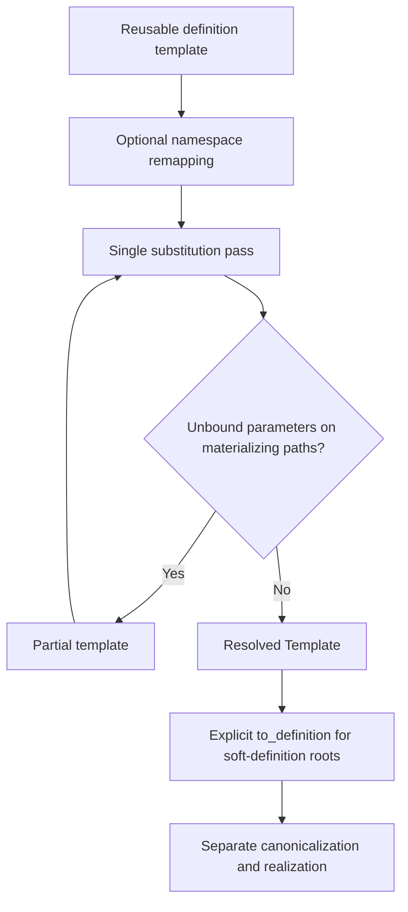
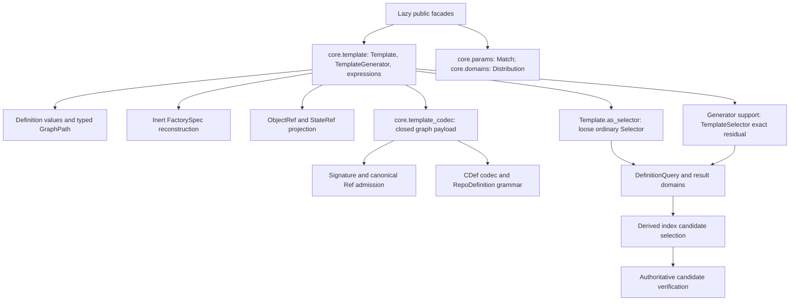
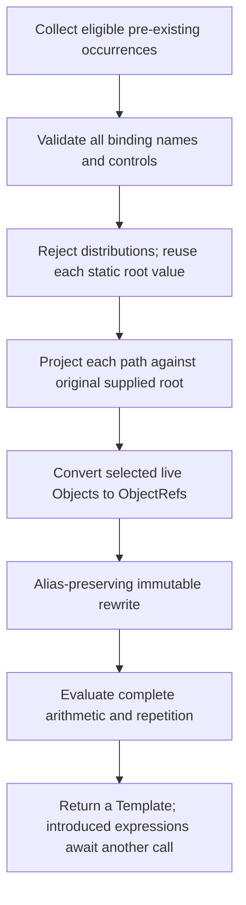
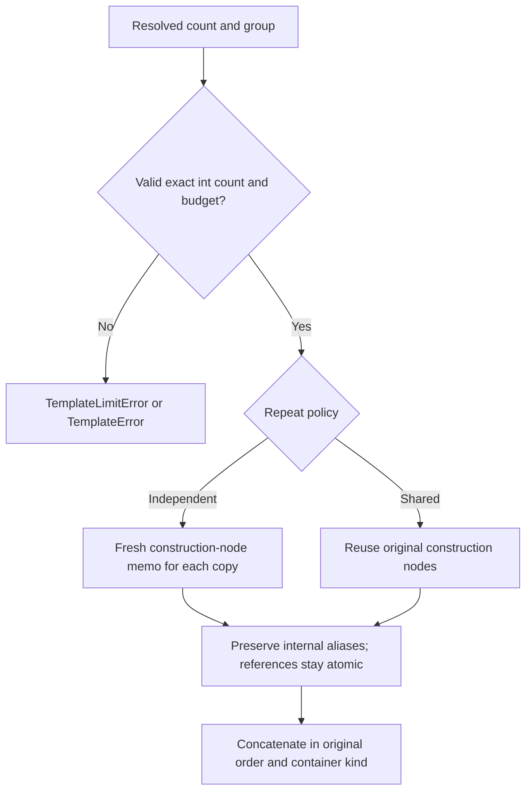
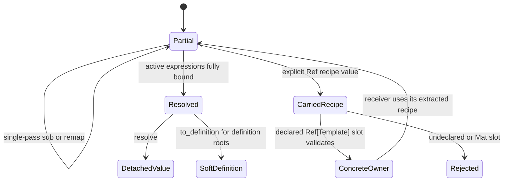
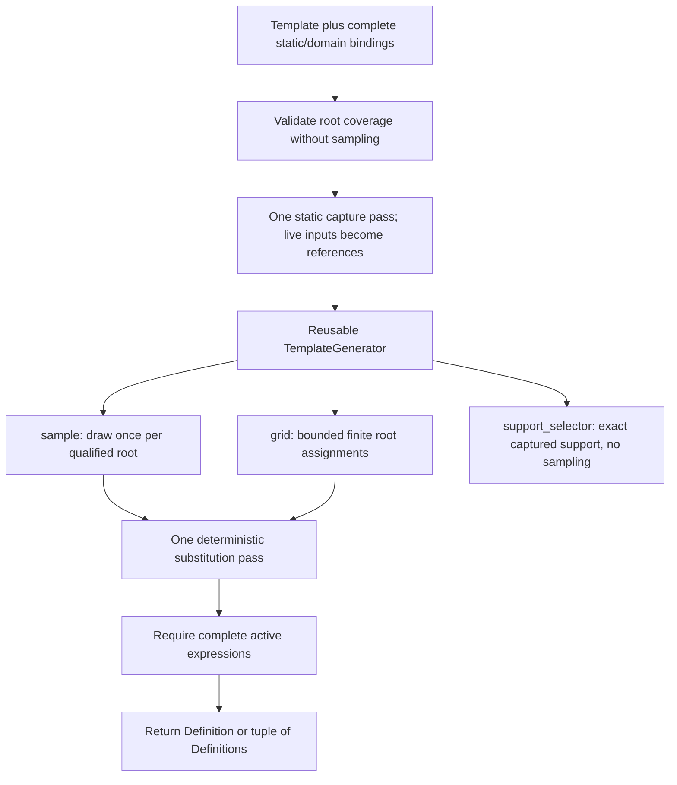
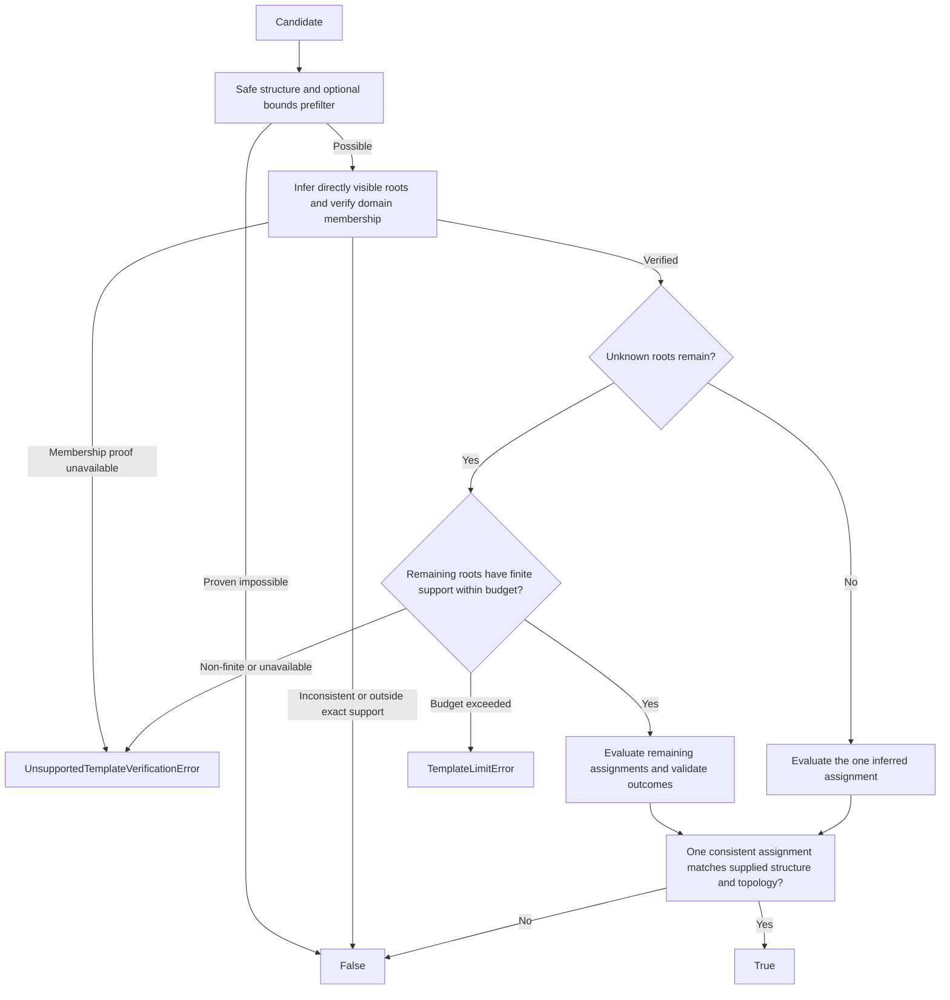

# Stage 6 Definition Templates - Plan

## Goal Capsule

- **Objective:** Generalize definition-based hyperparameter search into reusable templates with namespaced substitution, composition, POD parameter arithmetic, and list/tuple repetition.
- **Product authority:** The confirmed requirements below refine workstream 6 of `docs/plans/2026-09-20-001-v0.3.0b1-roadmap.md`. They extend its provisional layer-list boundary without taking ownership of Method polish or full ML workflow integration.
- **Implementation status:** Complete and deployed with deterministic Template operations, reusable complete generation, and separate loose/exact selector contracts. The completion record below states the verified scope and retained deferrals.
- **Open blockers:** None. The owner's two security deferrals remain non-blocking and are not represented as fixed; stop if implementation evidence contradicts a settled contract.
- **Execution profile:** Work serially in dependency order, beginning with focused characterization of query leaves, graph identity, and Ref admission. Follow the Verification Contract; exhaustive tests require a separate user request.
- **Authority and tail:** Preserve the Product Contract, source changes, and authoritative Store contents. The implementing coordinator owns integration and verification; commits and remote shipping require the applicable user authorization. This plan does not authorize pushing, package publication, or an automatic Proof update.

---

## Product Contract

### Summary

Provide generic Template/Par authoring, deterministic substitution, and composition, including unresolved recipes carried through declared `Ref[Template]` slots.
TemplateGenerator captures complete static/domain bindings and produces fully bound Definitions through sampling and finite grids, preserving namespaced arithmetic and repetition semantics.
Template.as_selector projects concrete structural constraints loosely; TemplateGenerator.support_selector verifies exact generated support and relationships, using bounds only to prefilter candidates.

### Problem Frame

Hyperparameter search already operates on definitions containing parameter placeholders, but its current generation path binds structural occurrences rather than shared names.
Reusable architectures also need parameters supplied by callers, models inserted into larger Experiment definitions, and linked dimensions across multiple layers.
Those uses overlap with stage 6's repeated layer groups rather than requiring unrelated templating and search systems.

A motivating consumer is evaluation after a training checkpoint: an Experiment author wants to supply Artifact recipes referring to components such as `this.model` and bind them against a live Experiment later.
Custom methods can express that orchestration today, but the desired reusable input is an inspectable construction recipe rather than a bespoke callback for every set of Artifacts.
Automatic callback creation, evaluation scheduling, computation, and saving are future consumer work, not requirements of this foundation.

### Key Decisions

- **Generic Template with direct authoring.** Choose the name `Template`, with `Template(Model, ...)` as the primary inert constructor form and explicit conversion for existing values; do not require `Template(Definition(...))` or add a DefTemplate alias. (session-settled: user-directed - chosen over the alternative name and nested wrapper authoring: keep the public surface direct while reusing Definition internally.)
- **Generation is a separate captured specification.** Template.sub rejects distributions and performs only deterministic substitution. TemplateGenerator captures static values or distributions for all active roots and owns sample, grid, and exact support-selector creation. (session-settled: user-directed - chosen over sampling inside Template.sub: retain generic templating and reusable generation.)
- **Successful generation is complete.** TemplateGenerator.sample and grid return fully bound Definitions, exempting only opaque Ref-carried recipes; partial composition stays with Template.sub. (session-settled: user-directed - chosen over partial grid results: make the generator's output contract complete.)
- **Loose template lookup is not generative support.** Template.as_selector retains concrete structural constraints and drops unknown parameter, same-name, and arithmetic relationships; TemplateGenerator.support_selector remains exact. (session-settled: user-directed - chosen over retaining unknown-parameter relationships in the loose selector: provide simple structural lookup without an implicit solver.)
- **Namespaced binding identity.** Equal fully qualified parameter root names intentionally share a binding. Remapping supplies explicit separation; no implicit namespace is created when a template is inserted. (session-settled: user-directed - chosen over implicit isolation of nested templates: authors control linkage by names and namespace transformations.)
- **One substitution pass.** Bind only parameter occurrences already present in the receiving template; do not recursively substitute into replacement templates during the same call. (session-settled: user-directed - chosen over binding newly inserted templates immediately: composition proceeds through explicit successive substitutions.)
- **General ordered sequences.** Repetition applies to list/tuple-valued definition parameters, not only model layer lists. (session-settled: user-directed - chosen over the roadmap's provisional layer-only boundary: the template operation should be generally useful.)
- **Independent repetition by default.** Symbolic multiplication creates independent construction subgraphs with linked parameter values. `Shared(...)` requests retained DRYML node identity. (session-settled: user-directed - chosen over shared-by-default or mandatory-policy repetition: ordinary stacked groups should have independent instances.)
- **Sharing stops at the DRYML graph boundary.** `Shared` guarantees DRYML graph-node sharing, not backend instance reuse for repeated factories. Authors needing tied backend weights express that in their own TensorFlow layer or Torch module. (session-settled: user-directed - chosen over extending Sequential to reuse factory-built layers: backend weight tying remains author-owned.)
- **Python arithmetic semantics.** Support `*`, `/`, and `//` without implicit rounding or conversion to constructor argument types. (session-settled: user-directed - chosen over exact-integer division or true-division-only support: authors can select true or floor division explicitly.)
- **Foundation before lifecycle integration.** Artifact binding is a use case and acceptance example; automatic Experiment evaluation belongs to later workflow work. (session-settled: user-directed - chosen over including checkpoint evaluation lifecycle here: the template foundation is independently useful and testable.)
- **Unresolved recipes require a declared slot.** An argument declared as `Ref[Template]` permits a CDef to retain and deliver an unresolved template without materializing its target. An undeclared slot or a generic value-side `Ref` wrapper does not grant that permission.
- **Ref-carried recipes are opaque by default.** Outer `.sub` and `.remap` calls do not enter `Ref[Template]` contents without explicit traversal permission. Normal template composition remains traversable, and calling an extracted recipe's own operations acts on that recipe normally.
- **Distribution products have exact support.** Choice distributions, finite integer ranges, and mixed choice/range bindings contribute all possible products, even when neither operand appears separately in the resulting definition. Repeated names and other occurrences still impose joint binding constraints.
- **Bounds narrow candidates, not matching semantics.** Other distributions can contribute supported conservative bounds to prefilter derived values, but a final match requires exact verification; unavailable exact verification is reported as unsupported, not as a match or a non-match. (session-settled: user-directed - chosen over approximate or bounds-only matches: keep selectors useful without admitting impossible values as exact results.)
- **Selected live Objects become ObjectRefs.** Resolve a path against the live input first, then substitute the selected Object's `ObjectRef`; supply a `StateRef` explicitly for an exact saved snapshot. (session-settled: user-directed - chosen over retaining a Python instance or applying destination AutoRef selection: bind Object-graph identity without an implicit checkpoint or runtime carrier.)

<!-- ce-section: work-relationships -->
### How This Work Fits Together

This plan owns the template foundation and generalizes stage 6's list multipliers.
The relationships below record the current understanding of surrounding work, not a new committed roadmap or authorization for parallel implementation.

- **Depends on:** The hook-free construction and canonicalization boundary established by stage 2, plus existing definition, reference, graph-sharing, and persistence contracts.
- **Can proceed independently of:** Stage 5 Method-selection polish; stage 6's dependency gate does not require that polish, although the original roadmap lists stage 5 first in its delivery sequence.
- **Can be scoped while:** Stage 4 CachedDataset work finishes. This document makes no claim about that work's completion.
- **Enables:** A later combined stages 5+7 effort exercising Method selection in full ML workflows. That combination is the user's intended next grouping, not an implementation plan supplied here.
- **Enables:** Experiment-owned checkpoint/end-of-training Artifact evaluation using template bindings. Trigger selection, managed callback integration, failure handling, exact-state association, and result saving remain that consumer's responsibility.
- **Shares:** Definition and reference semantics with Artifacts and models; no dependency from core templating to training orchestration is introduced by these use cases.

### Actors

- A1. A model or Object author composes reusable definitions with linked parameters, namespaces, and repeated groups.
- A2. An experiment or search caller composes and substitutes concrete values through Template, then captures complete static/domain bindings in TemplateGenerator for repeated generation or exact support lookup.

### Requirements

**Template Values And Substitution**

- R1. Expose reusable class-first `Template(Model, ...)` authoring and explicit conversion from existing values, preserving partial composition and later extraction to ordinary definitions.
- R2. A parameter identifies a named binding root and may select a graph path relative to that root.
- R3. Template.sub accepts supported literal values, live DRYML Objects, reference/definition values, replacement templates, and containers, but rejects distributions rather than sampling or storing them.
- R4. Each substitution call binds occurrences present in its permitted traversal once; parameter occurrences introduced by replacement templates remain for a later call, including when Ref-template traversal is enabled.
- R5. Equal fully qualified roots within a substitution traversal receive the same supplied value; a generator samples each qualified root once per sample and reuses that value across all occurrences and paths.
- R6. Missing bindings on materializing paths leave a partial template rather than inventing values; an unresolved Template in an explicitly declared `Ref[Template]` slot does not prevent the enclosing definition from being concrete or materializable.
- R7. Substitution and remapping do not mutate their input templates or supplied live Objects, materialize dependencies, build factories, invoke Artifact computation or training, or save state.
- R8. A live Object supplied directly or selected through a root-relative path binds as its `ObjectRef`, without retaining the Python instance, choosing `last_state_ref`, or saving state; an explicit `StateRef` retains its exact snapshot meaning.

**Namespaces And Remapping**

- R9. Support hierarchical qualified names such as `namespace1/namespace2/width`, with unqualified names as the empty-namespace case.
- R10. Provide namespace-qualified keyword substitution and a mapping form with fully qualified string keys, so callers can address names that cannot be Python keywords.
- R11. Remapping can rename binding roots, add namespace prefixes throughout a template closure, and strip a selected namespace prefix.
- R12. Remapping reaches parameters in nested definitions, supported containers, factory arguments, arithmetic expressions, and repetition expressions while preserving relative graph paths, but respects the Ref-template traversal boundary in R40.
- R13. Composition does not automatically isolate names; resulting equal fully qualified names within the permitted traversal intentionally identify the same binding.

**Factory Arguments And Arithmetic**

- R14. Template traversal and binding descend into `F`/`FactorySpec` positional and keyword values, including their supported nested containers, without resolving or invoking the target.
- R15. Support deferred multiplication, true division, and floor division between parameter expressions and supported POD-like values, including literal operands on either side.
- R16. An arithmetic expression remains partial until its required operands are bound, then evaluates with the supported values' Python operator semantics.
- R17. Arithmetic reuses each root binding rather than independently sampling repeated parameter occurrences or derived results.
- R18. Arithmetic does not silently round, truncate, coerce, or resample a value to satisfy a constructor or repetition count.
- R19. Unsupported operands and invalid arithmetic, including division by zero, produce an explicit failure rather than a fabricated value or a silently omitted generated case.

**Ordered Repetition And Identity**

- R20. Support symbolic ordered-group multiplication by a parameterized count for list and tuple template values, preserving container kind and element order.
- R21. Default template repetition produces independent owned DRYML construction subgraphs while retaining sharing relationships internal to each repeated group.
- R22. Independent repetition preserves parameter names and namespaces, so corresponding copies retain linked configuration rather than acquiring independent hyperparameters.
- R23. `Shared(count)` repetition retains the same DRYML graph nodes at corresponding positions across repetitions instead of freshening their construction identity.
- R24. Sharing does not deduplicate unrelated nodes merely because their definitions or factory values compare equal.
- R25. `Shared` makes no backend instance-sharing guarantee for FactorySpecs; repeated factory occurrences remain subject to their consumer's build behavior.
- R26. Repetition must not treat references to live Objects or saved states as permission to clone their state or rewrite their reference identity.
- R27. Count validation and expansion limits must prevent unsupported or excessive expansion from being returned as a valid completed definition.

**Generation, Selection, And Persistence**

- R28. TemplateGenerator provides reusable sampling and finite grid enumeration returning fully bound Definitions, with one choice per qualified root and opaque Ref recipes exempt from binding completeness.
- R29. TemplateGenerator.sample permits caller-controlled randomness without using ambient global random state; Template.sub has no RNG or sampling behavior.
- R30. TemplateGenerator.support_selector accepts generated definitions and enforces the same domain, linkage, arithmetic, ordering, and sharing constraints as generation; bounds never substitute for exact final verification.
- R31. Exact generator-support verification must find a consistent assignment across related occurrences; Template.as_selector is a separate deliberately loose projection, not an equivalent exact verifier.
- R32. Supported portable templates, selectors, and concrete results round-trip without changing names, paths, expressions, repetition policy, linkage, graph identity, or Ref delivery semantics, including unresolved templates embedded in a CDef's Ref data.
- R33. Nonportable bindings and unsupported expression/domain combinations fail explicitly rather than dropping constraints, serializing live process handles, or expanding the persistence contract implicitly.
- R34. Lightweight template manipulation and selector queries do not import TensorFlow/PyTorch or construct candidate Objects merely to discover whether they match.

**Qualification And Documentation**

- R35. Document the chosen authoring APIs, namespace and binding rules, single-pass behavior, supported operands and counts, and the distinction between parameter linkage, DRYML node sharing, and backend weight tying.
- R36. Qualify general list/tuple repetition and representative TensorFlow/PyTorch factory groups with focused acceptance tests, without requiring full training workflows in this milestone.

**Template Reference Delivery And Distribution Products**

- R37. An explicitly declared `Ref[Template]` argument must allow a CDef to retain and deliver an unresolved template to its receiving Object without resolving its parameters or materializing its target; undeclared or materializing slots reject that unresolved value.
- R38. The enclosing CDef's stable identity and persistence must retain the embedded template's expression and Ref semantics without requiring the template's described Objects to exist.
- R39. Generator support selectors must represent exact product support for finite choices, finite integer ranges, and mixed bindings, respecting qualified-root independence/linkage without sampling or replacing gaps with an interval.
- R40. `.sub` and `.remap` must treat Ref-carried Template contents as opaque by default and enter them only with explicit traversal permission, without mutating the original recipe.
- R41. Use available supported min/max bounds from other distributions as conservative prefilters without excluding valid outcomes; surviving candidates require exact verification or an explicit unsupported-exact-verification result.

**Generation Capture And Loose Projection**

- R42. TemplateGenerator captures a complete static/domain binding specification without sampling at construction, normalizes static live inputs without retaining live Object handles, and rejects incomplete generation rather than returning partial Templates.
- R43. Template.as_selector returns an ordinary loose Selector retaining sound concrete structure while dropping unknown parameter and derived-expression relationships, without deleting or shifting fixed sequence positions.
- R44. Loose projection preserves partial FactorySpec constraints through import-free ordinary selector verification and conservative query lowering, without constructing factory targets or claiming graph-topology exactness.

### Authoring Examples

The following are planned APIs, not currently executable DRYML code; the APIs section fixes their signatures.
Template receives the target class and captures its arguments without constructing the Model.

```python
group = [
    F("Dense", units=Par("width")),
    F("ReLU"),
]
model = Template(Sequential, group * Par("depth"))
bound = model.sub(width=64, depth=3)
generator = TemplateGenerator(
    model,
    width=UniformIntRange(32, 128),
    depth=UniformFromSet([1, 2, 3]),
)
definition = generator.sample(rng=rng)
definitions = generator.grid()
exact_selector = generator.support_selector()
loose_selector = model.as_selector()
```

The statically bound template produces three factory groups with linked width 64; the reusable generator separately samples or enumerates its captured width/depth domains.
The Sequential consumer builds separate backend layers per occurrence; changing the count to `Shared(Par("depth"))` does not impose backend weight tying.
The sharing distinction must also be demonstrated with actual DRYML definition nodes, where `Shared` has an observable graph-identity effect.

```python
experiment = outer.sub(model=inner_template)
generator = TemplateGenerator(experiment, width=width_distribution)
definition = generator.sample()

qualified = template.sub(namespace=("encoder",), width=64)
qualified = template.sub(sub_dict={"encoder/width": 64})

scaled = Template(Model,
    first_width=Par("width"),
    second_width=Par("width") * Par("scale"),
    third_width=Par("width") // Par("divisor"),
)
```

The two namespace examples express the same intended target.
Namespace components qualify a binding root; the graph path relative to a supplied root is a separate part of the parameter's meaning.

```python
evaluation = Template(
    MetricArtifact,
    model=Par("this.model"),
    dataset=Par("test_ds"),
)
bound_evaluation = evaluation.sub(this=live_experiment, test_ds=test_dataset)
```

This last example demonstrates binding only.
It neither supplies a checkpoint scheduling API nor chooses how a later callback captures exact saved state, materializes an Artifact, computes it, and saves the result.

An Object must also be able to receive and retain that template before its parameters are bound:

```python
class TemplateConsumer(Object):
    def __init__(self, recipe: Ref[Template]):
        self.recipe = recipe

consumer_definition = Definition(TemplateConsumer, recipe=evaluation)
consumer_cdef = consumer_definition.concretize()
```

`Ref[Template]` is the required explicit declaration for accepting an unresolved recipe, using the eventual public template type name; it is a new signature capability, not an existing supported annotation.
The consumer can be materialized while `this.model` and `test_ds` remain unresolved inside its recipe.
Its author can later call `.sub(...)` on the received template; owner construction and restoration do not perform that substitution implicitly.

Specializing or remapping an outer Experiment template must leave its Ref-carried Artifact recipes unchanged by default, even when they contain the same parameter names.
An explicit traversal option may allow changes inside those recipes; it does not enable recursive substitution into newly inserted replacements during the same call.
Binding or remapping the extracted recipe directly remains an ordinary operation on that template.

For independent named choices `width` in `{32, 64}` and `scale` in `{1, 2}`, an expression `Par("width") * Par("scale")` has support `{32, 64, 128}`.
The selector accepts all three values at a product-only position and rejects 96, even though 96 lies between the minimum and maximum.
Multiple assignments producing 64 do not add another distinct supported value; no probability-density API is required by this support requirement.
These domains belong to a reusable TemplateGenerator; `.sub(width=UniformIntRange(...))` is rejected without drawing a value.
For the scaled template above, `.as_selector()` drops the unknown width expressions rather than retaining their relationships. A candidate with first width 64 and second width 999 may match that loose projection even when the generator's exact support selector rejects it.

The same guarantee applies to ranges: multiplying two independent inclusive integer ranges `2..3` gives support `{4, 6, 9}`, not every integer between 4 and 9.
For mixed choice/range bindings, `{2, 5}` times the inclusive integer range `2..3` gives `{4, 6, 10, 15}`.
For other distributions, a supported min/max envelope can reject an impossible candidate cheaply, but membership in that envelope alone is not a successful support match.
No sampled extrema may stand in for guaranteed support bounds, and unsupported exact verification must remain distinguishable from both a match and a non-match.

### Key Flows

- F1. **Compose and bind.** A1 authors an inner model template; A2 optionally remaps its roots, inserts it into an outer template, and performs another substitution to bind the introduced parameters. The result remains inspectable without construction. **Covers R1-R7, R9-R14.**
- F2. **Generate related architectures.** A2 captures complete static/domain bindings in TemplateGenerator, then repeatedly samples or grids one assignment per qualified name to obtain fully bound Definitions. Its support selector verifies the same exact support and relationships. **Covers R15-R22, R27-R31, R39, R42.**
- F3. **Choose graph sharing.** A1 uses default repetition for independent DRYML groups or `Shared` for reused graph nodes. Ordinary realization follows the resulting topology; repeated FactorySpecs do not gain a backend weight-sharing promise. **Covers R21-R26.**
- F4. **Bind a live context.** A2 supplies a live Experiment, resolves supported paths from retained realization evidence, and binds each selected Object as its `ObjectRef` without retaining the instance, selecting a checkpoint, loading dependencies, or initiating evaluation. **Covers R2-R8, R14.**
- F5. **Round-trip and reuse.** A2 serializes a portable expression or concrete result, restores it, and verifies that binding, matching, and graph identity retain the same meaning. **Covers R28-R34, R38.**
- F6. **Deliver an unresolved recipe.** A1 declares a `Ref[Template]` parameter on an Object. A2 specializes the outer definition without entering the carried recipe, materializes the owner, and binds the received template later without changing the stored recipe. **Covers R6-R7, R32, R37-R38, R40.**
- F7. **Choose structural or exact lookup.** A2 uses Template.as_selector for concrete structural constraints without domains, or a captured generator's support_selector when domain, linkage, arithmetic, and topology must be enforced. **Covers R30-R31, R39, R41-R44.**



### Acceptance Examples

- AE1. **One sample per name.** TemplateGenerator.sample draws one value for every occurrence of `encoder/width` and reuses it through deterministic substitution. `decoder/width` remains an independent binding, including when both names use the same distribution instance. **Covers R5, R9-R10, R17, R28-R29, R42.**
- AE2. **Insertion is not recursive substitution.** Given an outer template with its own `width` and a `model` placeholder, `.sub(model=inner_template, width=64)` binds the outer occurrence but leaves the inserted template's `width` unbound. A second call binds that remaining occurrence; it does not retroactively change the already bound outer value. **Covers R4-R6, R13.**
- AE3. **Namespace remapping reaches the closure.** Prefixing a template's names with `encoder` changes parameters inside factories, arithmetic, and repetition counts while preserving each root-relative graph path. Stripping that prefix restores the corresponding qualified names. **Covers R9-R13.**
- AE4. **Partial arithmetic.** Given `width * scale`, binding only `width=64` leaves the equivalent partial expression `64 * scale`; binding `scale=2` later produces 128 without sampling width again. **Covers R4-R7, R15-R17.**
- AE5. **Python division.** Given width 65, `width / 2` produces 32.5 and `width // 2` produces 32. A width of 64 still produces 32.0 under `/`, without automatic conversion to an integer-valued constructor argument. **Covers R15-R18.**
- AE6. **Invalid arithmetic is not a search filter.** A bound zero divisor or unsupported operand produces a diagnosable failure without changing the source template or silently skipping that assignment in a grid. **Covers R7, R19, R28.**
- AE7. **Factory traversal is inert.** Binding a parameter nested in `F` arguments changes its supplied construction values without resolving or calling the factory target; later construction receives the resolved values. **Covers R7, R12, R14, R34.**
- AE8. **Independent ordered copies.** A two-node DRYML group repeated three times has six positions in the original order and distinct corresponding nodes across groups, while all occurrences of its width parameter share a selected value. Repeat the check for list and tuple containers. **Covers R20-R22.**
- AE9. **Sharing inside a group survives copying.** If two positions within one group refer to the same DRYML node, default repetition preserves that sharing inside each copy while keeping the different copies independent. **Covers R21-R22.**
- AE10. **Explicit graph sharing.** Repeating that group with `Shared(3)` retains corresponding DRYML nodes across all copies. Structural equality alone is insufficient evidence; graph topology and ordinary realization must distinguish the shared case from AE8. **Covers R23-R24.**
- AE11. **Factory sharing boundary.** Repeating ordinary layer factories under `Shared` does not require TF or Torch Sequential to return the same backend layer instance at multiple positions. Documentation directs users requiring tied weights to author a suitable backend layer/module. **Covers R25, R35-R36.**
- AE12. **Derived selector relationships.** TemplateGenerator.support_selector with width in `{32, 64}` and scale fixed at 2 accepts first/second widths `(64, 128)` and rejects `(32, 128)`, even though each number appears in an independently projected allowed set. The loose Template.as_selector does not enforce that relationship. **Covers R28, R30-R31.**
- AE13. **Finite repetition grid.** A generator with width in `{32, 64}` and depth in `{1, 2}` returns four fully bound Definitions, not independent width choices per repetition; every generated case matches its exact support selector. **Covers R22, R28-R31, R42.**
- AE14. **Portable meaning survives.** Round-trip a namespaced partial template containing arithmetic, factory parameters, and repetition, then bind it and obtain equivalent results. Round-trip concrete shared and independent graphs without collapsing their topology distinction. **Covers R32-R33.**
- AE15. **Live-context binding yields ObjectRef.** Binding `this.model` against an eligible live Experiment reads its retained model and substitutes the model's `ObjectRef`, without retaining the instance, selecting `last_state_ref`, training, Artifact computation, state saving, or unrelated materialization. An explicitly supplied `StateRef` instead preserves that exact snapshot. **Covers R2-R3, R7-R8.**
- AE16. **Validation boundaries.** Exercise malformed qualified names, conflicting input forms, invalid paths, unsupported arithmetic values, invalid counts, and the chosen expansion limit. Rejection must be explicit and must not mutate the original template or return a partial result as complete. **Covers R6-R7, R19, R27, R33.**
- AE17. **Reproducible reusable generation.** Repeated calls on one generator with equivalent caller-supplied random states produce equivalent Definition values and topology. Static bindings remain fixed, each sample draws again rather than retaining the prior sample, and constructing the generator never samples. **Covers R5, R17, R28-R29, R42.**
- AE18. **Equal does not mean shared.** A group containing two distinct but structurally equal DRYML nodes retains that distinction under `Shared(3)`; each original node is reused across repetitions without merging the two originals. **Covers R23-R24.**
- AE19. **Unresolved Ref template in a concrete owner.** A CDef carries a portable Artifact template with unbound context and dataset parameters through a constructor argument declared as `Ref[Template]`. The owner can be constructed, saved, and restored while retaining a usable unresolved recipe; the recipe's target is never constructed or computed by those operations. An undeclared or materializing slot rejects the unresolved template, including an attempt to bypass the declaration with a generic value-side Ref wrapper. **Covers R6-R7, R32, R37-R38.**
- AE20. **Product-only distribution support.** With width in `{32, 64}` and scale in `{1, 2}`, a definition containing only their product accepts 32, 64, and 128 under the support selector and rejects 96. The selector does not need separately stored width or scale fields, and both assignments yielding 64 remain consistent with that supported value. **Covers R28, R30-R31, R39.**
- AE21. **Product support retains correlations.** Under those same distributions, a definition exposing `(width, scale, product)` accepts `(32, 2, 64)` and rejects `(32, 2, 128)` despite each field individually belonging to its support set. For `width * width` with one qualified root, support is `{1024, 4096}`, not the independent Cartesian-product set containing 2048. **Covers R5, R17, R30-R31, R39.**
- AE22. **Integer-range and mixed products.** Two independent inclusive integer ranges `2..3` have product support `{4, 6, 9}`, rejecting 5 despite the min/max envelope `[4, 9]`. A choice binding `{2, 5}` multiplied by that range has support `{4, 6, 10, 15}`. Every generated result matches, while holes are rejected without requiring separately stored operands. **Covers R28, R30-R31, R39.**
- AE23. **Bounds are only a prefilter.** For a distribution supplying a valid conservative envelope, an outside candidate is rejected without exact verification. An inside candidate reaches exact verification and can still fail support or cross-field constraints; if exact verification is unavailable, the result is explicitly unsupported rather than a match or a non-match. **Covers R30-R31, R33, R41.**
- AE24. **Protect an Artifact recipe during specialization.** An Experiment template and its Ref-carried Artifact recipe both contain `width`. Outer `.sub(width=64)` binds only the Experiment occurrence, and outer namespace remapping leaves the recipe's names unchanged. Performing the same operations directly on the extracted recipe changes that recipe normally. **Covers R4-R7, R12-R13, R37, R40.**
- AE25. **Opt into Ref-template traversal.** With explicit traversal permission, outer substitution or remapping reaches pre-existing parameters inside Ref-carried recipes and returns an updated expression without modifying the originals. A replacement template inserted during that call remains unresolved until a later substitution, preserving the single-pass rule. **Covers R4-R7, R12, R40.**
- AE26. **Direct authoring and conversion.** Template(Model, ...) captures the same inert soft call as Definition(Model, ...).as_template(); Template.from_value wraps a generic list/tuple or existing definition without calling a target. Template(Definition(...)) is not the constructor contract. **Covers R1, R7, R34.**
- AE27. **No sampling through substitution.** Passing a distribution directly or inside a static binding to Template.sub fails before any provider call or rewrite. TemplateGenerator instead accepts complete domains and captures static live paths as ObjectRefs without retaining the source instances. **Covers R3-R8, R29, R42.**
- AE28. **Generation cannot return partial results.** Missing/unknown roots or uncovered roots after static capture fail construction; a sampled replacement leaving active expressions fails rather than returning a partial result. Valid sample/grid outputs are Definitions with no active expressions under the selected traversal; opaque Ref recipes remain allowed. Compose partial models before creating the generator when they introduce additional names. **Covers R4, R6, R19, R28, R40, R42.**
- AE29. **Loose projection preserves positions and known facts.** Unknown width fields and derived width expressions impose no constraint, while a fixed activation still must match. A fixed sequence's unknown position becomes a wildcard rather than shifting later items; unknown repetition shape is conservatively omitted. A projected F retains its known target and arguments without building it. **Covers R34, R43-R44.**
- AE30. **Loose and exact selectors differ deliberately.** With a generator fixing scale to 2, widths `(64, 999)` may match the source template's loose selector but fail its exact support selector. Ordinary loose matching makes no shared-node topology promise; exact generator support retains it. **Covers R30-R31, R39, R42-R44.**

### Scope Boundaries

- Automatic checkpoint/end-of-training evaluation, callback generation, managed lifecycle changes, and Artifact result publication are deferred to later workflow integration.
- Backend weight tying, FactorySpec identity caches in Sequential, and implicit deduplication of equal construction recipes are excluded.
- Independent per-copy hyperparameter choices remain outside the default repetition contract; fresh construction identity does not create fresh parameter namespaces.
- Whole-pipeline Method optimization, automatic representation conversion, architecture-search scheduling, and arbitrary user-program evaluation as template expressions are excluded; the documented trusted Distribution callbacks and existing predicate facilities remain allowed.
- This feature does not redefine ordinary Python operations already evaluated before template capture; `[node] * 3` in Python is not retroactively transformed into independent DRYML nodes.
- A template can receive trusted live Objects, but does not snapshot, clone, migrate, or persist their state implicitly.
- No pre-beta compatibility shim is required solely to preserve a superseded SearchSpace API. The roadmap's beta persistence commitment still applies to formats shipped in `0.3.0b1`.

### Dependencies And Assumptions

The current framework contracts remain authoritative for concrete identity, graph sharing, references, realization, and Store persistence.
Repetition and binding must compose with those contracts rather than introduce a second identity system.
Supported filesystem, trusted-code, concurrency, and disclosure assumptions are inherited from the workspace policy.

The user authorized API spelling and edge cases to be developed during planning, not silently chosen during implementation.
The confirmed operations form a bounded expression facility, not a promise to support arbitrary Python arithmetic on every object accepted by a constructor.
In particular, the current POD classification includes nonnumeric values and does not by itself establish valid arithmetic operands.

This document treats the namespace tuple as hierarchical qualification, consistent with the qualified-name examples.
Relative graph paths are not arbitrary Python attribute evaluation, and live-context binding must be reconciled with the existing retained graph-binding interface.
Where a proposed API would expand either interpretation, planning must surface the change for approval.

### Outstanding Questions

The delegated questions are resolved by KTD1-KTD10 and the APIs section: direct authoring and retirement; deterministic substitution versus captured generation; loose projection versus exact support; names, Ref traversal, live-reference delivery, arithmetic, repetition, and persistence.
The review's technical decisions are resolved in the Planning Contract. Owner-deferred security qualification is non-blocking and recorded separately; no launch-blocking product or architecture question remains.
The Assumptions section identifies planning-selected defaults, while Deferred Follow-Up Work distinguishes optional future capabilities from this implementation's requirements.

### Sources And Verified Baseline

These references establish the starting point, not implementation of the proposed APIs.

- `docs/plans/2026-09-20-001-v0.3.0b1-roadmap.md:381-439` establishes stage 6's accepted linked values, default independent layers, repetition acceptance, and provisional breadth; lines 565-606 establish delivery relationships and focused-plan responsibilities.
- `src/dryml/core/search_space.py:59-110` collects parameters by structural occurrence and samples/enumerates each occurrence's generator. It does not group generation by parameter name.
- `src/dryml/core/params.py:36-49` defines the current `Par(name, matcher, generator)` value without deferred arithmetic operators; simplified `Par(name)` examples above are proposed syntax.
- `src/dryml/core/params.py:155-192` provides both uniform inclusive integer-range and finite-choice generators with support matchers and finite grids; range support is an existing domain to preserve, not a new optional distribution family.
- `src/dryml/core/definition.py:512-568` and `src/dryml/core/utils/graph/value.py:118-153` provide definition lenses and copy-on-write replacement.
- `src/dryml/core/utils/graph/value.py:72-103` does not currently descend into FactorySpec arguments, so that coverage is required new behavior.
- `src/dryml/core/factory.py:96-120`, `src/dryml/core/factory.py:240-289`, `src/dryml/models/tf/keras/base.py:46-55`, and `src/dryml/models/torch/base.py:752-762` establish inert factories and per-occurrence backend construction.
- `src/dryml/core/object.py:424-449` supplies `Object.graph_at()` over retained realization bindings without materialization.
- `src/dryml/core/definition.py:830-899` and `docs/immutable_definition_graph.md` distinguish structural equality from graph-sharing topology.
- `src/dryml/core/types.py:8-12` demonstrates why POD classification alone is not arithmetic validation.
- `docs/signatures.md:49-56`, `src/dryml/core/signatures.py:1087-1104`, and `src/dryml/core/canonical.py:1247-1294` establish the current distinction between unresolved materializing expressions and inert quotation data in concrete owners. They are integration context, not evidence that Template reference delivery is already implemented.
- `docs/signatures.md`, `docs/formats.md`, and `docs/solutions/architecture-patterns/2026-09-18-code-shift-in-long-lived-sessions.md` constrain delivery, portable representation, and claims about live-code or Object migration.

---

## Planning Contract

**Product Contract preservation:** Existing IDs remain stable. R8/F4/AE15 retain the user-selected ObjectRef meaning. R1/R3/R5/R28-R31/R39 and their generation examples now reflect the user's explicit reversal of sample-in-sub and partial-grid behavior. Added R42-R44, F7, and AE26-AE30 for captured generation, direct authoring, and loose projection. The APIs section supplies implementation contracts; owner-deferred security work remains deferred.

### Key Technical Decisions

- KTD1. **Separate templates, generation, predicates, and domains.** Use class-first `Template`, named `Par`, reusable `TemplateGenerator`, independent predicate `Match`, and Distribution capabilities. Retain predicate helper names but change their return type. TemplateGenerator replaces SearchSpace's reusable generative role without its occurrence-based semantics; remove the old adapters and space mode rather than add aliases. (session-settled: user-directed - chosen over sampling-specific Template/Par and nested wrapper authoring: retain generic construction recipes and captured generation; see Generic Template and Generation is a separate captured specification.)
- KTD2. **Substitute deterministically; generate from captured bindings.** Template.sub returns another Template, never samples, and rejects distributions. TemplateGenerator captures all active root bindings once and owns sample/grid/exact support. Successful sample/grid outputs are Definitions, not partial Templates. (session-settled: user-directed - chosen over distribution-aware sub and partial grids: partial composition stays explicit while the generator promises complete results; see Generation is a separate captured specification and Successful generation is complete.)
- KTD3. **Template data is a quotation boundary, not an owned dependency.** A literal nested Template, or a `Ref(template)` substitution, denotes a carried recipe. Bare Template replacement of an ordinary `Par` inlines its body once. Only declared `Ref[Template]` constructor slots admit carried recipes into a CDef. Ref-template traversal defaults to opaque; explicit traversal does not weaken signature admission or single-pass replacement. This extends the existing quotation pattern without importing a class merely to infer a traversal boundary.
- KTD4. **Project live values before freezing.** Resolve a requested path against the original live root, then replace any selected Object with its `object_ref`. Do not lower the root before projection, retain a runtime sidecar, or select `last_state_ref`. (session-settled: user-directed - chosen over retaining the Python instance or applying destination AutoRef selection: ObjectRef is graph identity, while callers explicitly supply StateRef for snapshots; see Selected live Objects become ObjectRefs.)
- KTD5. **Use a small expression language.** Immutable operator nodes implement `*`, `/`, and `//` and reflected forms, with no `__index__` or arbitrary evaluation. Python's reflected multiplication supports ordinary `list * Par`; no special list wrapper is required. Arithmetic supports exact built-in `int` and finite `float`, excluding bool and implicit NumPy conversion. (session-settled: user-directed - chosen over exact-integer division or implicit coercion: retain Python operator semantics; see Python arithmetic semantics.)
- KTD6. **Freshen construction identity, not configuration.** Evaluate nested repeats inside-out. Independent repetition allocates a new node memo for each copy, including the first; Shared reuses original DRYML nodes. Preserve aliases within each copy and keep exact external references atomic. This uses current graph identity rather than structural equality or backend caches. (session-settled: user-directed - chosen over shared-by-default repetition and factory output reuse: independent layer configuration is the default and backend tying remains author-owned; see General ordered sequences, Independent repetition, and Sharing stops at the DRYML graph boundary.)
- KTD7. **Verify one joint assignment.** Infer roots exposed directly by candidate fields and validate exact domain membership first, for finite and non-finite domains alike; enumerate only the roots still unknown. Preserve shared-name constraints across all fields and derived expressions. No inverse solver is introduced. Bounds can reject, never accept, and unavailable exact verification raises a distinct error. (session-settled: user-directed - chosen over approximate support matches and always enumerating finite domains: retain exact results without enumerating directly visible wide ranges; see Bounds narrow candidates and the planning refinement on wide-range matching.)
- KTD8. **Keep one expression codec and preserve authority.** A closed template codec owns stable payloads for direct serialization, CDef Ref data, and portable selector/config values. Graph materialization treats the payload as terminal. Index version changes invalidate derived state only; no recovery path rewrites authoritative Store files. The pre-beta clean break does not justify adding legacy-reader shims.
- KTD9. **Preserve or reject query transformations explicitly.** Carry a residual TemplateSelector through every supported query execution path. Structural rewrites and bridges that cannot preserve it fail at the builder boundary. Do not silently use only the prefilter. This is narrower than teaching SQLite or the generic graph matcher a symbolic solver.
- KTD10. **Expose a separate loose projection.** Template.as_selector returns ordinary Selector constraints, dropping unknown names and relationships. Preserve fixed positions and concrete factory constraints through private matching adapters; keep exact domains and topology in the generator's TemplateSelector. (session-settled: user-directed - chosen over solving unknown parameter relationships in loose lookup: expose useful concrete structure without implying exact generative support.)

### Assumptions

These are planning-selected defaults under the user's delegation, not additional session-settled product choices:

- Use the names and defaults in APIs, including Template.as_selector for loose lookup, finite built-in numeric arithmetic, zero-as-empty repetition, explicit bounded operations, and strict duplicate/unknown binding validation.
- `Template` may wrap a supported value graph, including a list/tuple root for a bundle of recipes. Only definition-rooted templates can become query support selectors or be extracted as Definitions.
- Preserve the current predicate helpers through `Match`, but do not preserve the old `Par` matcher/generator constructor, `Generator` protocol, or `SearchSpace` entry points.
- Provide runtime custom domain capabilities without a plugin registry or portable arbitrary-code codec. Generators are runtime captured specifications; their portable Template and built-in-domain exact selectors retain the closed-codec guarantees. No TemplateGenerator persistence or Ref[TemplateGenerator] API is added.
- Specialized support queries use exact symbolic class identity. Ordinary Selector inheritance behavior is unchanged. No new global selector policy is inferred from TemplateSelector.
- Existing pre-beta persisted data may fail with an explicit unsupported-version error under the roadmap's accepted boundary. Never delete or rewrite it. New beta fixtures establish the forward-compatibility commitment.

### Architecture



Add four focused modules: `src/dryml/core/template.py` for authoring/evaluation, `src/dryml/core/domains.py` for independent domain capabilities, `src/dryml/core/template_selector.py` for relational support and candidate projection, and `src/dryml/core/template_codec.py` for shared portable representation.
Keep private expression node implementations in `template.py` until a demonstrated maintenance need warrants another module.
`params.py` owns independent matcher leaves; `domains.py` owns the new Distribution implementations. Neither imports query execution.
TemplateGenerator stays in `template_selector.py` as the small owner of captured bindings and generation, reusing deterministic substitution and domain enumeration rather than adding a second evaluator.
The new exception hierarchy lives in dependency-light `core/errors.py`, so domains, expressions, codecs and query verification do not import one another merely to report a failure.
Use lazy call-time integration where necessary to avoid cycles among Definition, canonicalization, and template codecs.
Generic categorical projection and generic graph traversal do not become factory-aware; only the template walker deliberately enters FactorySpec values.

### Names And Paths

```text
component       := [A-Za-z_][A-Za-z0-9_-]*
qualified_root  := component ('/' component)*
convenience_par := qualified_root ('.' component)*
explicit_par   := qualified_root plus a separate GraphPath
```

Names are ASCII, case-sensitive, with no escaping. Reject empty components, repeated/leading/trailing separators, dot components in a binding-map key, and simultaneous dotted-name plus explicit-path forms.
The empty namespace is `()`; a string namespace is split on `/`, and a tuple contains its components.
Keywords name unqualified roots within the supplied namespace; `sub_dict` keys are already fully qualified and are not prefixed again.
Control-name roots such as `namespace`, `traverse_refs`, or `sub_dict` must be supplied through the mapping. `rng` is not a substitution or generator-construction control; it may be an ordinary captured root, while sample's RNG argument is a separate operation control.
Reject duplicate effective targets, unknown roots in the permitted traversal, and malformed maps before sampling.

`Par("ns/this.model.encoder")` normalizes to root `ns/this` and two semantic `Parameter` segments; the explicit GraphPath form is identical in equality and encoding.
Path projection uses `Object.graph_at`, reference `.at`, CDef semantic values, or the existing container path utilities as appropriate.
Soft Definition `Arg`/`Kwarg` paths retain call-shape meaning. Semantic Parameter projection is allowed only when names are already known without import or constructor execution.
Never use arbitrary `getattr`, evaluate a path string as Python, resolve an alias implicitly, or materialize a reference to continue traversal.

Remapping is simultaneous on pre-operation roots. Apply explicit root renames first, then strip a matching namespace prefix, then add the requested prefix.
An absent rename source or wholly unmatched requested strip is an error. Unmatched individual roots remain unchanged during strip.
Reject a transformation producing an empty or malformed root. Final-name collisions intentionally link roots.
`traverse_refs=True` permits entry across all pre-existing nested recipe boundaries for that one call, without changing those boundaries permanently.

### Binding And Evaluation



Use one graph rewrite memo per call, not sequential occurrence-local `replace_subtree` calls that can split shared nodes.
Preserve untouched node identity and aliases among changed nodes; do not merge independent equal nodes.
Two occurrences of the same qualified root reuse the same supplied root even when they select different paths. TemplateGenerator performs any sampling before invoking this deterministic operation.
Project live roots before converting selected objects; otherwise a child path would lose its live retained binding evidence.
Recursively detach supported container values and convert live Object leaves to ObjectRefs without descending into their Object graphs.
The call does not register Objects in a Repo, retain a Python instance, save a checkpoint, or choose a last-state receipt.
Later realization uses ordinary ObjectRef authority and may fail if no eligible live/saved realization is available; it never fabricates an unrelated stateful Object.

Treat a nested Template value authored as a constructor argument as an opaque carried recipe pending slot validation.
A bare Template supplied to an ordinary Par replacement is deliberately inlined once. To substitute a carried recipe rather than inline it, supply `Ref(recipe)`; the destination still must declare `Ref[Template]`.
This distinction is visible from expression values and does not require importing symbolic classes during `.sub` or `.remap`.
At a known constructor boundary the annotation authorizes delivery, but at canonicalization an undeclared destination is rejected before any owner or recipe target construction.

Immutable rewriting and failures cannot modify the source template or a carried recipe.
Template.sub rejects Distribution values, including providers nested in supplied static containers, before rewriting or invoking a provider. It has no RNG argument and no sampling side effects.

### Expressions And Repetition

```text
Expr := Par(root, path)
      | Binary(op in {mul, truediv, floordiv}, Expr-or-number, Expr-or-number)
      | Repeat(list-or-tuple, integer-or-Expr, independent-or-shared)
```

Public expression operators return immutable expression nodes; they do not evaluate while a parameter remains unresolved.
Unsupported foreign operand types return `NotImplemented` to preserve Python dispatch; supported forms with invalid bound values fail at evaluation with a bounded TemplateError.
Provide `repeat(group, count)` for a fixed integer or explicit expression; `group * Par(...)` and `group * Shared(...)` are equivalent authoring conveniences.
Symbolic values do not implement `__index__`. Ordinary Python `group * 3` completed before template capture remains ordinary shallow repetition.

Arithmetic supports exact built-in `int` and finite built-in `float`; bool, NumPy scalars, arrays/tensors, complex, strings, Decimal/Fraction, and arbitrary numeric overloads are not implicitly coerced.
Other supported POD values may still be literal bindings or choice-domain values; the arithmetic restriction does not prohibit string-valued hyperparameters.
Preserve `/` and `//` result types, negative floor semantics, and operand order. Reject non-finite operands/results and zero division.
Do not algebraically simplify partial expressions in ways that skip validation or discard a name: `0 * Par("x")` remains partial until x is bound.



Counts are exact built-in integers excluding bool; zero yields an empty list/tuple, negatives and floats are invalid.
Nested repeats evaluate inside-out. Independent copying freshens owned soft Definition identities and CDef private node tokens for every copy, including count one.
Use a memo shared by all entries within a copy, not separate per-element copies. Shared reuses original nodes but never deduplicates independent equal nodes.
An owned raw node used both inside the group and elsewhere in the enclosing template is still copied for every independent repetition; its outside occurrence remains separate. Shared retains that cross-boundary alias. (session-settled: user-directed - chosen over treating any outside alias as an external dependency: repetition semantics do not change merely because another field mentions the node.)
Ref edges to external CDefs, ObjectRefs, StateRefs, and carried recipes remain external values, not cloned state.
FactorySpec occurrences remain data; no build occurs and no backend instance-sharing guarantee is added.
Expression/order normalization, scalar evaluation, and graph copying consume one operation budget, so nested groups cannot bypass the total expansion limit.

### Ref Admission And Extraction



`is_resolved` and extraction use default Ref opacity. An unresolved carried recipe can be data in a resolved owning template.
`resolve()` returns a detached supported root value, not a live Object. `to_definition()` accepts only an already-soft Definition root and returns it without filling omitted defaults or importing a class.
For a CDef root, use `resolve()` to retain the exact CDef; `to_definition()` rejects it rather than calling the existing import-capable `ConcreteDefinition.thaw()` or inventing a positional call shape.
Use `.to_definition().concretize(repo=...)` at the existing explicit canonicalization boundary; this is separate from template operations and may perform the existing class-resolution work.
Do not expose a new template materialization/lifecycle API.

`Ref[Template]` is a new exact Ref-only target. A raw carried Template in an undeclared/Mat slot is invalid even if its recipe happens to be resolved.
`Ref(value)` can express authoring intent but never bypass annotation validation. Finalized persisted Ref payloads replay inertly without reinterpreting a changed constructor's annotations.
Fresh constructor input containing a manually finalized Template Ref link must still pass exact `Ref[Template]` slot validation; finalization alone is not admission provenance.
Use the existing fresh-constructor versus already-bound/decoded replay context to enforce this distinction, including the current unannotated-slot finalized-link shortcut. A standalone-decoded Template or link passed to a fresh constructor is fresh input, not replay of an owning CDef.
Use `*recipes: Ref[Template]` for separate arguments or one Template with a list/tuple root for a bundle. Do not add nested role grammar such as `list[Ref[Template]]` or `Ref[list[Template]]` in this stage.
The canonical stored representation is a finalized Ref link to a validated immutable Template payload. Bare Template data is not admitted as an ordinary concrete leaf.
The standalone Template codec serializes an expression; decoding it does not itself admit it into an Object's CDef.

### Generator Capture And Domains

TemplateGenerator requires a soft-Definition-rooted Template with a concrete symbolic class target and ordinary supplied call shape, not a classless/skip-args selector or a CDef requiring thawing. Generic value-root templates remain useful through sub/remap/resolve but do not gain an implicit generator return-type conversion.
Validate binding keys against every active root of the input template under the chosen Ref traversal policy. Missing, duplicate, or unknown keys fail before provider invocation. Opaque recipe roots are exempt unless traversal is enabled.
Partition static bindings from distributions. Capture statics through one simultaneous Template.sub pass at construction; this projects live inputs before converting selected Objects to ObjectRefs and retains no live Object handles.
After static capture, the active root-name set must equal the distribution-bound root set. Reject additional unresolved roots and newly unused distribution bindings; do not recursively consume binding keys introduced by a static replacement. Compose first with Template.sub when an inner recipe introduces new names.
Freeze the prepared template and binding-map association. Built-in domains are immutable descriptions; custom providers are trusted runtime handles whose support must remain stable while the generator and its selectors are in use. Rebuild the generator if that support changes.
Construction does not sample, invoke targets, save state, or freeze an RNG. A static-only generator is valid and has one fully bound output.

Freeze built-in choice values; reject empty choices and duplicate type-aware canonical values rather than silently changing their sampling weights. Inclusive integer ranges accept exact integer bounds with `lo <= hi`; cardinality is arithmetic, not a preallocated list.
Domains expose cardinality and indexed values so operation limits can be checked before pooling or enumerating. No new built-in continuous family is required.

### Generation And Exact Support



Sample qualified roots in lexical order with a caller-supplied random.Random or a new call-local RNG. Each draw is reused across that root's occurrences and paths. No sample value is cached for the next call.
Sampling advances the supplied RNG and may invoke trusted provider code; failure does not roll back those external effects or trigger automatic retry/resampling.
For each assignment, apply Template.sub to the captured prepared template and validate completeness under the generator's selected Ref traversal policy before extracting a soft Definition. No generator operation materializes an Object or fills constructor defaults.
Fully bound means no active Par, arithmetic, or repetition expression remains; ordinary constructor signature/default validation still belongs to explicit Definition.concretize. Opaque Ref-carried recipes may remain unresolved.
Known static or built-in choice replacements that would introduce uncovered active expressions are rejected before generation is accepted. Provider-dependent introduced expressions fail with UnresolvedTemplateError during the attempted operation, never yield a partial result, and are never treated as wildcards.
Grid enumeration uses lexical root order and mixed-radix indices and returns a tuple only after every selected assignment succeeds. Invalid or incomplete assignments fail the whole grid, without skipping cases or returning partial Templates. This supersedes the earlier partial-grid proposal by explicit user choice.

TemplateGenerator.support_selector reuses the same prepared template, domains, static values and traversal policy without sampling. It returns the existing exact TemplateSelector type; callers no longer supply a second binding map to create the selector.



First infer every root exposed by a direct, empty-path Par occurrence and check consistency and exact membership. This applies equally to finite choices, integer ranges, and runtime domains; a visible value in a million-element integer range needs no enumeration.
For roots still unknown, finite support validates all remaining assignments under those inferred bindings before accepting a match, so an invalid considered arithmetic branch is not ignored because another branch matched first.
Assignments outside the candidate's inferred bindings are not generated by this verification. Generator grids still validate their complete captured Cartesian product and fail on invalid or incomplete assignments rather than filtering them out.
Do not retain all expanded variants unnecessarily: bounded validation may stream them into a matched flag or a detached compiled representation while retaining failure semantics.
Candidate comparison uses the supplied soft-definition constraints, type-aware scalar equality, symbolic class identity, and a two-way node correspondence for described graph topology.
Omitted constructor parameters remain unconstrained rather than forcing default insertion during matching.
For positional soft calls, capture a supplied-name projection when a live class/signature is already available without import, using existing signature/semantic-parameter machinery. Serialize that projection with the template; reject a support request needing unavailable positional-name resolution instead of resolving an ImportRef to learn it.
FactorySpec call shape compares target/args/kwargs directly without signature interpretation. ObjectRefs and StateRefs compare exact identity, not just their CDefs.
Scalar comparison distinguishes bool/int/float where constructor data is concerned; a generated `32.0` does not silently become integer 32.
TemplateSelector class comparisons remain symbolic-exact even when ordinary query convenience methods use their default `class_match="selector"`; explain the effective policy and never invoke inheritance imports for a residual selector.

Infer a root only from an actual direct Par occurrence with an empty relative path. Check all repeated occurrences against that same inferred value and ask the domain for exact membership. If membership is unavailable but finite indexed support exists, a separately budgeted membership scan can prove it; otherwise report unsupported.
Hidden roots, path-only roots, inverse arithmetic, or unconstrained variable repetition needing a solver are explicitly unsupported unless finite enumeration supplies the roots.
Never equate distribution-object identity with root identity: reusing one distribution instance under two names still represents two independent choices.

Bounds are closed conservative numeric envelopes, permitting infinite endpoints but not NaN or reversed endpoints. Missing/unsupported bounds mean no pruning.
Direct-value comparisons can use provider-declared bounds. Initial derived-bound propagation is limited to sound exact-integer multiplication endpoints; float multiplication and division/floor-division expressions fall back to no derived bounds rather than use unsound rounded endpoints.
This does not restrict exact evaluation of finite float choices. Bounds returned by providers are trusted domain contracts, not sampled extrema.
Lack of an exact capability raises UnsupportedTemplateVerificationError for a surviving candidate; exhausted resource limits raise TemplateLimitError, not semantic unsupported or false.

### Loose Template Projection

Template.as_selector requires a soft Definition root and returns an ordinary Selector with symbolic-exact class policy. It needs no distribution bindings and never constructs a TemplateGenerator or samples anything.
Omit unknown Definition fields and mapping constraints. An expression depending on an unknown Par contributes no arithmetic or same-name relationship to the loose selector.
In fixed list/tuple/positional call shapes, replace unknown positions with independent AnyValue Match leaves rather than deleting them. Keep known positions, container kind, and fixed length.
When unknown repetition controls a sequence's shape, omit the nearest omittable field or wildcard the containing fixed slot; do not assert a guessed length, prefix, or suffix. Fully concrete expressions may be evaluated using the existing bounded evaluator.
Ref-carried Templates remain opaque literal recipe constraints. Projection does not erase their internal Par data or change reference identity.
This is ordinary structural matching, not exact graph-topology support: Shared and independent shapes may match the same loose selector. Exact generator support remains responsible for alias relationships.

Project FactorySpec values without target resolution. Keep its target, positional arity, known values, and call keys; unknown fixed arguments become independent AnyValue leaves. A selector-side FactorySpec containing Match leaves is a partial call-shape pattern, not an exact atomic factory value.
Add private recursive factory-pattern verification to both ordinary matching paths (`definition.py` and `query/query.py`), preserving current exact behavior for concrete FactorySpecs. Projected keyword constraints are subset constraints, with retained unknown keys requiring presence through AnyValue.
Query feature/lowering code must not hash a partial factory pattern as an exact scalar. Mark such occurrences scan-required unless a proven-safe concrete prefilter exists; verify the actual pattern after candidate loading.
Reuse this loose projection for the generator's conservative prefilter where sound, but never replace its exact residual. No new public projection-matcher framework or variadic sequence solver is introduced.

### Query Integration

Store the ordinary prefilter separately from an immutable residual TemplateSelector on DefinitionQuery.
Preserve graph-distinct candidate witnesses before applying that residual. Current structural CDef equality, SQLite root deduplication, and federation merging can collapse shared and independent graphs before matching; a late residual alone cannot recover the lost variant.
For this stage, TemplateSelector queries enumerate graph-distinct witnesses from authoritative Store definition records or the selected domain's original live/fixed-universe roots, keyed by graph identity and source association rather than structural CDef equality. The ordinary structural index may reject a whole structural bucket only when sound; it may not choose one topology representative as the entire bucket.
Use a bounded witness-scan fallback where the current index cannot enumerate all variants. Do not add a new SQLite topology solver/table solely for this feature. A forbidden scan or a domain unable to supply complete witnesses raises QueryDomainError before claiming a result.
Residual verification occurs before existing public structural result deduplication; the retained representative must be a matching witness. Definition-result counts keep their existing structural-distinct meaning, while occurrence and owner associations come only from matched witnesses. Ordinary query identity semantics remain unchanged.
Apply the residual after authoritative CDef loading for cached, known, stored, multi-Store, nested-definition, occurrence, owner-projection, and paged query-backed execution.
Disable count/exists/cardinality shortcuts claiming index-exactness while a residual exists; `max_verify` counts candidates reaching combined verification, while template assignment work has its own limit.
One terminal-execution context owns cumulative candidate, assignment-work and expansion counters plus immutable residual compilation state across pages, Store partitions, cached-plus-stored domains, and generation retries. Reporting QueryStats does not own or reset those allowances.
Each independent terminal or result-set iteration gets its own context; concurrent callers cannot share mutable counters. A retry consumes remaining allowance, and a context cannot reset merely because a page/source finishes.
Topology-sensitive witness discovery defaults to 65,536 visited witness records per terminal execution. `DefinitionQuery.max_witnesses(n)` sets another positive limit, and `max_witnesses(None)` explicitly disables that witness cap. Bool, zero, and negative values are invalid. (session-settled: user-directed - chosen over a fixed hard cap or no default witness budget: bound accidental scans while allowing deliberate large-Store queries.)
Charge every visited record, including prefilter rejections, duplicate source visits and retry work. Exhaustion raises TemplateLimitError rather than returning a truncated result, an incomplete count, or a false non-match.
The witness budget does not alter `max_verify`: that existing optional control counts candidates reaching combined verification. Expression/codec hard limits apply to each proof or payload; `max_assignments` bounds each candidate-dependent proof and finite-domain compilation, while the terminal context retains cumulative work statistics and never resets configured query-level allowances at a page boundary.
Known-disjoint bounds may reject before exact evaluation, but no index result can stand in for relational verification.
Generation retries retain their current bounded behavior, and failure from a residual must never be misclassified as corrupt derived state, an empty Store, or a non-match.

Domain, refresh, reuse, limit, and result-universe refinements preserve the residual.
`categorical`, `restore`, `exact`, and the ReferenceQuery bridges `references`/`where` reject with QueryDomainError when a residual is attached; those APIs currently rewrite or retain only structural selectors.
They remain unchanged for ordinary queries. No new `DefinitionQuery.at` API is introduced.
Result-set `.query(new_selector)` applies the new selector over its already verified fixed universe, preserving previous selection by membership rather than discarding it.
TemplateSelector refinement is admitted only when the fixed universe has a complete immutable topology-witness set for its original membership. Ordinary structurally deduplicated results without that evidence raise QueryDomainError; do not expand them against the current Store to invent missing original witnesses. (session-settled: user-directed - chosen over requiring complete provenance on every ordinary result: retain the narrower explicit-rejection contract.)
Result sets produced by the new witness-aware execution may retain a bounded private witness set and completeness marker. Existing result constructors do not assert completeness merely from a representative CDef and replica Store list. Independent supplied graphs can establish an explicit universe; stale or unavailable witness evidence is an error, not a non-match.
Union/intersection retain existing structural set semantics and conservatively clear topology completeness unless the result operation has an explicitly verified complete witness construction. No ordinary result-set provenance expansion is required by this stage.

| Entry point or operation | TemplateSelector disposition | Failure or preservation rule |
| --- | --- | --- |
| `Repo.query` and `DefinitionQuery.from_source` without a fixed universe | Supported | Acquire complete witnesses from the selected domain and preserve the residual |
| `Repo.find_defs`, `find_occurrences`, `find_owner_defs`, `find`, `find_owners` | Supported | Same exact verification before projections or existing materialization effects |
| Domain/refresh/limit/strict/class-policy refinements and query terminals | Supported | Preserve residual, effective symbolic-class policy, and cumulative context |
| `DefinitionResultSet.query` / `refine` | Conditional | Require a complete witness universe; otherwise QueryDomainError before verification |
| `QueryBackedDefinitionResultSet.query` and inherited `refine` | Conditional | Complete the original bounded result enumeration, retain its witness evidence if available, then apply the same admission check |
| `OccurrenceResultSet.query` / `refine` | Conditional | Require complete owner/path/definition witness associations; never infer them from structurally collapsed owners |
| `DefinitionQuery.references`, `where`, `categorical`, `restore`, `exact` | Rejected when residual-bearing | QueryDomainError at the builder boundary rather than dropping or mis-transforming constraints |
| Existing `ReferenceQuery.definition(...)` accepting a structural selector | Rejected for TemplateSelector | TypeError at input validation; no prefilter-only substitution |
| `SaveRouting` route selector | Supported on the supplied exact CDef | Invoke full TemplateSelector matching; unsupported verification fails route planning rather than choosing a default destination |
| RepoDefinition route/config serialization | Supported for portable selectors | Shared TemplateSelector codec; custom runtime providers reject as nonportable |

`ObjectResultSet` has no `.query` method in the current API, and there is no core ObjectContainer query adapter to extend. Do not invent those entry points as part of this work.

### Persistence And Limits

Use a single closed `dryml-template` v1 payload for Template and TemplateSelector, including typed roots, paths, arithmetic/repetition tags, factory call data, built-in domain values, Ref boundaries, and graph-local labels.
Preserve separate soft call spelling and any captured semantic-name projection; decoding never imports targets, fills defaults, or invokes factories.
Reuse existing codecs for symbols, scalar/container values, exact reference data, and GraphPath. Validate graph-label uniqueness, reachability, acyclicity, canonical ordering, and alias preservation before exposing a value.
Use type-tagged scalar representations rather than JSON coercion. Support portable strings, bytes, None, bool, bounded ints, finite floats, supported frozen containers, Definition/CDef, FactorySpec, ImportRef/SourceSpec, ObjectRef/StateRef, and existing quotation/selector values through their owning codecs.
Template expressions may occur in supported container values, not mapping keys or set members; reject those unordered/address-changing positions. Literal supported keys/set members remain allowed.
Runtime custom distributions, live handles, unresolved state aliases, and arbitrary unsupported objects cannot use an opaque-pickle fallback for template payloads.

The Template codec defines structural and topology-sensitive projections; Template equality/hash includes its expression, linkage, Ref boundaries, and topology. After resolution, existing CDef structural equality and graph equality keep their distinct meanings.
TemplateGenerator has no new persistence API or Ref annotation in this stage. Portable Templates and exact selectors over built-in domains provide the required persistent expression/support contracts; runtime generators and custom providers are not serialized by fallback.
Loose selectors use the ordinary Selector/Match/FactorySpec grammar, including partial factory pattern semantics, rather than a TemplateSelector residual or witness requirement.
Extend the owning selector-value codecs with explicit FactorySpec/Match pattern records where absent; reuse the shared factory-value encoding rather than serializing a partial pattern as an opaque atom. Decoding must retain the distinction between concrete factories and factories containing predicate leaves.
Private node identities, runtime memos, RNG state, and selected verification caches are never serialized or hashed into persistent identity.
TemplateSelector serialization includes built-in domains, traversal mode, and policies; it does not serialize a compiled candidate cache or custom provider code.

Keep the existing CDef graph v2 envelope and interpretation of its existing tags, adding an explicit Template payload leaf carrying its own `dryml-template` v1 version. Older readers reject the unknown new leaf; no existing record is reinterpreted and no legacy reader is required. The new Match representation is confined to the updated selector-value grammar.
This additive policy must preserve the byte-fixed `tests/fixtures/store_v3/` baseline and archive. Do not regenerate that authority merely to make tests pass. Add independent template-v1 fixtures and a manifest covering Template, TemplateSelector, a Ref-owning CDef, RepoDefinition, ObjectRef and StateRef.
If existing authority cannot remain readable and semantically unchanged under this additive extension, stop for a compatibility decision rather than silently rebaseline fixtures or rewrite a Store.

| Version owner | Current | Planned | Reason |
| --- | --- | --- | --- |
| Template payload | Absent | 1 | New closed expression format |
| CDef graph codec | 2 | 2 | Add separately versioned leaf, preserve existing bytes/tags |
| CDef identity | V2 | V2 | Named-parameter and structural identity unchanged |
| Query CDef / feature codecs | 3 / 3 | 4 / 4 | New canonical query values |
| Aggregate query-index codec | 5 | 6 | Invalidate old derived semantics |
| Canonical query semantics | 3 | 4 | Match/expression boundary changes |
| Fingerprint schema | 4 | 5 | New terminal-data feature projections |
| CDef query-graph schema | 6 | 7 | Explicit inert Template boundary |
| GraphPath / reference codecs | 3 / 1 | 3 / 1 | Existing paths and exact-reference grammar retained |
| SQLite physical schema | 7 | 7 | No required table-layout change |
| RepoDefinition resource envelope | 1 | 1 | Add versioned Template/selector value tags only |

Update the entire sidecar compatibility bundle and its validation tests, not just the aggregate version. A rebuild changes derived files only. No new pre-beta readers, migration commands, or authority-repair path are introduced.

Fixed hard limits: 16 namespace components, 64 characters per component, 256 characters per qualified root, 128 expression levels, 65,536 expression values/nodes per operation, 4,096 entries per literal container, 1,024 repetitions per expression, 4,096 grid assignments, 65,536 exact-verification assignments, 1,024-bit integers, and 16 MiB encoded payloads.
API `max_results` and `max_assignments` may lower their respective limits, not disable or exceed the hard caps. All limits exclude bool and reject non-positive controls; zero repetition is separately valid.
Count all copies and assignments toward a total operation expansion budget, not a fresh unlimited allowance per group. Budget exhaustion is explicit even for mathematically finite support.
Validate finite cardinalities before calling `value_at` or retaining pools. Reject provider cardinality/lookup inconsistencies as TemplateError.

Framework-authored errors use bounded reason codes and necessary structural facts and must not knowingly render recognizable secrets or arbitrary bound values. This is not a claim that every provider exception chain, traceback, or logging path has been security-qualified; that additional work is owner-deferred below.
The functional codec limits apply to supported expression construction, encoding, and validation of supplied parsed values. They do not claim to bound memory already allocated by a caller before `from_data`, nor establish new pre-parse guarantees for existing trusted Store readers.

### Research And Risks

- **Operator dispatch:** Python's reflected-operation protocol and CPython `PyNumber_Multiply` try numeric slots before sequence-repeat fallback. This supports the accepted syntax without `__index__`: https://docs.python.org/3.14/reference/datamodel.html and https://github.com/python/cpython/blob/3.14/Objects/abstract.c.
- **Finite generation:** `itertools.product` consumes its input pools before yielding; the indexed-domain contract prevents allocation before budgets: https://docs.python.org/3/library/itertools.html#itertools.product.
- **Bounds:** Interval dependency and float rounding preclude naive min/max acceptance. Use rejection-only sound bounds and exact finite evaluation: https://juliaintervals.github.io/IntervalArithmetic.jl/stable/manual/usage/ and https://docs.oracle.com/cd/E19957-01/806-3568/ncg_goldberg.html.
- **Alias loss:** Occurrence-by-occurrence replacement can split a shared node. Unit tests must exercise alias preservation across fields, factories, Ref payloads, and repetition, not just equal outputs.
- **Boundary loss:** A Template cannot become an arbitrary CDef atom or a predicate that query lowering treats as index-exact. Audit every quotation/codec/query entry point and fail explicitly on unsupported adapters.
- **Pre-beta break:** Query helper return types and search authoring change together. Migrate maintained callers and docs in the owning repository; do not silently claim API compatibility.

### Deferred Follow-Up Work

Additional numeric families, inverse solvers, new built-in continuous distributions, portable custom-provider registration, nested signature-role grammar, safe structural rewrites of residual queries, float interval propagation, automatic Experiment callbacks, and backend weight tying are not part of this implementation.
Execution may tune private algorithms within the stated limits, but changing a public bound, error meaning, supported domain, or traversal rule requires a deliberate plan update.

The owner deferred provider-error disclosure regression coverage and additional pre-parse payload-ingestion hardening to a later security pass. These are not Stage 6 completion gates and are not claimed fixed.
The retained concern, assessment, planned code locations, and future verification homes are recorded in `docs/solutions/architecture-patterns/2026-09-24-deferred-stage-3-diagnostic-disclosure-hardening.md`, under Stage 6 Template Security Follow-Up.
Ordinary input validation, deterministic resource errors, Ref admission, exact matching, and Store authority obligations remain in scope. Deferral does not authorize knowingly disclosing secrets or treating corrupt data as successful output.

---

## APIs

These are planned public contracts, not deployed code. Signatures are declaration-only, as requested; implementations must add complete docstrings for parameters, returns, failures, and effects.
Unless specified otherwise, expose new public names from both `dryml` and `dryml.core` through lazy exports.
The following aliases describe signature types; they are notation, not additional root-facade exports. `GraphPathLike`, `QueryDomain`, and result types are existing project types.

```python
Scalar = None | bool | int | float | str | bytes
TemplateValue = (Scalar | ImportRef | SourceSpec | Definition | ConcreteDefinition
                 | ObjectRef | StateRef | FactorySpec | Expr | Template | DefLink
                 | QuotedDef | SelectorSpec | Selector | Match
                 | FrozenList | FrozenTuple | FrozenDict | FrozenSet)
TemplateInput = (TemplateValue | type | list["TemplateInput"]
                 | tuple["TemplateInput", ...]
                 | Mapping[object, "TemplateInput"] | set[object] | frozenset[object])
BindingValue = (TemplateValue | Object | type | list["BindingValue"]
                | tuple["BindingValue", ...]
                | Mapping[object, "BindingValue"] | set[object] | frozenset[object])
StaticBinding = BindingValue
GeneratorBinding = StaticBinding | Distribution
Namespace = str | tuple[str, ...]
Bounds = tuple[int | float, int | float] | None
```

Recursive raw containers are frozen to their tagged variants. Class inputs normalize to supported symbolic references. Keys, set members, DefLink positions and nested quotation payloads obey the validation restrictions in Persistence And Limits; the broad container annotations are not permission for arbitrary Python values. Scalar aliases are also subject to finite-value/size limits. Bounds alone may contain infinity, never NaN.
BindingValue additionally permits live Object leaves in supplied containers, which are lowered to ObjectRefs; ordinary TemplateInput does not retain live Objects. StaticBinding excludes distributions, including providers hidden in containers. Only TemplateGenerator accepts distribution bindings at active roots, never recursive provider objects inside a purported static value.
The existing module-level `dryml.core.params.Matcher` protocol used by Match retains `matches(value: object, *, present: bool = True) -> bool` and `stable_key() -> object`; it is not a newly promised root export.

### New APIs

**Expressions and explicit repetition**

```python
class Expr:
    def __mul__(self, other: int | float | Expr, /) -> Expr: ...
    def __rmul__(self, other: int | float | list | tuple, /) -> Expr: ...
    def __truediv__(self, other: int | float | Expr, /) -> Expr: ...
    def __rtruediv__(self, other: int | float | Expr, /) -> Expr: ...
    def __floordiv__(self, other: int | float | Expr, /) -> Expr: ...
    def __rfloordiv__(self, other: int | float | Expr, /) -> Expr: ...

class Shared:
    def __init__(self, count: int | Expr, /) -> None: ...
    def __rmul__(self, group: list | tuple, /) -> Expr: ...

def repeat(group: list | tuple, count: int | Expr | Shared, /) -> Expr: ...
```

Expr is the common returned expression type; concrete binary/repeat node constructors remain private.
Python special methods may return `NotImplemented` for unsupported foreign operands; the successful result types above describe supported forms.
No symbolic value implements `__index__` or runs a user constructor. `repeat(group, 3)` provides independent fixed-count repetition that ordinary Python `group * 3` cannot express retroactively.

**Template operations**

```python
class Template:
    def __init__(self, target: type | ImportRef | SourceSpec, /,
                 *args: TemplateInput, **kwargs: TemplateInput) -> None: ...
    @classmethod
    def from_value(cls, value: TemplateInput, /) -> Template: ...
    @property
    def root(self) -> TemplateValue: ...
    @property
    def names(self) -> tuple[str, ...]: ...
    @property
    def is_resolved(self) -> bool: ...
    def sub(
        self, *, sub_dict: Mapping[str, StaticBinding] | None = None,
        namespace: Namespace = (), traverse_refs: bool = False,
        **bindings: StaticBinding,
    ) -> Template: ...
    def remap(
        self, mapping: Mapping[str, str] | None = None, *,
        prefix: Namespace = (), strip: Namespace = (),
        traverse_refs: bool = False,
    ) -> Template: ...
    def as_selector(self, *, strict: bool = False) -> Selector: ...
    def resolve(self) -> TemplateValue: ...
    def to_definition(self) -> Definition: ...
    def stable_hash(self) -> str: ...
    def to_data(self) -> dict[str, object]: ...
    @classmethod
    def from_data(cls, data: Mapping[str, object], /) -> Template: ...
```

The primary constructor captures a class-first inert Definition; it does not call the target. Existing Definition/CDef or generic value roots use from_value, while Definition.as_template delegates to that conversion. Template(Definition(...)) is not an overloaded constructor form.
`.root` is immutable, `.names` is lexical active-root order under default Ref opacity, and `.is_resolved` excludes unresolved quoted recipe internals.
`sub` accepts only supported static bindings and always returns Template. It rejects direct or nested Distribution values before provider invocation and has no RNG control.
`as_selector` requires a soft Definition root and returns a loose ordinary Selector with `cls_policy="exact"`, preserving the import-free boundary. It drops unknown relationships, follows the projection rules above, and never supplies a generator support guarantee. The strict flag keeps ordinary Selector structural semantics; it does not restore unknown linkage or topology constraints.
`resolve` and `to_definition` fail with UnresolvedTemplateError for active expressions; `to_definition` additionally rejects every root other than a soft Definition, including CDef. CDef roots use `resolve()` instead. Neither operation canonicalizes, fills defaults, thaws CDefs, resolves classes, or realizes anything.
`to_data`, `from_data`, `stable_hash`, and equality use the shared closed codec and fail on nonportable or malformed values. They do not resolve symbols.
Unknown bindings, invalid paths/types, duplicate inputs, rejected providers, and arithmetic errors are TemplateError; hard-limit violations are TemplateLimitError.

**Reusable generation**

```python
class TemplateGenerator:
    def __init__(
        self, template: Template, /, *,
        sub_dict: Mapping[str, GeneratorBinding] | None = None,
        namespace: Namespace = (), traverse_refs: bool = False,
        **bindings: GeneratorBinding,
    ) -> None: ...
    @property
    def template(self) -> Template: ...
    @property
    def domains(self) -> Mapping[str, Distribution]: ...
    def sample(self, rng: random.Random | None = None) -> Definition: ...
    def grid(self, *, max_results: int = 4096) -> tuple[Definition, ...]: ...
    def support_selector(self, *, max_assignments: int = 65536) -> TemplateSelector: ...
```

The constructor captures a complete reusable specification without sampling: validate original active-root coverage, specialize static bindings once, detach live inputs to reference values, and require the remaining root set to match captured domains exactly. Missing, unknown, duplicate, incomplete, or structurally invalid specifications fail explicitly.
`template` exposes the immutable prepared template with statics captured; `domains` exposes a read-only association of remaining qualified roots to providers. Their traversal policy is fixed at construction; `.template.names` still uses its own default Ref-opaque inspection policy.
`sample` draws once per remaining root and returns a fully bound soft Definition, or raises. `grid` returns an all-or-error tuple of such Definitions, never partial Templates; a static-only generator returns its one Definition in a singleton grid.
Unresolved expressions in opaque Ref recipes remain allowed. Introduced active expressions outside that exemption produce UnresolvedTemplateError and are not recursively bound or resampled.
`support_selector` uses the captured prepared template/domains without drawing values. Known incomplete choices are rejected before an exact support contract is exposed; custom-provider incompleteness fails explicitly when encountered.
Provider failures and invalid results use TemplateError; per-operation budgets use TemplateLimitError. Custom providers must retain their declared support while the generator/selector is in use. The generator itself has no to_data/from_data, stable-hash, or Ref delivery API in this stage.

**Independent query leaves and distribution capabilities**

```python
class Match:
    def __init__(self, matcher: Matcher, name: str | None = None) -> None: ...
    def matches(self, value: object, *, present: bool = True) -> bool: ...
    def stable_key(self) -> object: ...

class Distribution(Protocol):
    def sample(self, rng: random.Random, /) -> object: ...
    def cardinality(self) -> int | None: ...
    def value_at(self, index: int, /) -> object: ...
    def contains(self, value: object, /) -> bool | None: ...
    def bounds(self) -> Bounds: ...
```

Match replaces the old predicate-carrying Par role; its optional name remains metadata and does not link query fields.
Distribution is an explicit trusted provider capability, detected without treating arbitrary values with arithmetic methods as providers.
`cardinality=None` means finite enumeration is unavailable; `contains=None` means exact membership is unavailable. `value_at` is valid only for declared finite indexed support and must fail on out-of-range access.
Bounded calls validate cardinality before indexing. Providers must return valid bounds and stable support while captured by a generator and its selectors; caller mutation of that support is unsupported, not made safe by copying arbitrary provider code. Reconstruct the generator after changing a provider's support.
Runtime provider objects are not hashable/portable template identity. There is no arbitrary stable-key escape hatch or global registration protocol.

**Support selectors and failures**

```python
class TemplateSelector:
    def __init__(
        self, generator: TemplateGenerator, /, *, max_assignments: int = 65536,
    ) -> None: ...
    @property
    def prefilter(self) -> Selector: ...
    def matches(self, target: Definition | ConcreteDefinition | Object, /) -> bool: ...
    def to_data(self) -> dict[str, object]: ...
    @classmethod
    def from_data(cls, data: Mapping[str, object], /) -> TemplateSelector: ...

class TemplateError(ValueError):
    def __init__(self, reason: str, *, path: GraphPath | None = None,
                 root: str | None = None) -> None: ...
    reason: str
    path: GraphPath | None
    root: str | None
class UnresolvedTemplateError(TemplateError): ...
class TemplateLimitError(TemplateError): ...
class UnsupportedTemplateVerificationError(TemplateError): ...
```

Selector construction consumes the validated captured generator specification and freezes its prepared template, built-in domains, and traversal policy. It does not reject a wide finite domain solely for cardinality; enumeration limits apply after candidate-root inference. Its prefilter may reuse the loose template projection, but is explicitly a candidate filter, never the exact match contract.
The portable selector codec reconstructs and validates this captured specification directly; it does not require serializing a runtime TemplateGenerator or retaining that object by identity.
`matches` returns bool only for a proven result; provider capability gaps raise UnsupportedTemplateVerificationError, and finite-budget exhaustion raises TemplateLimitError.
It may call trusted provider membership methods but never a candidate Object constructor, factory build, or optional-framework import. Custom provider domains make `to_data()` fail explicitly; there is no provider-code serialization fallback.
All error subclasses inherit the stated constructor and fields. Framework call sites use bounded reason codes and necessary structural context rather than deliberately rendering bound values. Comprehensive exception-chain, traceback, and diagnostic-disclosure qualification is owner-deferred, not guaranteed by this API catalog.

### Modified APIs

**Par changes from a predicate/generator tuple to a named expression**

```python
# Before
Par(name: str | None, matcher: Matcher, generator: Generator | None = None)

# After
class Par(Expr):
    def __init__(self, name: str, /, *, path: GraphPathLike | None = None) -> None: ...
    @property
    def name(self) -> str: ...
    @property
    def path(self) -> GraphPath: ...
```

The old constructor form is removed, not overloaded. Normalized name/path and Expr operations replace `.matcher`, `.generator`, and `.matches` on Par.
Names such as `this.model` use the defined convenience grammar; supplying `path` with dotted syntax is an error.

**Distribution helper names remain, but now return domain values**

```python
# Before: each returned Par, with an optional name argument
UniformIntRange(lo: int, hi: int, name: str | None = None) -> Par
UniformFromSet(values: Iterable[object], name: str | None = None) -> Par

# After: immutable built-in implementations of Distribution
class UniformIntRange:
    def __init__(self, lo: int, hi: int) -> None: ...
    def sample(self, rng: random.Random, /) -> int: ...
    def cardinality(self) -> int: ...
    def value_at(self, index: int, /) -> int: ...
    def contains(self, value: object, /) -> bool: ...
    def bounds(self) -> tuple[int, int]: ...

class UniformFromSet:
    def __init__(self, values: Iterable[TemplateInput]) -> None: ...
    def sample(self, rng: random.Random, /) -> TemplateValue: ...
    def cardinality(self) -> int: ...
    def value_at(self, index: int, /) -> TemplateValue: ...
    def contains(self, value: object, /) -> bool: ...
    def bounds(self) -> Bounds: ...
```

Remove `name=` from both domain constructors. Root identity belongs to Par and the binding map. Integer ranges are inclusive and cardinality is computed without allocation; choices are bounded, detached, nonempty, and type-aware duplicate-free.
Their root/core public names now resolve to `dryml.core.domains`; the old generator-bearing helpers in `dryml.core.params` are removed, not retained as forwarding aliases.
Finite choice bounds exist only for compatible numeric choices; other choices return None. Constructor validation and resource failures use the TemplateError hierarchy.

**Existing predicate helpers keep their inputs and matching behavior**

```python
def Present(name: str | None = None) -> Match: ...
def Missing(name: str | None = None) -> Match: ...
def AnyValue(name: str | None = None) -> Match: ...
def Exact(value: object, name: str | None = None) -> Match: ...
def Choice(values: Iterable[object], name: str | None = None) -> Match: ...
def IntRange(lo: int, hi: int, name: str | None = None) -> Match: ...
def SubclassOf(cls: type, name: str | None = None) -> Match: ...
def Satisfies(predicate: Callable[[object], bool], name: str | None = None) -> Match: ...
```

All previously returned Par. They now return Match and preserve the existing Matcher protocol and ordinary Selector semantics. `Satisfies` remains an existing query predicate facility, not permission for arbitrary template evaluation or portable custom distributions.

**Definition and signature integration**

```python
class Definition:
    def as_template(self) -> Template: ...
    def concretize(self, repo: Repo | None = None) -> ConcreteDefinition: ...

Ref[Template]
```

`as_template` is new and returns Template.from_value(self), while TemplateGenerator replaces the generative role formerly reached through as_space. `concretize` keeps its signature but accepts a validated Template Ref payload only through declared Ref[Template] admission.
The annotation adds an exact Ref-only target. No Ref/Mat callable signature changes, no nested role grammar, and no generic wrapper bypass are introduced.
FactorySpec's existing `__init__(target, *args, **kwargs) -> None` and `build(*, namespace=None, instance_type=None) -> object` signatures remain unchanged; template expressions become supported supplied argument values, while direct build with unresolved expressions fails before target invocation.
Ordinary Selector.matches keeps its signature but gains sound partial FactorySpec matching when the selector-side factory contains Match leaves. Concrete factories retain exact identity-value matching; partial factories are never compiled as exact scalar equality constraints.

**Query entry points accept TemplateSelector**

`QuerySource` below denotes `Definition | ConcreteDefinition | Selector | TemplateSelector | Object | None`, extending the current source union by TemplateSelector.

```python
class Repo:
    def query(self, selector: QuerySource = None) -> DefinitionQuery: ...
    def find_defs(self, selector: QuerySource = None, *, scope: str = "stored",
                  refresh: RefreshPolicy = "auto", class_match: str = "selector") -> DefinitionResultSet: ...
    def find_occurrences(self, selector: QuerySource = None, *,
                         refresh: RefreshPolicy = "auto", class_match: str = "selector",
                         max_occurrences: int | None = None) -> OccurrenceResultSet: ...
    def find_owner_defs(self, selector: QuerySource = None, *,
                        refresh: RefreshPolicy = "auto", class_match: str = "selector") -> DefinitionResultSet: ...
    def find(self, selector: QuerySource = None, *, scope: str = "stored",
             refresh: RefreshPolicy = "auto", class_match: str = "selector",
             **load_options: object) -> ObjectResultSet: ...
    def find_owners(self, selector: QuerySource = None, *,
                    refresh: RefreshPolicy = "auto", class_match: str = "selector",
                    **load_options: object) -> ObjectResultSet: ...

class DefinitionQuery:
    @classmethod
    def from_source(cls, repo: Repo, source: QuerySource = None, *,
                    domain: QueryDomain | None = None,
                    universe: ResultUniverse | None = None) -> DefinitionQuery: ...
    def references(self) -> ReferenceQuery: ...
    def where(self, predicate: MetadataPredicate) -> ReferenceQuery: ...
    def categorical(self, *, path: GraphPathLike = "$", recursive: bool = False,
                    drop: Iterable[str] = (), drop_args: bool = False,
                    drop_class: bool = False) -> DefinitionQuery: ...
    def restore(self, *, path: GraphPathLike = "$") -> DefinitionQuery: ...
    def exact(self, definition: ConcreteDefinition | Object | None = None, *,
              path: GraphPathLike = "$") -> DefinitionQuery: ...
    def max_witnesses(self, limit: int | None) -> DefinitionQuery: ...
```

Existing argument shapes are retained; type annotations document the widened accepted source and existing returns. Find/object terminals retain their existing explicit realization effects, but only after residual verification.
`references`, `where`, `categorical`, `restore`, and `exact` gain QueryDomainError for a residual-bearing query. Domain and result-set refinement retain the residual or already verified universe as specified in Query Integration.
`max_witnesses` is a new immutable query-builder method, returning a copy with the configured witness-discovery limit. Its default for a TemplateSelector witness path is 65,536; callers may raise/lower it or explicitly use None. It does not retroactively limit ordinary queries that do not use witness discovery and never weakens other validation budgets.

```python
class DefinitionResultSet:
    def query(self, selector: QuerySource = None) -> DefinitionQuery: ...
    def refine(self, selector: QuerySource) -> DefinitionResultSet: ...

class QueryBackedDefinitionResultSet(DefinitionResultSet):
    def query(self, selector: QuerySource = None) -> DefinitionQuery: ...

class OccurrenceResultSet:
    def query(self, selector: QuerySource = None) -> DefinitionQuery: ...
    def refine(self, selector: QuerySource) -> OccurrenceResultSet: ...

class SaveRouting:
    def __init__(
        self, routes: tuple[tuple[Selector | TemplateSelector, Store], ...] = (),
        match_mode: str = "first", graph_mode: str = "per-object",
    ) -> None: ...
```

Result refinement widens its accepted source but adds QueryDomainError for an incomplete fixed-universe witness set. It does not rebuild the old universe from newly observed Store contents. Ordinary selector refinement is unchanged.
SaveRouting widens its route-selector union from Selector alone; existing `first`/`all` and graph-placement rules stay unchanged. Exact verification failures propagate during route planning before publication, never count as a non-match/default-route permission. Runtime custom-provider selectors remain nonportable when a RepoDefinition is serialized.

**Portable encoding entry points keep their signatures**

```python
def encode_cdef_graph(root: ConcreteDefinition) -> dict[str, object]: ...
def decode_cdef_graph(data: object) -> ConcreteDefinition: ...

class RepoDefinition:
    def to_data(self) -> dict[str, object]: ...
    @classmethod
    def from_data(cls, data: Mapping[str, object]) -> RepoDefinition: ...
```

These module APIs add explicit Template and TemplateSelector payload handling through the shared codec. Malformed/unknown payloads use the owning codec/RepoDefinition error, preserving a bounded cause; no arbitrary atom fallback is allowed for new expressions.
Unknown expression-version rejection and derived-index invalidation are explicit changes, not silent reconstruction under a different identity. Existing byte-fixed Store-v3 authority remains readable under the additive CDef leaf policy.

### Removed APIs

```python
class ParameterBinding:
    path: GraphPath
    par: Any
    def __init__(self, path: GraphPath, par: Any) -> None: ...

class SearchSpace:
    template: Any
    params: tuple[ParameterBinding, ...]
    def __init__(self, template: Any, params: tuple[ParameterBinding, ...]) -> None: ...
    @property
    def parameters(self) -> FrozenDict[str, Any]: ...
    def __getattr__(self, name: str) -> Any: ...
    @classmethod
    def from_def(cls, defn: object) -> SearchSpace: ...
    def sample(self, rng: random.Random | None = None) -> object: ...
    def grid(self) -> Iterable[object]: ...
    def support_selector(self) -> Selector: ...

def space(defn: object) -> SearchSpace: ...
def space_mode(enabled: bool = True) -> ContextManager[None]: ...

class Definition:
    def as_space(self) -> SearchSpace: ...

class Generator(Protocol):
    def sample(self, rng: random.Random) -> object: ...
    def support_matcher(self) -> Matcher: ...
    def grid(self) -> tuple[object, ...]: ...
    def stable_key(self) -> object: ...

class UniformIntRangeGenerator:
    def __init__(self, lo: int, hi: int) -> None: ...
    def sample(self, rng: random.Random) -> int: ...
    def support_matcher(self) -> Matcher: ...
    def grid(self) -> tuple[int, ...]: ...
    def stable_key(self) -> Any: ...

class UniformFromSetGenerator:
    values: FrozenTuple
    def __init__(self, values: Iterable[Any]) -> None: ...
    def sample(self, rng: random.Random) -> Any: ...
    def support_matcher(self) -> Matcher: ...
    def grid(self) -> tuple[Any, ...]: ...
    def stable_key(self) -> Any: ...
```

Remove SearchSpace's occurrence `ParameterBinding` record and its constructor `SearchSpace(template, params)` along with the module; no replacement public binding record is needed.
Retire the module-visible UniformIntRangeGenerator and UniformFromSetGenerator classes in favor of the corresponding public domain values.
Remove `"space"` from the `ObjectMode` Literal, session validation, metaclass dispatch, and `in_definition_mode` recognition. Existing modes remain unchanged; no new template mode is needed because explicit Definition/Template authoring already suffices.
Remove old Par predicate/generator constructor forms and distribution-helper `name=` arguments as documented above.
The old `dryml.core.params.Par` module path is removed; root/core `Par` instead resolves to the new `dryml.core.template.Par`. `ParameterBinding`, `SearchSpace`, and `space` disappear with `dryml.core.search_space`; the old generator protocol/classes disappear from `dryml.core.params`.
No deprecated forwarding names, legacy protocol adapters, or old persisted-reader shims are introduced merely for this pre-beta transition.
Template(root), distribution-aware Template.sub, Template.grid, and Template.support_selector were earlier unimplemented proposals, not deployed APIs to preserve or deprecate. Their replacements are class-first authoring/from_value, static sub, TemplateGenerator generation/exact support, and Template.as_selector loose projection.

**Construction-mode type change, with retained function signatures**

```python
# Before, in dryml.core.session
ObjectMode = Literal["fresh", "definition", "concrete", "selector", "space", "load_or_build"]

# After
ObjectMode = Literal["fresh", "definition", "concrete", "selector", "load_or_build"]

# Retained, in dryml.core.object
def in_definition_mode() -> bool: ...
```

`in_definition_mode` remains a pure context-state check but no longer recognizes space mode. Existing session configuration entry points retain their signatures and reject `object_mode="space"` during validation; valid remaining modes and context restoration behavior are unchanged.

---

## Implementation Units

U1-U6 build the new module-owned paths additively while retaining the existing public search/predicate entry points unchanged. U7 performs the atomic public-export/helper cutover and removes the old generation path after its replacements are complete.
New Match and expression types remain distinct from the old predicate Par during this development sequence; no old constructor form is added to the new Par. Temporary acceptance of the old predicate type is removed with its callers in U7, not shipped as a compatibility layer.

### U1. Separate Expression, Matcher, And Domain Vocabulary

- **Goal:** Establish direct inert Template authoring, expression syntax, and separate query/domain vocabulary.
- **Requirements:** R1-R2, R9-R10, R14-R15, R28-R29, R34-R35; A1-A2, F1-F2; KTD1-KTD2, KTD5.
- **Dependencies:** None.
- **Files:** Add `src/dryml/core/template.py` and `src/dryml/core/domains.py`; update `src/dryml/core/params.py`, `src/dryml/core/canonical.py`, `src/dryml/core/definition.py`, `src/dryml/core/factory.py`, `src/dryml/core/cdef_graph.py`, `src/dryml/core/errors.py`, `src/dryml/core/repo_definition.py`, `src/dryml/core/utils/stable_hash.py`, `src/dryml/core/query/query.py`, `src/dryml/core/query/local_structure.py`, `src/dryml/core/query/selector_graph.py`, and `src/dryml/core/query/fingerprint.py`; add `tests/core/test_template_api.py`; update `tests/core/test_selector_api.py`, `tests/core/test_selector_match.py`, and `tests/core/test_import_safety.py`.
- **Approach:** Introduce Expr/Par/Shared/repeat, class-first Template construction, from_value/as_template conversion, Match predicate leaves and indexed Distribution capability. Add distinct query-leaf and expression recognition; preserve existing facade/helper behavior until U7. Do not overload Template's constructor with an existing Definition or mix sampling into Par/Template.
- **Patterns:** Existing lazy facades, frozen value classes, Matcher helper semantics, and reflected-operator dispatch. Implement unsupported-operand fallback without symbolic index conversion.
- **Test scenarios:** Covers AE3/AE16: normalize names/paths and reject invalid or ambiguous spellings. Covers AE5: construct all reflected arithmetic forms without evaluating. Covers AE7: accept expression-bearing F values without invoking a target. Prove new Match leaves agree with the unchanged old helper predicates before the U7 return-type cutover. Check list/tuple reflected multiplication and ordinary fixed Python multiplication separately. Reject empty/duplicate domains and bool integer-range bounds; compute huge range cardinality without allocation.
- **Verification:** Focused API, ordinary selector, and lazy-import tests pass; new expression imports do not load optional frameworks or query execution. Tests first characterize predicate semantics that the migration must preserve.
- **Factory-build boundary:** Calling FactorySpec.build directly with an unresolved nested expression must fail before target invocation; a counter-based trusted target proves no constructor ran. Resolving the same recipe first permits the normal build path.
- **Direct authoring:** Covers AE26: Template(Model, ...) and Definition(Model, ...).as_template produce equivalent inert recipes, with from_value handling generic roots. Reject the old nested-wrapper constructor form without invoking Model or resolving a symbolic target.

### U2. Implement Scoped Substitution And Reference Projection

- **Goal:** Bind and remap eligible names once while preserving aliases and Ref opacity.
- **Requirements:** R2-R14, R17, R40; F1, F4, F6; KTD2-KTD4.
- **Dependencies:** U1.
- **Files:** Update `src/dryml/core/template.py`, `src/dryml/core/definition.py`, and `src/dryml/core/factory.py`; use existing `src/dryml/core/object.py`, `src/dryml/core/reference_values.py`, and `src/dryml/core/utils/graph/path.py` interfaces; add `tests/core/test_template_substitution.py`; extend `tests/core/test_graph_at.py` and `tests/core/test_ref_selector_values.py`.
- **Approach:** Snapshot eligible occurrences, reject distributions and validate static maps, project original roots before ObjectRef lowering, and perform one memoized immutable rewrite. Retain recipe data versus inlining structurally without importing a constructor. Capture available supplied-name projection for later import-free matching. Implement resolve/to_definition without import-capable CDef thawing.
- **Test scenarios:** Covers AE2/AE25: introduced template parameters remain untouched in the same call, including with Ref traversal enabled. Covers AE3/AE24: simultaneous remap, prefix/strip and intentional linkage, with Ref opacity and explicit opt-in. Covers AE7: F traversal preserves aliases and target inertness. Covers AE15: live paths yield ObjectRef and explicit StateRef stays exact without last-state lookup. Covers AE27: direct/nested Distribution values reject before sample or any other provider callback, with no mutation. Unknown/duplicate keys and bad paths fail deterministically; rng can now be an ordinary binding root.
- **Verification:** Focused substitution and retained-graph tests pass without construction or persistence effects; shared nodes remain shared after more than one occurrence changes.
- **Extraction scenarios:** An unavailable-symbol CDef root resolves unchanged without import and is rejected by to_definition. A soft Definition preserves positional-only/variadic call spelling through to_definition; non-definition roots and unresolved active expressions fail as documented, while opaque Ref recipes do not block owner extraction.

### U3. Evaluate Arithmetic And Identity-Aware Repetition

- **Goal:** Resolve bounded expressions and repeats without changing linkage or external reference identity.
- **Requirements:** R15-R27; F2-F3; KTD5-KTD6.
- **Dependencies:** U1-U2.
- **Files:** Update `src/dryml/core/template.py` and reuse graph-copy mechanics in `src/dryml/core/definition.py` and `src/dryml/core/cdef_codec.py`; add `tests/core/test_template_repetition.py`; extend `tests/core/test_cdef_node_identity.py`.
- **Approach:** Use post-order evaluation and one operation-wide budget. Allocate one fresh memo per independent copy, retaining intra-copy aliases. Keep Shared and explicit references as identity-bearing values, not structural deduplication requests.
- **Test scenarios:** Covers AE4-AE6: partial expressions, operand order, negative floor division, float-vs-int results, zero division and rejected coercions. Covers AE8-AE10/AE18: list/tuple order, count zero/one, first-copy freshening, internal aliases, independent equal nodes, and Shared identity. Covers AE11: factory repeats do not build or promise tied layers. Covers AE16: count/depth/total-expansion limits at and over boundaries, including nested repeats and invalid bool/float counts. Verify original graph/reference identities survive every failed operation.
- **Verification:** Values and graph topology both agree with the contract, and no limit can be bypassed by nesting or per-element copying.
- **Cross-boundary alias scenario:** With `extra=block` and `layers=[block] * count`, independent count two yields three distinct nodes with equal configuration; Shared count two retains one node across extra and both layer positions. Explicit Ref edges remain atomic in both cases.

### U4. Add Captured Generation And Both Selector Views

- **Goal:** Capture reusable complete generation, exact joint support, and a separate loose structural projection.
- **Requirements:** R17-R19, R28-R31, R33-R34, R39, R41-R44; F2, F7; KTD2, KTD7, KTD10.
- **Dependencies:** U1-U3.
- **Files:** Add `src/dryml/core/template_selector.py`; update `src/dryml/core/template.py`, `src/dryml/core/domains.py`, `src/dryml/core/definition.py`, and `src/dryml/core/query/query.py`; add `tests/core/test_template_generation.py`, `tests/core/test_template_support.py`, and `tests/core/test_template_projection.py`; extend `tests/core/test_selector_match.py`.
- **Approach:** Implement TemplateGenerator with no-sampling static capture and complete domain coverage. Its sample/grid use deterministic substitution and return Definitions; its support selector reuses the captured specification. Retain direct-first membership, bounded unknown-root enumeration, and exact topology. Implement Template.as_selector as a distinct loose projection and add private partial-factory matching to both ordinary verification paths. Shared evaluation helpers stay below these different public contracts. Codec and query-lowering integration follow in U5-U6.
- **Test scenarios:** Covers AE12/AE20-AE22: product holes, hidden finite roots, correlated output fields, same-root squares, ranges/mixed choices and topology. Covers AE13: grid assignment count independent of repetition copies. Covers AE6/AE16: invalid arithmetic fails the whole finite operation; no early positive hides an invalid domain branch. Covers AE23: bounds reject outside values, exact checking still rejects inside false positives, custom hidden roots raise unsupported, resource excess raises a different limit error. Exercise absent positional-name evidence and portable captured projections without importing a target. Verify at-limit/over-limit cardinalities before any provider indexing or large allocation.
- **Verification:** Direct support agrees with every successful bounded grid result; unsupported exact verification never returns bool or disappears as an omitted candidate.
- **Wide-range scenarios:** A direct width in `UniformIntRange(1, 1000000)` matches by exact membership without value enumeration. A related width-times-two field must agree with the inferred width. A product-only hidden root still requires bounded exact verification; a wide domain is not silently approximated by its bounds.
- **Capture and completion:** Covers AE1/AE17/AE27-AE28: capture invokes no sample, static live roots detach to references, no input-map mutation affects captured associations, and repeated calls draw again reproducibly. Missing/unknown roots fail capture; static-only generators have one Definition. Known incomplete choices fail before generation is exposed; provider-dependent active unknowns raise rather than produce partial sample/grid outputs. Opaque recipes remain valid. Sampling failures do not claim RNG rollback or silently retry.
- **Root boundary:** Reject list/tuple-rooted, CDef-rooted, classless and skip-args Templates in TemplateGenerator before provider invocation. Their supported generic Template sub/remap/resolve operations remain available; generation never imports or thaws a root to invent a soft Definition conversion.
- **Loose versus exact:** Covers AE29-AE30: loose Model/activation constraints accept unrelated widths while exact generator support rejects them. Preserve fixed sequence positions and concrete elements, conservatively omit unknown repeat shape, and keep Ref recipes opaque. Partial F patterns retain target/arity/known values without construction; concrete F matching remains exact. Neither loose projection nor exact matching imports optional frameworks.
- **Projection boundaries:** Known None, False, zero, and empty-container values remain concrete constraints rather than being mistaken for unknowns. Unknown mapping values may drop a constraint, but unknown fixed sequence positions never change length or shift later known values.

### U5. Integrate Ref Admission And The Portable Codec

- **Goal:** Carry and persist unresolved recipes through explicitly admitted concrete-owner slots.
- **Requirements:** R6-R7, R32-R38, R40, R42-R44; F5-F7; KTD3-KTD4, KTD8, KTD10.
- **Dependencies:** U1-U4.
- **Files:** Add `src/dryml/core/template_codec.py` and synthetic `tests/fixtures/template_v1/` payloads/manifest; update `src/dryml/core/signatures.py`, `src/dryml/core/canonical.py`, `src/dryml/core/links.py`, `src/dryml/core/cdef_graph.py`, `src/dryml/core/cdef_codec.py`, `src/dryml/core/repo_definition.py`, `src/dryml/core/query/codecs.py`, `src/dryml/core/query/model.py`, and `src/dryml/core/query/local_structure.py`; add `tests/core/test_template_persistence.py`; extend `tests/core/test_signatures.py`, `tests/core/test_signature_materialization.py`, `tests/core/test_cdef_graph_codec.py`, `tests/core/test_repo_definition.py`, `tests/core/test_query_codecs.py`, `tests/core/test_query_sqlite_skeleton.py`, and `tests/core/test_store_v3_fixtures.py`. Preserve the existing `tests/fixtures/store_v3/` bytes.
- **Approach:** Add exact Ref[Template] admission with explicit rejection elsewhere; preserve finalized replay and opaque graph boundaries. Implement one closed canonical template payload and all delegates, including predicate-type migration and supplied-name projections. No new payload can fall back to opaque pickle encoding.
- **Test scenarios:** Covers AE14/AE19: partial expression round-trip, immutable recipe in a constructed/saved/restored owner, identity/hash distinction and Ref delivery without target construction. Covers AE24/AE25: opacity survives serialization; opt-in modifies a copy, not the saved payload. Reject undeclared/Mat slots, generic Ref wrappers, manually finalized Template links, and standalone-decoded payloads passed through fresh unannotated constructor admission. Persisted owning-CDef replay remains inert after annotations change. Reject malformed tags/versions, cycles, duplicate/dangling labels, invalid paths, custom providers, live handles and size/depth limits. Preserve aliasing across mixed soft/CDef nodes and references. Existing byte-fixed Store-v3 fixtures still load without changed bytes; new template fixtures decode in a fresh lightweight process. Unknown future payload/sidecar versions fail closed without authority modification.
- **Verification:** Fresh lightweight decoding and owner restoration retain expressions/topology without resolving template targets; template/CDef/RepoDefinition serializers agree on payload meaning.
- **Selector views:** Persist loose partial-factory Selector values through existing value codecs and exact TemplateSelector values through the captured built-in-domain codec. Do not add a TemplateGenerator payload or Ref[TemplateGenerator] admission, and reject custom runtime-provider serialization explicitly.

### U6. Preserve Exact Residuals Across Query Pipelines

- **Goal:** Integrate support selectors without false positives, omitted matches, or dropped relational constraints.
- **Requirements:** R30-R34, R38-R44; F2, F5, F7; KTD7-KTD10.
- **Dependencies:** U4-U5.
- **Files:** Update `src/dryml/core/query/query.py`, `src/dryml/core/query/federation.py`, `src/dryml/core/query/result.py`, `src/dryml/core/query/reference.py`, `src/dryml/core/query/domain.py`, `src/dryml/core/query/index.py`, `src/dryml/core/query/sqlite/index.py`, `src/dryml/core/query/sqlite/schema.py`, `src/dryml/core/query/selector_graph.py`, `src/dryml/core/query/local_structure.py`, `src/dryml/core/query/fingerprint.py`, `src/dryml/core/query/codecs.py`, `src/dryml/core/query/model.py`, `src/dryml/core/repo.py`, and `src/dryml/core/repo_plan.py`; add `tests/core/test_template_query.py`; extend `tests/core/test_query_lowering.py`, `tests/core/test_query_graph_planner.py`, `tests/core/test_query_exact_constraints.py`, `tests/core/test_query_result_set.py`, `tests/core/test_query_federation.py`, `tests/core/test_repo_query_multistore.py`, `tests/core/test_query_sqlite_skeleton.py`, `tests/core/test_selector_graph.py`, and `tests/core/test_dirstore_query_index.py`.
- **Approach:** Retain an immutable residual and effective symbolic class policy beside the safe prefilter. Enumerate graph-distinct authoritative witnesses before structural deduplication, using explicit bounded scan fallback where needed. Own cumulative budgets in one terminal context. Audit every execution shortcut, nested/federated projection, count/existence terminal, result refinement and routing adapter. Add early QueryDomainError for unsupported structural/ReferenceQuery transformations, not a fallback to prefilter-only matching.
- **Test scenarios:** Covers AE12/AE20-AE23: indexed/non-indexed results agree for holes and correlated values; count/exists/one/nested owners reject the same impossible candidates. Check pagination, fixed-universe result refinement, multi-Store duplicate publication, and dirty/missing/rebuilt indexes. Errors from unsupported exact verification propagate rather than trigger index recovery or empty results. Residual-bearing references/where/categorical/restore/exact fail before execution, while ordinary queries retain behavior. No optional class import occurs through convenience `find*` defaults. Rebuild changed codec versions without rewriting Store authority.
- **Verification:** All supported query shapes either enforce the residual or explicitly reject the operation; derived-index acceleration cannot change exact results.
- **Identity and budget scenarios:** Store shared-child and independent-child variants with equal structural hashes in both insertion orders; each support selector finds its matching witness through memory, SQLite, rebuild, nested-owner and paged paths. Result representatives must be verified witnesses. Cross a verification limit only cumulatively across two pages, stored-plus-cache partitions, multiple Stores, and a generation retry; it must fail rather than reset. Independent/concurrent iterations use independent contexts.
- **Witness controls:** Verify the default 65,536 witness limit, a smaller positive override, a larger override, and explicit None. Count rejected/duplicate/retried visits, reject bool/zero/negative controls, and prove no partial count or result is reported as complete on exhaustion. Ordinary non-witness queries keep existing behavior; per-proof expression limits and configured max_verify remain independently enforced.
- **Adapter scenarios:** An ordinary result that retained only a structural representative rejects TemplateSelector refinement; a witness-complete result accepts it and selects the correct topology in both insertion orders. Do not reconstruct missing original witnesses from a changed Store. Check query-backed completion, occurrence/owner evidence, and conservative completeness loss through set operations. ReferenceQuery rejects TemplateSelector input; portable SaveRouting selectors use exact matching and route-plan failures never fall back to a default Store.
- **Loose projection lowering:** Partial FactorySpec patterns must not produce an exact atomic hash prefilter that omits valid candidates. Indexed and scan verification agree on target, arity, fixed/wildcard positions and kwargs. Loose selectors use ordinary query/refinement/ReferenceQuery behavior without exact-selector witness restrictions; generator support retains those restrictions and rejects the additional matches deliberately admitted by loose lookup.

### U7. Complete API Retirement, Documentation, And Qualification

- **Goal:** Finish the intentional pre-beta transition and provide executable, documented authoring examples.
- **Requirements:** R1-R44; A1-A2, F1-F7, AE1-AE30; KTD1-KTD10.
- **Dependencies:** U1-U6.
- **Files:** Remove `src/dryml/core/search_space.py`; update `src/dryml/core/params.py`, `src/dryml/core/definition.py`, `src/dryml/core/object.py`, `src/dryml/core/session.py`, `src/dryml/core/__init__.py`, `src/dryml/__init__.py`, and the U1 recognition sites to remove old predicate-Par support; add `docs/templates.md` and `tests/models/test_template_factory_groups.py`; update `docs/signatures.md`, `docs/formats.md`, `docs/objects_and_defs.md`, `docs/immutable_definition_graph.md`, `docs/graph_querying.md`, `docs/table_of_content.md`, `tests/test_profiles.json`, `tests/core/test_immutable_definition_graph_sprint.py`, `tests/core/test_object_abstract.py`, `tests/core/test_repo_definition.py`, `tests/core/test_session_config.py`, `tests/core/test_namespace_promotion.py`, `tests/core/test_import_safety.py`, and `tests/package/test_public_imports.py`. Replace the maintained tests in `tests/core/test_search_space.py` with the new template coverage, then remove that obsolete file.
- **Approach:** Remove occurrence-generation adapters and space mode once TemplateGenerator and static/projection paths are complete. Document class-first construction, static-only sub, captured generation, fully bound Definition results, and loose-versus-exact lookup alongside the other APIs. Do not keep aliases for unimplemented earlier proposals. Add small backend build tests and curate representative coverage without reducing assertions or imposing time cutoffs.
- **Test scenarios:** Covers AE7-AE11/AE19: representative TF/Torch groups build with resolved values; Shared remains graph-only; no model/data input is loaded merely to carry an Artifact recipe. Verify old public names and space mode reject, ordinary modes still work, new lazy exports are available, and documentation examples exercise sampling, grid, Ref recipes, namespaces and exact support. Check all maintained call sites, including immutable-definition sprint and import/export fixtures, not only the old search-space test file.
- **Verification:** Focused backend, import/package, documentation and representative maintained tests pass. No temporary compatibility layer, abandoned implementation attempt, or unsupported example remains in the intended diff.

---

## Verification Contract

These are future execution gates, not tests run while writing this plan. Run from the framework repository with `big_env` activated using `source ~/conda.sh` and `conda activate big_env`.
Use the workspace's declared disposable build root for artifacts. Run one resource-intensive suite at a time.

| Gate | Command | Required evidence |
| --- | --- | --- |
| Vocabulary and substitution | `./tests.sh tests/core/test_template_api.py tests/core/test_template_substitution.py --no-cov` | Name/path, single-pass, live-reference, Ref-opacity and error contracts |
| Arithmetic and identity | `./tests.sh tests/core/test_template_repetition.py tests/core/test_cdef_node_identity.py --no-cov` | Scalar and graph identity correctness, including first copy and limits |
| Generation and selector views | `./tests.sh tests/core/test_template_generation.py tests/core/test_template_support.py tests/core/test_template_projection.py tests/core/test_selector_match.py --no-cov` | Complete captured generation, loose projection, exact correlation, holes and bounds |
| Ref and persistence | `./tests.sh tests/core/test_template_persistence.py tests/core/test_signatures.py tests/core/test_signature_materialization.py tests/core/test_cdef_graph_codec.py tests/core/test_repo_definition.py tests/core/test_store_v3_fixtures.py tests/core/test_query_codecs.py --no-cov` | Closed codecs, role admission, byte-fixed authority and fresh-process inertness |
| Query integration | `./tests.sh tests/core/test_template_query.py tests/core/test_query_lowering.py tests/core/test_query_exact_constraints.py tests/core/test_query_result_set.py tests/core/test_query_federation.py tests/core/test_repo_query_multistore.py tests/core/test_dirstore_query_index.py tests/core/test_query_sqlite_skeleton.py --no-cov` | Graph-witness preservation, cumulative budgets, indexed/scan/federated agreement and safe sidecars |
| Backend consumers | `./tests.sh tests/models/test_template_factory_groups.py --no-cov` | TF and Torch build-only evidence; unavailable dependencies are reported, not called qualified |
| Public API transition | `./tests.sh tests/core/test_import_safety.py tests/core/test_namespace_promotion.py tests/core/test_session_config.py tests/core/test_immutable_definition_graph_sprint.py tests/package/test_public_imports.py --no-cov` | Export, mode, predicate return-type and documentation-facing contracts |
| Routine closeout | `./tests.sh good-enough --ignore tests/old --ignore tests/dev -x tests` | Representative maintained acceptance after focused and affected tests pass |

No exhaustive/full/coverage or broad medium/heavy run, raw full pytest invocation, dataset download, training matrix, GPU qualification, or service provisioning is authorized by this plan alone.
Keep broad parameter products available as explicitly exhaustive tests rather than multiplying routine execution.
When a broad failure appears, return to focused and affected-subsystem verification, collect related failures without fail-fast, and rerun broad verification only for a material reason after that group passes.
Record backend/runtime coverage not run and why; source inspection is not evidence of runtime qualification.

---

## Completion Record

Stage 6 was implemented serially through U1-U7 and completed on 2026-09-27. The deployed surface includes direct Template authoring and transformation, captured generation, loose and exact selector views, closed persistence, exact residual query execution, public API retirement, documentation, and representative TensorFlow/PyTorch factory qualification.

The final exact-query closeout charges the 65,536 default witness budget before safe prefilter rejection or duplicate suppression and streams nested authority so exhaustion stops further Store traversal. Regression coverage proves the default path, a larger override, prefilter-rejected and duplicate visits, no partial result, explicit unlimited operation, invalid controls, and independent terminal contexts.

Verification evidence:

- Focused template, persistence, query, API-transition, and backend-consumer gates passed during their owning implementation units.
- The final query-integration gate passed 219 tests.
- Targeted F-class lint and `git diff --check` passed.
- The final `good-enough` orchestration profile passed 264 tests with 64 deselected.
- The final maintained representative profile passed 3,313 tests with 30 skipped and 828 deselected.
- Exhaustive, coverage, broad heavy, GPU, training, and service qualification were not run; they are not authorized completion gates for this plan.
- The two owner-deferred security follow-ups remain unresolved and are not represented as fixed or qualified.

---

## Definition of Done

- Every R1-R44 requirement has implementation and verification evidence in its owning unit, with F1-F7 and AE1-AE30 preserved or deliberately clarified by the user.
- Public APIs, argument/return types, errors, exports, examples and migration descriptions agree with the APIs section; removed search-space entry points have no accidental aliases or maintained callers.
- Template uses direct class-first authoring, static-only single-pass substitution, and explicit value conversion; it never samples or retains a live Object instead of its ObjectRef.
- TemplateGenerator captures complete reusable bindings without sampling at construction; successful sample/grid calls return fully bound Definitions, with only opaque Ref recipes exempt. Sampling occurs once per qualified root per call.
- Template.as_selector supplies the deliberately loose concrete-constraint projection; the generator's support selector preserves exact domain, relationship, and topology semantics. Partial factory constraints never become unsound exact index filters.
- Ref[Template] admission and default traversal opacity hold through canonicalization, persistence, reconstruction, query indexing and explicit opt-in transforms.
- Arithmetic/repetition preserve type, order, reference identity and graph sharing within bounds; backend factory identity caching and weight tying have not been added.
- Exact support and query results agree with successful finite generation, preserve correlations and topology, and distinguish unsupported verification from false and from resource exhaustion.
- Portable expression and selector codecs are closed/versioned, beta fixtures cover their retained meaning, derived indexes rebuild safely, and no authoritative data is deleted or rewritten to recover them.
- All applicable Verification Contract gates pass; any unrun required backend coverage or accepted limitation is explicitly dispositioned rather than reported as success.
- Changes are limited to the planned framework/doc/test scope; unrelated user work is preserved and abandoned-attempt code or temporary compatibility scaffolding is removed.
- No automatic Experiment lifecycle, global optimizer/solver, new backend weight-tying contract, remote publication, or live-Object migration is claimed by completion.
